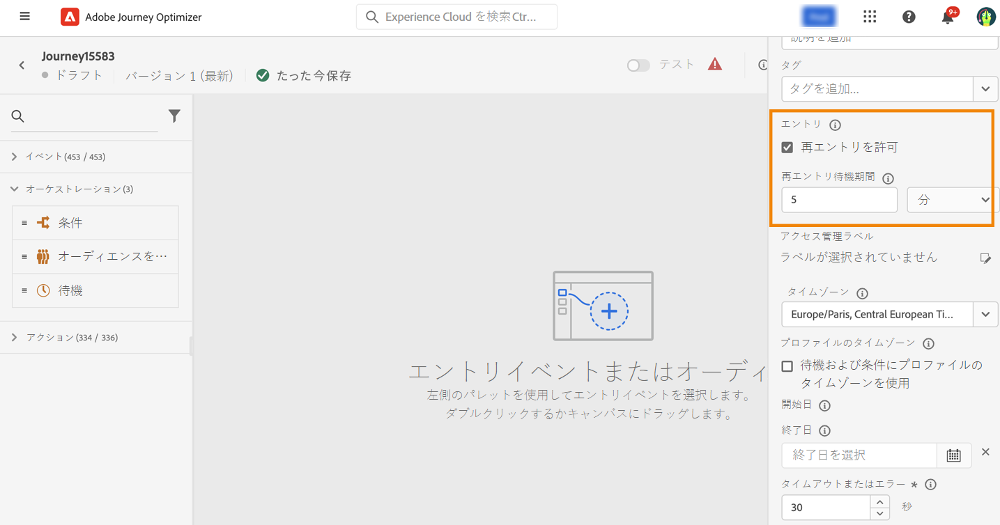
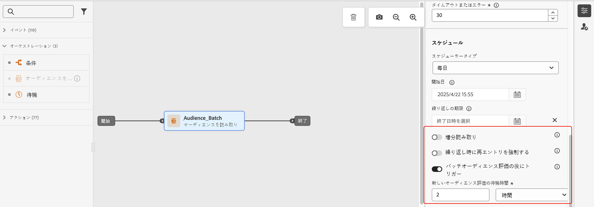

# プロファイルエントリ管理 {#entry-management}

次の 4 種類のジャーニーがあります。

* **単一イベント** ジャーニー：これらのジャーニーは、単一イベントから開始します。 イベントを受け取ると、関連するプロファイルがジャーニーに入ります。 [詳細情報](#entry-unitary)

* **ビジネスイベント** ジャーニー：これらのジャーニーは、ビジネスイベントの直後に読み取りオーディエンスが続く状態で開始します。 イベントを受け取ると、ターゲットオーディエンスに属するプロファイルがジャーニーにエントリします。 このジャーニーのインスタンスは、各プロファイルに対して 1 つ作成されます。 [詳細情報](#entry-business)

* **オーディエンスの閲覧** ジャーニー：これらのジャーニーは、読み取りオーディエンスから開始します。 ジャーニーが実行されると、ターゲットオーディエンスに属するプロファイルがジャーニーにエントリします。 このジャーニーのインスタンスは、各プロファイルに対して 1 つ作成されます。 これらのジャーニーは、繰り返しの場合もあれば、1 回限りの場合もあります。[詳細情報](#entry-read-audience)

* **オーディエンスの選定** ジャーニー：これらのジャーニーは、オーディエンスの選定イベントから開始します。 これらのジャーニーは、オーディエンス内のプロファイルの流入と離脱をリッスンします。 これが発生すると、関連するプロファイルがジャーニーに入ります。 [詳細情報](#entry-unitary)

すべてのジャーニータイプで、1 つのプロファイルを同じジャーニー内に複数回同時に存在させることはできません。 人物がジャーニーに含まれているかどうかを確認するために、プロファイル ID がキーとして使用されます。 システムでは、同じキー（例えば、キー CRMID=3224）を同じジャーニー内の別の場所に配置することは許可されていません。

## 単一イベントおよびオーディエンスの選定ジャーニー{#entry-unitary}

単一イベントおよびオーディエンスの選定ジャーニーでは、再エントリを有効または無効にできます。

* 再エントリが有効な場合、プロファイルはジャーニーに複数回エントリできますが、以前のジャーニーインスタンスから完全に離脱するまでは実行できません。

* 再入口が無効になっている場合、グローバルジャーニーのタイムアウト期間内に、プロファイルを同じジャーニーに複数回入力することはできません。 この[節](../building-journeys/journey-gs.md#global_timeout)を参照してください。

デフォルトでは、ジャーニーは再エントリを許可します。  「**再エントリを許可**」オプションがアクティベートされると、「**再エントリ待機期間**」フィールドが表示されます。待機する時間を定義してから、プロファイルがジャーニーに再度エントリできるようにできます。 これにより、ジャーニーが同じイベントに対して誤って複数回トリガーされるのを防ぎます。デフォルトでは、このフィールドは 5 分に設定されています。最大期間は 29 日です。

<!--
When a journey ends, its status is **[!UICONTROL Closed]**. New individuals can no longer enter the journey. Persons already in the journey automatically exit the journey. [Learn more](journey-gs.md#entrance)
-->

再入場期間が経過すると、プロファイルはジャーニーに再入場できます。 これを回避し、これらのプロファイルの再エントリを完全に無効にするには、プロファイルまたはオーディエンスデータを使用して、プロファイルが既にエントリされているかどうかをテストする条件を追加できます。

<!--
Due to the 30-day journey timeout, when journey re-entrance is not allowed, we cannot make sure the re-entrance blocking will work more than 30 days. Indeed, as we remove all information about persons who entered the journey 30 days after they enter, we cannot know the person entered previously, more than 30 days ago. -->

## ビジネスジャーニー{#entry-business}

<!--
Business events follow re-entrance rules in the same way as for unitary events. If a journey allows re-entrance, the next business event will be processed.
-->

複数のビジネスイベントの実行を許可するには、ジャーニープロパティの「**[!UICONTROL 実行]**」セクションで、対応するオプションを有効にします。

ビジネスイベントの場合、特定のジャーニーについて、最初の実行時に取得されたオーディエンスデータは、1 時間の時間枠で再利用されます。

プロファイルは、同じジャーニーで複数回同時に存在することができますが、異なるビジネスイベントのコンテキストでは存在しません。

詳しくは、 [セクション](../event/about-creating-business.md)

## 「オーディエンスを読み取り」ジャーニー{#entry-read-audience}

オーディエンスジャーニーの読み取りは、繰り返しまたは 1 回のみ実行できます。

* 繰り返し発生しないジャーニーの場合：プロファイルはジャーニーに 1 回のみエントリします。

* 繰り返しジャーニーの場合：デフォルトでは、オーディエンスに属するすべてのプロファイルが、繰り返しごとにジャーニーにエントリします。 プロファイルは、別のオカレンスに再エントリする前に、ジャーニーを終了する必要があります。

繰り返し読み取りオーディエンスジャーニーには、次の 2 つのオプションを使用できます。

* 「**増分読み取り**」オプション：繰り返しの&#x200B;**オーディエンスを読み取り**&#x200B;を含んだジャーニーが初めて実行されると、オーディエンス内のすべてのプロファイルがジャーニーにエントリします。このオプションを使用すると、最初の 1 回目の発生後に、ジャーニーの最後の実行以降にオーディエンスに入った個人のみをターゲットにすることができます。

  >[!NOTE]
  >
  >ターゲット設定を行う場合は、 [カスタムアップロードオーディエンス](../audience/about-audiences.md#segments-in-journey-optimizer) ジャーニーでは、プロファイルは、繰り返しジャーニーでこのオプションが有効になっている場合、これらのオーディエンスが修正されるので、最初の繰り返し時にのみ取得されます。

* **繰り返し時に再入力を強制**：このオプションを使用すると、すべてのプロファイルを、次回の実行時に、ジャーニーに存在するまま自動的に終了させることができます。 このジャーニーのプロファイルの有効期間が繰り返し頻度を超える場合（例えば、待機アクティビティを使用する場合）は、このオプションを有効にしないで、プロファイルがジャーニーを終了できるようにします。

詳しくは、 [セクション](../building-journeys/read-audience.md#configuring-segment-trigger-activity)

<!--
After 30 days, a Read audience journey switches to the **Finished** status. This behavior is set for 30 days only (i.e. journey timeout default value) as all information about profiles who entered the journey is removed 30 days after they entered. Persons still in the journey automatically are impacted. They exit the journey after the 30 day timeout. 
-->
