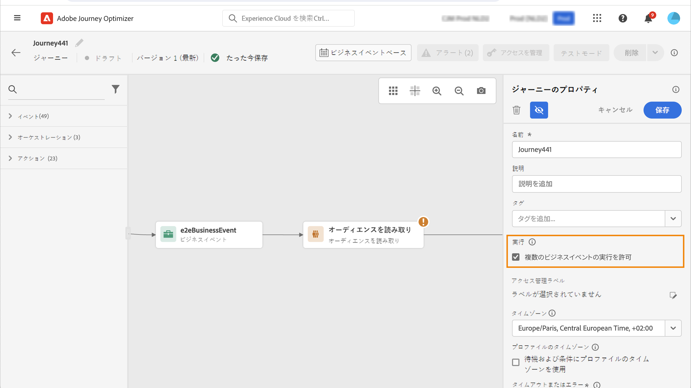

# プロファイルエントリ管理 {#entry-management}

プロファイルエントリ管理は、ジャーニーのタイプに応じて異なります。Adobe Journey Optimizer では、次のタイプのジャーニーを使用できます。

* **単一イベント**&#x200B;ジャーニー：単一イベントから開始するジャーニーです。イベントを受信すると、関連付けられたプロファイルがジャーニーにエントリします。[詳細情報](#entry-unitary)

* **ビジネスイベント**&#x200B;ジャーニー：ビジネスイベントから開始し、その直後に&#x200B;**オーディエンスを読み取り**&#x200B;アクティビティが続くジャーニーです。イベントを受信すると、ターゲットオーディエンスに属するプロファイルがジャーニーにエントリします。このジャーニーのインスタンスが各プロファイルに対して 1 つ作成されます。[詳細情報](#entry-business)

* **オーディエンスを読み取り**&#x200B;ジャーニー：**オーディエンスを読み取り**&#x200B;アクティビティから開始するジャーニーです。ジャーニーを実行すると、ターゲットオーディエンスに属するプロファイルがジャーニーにエントリします。このジャーニーのインスタンスが各プロファイルに対して 1 つ作成されます。これらのジャーニーは、繰り返しの場合もあれば、「1 回限り」の場合もあります。[詳細情報](#entry-read-audience)

* **オーディエンスの選定**&#x200B;ジャーニー：オーディエンスの選定イベントから開始するジャーニーです。これらのジャーニーは、オーディエンス内のプロファイルのエントリと離脱をリッスンします。これが発生すると、関連付けられたプロファイルがジャーニーにエントリします。[詳細情報](#entry-unitary)

すべてのジャーニータイプで、プロファイルは同じジャーニー内に同時に複数回存在することはできません。ユーザーがジャーニー内に存在することを確認するには、プロファイル ID をキーとして使用します。同じキー（キー CRMID=3224 など）を同じジャーニー内の異なる場所に配置することはできません。

## 単一イベントおよびオーディエンスの選定ジャーニー{#entry-unitary}

**単一イベント** ジャーニーおよび **オーディエンスの選定** ジャーニーでは、再エントリを有効または無効にできます。

* 再エントリが有効な場合、プロファイルはジャーニーに複数回エントリできますが、以前のジャーニーインスタンスから完全に離脱するまでは実行できません。

* 再エントリが無効な場合、プロファイルは、グローバルジャーニーのタイムアウト期間内に、同じジャーニーに複数回エントリできません。 この[節](../building-journeys/journey-properties.md#global_timeout)を参照してください。

デフォルトでは、ジャーニーは再エントリを許可します。 「**再エントリを許可**」オプションがアクティベートされると、「**再エントリ待機期間**」フィールドが表示されます。 プロファイルがジャーニーに再度エントリできるようになるまでの待機時間を定義できます。これにより、ジャーニーが同じイベントに対して誤って複数回トリガーされるのを防ぎます。デフォルトでは、このフィールドは 5 分に設定されています。最大期間は 91 日間（[グローバルタイムアウト](journey-properties.md#global_timeout)）です。

<!--
When a journey ends, its status is **[!UICONTROL Closed]**. New individuals can no longer enter the journey. Persons already in the journey automatically exit the journey. 
-->

再エントリ期間の後、プロファイルはジャーニーに再エントリできます。 これを回避し、これらのプロファイルの再エントリを完全に無効にするには、プロファイルまたはオーディエンスデータを使用して、プロファイルが既に入力されているかどうかをテストする条件を追加します。

<!--
Due to the 30-day journey timeout, when journey reentrance is not allowed, we cannot make sure the reentrance blocking will work more than 91 days. Indeed, as we remove all information about persons who entered the journey 91 days after they enter, we cannot know the person entered previously, more than 91 days ago. -->

## ビジネスジャーニー {#entry-business}

<!--
Business events follow reentrance rules in the same way as for unitary events. If a journey allows reentrance, the next business event will be processed.
-->

**ビジネスジャーニー**&#x200B;で、複数のビジネスイベントの実行を許可するには、ジャーニープロパティの「**[!UICONTROL 実行]**」セクションで、対応するオプションを有効にします。

ビジネスイベントの場合、特定のジャーニーについて、最初の実行時に取得されたオーディエンスデータが 1 時間の時間枠で再利用されます。

プロファイルは、同じジャーニー内で同時に複数回存在できますが、異なるビジネスイベントのコンテキスト内で存在できます。

詳しくは、この[節](../event/about-creating-business.md)を参照してください。

## 「オーディエンスを読み取り」ジャーニー {#entry-read-audience}

**オーディエンスを読み取り**&#x200B;ジャーニーは、繰り返しの場合もあれば、「1 回限り」の場合もあります。

* 繰り返し発生しない／「1 回限り」のジャーニーの場合：プロファイルはジャーニーに 1 回のみエントリします。

* 繰り返しジャーニーの場合：デフォルトでは、オーディエンスに属するすべてのプロファイルが、繰り返しのたびにジャーニーにエントリします。プロファイルは、別のオカレンスに再エントリする前に、ジャーニーを終了する必要があります。

繰り返しの「オーディエンスを読み取り」ジャーニーには、2 つのオプションがあります。

* 「**増分読み取り**」オプション：繰り返しの&#x200B;**オーディエンスを読み取り**&#x200B;を含んだジャーニーが初めて実行されると、オーディエンス内のすべてのプロファイルがジャーニーにエントリします。このオプションを使用すると、最初の実行後、ジャーニーの前回の実行以降にオーディエンスにエントリした個人のみをターゲットにすることができます。

  >[!NOTE]
  >
  >ジャーニーで[カスタムアップロードオーディエンス](../audience/about-audiences.md#segments-in-journey-optimizer)をターゲティングする場合、繰り返しジャーニーでこのオプションを有効にすると、これらのオーディエンスは固定なので、プロファイルは最初の繰り返し時にのみ取得されます。

* **繰り返し時に再エントリを強制**：このオプションを使用すると、ジャーニーにまだ存在するすべてのプロファイルを、次の実行時に自動的に終了させることができます。このジャーニーでのプロファイルの存続期間が繰り返し頻度よりも長くなる可能性がある場合（例えば、待機アクティビティを使用する場合）は、プロファイルがジャーニーを終了できるようにするために、このオプションをアクティブ化しないでください。

詳しくは、この[節](../building-journeys/read-audience.md#configuring-segment-trigger-activity)を参照してください。

<!--
After 91 days, a Read audience journey switches to the **Finished** status. This behavior is set for 91 days only (i.e. journey timeout default value) as all information about profiles who entered the journey is removed 91 days after they entered. Persons still in the journey automatically are impacted. They exit the journey after the 30 day timeout. 
-->
