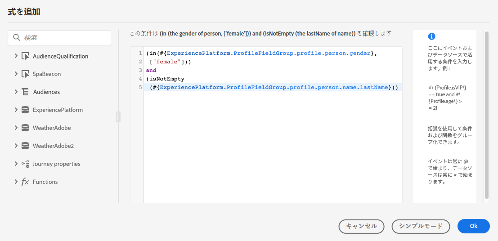
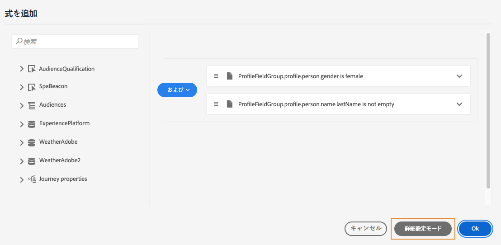
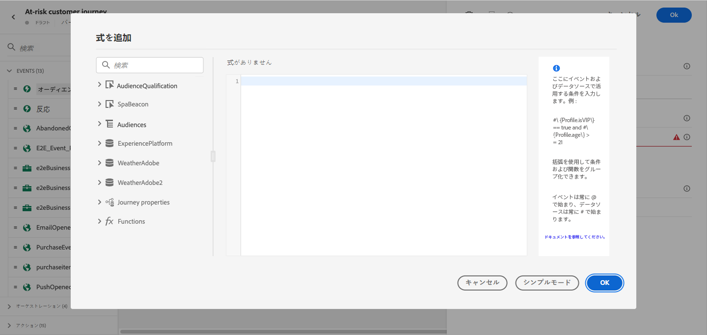
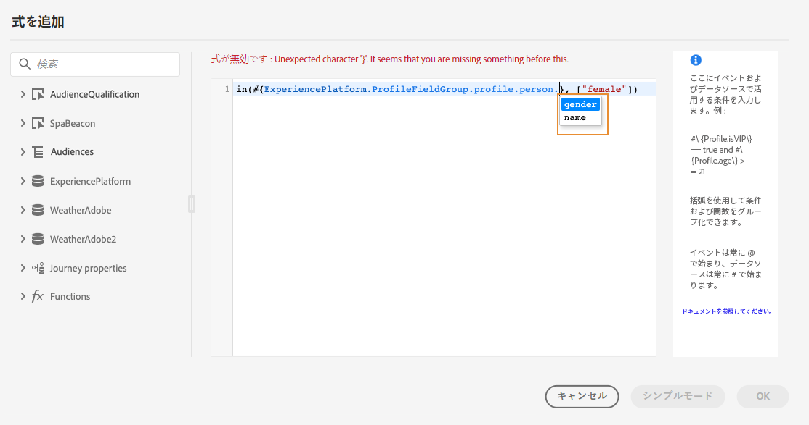
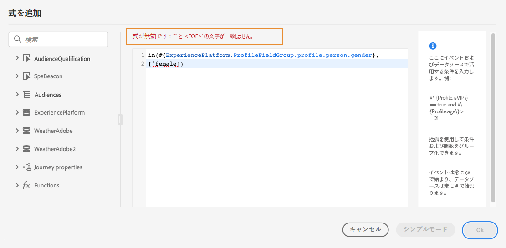
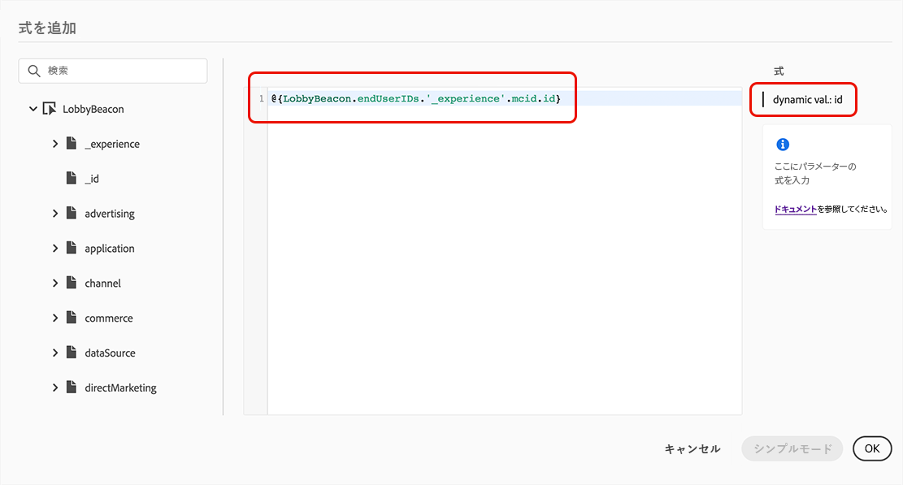

# 高度な式エディターの操作 {#about-the-advanced-expression-editor}

>[!CONTEXTUALHELP]
>id="ajo_journey_expression_advanced"
>title="高度な式エディターについて"
>abstract="高度な式エディターを使用すると、インターフェイスの様々な画面で高度な式を作成できます。 例えば、ジャーニーを設定して使用する場合や、データソース条件を定義する場合に、式を作成できます。"

ジャーニーの高度な式エディターを使用すると、インターフェイスの様々な画面で高度な式を作成できます。 例えば、ジャーニーを設定して使用する場合や、データソース条件を定義する場合に、式を作成できます。

また、特定のデータ操作が必要なアクションパラメーターを定義する必要がある場合にも利用できます。 イベントから取得したデータやデータソースから取得した追加情報を活用できます。 ジャーニーでは、表示されるイベントフィールドリストは状況に応じて異なり、ジャーニーに追加されるイベントに応じて変化します。

高度な式エディターには、値を操作し、特にニーズに合った式を定義できる一連のビルトインの関数と演算子が用意されています。 また、高度な式エディターを使用すると、外部データソースパラメーターの値を定義したり、マップフィールドやコレクションを操作したりできます。

>[!NOTE]
>
>ジャーニーの高度な式エディターで使用できる関数や機能は、[パーソナライゼーションエディター](../../personalization/functions/functions.md)で使用できる関数や機能とは異なります。

## 高度な式エディターへのアクセス {#accessing-the-advanced-expression-editor}

高度な式エディターは、次の目的で使用できます。

* データソースとイベント情報に関する[高度な条件](../conditions.md#data_source_condition)の作成
* カスタム[待機アクティビティ](../wait-activity.md#custom)の定義
* アクションパラメーターのマッピングの定義

可能な場合は、**[!UICONTROL 詳細設定モード]**／**[!UICONTROL シンプルモード]**&#x200B;ボタンを使用して 2 つのモードを切り替えることができます。 シンプルモードについては[ここ](../conditions.md#about_condition)で説明されています。

>[!NOTE]
>
>* 条件は、単純な式エディターまたは高度な式エディターで定義できます。 常にブール型を返します。
>
>* アクションパラメーターは、フィールドを選択するか、高度な式エディターを使用して定義できます。 式に応じて特定のデータタイプを返します。

高度な式エディターには、様々な方法でアクセスできます。

* データソース条件を作成した場合は、**[!UICONTROL 詳細設定モード]**&#x200B;をクリックして高度なエディターにアクセスできます。

  

* カスタムタイマーを作成すると、高度なエディターが直接表示されます。
* アクションパラメーターをマッピングする場合、**[!UICONTROL 詳細設定モード]**&#x200B;をクリックします。

## インターフェイスの確認 {#discovering-the-interface}

この画面では、式を手動で記述できます。

画面の左側には、使用可能なフィールドと関数が表示されます。

* **[!UICONTROL イベント]**：インバウンドイベントから受信したフィールドの 1 つを選択します。 表示されるイベントフィールドリストは状況に応じて異なり、ジャーニーに追加されるイベントに応じて変化します。 [詳細情報](../../event/about-events.md)

  >[!CAUTION]
  >
  >エクスペリエンスイベントを使用した式の作成はサポートされていません。 エクスペリエンスイベントを使用して式／ロジックを作成する際の代替アプローチとベストプラクティスについて詳しくは、[こちら](../../building-journeys/exp-event-lookup.md)を参照してください。

* **[!UICONTROL オーディエンス]**：**[!UICONTROL オーディエンスの選定]**&#x200B;イベントをドロップした場合は、式で使用するオーディエンスを選択します。 [詳細情報](../conditions.md#using-a-segment)
* **[!UICONTROL データソース]**：データソースのフィールドグループにあるフィールドリストから選択します。 [詳細情報](../../datasource/about-data-sources.md)
* **[!UICONTROL ジャーニーのプロパティ]**：このセクションでは、特定のプロファイルのジャーニーに関連するテクニカルフィールドが再グループ化されます。 [詳細情報](journey-properties.md)
* **[!UICONTROL 関数]**：複雑なフィルタリングを実行できるビルトインの関数のリストから選択します。 関数はカテゴリ別に整理されています。 [詳細情報](functions.md)

オートコンプリートメカニズムにより、コンテキストに応じた候補が表示されます。

構文検証メカニズムは、コードの整合性をチェックします。 エラーはエディターの上部に表示されます。

>[!TIP]
>
>高度な式エディターで条件を作成する場合は、式に非表示の文字や印刷不可能な文字が含まれていないことを確認します。 さらに、解析エラーを回避するために、単一行の式を使用します。

**高度な式エディターで条件を作成する場合のパラメーターの必要性**

パラメーターの呼び出しが必要な外部データソースからフィールドを選択すると（[このページ](../../datasource/external-data-sources.md)を参照）、新しいタブが右側に表示されて、このパラメーターを指定できるようになります。 パラメーター値は、ジャーニー内に配置されたイベントまたは Experience Platform データソースから取得できます（他の外部データソースから取得することはできません）。 例えば、天候関連のデータソースでは、頻繁に使用されるパラメーターは「市区町村」です。 そのため、この市区町村パラメーターを取得する場所を選択する必要があります。 関数をパラメーターに適用して、形式の変更や連結を実行することもできます。

より複雑なユースケースの場合、データソースのパラメーターをメイン式に含めるには、「params」キーワードを使用して、そのパラメーター値を定義できます。 [このページ](../expression/field-references.md)を参照してください。
