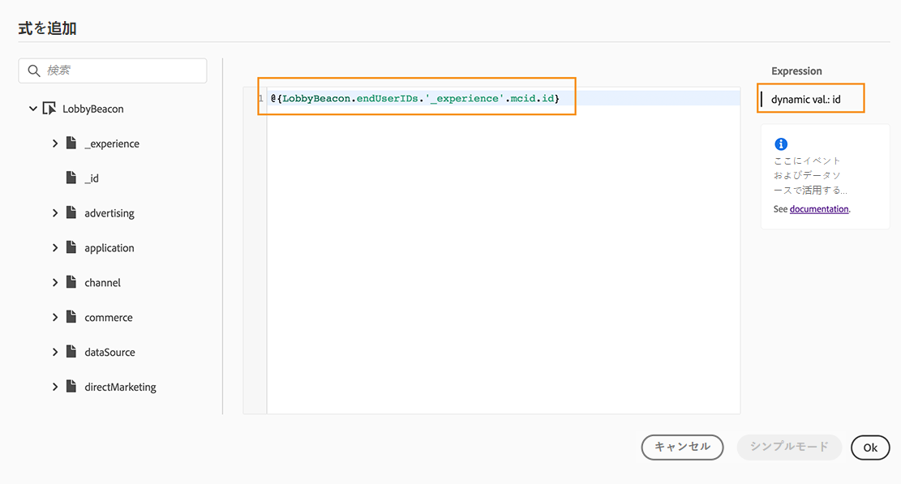

# 高度な式エディターについて {#about-the-advanced-expression-editor}

>[!CONTEXTUALHELP]
>id="ajo_journey_expression_advanced"
>title="高度な式エディターについて"
>abstract="高度な式エディターを使用すると、インターフェイスの様々な画面で高度な式を作成できます。 例えば、journeys を設定して使用する場合や、データソース条件を定義する場合は、式を作成することができます。"

高度な式エディターを使用すると、インターフェイスの様々な画面で高度な式を作成できます。 例えば、journeys を設定して使用する場合や、データソース条件を定義する場合は、式を作成することができます。特定のデータ操作が必要なアクションパラメーターを定義する場合は、いつでも使用できます。 データを利用して、データソースから取得したイベントやその他の情報を使用することができます。 順番には、表示されたイベントフィールドのリストが状況に応じて表示されます。これは、その過程で追加されたイベントによって異なります。

高度な式エディターには、関数と演算子のセットが用意されています。これにより、値を操作して、具体的なニーズに適合する式を定義することができます。 さらに、高度な式エディターを使用して、外部データソースパラメーターの値を定義し、「エクスペリエンスイベント」のように、マップフィールドやコレクションを操作することもできます。

_アドバンスエクスプレッションエディターインターフェイス_

高度な式エディターを使用して、次のことができます。

* データソースとイベント情報に関する詳細な条件 ](../condition-activity.md#about_condition) の作成 [
* カスタム [ 待機アクティビティーの定義](../wait-activity.md#custom)
* アクションパラメーターマッピングの定義

可能な場合は、 **[!UICONTROL Advanced mode]** / **[!UICONTROL Simple mode]** ボタンを使用して2つのモードを切り替えることができます。 ここで ](../condition-activity.md#about_condition) は、シンプルモードについて説明 [ します。

>[!NOTE]
>
>条件は、単純なエクスプレッションエディターまたはアドバンスエクスプレッションエディターで定義することができます。 これらの値は常にブール型を返します。
>
>アクションのパラメーターを定義するには、フィールドを選択するか、高度な式エディターを使用します。 式によって特定のデータ型が返されます。

## 高度な式エディターへのアクセス {#accessing-the-advanced-expression-editor}

アドバンスエクスプレッションエディターには、次のような方法でアクセスできます。

* データソース条件を作成するときに、「on **[!UICONTROL Advanced mode]** 」をクリックして詳細エディターにアクセスできます。

   

* カスタムタイマーを作成すると、詳細エディターが直接表示されます。
* 「アクション」パラメーターをマップする場合は、「on **[!UICONTROL Advanced mode]** 」をクリックします。

## インターフェイスの検出{#discovering-the-interface}

この画面では、エクスプレッションを手動で記述することができます。

画面の左側には、使用可能なフィールドと関数が表示されます。

* **[!UICONTROL Events]**: 着信イベントから受信したフィールドを1つ選択します。 イベントフィールドの表示リストは文脈に従い、その過程で追加されたイベントによって異なります。 [詳細を読む](../../event/about-events.md)
* **[!UICONTROL Segments]**: イベントを削除 **[!UICONTROL Segment qualification]** した場合は、式に使用するセグメントを選択します。 [詳細を読む](../condition-activity.md#using-a-segment)
* **[!UICONTROL Data Sources]**&#x200B;データソースのフィールドグループで利用可能なフィールドのリストから選択します。 [詳細を読む](../../datasource/about-data-sources.md)
* **[!UICONTROL Journey properties]**&#x200B;この節では、特定のプロファイルの旅に関する技術フィールドについて説明しています。 regroups を参照してください。 [詳細を読む](journey-properties.md)
* **[!UICONTROL Functions]**: 複雑なフィルターの実行を許可する組み込み関数のリストから選択します。 関数はカテゴリー別に整理されています。 [詳細を読む](functions.md)

オートコンプリートメカニズムによって、文脈に応じた候補が表示されます。

シンタックス検証機構は、コードの整合性をチェックします。 エラーは、エディターの上に表示されます。

**高度な式エディターを使用して条件を作成する際にパラメーターが必要**

パラメーターを呼び出す必要がある場合は、外部データソースからフィールドを選択します (このページ ](../../datasource/external-data-sources.md) を参照してください [ 。例えば、weather 関連のデータソースでは、頻繁に使用されるパラメーターは「市区町村」になります。 そのため、この city パラメーターを取得する場所を選択する必要があります。 関数をパラメーターに適用して、フォーマットの変更または連結を実行することもできます。

複雑な使用例については、データソースのパラメーターをメイン式に含める必要がある場合は、「params」キーワードを使用して値を定義することができます。 このページ ](../expression/field-references.md) を参照してください [ 。
