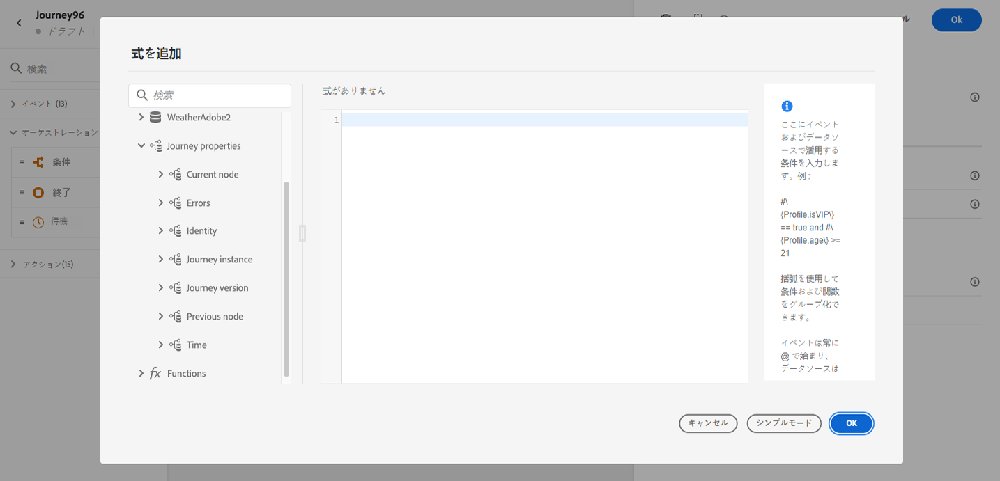

# 旅のプロパティの属性 {#journey-properties}

高度な式エディターには、「イベント」および「データソース」カテゴリーの下の「旅のプロパティ **」カテゴリーが表示され** ます。このカテゴリには、特定のプロファイルの旅に関する技術フィールドが含まれています。 これは、システムによって取得される情報 (journeys または発生した具体的なエラーなど) です。

>[!NOTE]
>
>「旅のプロパティ」属性は、単純なエクスプレッションエディターでも使用できます。 この [ 項を参照してください。](../condition-activity.md#about_condition)

例えば、次のような情報が表示されます。

* 旅のバージョン: 旅の uid、旅の uid、インスタンス uid など
* エラー: データのフェッチ、アクションの実行、その他
* 現在のステップ、最後のステップ、その他
* プロファイルの破棄

これらのフィールドを使用して、式を作成することができます。 これらの値は、旅の実行中に直接取得されます。

次に、使用例を示します。

* **プロファイルは破棄されたプロファイル** : メッセージから除外されたすべてのプロファイルを、記録用にサードパーティシステムのシステムに送信することができます。 そのためには、タイムアウトとエラーが発生したときのパスを設定し、次のように、特定のエラータイプにフィルターを適用するための条件を追加します。 その後、カスタムアクションを使用して、破棄されたプロファイルをサードパーティシステムにプッシュすることができます。

* **エラー** が発生した場合にアラートを送信: メッセージでエラーが発生するたびに、サードパーティのシステムに通知を送信できます。 これを行うには、エラーが発生したときのパスを設定し、条件とカスタムアクションを追加します。 このような場合は、エラーが発生したときのように、余裕期間のチャネルで通知を送信することができます。

* **レポート** のエラーを改善: エラーが発生したメッセージのパスが1つだけではなく、エラーの種類ごとに条件を定義することができます。 これにより、レポートを改良し、すべてのエラータイプデータを表示することができます。

## フィールドのリスト {#journey-properties-fields}

| 項目 | フィールド名 | 見出し | つい |
|---|---|---|------------|
| 旅のバージョン | journeyUID | 旅の識別子 |  |
|  | journeyVersionUID | 旅のバージョンの識別子 |  |
|  | journeyVersionName | 旅のバージョン名 |  |
|  | journeyVersionDescription | 「旅のバージョン」の説明 |  |
|  | journeyVersion | 旅のバージョン |  |
| 旅インスタンス | instanceUID | 「旅のインスタンス識別子」 | インスタンスの ID |
|  | externalKey | 外部キー | 個々の識別子が旅をトリガーします。 |
|  | 組織 Id | 組織識別子 | ブランドの編成 |
|  | sandboxName | サンドボックス名 | サンドボックスの名前 |
| Identity | profileId | プロファイル Id id | 旅のプロファイルの識別子 |
|  | 名前 | Profile Identity Namespace | 「フライト中のプロファイルの名前 (例: 他 d)] |
| 現在のノード | currentNodeId | 現在のノード識別子 | 現在のアクティビティ (ノード) の識別子 |
|  | currentNodeName | 現在のノード名 | 現在の利用状況 (ノード) の名前 |
| 前のノード | 前の Nodeid | 前のノードの識別子 | 前のアクティビティ (ノード) の識別子 |
|  | 前のノードの nodename | 前のノード名 | 前のアクティビティ (ノード) の名前 |
| 誤り | lastNodeUIDInError | エラーが発生した最後のノード識別子 | エラーが発生した最新のアクティビティ (ノード) の識別子 |
|  | Lastnoデ Ameerror | エラーが発生した最後のノード名 | エラーが発生した最新のアクティビティ (ノード) の名前 |
|  | lastNodeTypeInError | エラーが発生した最後のノードタイプ | エラーによって最新のアクティビティ (ノード) のエラータイプが発生します。 使用できるタイプ:<ul><li>イベント: イベント、反力、SQ (例: セグメント条件)</li><li>フロー制御: 終了、条件、待ち</li><li>アクション: ACS アクション、ジャンプ、カスタムアクション</li></ul> |
|  | lastErrorCode | 最終エラーコード | エラーが発生した最新のアクティビティ (ノード) のエラーコードです。 エラーが発生する可能性があります。 <ul><li>HTTP エラーコード</li><li>キャップ</li><li>timedOut</li><li>エラー (例: 予期しないエラーが発生した場合のデフォルトです。 まれに発生しますが、非常にまれな場合もあります。</li></ul> |
|  | lastExecutedActionErrorCode | 最後に実行されたアクションエラーコード | エラーの最新アクションのエラーコード |
|  | lastDataFetchErrorCode | 最後のデータ Fetch エラーコード | データソースからの最新のデータフェッチのエラーコード |
| ここ | lastActionExecutionElapsedTime | 最後のアクションの実行に経過した時間 | 最新のアクションの実行に要した時間 |
|  | lastDataFetchElapsedTime | 最終データ fetch 経過時間 | データソースからの最新のデータフェッチの実行に要した時間 |
