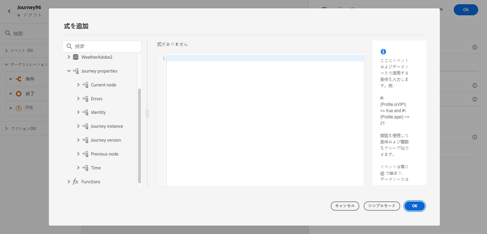

# ジャーニーのプロパティ属性 {#journey-properties}

[単純な式エディター](../conditions.md#about_condition)と[高度な式エディター](../expression/expressionadvanced.md)では、**イベント**&#x200B;カテゴリと&#x200B;**データソース**&#x200B;カテゴリの下にある&#x200B;**ジャーニープロパティ**&#x200B;カテゴリにアクセスできます。 このカテゴリには、特定のプロファイルのジャーニーに関連するテクニカルフィールドが含まれています。 これは、ジャーニー ID や発生した特定のエラーなど、システムがライブジャーニーから取得した情報です。

例えば、次の情報が含まれます。

* ジャーニーのバージョン：ジャーニー UID、ジャーニーバージョン UID、インスタンス UID など。
* エラー：データ取得、アクション実行など。
* 現在のステップ、前回のステップなど。
* 破棄されたプロファイル

  フィールドのリストについて詳しくは、[この節](#journey-properties-fields)を参照してください。

これらのフィールドを使用して式を作成できます。 ジャーニーの実行中、値はジャーニーから直接取得されます。

ユースケースの例を以下に示します。

* **破棄されたプロファイルをログに記録**：キャップルールによってメッセージから除外されたすべてのプロファイルを、ログに記録するためにサードパーティシステムに送信できます。 それには、タイムアウトおよびエラーの場合にパスを設定し、特定のエラータイプに基づいてフィルタリングするための条件を追加します。例えば、「キャップルールでユーザーを廃棄する」などです。 その後、カスタムアクションを使用して、破棄されたプロファイルをサードパーティシステムにプッシュできます。

* **エラーが発生した場合にアラートを送信**：メッセージでエラーが発生するたびに、サードパーティシステムに通知を送信できます。 それには、エラーが発生した場合のパスを設定し、条件とカスタムアクションを追加します。 例えば、発生したエラーの説明を記載した通知を Slack チャネルで送信できます。

* **レポートでエラーを絞り込み**：エラーメッセージのパスを 1 つだけ用意するのではなく、エラータイプごとに条件を定義できます。 これにより、レポートの精度を高め、すべてのエラータイプのデータを表示できます。

## フィールドの一覧 {#journey-properties-fields}

| カテゴリ | フィールド名 | ラベル | 説明 |
|---|---|---|------------|
| ジャーニーバージョン | journeyUID | ジャーニー識別子 | |
| | journeyVersionUID | ジャーニーバージョン識別子 | |
| | journeyVersionName | ジャーニーバージョン名 | |
| | journeyVersionDescription | ジャーニーバージョンの説明 | |
| | journeyVersion | ジャーニーバージョン | |
| ジャーニーインスタンス | instanceUID | ジャーニーインスタンス識別子 | インスタンスの ID |
| | externalKey | 外部キー | ジャーニーをトリガーする個々の識別子 |
| | organizationId | 組織識別子 | ブランドの組織 |
| | sandboxName | サンドボックス名 | サンドボックスの名前 |
| ID | profileId | プロファイル ID 識別子 | ジャーニー内のプロファイルの識別子 |
| | 名前空間 | プロファイル ID 名前空間 | ジャーニー内のプロファイルの名前空間（例：ECID） |
| 現在のノード | currentNodeId | 現在のノード識別子 | 現在のアクティビティ（ノード）の識別子 |
| | currentNodeName | 現在のノード名 | 現在のアクティビティ（ノード）の名前 |
| 前のノード | previousNodeId | 前のノード識別子 | 前のアクティビティ（ノード）の識別子 |
| | previousNodeName | 前のノード名 | 前のアクティビティ（ノード）の名前 |
| エラー | lastNodeUIDInError | エラーの最後のノード識別子 | エラーが発生した最新のアクティビティ（ノード）の識別子 |
| | lastNodeNameInError | エラーの最後のノード名 | エラーが発生した最新のアクティビティ（ノード）の名前 |
| | lastNodeTypeInError | エラーの最後のノードタイプ | エラーが発生した最新のアクティビティ（ノード）のエラータイプ。 考えられるタイプは次のとおりです。<ul><li>イベント：イベント、反応、SQ（例：オーディエンスの選定）</li><li>フロー制御：終了、条件、待機</li><li>アクション：ACS アクション、ジャンプ、カスタムアクション</li></ul> |
| | lastErrorCode | 前回のエラーコード | エラーが発生した最新のアクティビティ（ノード）のエラーコード。 考えられるエラーは次のとおりです。 <ul><li>HTTP エラーコード</li><li>キャップ</li><li>タイムアウト</li><li>エラー（例：予期しないエラーが発生した場合のデフォルト。 発生すべきでないか、きわめて稀にしか発生しない）</li></ul> |
| | lastExecutedActionErrorCode | 前回実行されたアクションのエラーコード | エラーの最新アクションのエラーコード |
| | lastDataFetchErrorCode | 前回のデータ取得エラーコード | データソースからの最新のデータ取得のエラーコード |
| 時間 | lastActionExecutionElapsedTime | 前回のアクション実行の経過時間 | 最新のアクションの実行に費やした時間 |
| | lastDataFetchElapsedTime | 前回のデータ取得の経過時間 | データソースからの最新のデータ取得の実行に費やした時間 |

+++ AI ナレッジリファレンス

このセクションには、このトピックに関連する解釈、検索、質問への回答をサポートすることを目的とした構造化された知識が含まれています。

理解を深めるには、この情報をこのページのドキュメントと組み合わせる必要があります。 どちらのソースも単独で使用することを意図していません。このページでは、機能について説明しますが、この節では、用語、意図、適用可能性、および制約の曖昧さを解消するのに役立つ追加のコンテキストを提供します。

* **TL;DR:**&#x200B;このページでは、式エディターのジャーニープロパティ カテゴリについて説明します。これは、ログ、アラート、エラー固有のレポート用の式の作成に使用できる、ライブジャーニーインスタンス（ID、エラー、現在/過去のノード、経過時間）に関する一連の技術的なフィールドです。

**インテント：**

* シンプルまたは高度な式エディターでジャーニープロパティ フィールドにアクセスして、ライブジャーニーのメタデータを参照できます
* 破棄されたプロファイルをエラータイプ別にフィルタリングして、サードパーティのログシステムに転送する条件を作成します
* カスタムアクションで最後のエラーコードとノード名を参照することで、外部チャネル（Slackなど）にエラーアラートを送信します
* `lastNodeTypeInError`と`lastErrorCode`を使用して、エラータイプごとに個別の条件パスを作成することで、ジャーニーエラーレポートを調整します
* トラッキングと監査のためのエクスプレッションで、ジャーニーのバージョン識別子、インスタンス識別子、サンドボックス名を参照する

**用語集：**

* **ジャーニーのプロパティ**：現在のジャーニー実行インスタンス *（product-specific）*&#x200B;のテクニカルメタデータフィールドを含む式エディターのカテゴリ
* **instanceUID**：特定のプロファイル実行&#x200B;*（製品固有）*&#x200B;のジャーニーインスタンスの一意の識別子
* **lastErrorCode**: ジャーニーで最後に失敗したアクティビティのエラーコード。使用可能な値は、HTTP コード、`capped`、`timedOut`および`error`、*（製品固有）*&#x200B;です
* **lastNodeTypeInError**: エラーが発生した最後のアクティビティのタイプ。イベント、フロー制御、またはアクション *（製品固有）*&#x200B;にすることができます
* **externalKey**: ジャーニーインスタンス *（製品固有）*&#x200B;をトリガーした個人識別子（プロファイル IDなど）

**ガードレール：**

* ジャーニープロパティ フィールド値は、実行時にライブジャーニーから直接取得されます。実行前の検証には使用できません
* `lastErrorCode` フィールドでは、HTTP エラーコード、`capped`、`timedOut`、`error`の定義済み値が使用されています
* ジャーニーのプロパティは、ジャーニーのプロパティ カテゴリの下のシンプルなエクスプレッションエディターと高度なエクスプレッションエディターの両方で使用できます

**用語：**

* 正規名：ジャーニーのプロパティ – 頭字語：なし – バリアント：ジャーニーのテクニカルフィールド、ジャーニーメタデータフィールド
* 同義語：「ジャーニープロパティ」 = 「ジャーニーのテクニカルフィールド」、「instanceUID」 = 「ジャーニーインスタンス識別子」
* 混同しないでください：journeyUID （ジャーニー定義を識別）≠ instanceUID （ジャーニーの特定のプロファイルの実行を識別）

**FAQ:**

* **Q：式エディターのジャーニープロパティ フィールドはどこにありますか？** — イベントとデータソースの下のジャーニープロパティ カテゴリの下にあるシンプル式エディターと高度な式エディターの両方に表示されます。
* **Q: キャッピングルールによって破棄されたプロファイルをログに記録するにはどうすればよいですか？** — `lastErrorCode == "capped"`にエラーパス条件フィルタリングを追加し、カスタムアクションを使用して、それらのプロファイルをサードパーティシステムにプッシュします。
* **Q: `journeyUID`と`instanceUID`の違いは何ですか？** — `journeyUID`はジャーニー定義を識別し、`instanceUID`は特定のプロファイルに対する特定の実行インスタンスを識別します。
* **Q：予期しないシステムエラーに対してどのようなエラーコードが返されますか？** — `error` コード。予期しないエラーの既定値として使用され、めったに発生しません。
* **Q: ジャーニーのプロパティ フィールドを使用して、アクションエラーに関するSlack アラートを送信できますか？**  – はい。カスタムアクションで`lastNodeNameInError`と`lastErrorCode`を参照して、Slack通知にエラーの詳細を含めます。

+++
