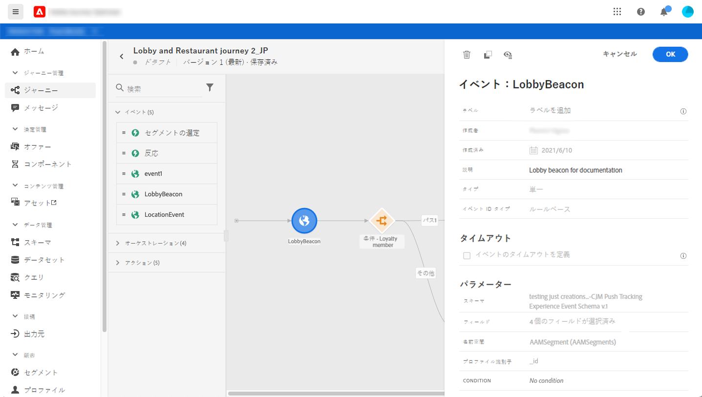
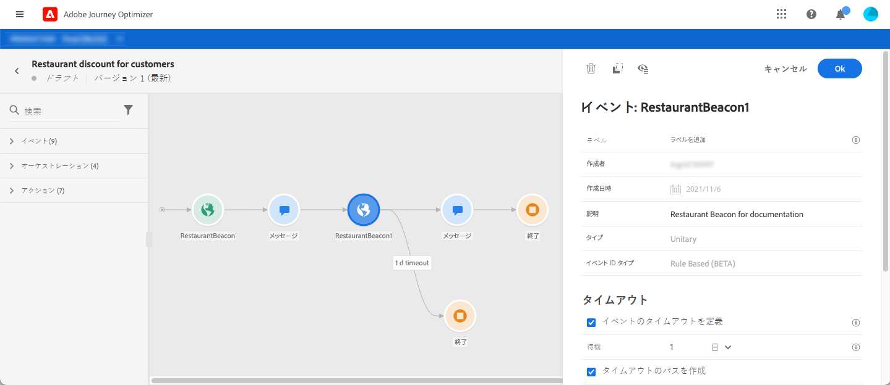
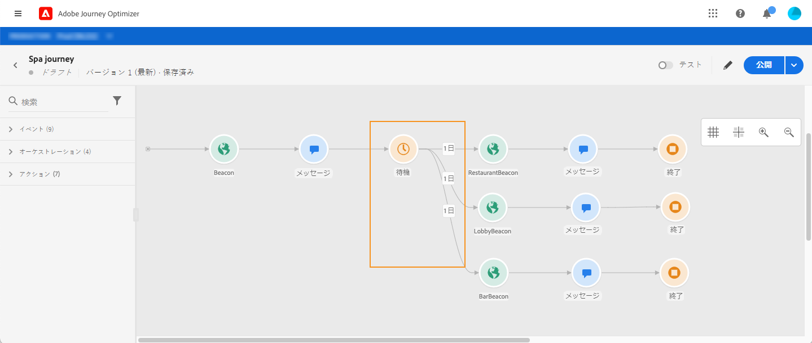

# 一般イベント {#section_ofg_jss_dgb}

このタイプのイベントでは、ラベルと説明のみを追加できます。その他の設定は編集できません。技術ユーザーによって実施します。[このページ](../event/about-events.md)を参照してください。

ビジネスイベントをドロップすると、自動的に&#x200B;**セグメントの読み取り**&#x200B;アクティビティが追加されます。 ビジネスイベントの詳細については、[この節](../event/about-events.md)を参照してください。

## 一定時間内のイベントのリッスン {#events-specific-time}

ジャーニー内に配置されたイベントアクティビティは、イベントを無限にリッスンします。イベントを一定時間のみリッスンするようにするには、イベントのタイムアウトを設定する必要があります。

タイムアウトを設定すると、ジャーニーでは、タイムアウトするまでの待機時間中のみ、イベントがリッスンされるようになります。待機時間中にイベントの受け取りが発生すると、そのイベントのパスに進みます。イベントの受け取りが発生しなかった場合、タイムアウトパスに進むか、ジャーニーが終了します。

イベントのタイムアウトを設定するには、次の手順に従います。

1. イベントプロパティで「**[!UICONTROL イベントのタイムアウト]**&#x200B;を定義します」オプションを有効にします。

1. ジャーニーがこのイベントを待機する時間を指定します。

1. 指定したタイムアウト内にイベントを受信しなかったときに、個人をタイムアウトパスに送信する場合は、「 **[!UICONTROL タイムアウトパスを設定]** 」オプションを有効にします。 このオプションを有効にしない場合、ジャーニーはタイムアウト値に達すると終了します。

   

この例のジャーニーでは、まず顧客に最初のウェルカムプッシュが送信されます。次に、顧客が翌日中にレストランに入店した場合に限り、食事割引プッシュが送信されます。レストランのイベントは 1 日でタイムアウトするように設定してあります。

* 「ウェルカム」プッシュの1日未満にレストランイベントが受信された場合は、「食事割引」プッシュアクティビティが送信されます。
* 翌日中にレストランのイベントの受け取りが発生しなかった場合は、タイムアウトパスに進みます。

**[!UICONTROL 待機]**&#x200B;アクティビティの後に配置する複数のイベントにタイムアウトを設定する場合は、これらのイベントのいずれかにのみタイムアウトを設定する必要があります。

このタイムアウトは、**[!UICONTROL 待機]**&#x200B;アクティビティの後に配置されたすべてのイベントに適用されます。 指定されたタイムアウトまでにイベントを受信しなかった場合、個人は1つのタイムアウトパスに送られるか、ジャーニーを終了します。

