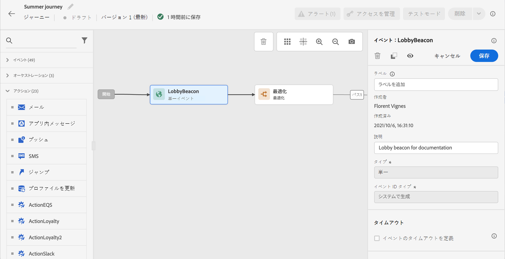
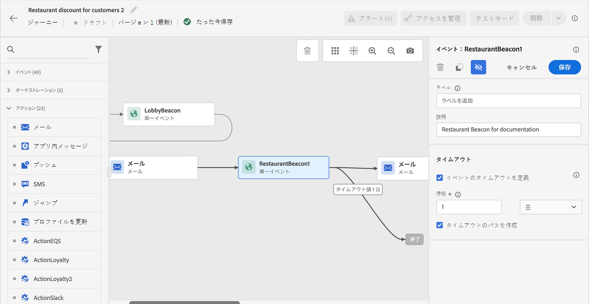
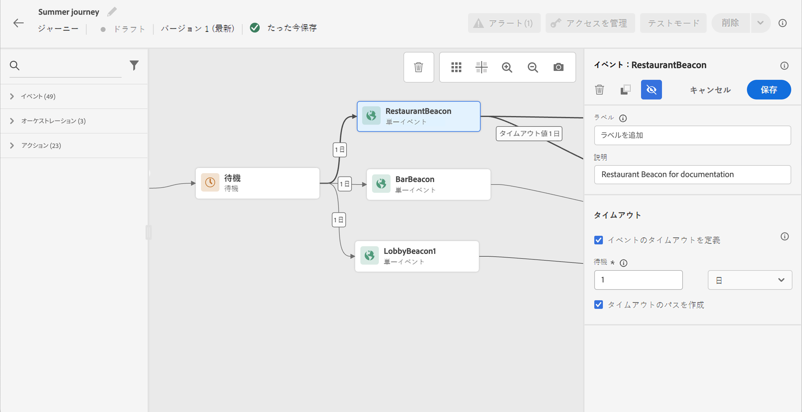

# 一般イベント {#general-events}

>[!CONTEXTUALHELP]
>id="ajo_journey_event_custom"
>title="単一イベント"
>abstract="イベントを使用すると、ジャーニーをまとめてトリガーし、ジャーニーの過程にある個人にリアルタイムでメッセージを送信できます。このタイプのイベントでは、ラベルと説明のみを追加できます。イベントの設定はデータエンジニアが実行し、編集できません。"

イベントを使用すると、ジャーニーをまとめてトリガーし、ジャーニーの過程にある個人にリアルタイムでメッセージを送信できます。

このタイプのイベントでは、ラベルと説明のみを追加できます。その他の設定は編集できません。技術ユーザーによって実施します。[このページ](../event/about-events.md)を参照してください。

ビジネスイベントをドロップすると、**オーディエンスを読み取り**&#x200B;アクティビティが自動的に追加されます。ビジネスイベントの詳細については、[この節](../event/about-events.md)を参照してください。

## 一定時間内のイベントのリスニング {#events-specific-time}

ジャーニー内に配置されたイベントアクティビティは、イベントを無限にリッスンします。イベントを一定時間のみリッスンするようにするには、イベントのタイムアウトを設定する必要があります。

タイムアウトを設定すると、ジャーニーでは、タイムアウトするまでの待機時間中のみ、イベントがリッスンされるようになります。待機時間中にイベントの受け取りが発生すると、そのイベントのパスに進みます。そうでない場合、そのプロファイルは、タイムアウトパスに進むか（定義されている場合）、そのジャーニーを継続します。

タイムアウトパスが定義されていない場合、タイムアウト設定は待機アクティビティとして機能し、プロファイルは一定時間待機します。この待機の終了前にイベントが発生した場合は、停止することがあります。タイムアウト後にプロファイルをそのジャーニーから除外したい場合は、タイムアウトパスを設定する必要があります。

イベントのタイムアウトを設定するには、次の手順に従います。

1. イベントのプロパティで「**[!UICONTROL イベントのタイムアウトを定義]**」オプションを有効にします。

1. ジャーニーがこのイベントを待機する時間を指定します。最大期間は 29 日です。

1. 指定のタイムアウト内でイベントの受け取りが発生しなかったとき、対象者をタイムアウトのパスに送信したい場合は「**[!UICONTROL タイムアウトのパスを設定]**」オプションを有効にします。このオプションが有効になっていない場合、タイムアウトに達すると、個人のジャーニーが続行されます。 を常に有効にすることをお勧めします **タイムアウトのパスを設定** オプション。

   

この例では、ジャーニーはロビーに入った顧客に、最初のお知らせメールを送信します。 次に、顧客が翌日中にレストランに入った場合にのみ、食事割引メールを送信します。 レストランのイベントは 1 日でタイムアウトするように設定してあります。

* ウェルカムメールから 1 日経過する前にレストランのイベントの受け取りが発生した場合は、食事割引メールが送信されます。
* 翌日中にレストランのイベントの受け取りが発生しなかった場合は、タイムアウトパスに進みます。

**[!UICONTROL 待機]**&#x200B;アクティビティの後に配置された複数のイベントでタイムアウトを設定する場合は、これらのイベントのいずれかでタイムアウトを設定する必要があります。

定義されたタイムアウトは、の後に配置されるすべてのイベントに適用されます **[!UICONTROL 待機]** アクティビティ：

* タイムアウト時間内に 1 つのイベントを受信した場合、個人は受信したイベントのパスに進みます。
* タイムアウトの期間内にイベントの受け取りが発生しなかった場合、個々のユーザーは、タイムアウトが定義されたイベントのタイムアウト分岐に進みます。

