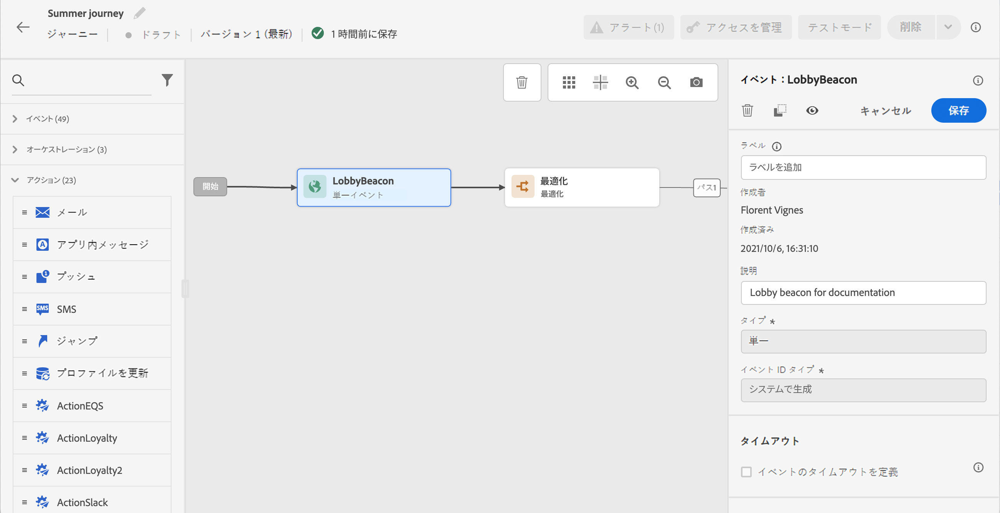
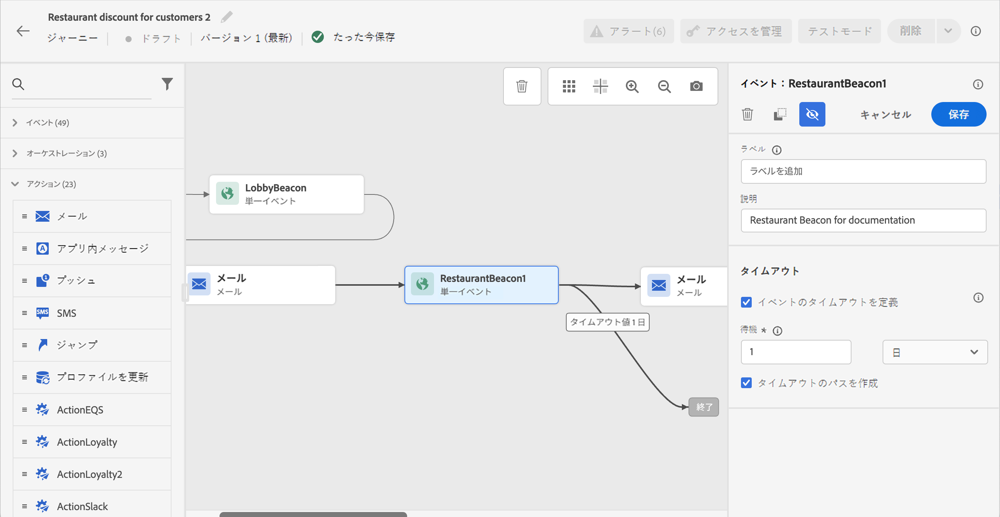
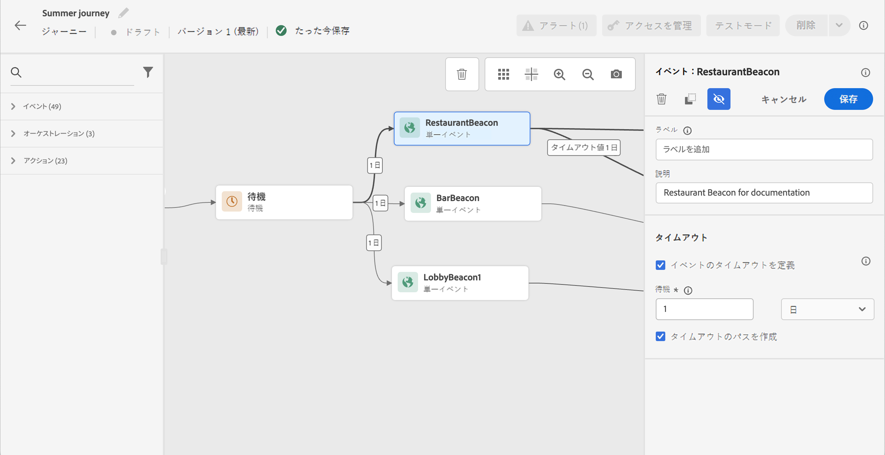

# 一般イベント {#general-events}

>[!BEGINSHADEBOX]

**このページでは、**&#x200B;一般的なイベントを使用してジャーニーをリアルタイムで一括トリガーし、イベントのタイムアウトとタイムアウトパスを設定して、定義された期間のみイベントをリッスンする方法を説明します。

>[!ENDSHADEBOX]

>[!CONTEXTUALHELP]
>id="ajo_journey_event_custom"
>title="単一イベント"
>abstract="イベントを使用すると、ジャーニーをまとめてトリガーし、ジャーニーの過程にある個人にリアルタイムでメッセージを送信できます。 このタイプのイベントでは、ラベルと説明のみを追加できます。 イベントの設定はデータエンジニアが実行し、編集できません。"

>[!CONTEXTUALHELP]
>id="ajo_journey_event_business_canvas"
>title="ビジネスイベント"
>abstract="これらのイベントを使用すると、プロファイルに関連しないイベントを使用してジャーニーを開始できます。 そのイベントが発生すると、プロファイルのオーディエンスにメッセージを送信できるようになります。 このタイプのイベントでは、ラベルと説明のみを追加できます。 イベントの設定は技術系ユーザーが実行し、編集はできません。"

イベントを使用すると、ジャーニーをまとめてトリガーし、ジャーニーの過程にある個人にリアルタイムでメッセージを送信できます。

このタイプのイベントでは、ラベルと説明のみを追加できます。 その他の設定は編集できません。 技術ユーザーによって実施します。 [このページ](../event/about-events.md)を参照してください。

イベントのスループットとジャーニーの処理率について詳しくは、[この節](entry-management.md#journey-processing-rate)を参照してください。

ビジネスイベントをドロップすると、**オーディエンスを読み取り**&#x200B;アクティビティが自動的に追加されます。 ビジネスイベントの詳細については、[この節](../event/about-events.md)を参照してください。

## 一定時間内のイベントのリスニング {#events-specific-time}

ジャーニー内に配置されたイベントアクティビティは、イベントを無期限でリッスンします。 特定の時間でのみイベントをリッスンするには、イベントのタイムアウトを設定する必要があります。

その後、ジャーニーはタイムアウトで指定された期間中にイベントをリッスンします。 その期間中にイベントを受信すると、そのイベントパスに人が流れます。 そうでない場合、そのプロファイルは、タイムアウトパスに進むか（定義されている場合）、そのジャーニーを継続します。

タイムアウトパスが定義されていない場合、タイムアウト設定は待機アクティビティとして機能し、プロファイルは一定時間待機します。この待機の終了前にイベントが発生した場合は、停止することがあります。 タイムアウト後にプロファイルをそのジャーニーから除外したい場合は、タイムアウトパスを設定する必要があります。

イベントのタイムアウトを設定するには、次の手順に従います。

1. イベントのプロパティで「**[!UICONTROL イベントのタイムアウトを定義]**」オプションを有効にします。

1. ジャーニーがこのイベントを待機する時間を指定します。 最大期間は **90 日**&#x200B;です。

1. 指定したタイムアウト内にイベントが受信されなかった場合、ベストプラクティスは、個人をタイムアウトパスに送信することです。 この場合は、「**[!UICONTROL タイムアウトのパスを設定]**」オプションを有効にします。 その場合、その個人のジャーニーはタイムアウト値に達しても続行します。 「**[!UICONTROL タイムアウトのパスを設定]**」オプションを常に有効にすることをお勧めします。

   

この例のジャーニーでは、顧客がロビーに入ると、最初のウェルカムメールが送信されます。 次に、顧客が翌日中にレストランに入店した場合に限り、食事割引メールが送信されます。 そのため、レストランのイベントは 1 日でタイムアウトするように設定してあります。

* ウェルカムメールから 1 日経過する前にレストランのイベントの受け取りが発生した場合は、食事割引メールが送信されます。
* 翌日中にレストランのイベントの受け取りが発生しなかった場合は、タイムアウトパスに進みます。

**[!UICONTROL 待機]**&#x200B;アクティビティの後に配置された複数のイベントでタイムアウトを設定する場合は、これらのイベントのいずれかでタイムアウトを設定する必要があります。

この定義済みタイムアウトは、**[!UICONTROL 待機]**&#x200B;アクティビティの後に配置されるすべてのイベントに適用されます。

* タイムアウト期間内に 1 つのイベントの受け取りが発生すると、その個人は受け取ったイベントのパスに進みます。
* タイムアウト期間内にイベントの受け取りが発生しなかった場合、その個人はタイムアウトが定義されたイベントのタイムアウトブランチに進みます。

+++ AI ナレッジリファレンス

このセクションには、このトピックに関連する解釈、検索、質問への回答をサポートすることを目的とした構造化された知識が含まれています。

理解を深めるには、この情報をこのページのドキュメントと組み合わせる必要があります。 どちらのソースも単独で使用することを意図していません。このページでは、機能について説明しますが、この節では、用語、意図、適用可能性、および制約の曖昧さを解消するのに役立つ追加のコンテキストを提供します。

* **TL;DR:**&#x200B;このページでは、ジャーニーで一般的な（単一およびビジネス）イベントを使用して、リアルタイムの個人レベルのメッセージ配信をトリガーする方法について説明します。これには、イベントのタイムアウトとタイムアウトパスの設定方法が含まれます。

**インテント：**
* ジャーニーキャンバスに一般的なイベントアクティビティを追加して、リアルタイムのプロファイルエントリをトリガーにする
* イベントのタイムアウトを設定して、ジャーニーがイベントをリッスンする時間を制限します
* タイムアウトパスを設定して、期待されるイベントをリアルタイムでトリガーしないプロファイルを処理します
* 単一イベントとビジネスイベントを区別し、それぞれが自動的に追加されるタイミングを把握できます
* イベントタイムアウトと待機アクティビティを組み合わせて、マルチイベントタイムアウト動作を制御します

**用語集：**
* **単一イベント**: リアルタイム *（product-specific）*&#x200B;で、一度に1人のジャーニーをトリガーするイベント
* **ビジネスイベント**: プロファイルのオーディエンスのジャーニーをトリガーする、プロファイルに関連しないイベント。オーディエンスを読み取りアクティビティ *（製品固有）*&#x200B;が自動的に追加されます
* **イベントタイムアウト**：設定可能な期間（最大90日）。その後、ジャーニーは特定のイベントの待機を停止し、プロファイルをタイムアウトパス *（製品固有）*&#x200B;にルーティングします
* **タイムアウトパス**: タイムアウトウィンドウ *（製品固有）*&#x200B;内で予期されたイベントを受信しなかった場合にプロファイルが従う、オプションのジャーニーブランチ

**ガードレール：**
* イベントラベルと説明は、キャンバス上の一般的なイベントの唯一の編集可能なフィールドです。その他の設定はすべてテクニカルユーザーが実行し、ジャーニーから変更することはできません
* 最大イベントタイムアウト期間は90日です
* 複数のイベントが待機アクティビティに続く場合、そのイベントの1つにのみタイムアウトを設定する必要があります。定義されたタイムアウトは、待機後のすべてのイベントに適用されます
* タイムアウトパスが定義されていない場合、タイムアウトは待機アクティビティとして機能します。イベントを受信しないプロファイルは、タイムアウトが経過するまでジャーニーに残ります

**用語：**
* 正規名：一般イベント – 頭字語：なし – バリアント：単一イベント、カスタムイベント
* 同義語：「一般イベント」 = 「単一イベント」（キャンバスアクティビティのコンテキスト内）
* 混同しないでください：「ビジネスイベント」≠「単一イベント」 – ビジネスイベントはプロファイルのオーディエンスをターゲットとし、単一イベントは個人をターゲットにします

**FAQ:**
* **Q: ジャーニーキャンバスからイベント設定を変更できますか？**  – いいえ。キャンバスで編集できるのは、ラベルと説明のみです。 完全なイベント設定はテクニカルユーザーが設定し、ジャーニーから変更することはできません。
* **Q: タイムアウトが終了する前にイベントを受信しなかった場合はどうなりますか？** — タイムアウトパスが定義されている場合、プロファイルはそのパスに流れます。 タイムアウトパスが設定されていない場合、タイムアウトは待機アクティビティのように動作し、プロファイルはタイムアウト期間後もジャーニーを継続します。
* **Q: イベントのタイムアウト時間の最大値を教えてください。** — 90日間。
* **Q: タイムアウトパスオプションを有効にするタイミングを教えてください。** — タイムアウト後にプロファイルがそのブランチを終了する場合は、常に有効にします。タイムアウトパスがなければ、プロファイルはジャーニー内に残り、イベントを待機します。
* **Q: ビジネス イベントとジャーニーキャンバス内の単一イベントの違いについて教えてください。** — ビジネスイベントをドロップすると、単一の個人ではなく複数のプロファイルを同時にターゲットにするため、オーディエンスを読み取りアクティビティが自動的に追加されます。

+++
