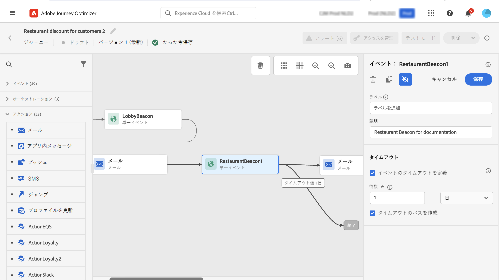
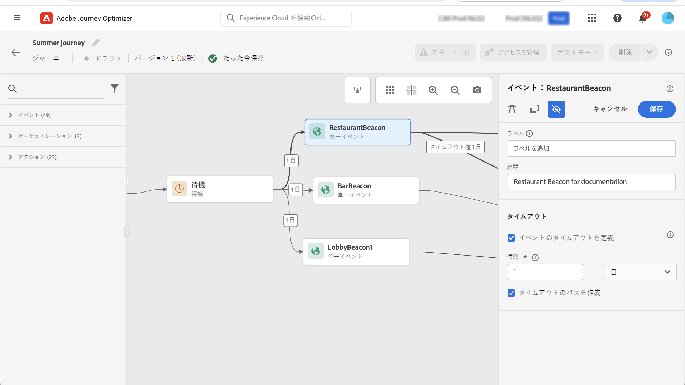

# 一般的なイベント {#general-events}

>[!CONTEXTUALHELP]
>id="ajo_journey_event_custom"
>title="一般的なイベント"
>abstract="イベントを使用すると、journeys unitarily を利用して、その過程に流れている個々のメッセージをリアルタイムに送信することができます。 このタイプのイベントに対しては、ラベルと説明のみを追加できます。 イベント設定はデータエンジニアによって実行されるので、編集はできません。"

イベントを使用すると、journeys unitarily を利用して、その過程に流れている個々のメッセージをリアルタイムに送信することができます。

このタイプのイベントに対しては、ラベルと説明のみを追加できます。 その他の設定を編集することはできません。 これはテクニカルユーザーによって実行されました。 このページ ](../event/about-events.md) を参照してください [ 。

業務イベントをドロップすると、自動的に「セグメント **の読み取り」アクティビティーが** 追加されます。ビジネスイベントについて詳しくは、次の項を [ 参照してください。](../event/about-events.md)

## 特定の時間におけるイベントの監視 {#events-specific-time}

このイベントアクティビティーは、いつまでにイベントをリスンします。 一定の時間にイベントを監視するには、イベントのタイムアウトを設定する必要があります。

これにより、タイムアウトで指定された時間にイベントが監視されます。 その間にイベントを受信した場合、その人物はイベントパスに送られます。 それ以外の場合は、お客様がタイムアウトパスを使用するか、またはその旅を終了します。

イベントのタイムアウトを設定するには、次の手順を実行します。

1. **[!UICONTROL Define the event timeout]**&#x200B;イベントプロパティからオプションを選択します。

1. イベントを待機する時間の長さを指定します。

1. 指定された時間内にイベントが受信されない場合に、ユーザーをタイムアウトパスに送信するには、このオプションを有効 **[!UICONTROL Set a timeout path]** にします。 このオプションがオフの場合は、タイムアウトに達すると、1人のユーザーに対して実行が開始されます。

   

この例では、旅によって最初にウェルカム push がユーザーに送られます。 その後、顧客が翌営業日にレストランを入力した場合にのみ、料理割引を送信します。 そのため、レストランイベントを設定するには1日のタイムアウトを設定します。

* レストランイベントが開始プッシュ以降、1日未満に受信されると、「食事」割引プッシュアクティビティーが送信されます。
* 次の日の間にレストランイベントが受信されない場合は、タイムアウトパスを通って人物が流れています。

アクティビティの後 **[!UICONTROL Wait]** に配置された複数のイベントに対してタイムアウトを設定する場合は、これらのイベントのいずれかについてのみタイムアウトを設定する必要があります。

タイムアウトは、アクティビティーの **[!UICONTROL Wait]** 後に配置されたすべてのイベントに適用されます。 指定されたタイムアウトになる前にイベントが受信されない場合は、1つのタイムアウトパスに、1つの送信が開始されます。

