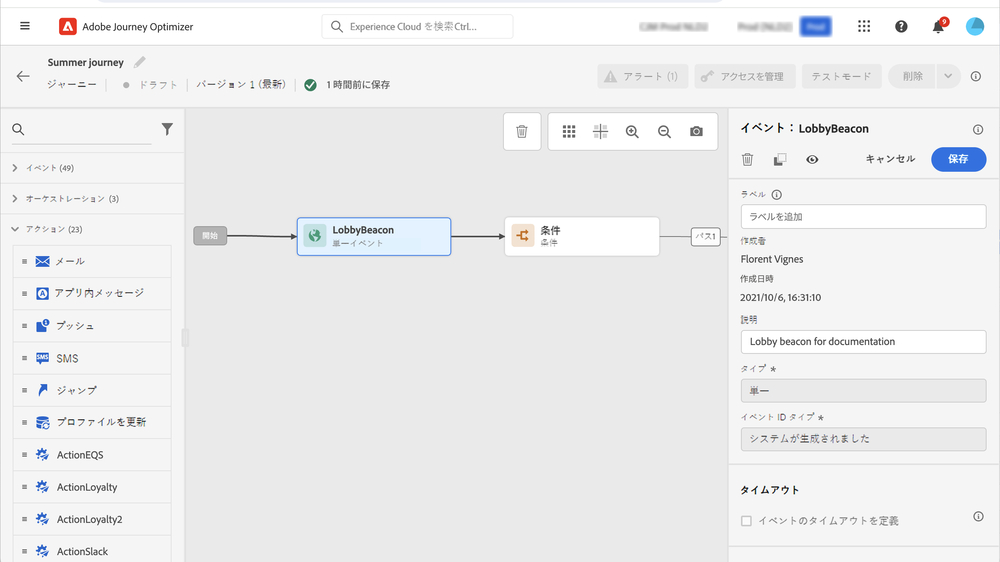

# 一般イベント {#general-events}

>[!CONTEXTUALHELP]
>id="ajo_journey_event_custom"
>title="単一イベント"
>abstract="イベントを使用すると、ジャーニーをまとめてトリガーし、ジャーニーの過程にある個人にリアルタイムでメッセージを送信できます。このタイプのイベントでは、ラベルと説明のみを追加できます。イベントの設定はデータエンジニアが実行し、編集できません。"

>[!CONTEXTUALHELP]
>id="ajo_journey_event_business_canvas"
>title="ビジネスイベント"
>abstract="これらのイベントを使用すると、プロファイルに関連しないイベントを使用してジャーニーを開始できます。そのイベントが発生すると、プロファイルのオーディエンスにメッセージを送信できるようになります。このタイプのイベントでは、ラベルと説明のみを追加できます。イベントの設定は技術系ユーザーが実行し、編集はできません。"

イベントを使用すると、ジャーニーをまとめてトリガーし、ジャーニーの過程にある個人にリアルタイムでメッセージを送信できます。

このタイプのイベントでは、ラベルと説明のみを追加できます。その他の設定は編集できません。技術ユーザーによって実施します。[このページ](../event/about-events.md)を参照してください。

ビジネスイベントをドロップすると、**オーディエンスを読み取り**&#x200B;アクティビティが自動的に追加されます。ビジネスイベントの詳細については、[この節](../event/about-events.md)を参照してください。

## 一定時間内のイベントのリスニング {#events-specific-time}

ジャーニー内に配置されたイベントアクティビティは、イベントを無期限でリッスンします。特定の時間でのみイベントをリッスンするには、イベントのタイムアウトを設定する必要があります。

その後、ジャーニーはタイムアウトで指定された期間中にイベントをリッスンします。その期間中にイベントを受信すると、そのイベントパスに人が流れます。そうでない場合、そのプロファイルは、タイムアウトパスに進むか（定義されている場合）、そのジャーニーを継続します。

タイムアウトパスが定義されていない場合、タイムアウト設定は待機アクティビティとして機能し、プロファイルは一定時間待機します。この待機の終了前にイベントが発生した場合は、停止することがあります。タイムアウト後にプロファイルをそのジャーニーから除外したい場合は、タイムアウトパスを設定する必要があります。

イベントのタイムアウトを設定するには、次の手順に従います。

1. イベントのプロパティで「**[!UICONTROL イベントのタイムアウトを定義]**」オプションを有効にします。

1. ジャーニーがこのイベントを待機する時間を指定します。最大期間は **90 日**&#x200B;です。

1. 指定したタイムアウト内にイベントの受け取りが発生しなかった場合、ベストプラクティスは個人をタイムアウトパスに送信することです。 その場合は、「**[!UICONTROL タイムアウトパスを設定]** オプションを有効にします。 その場合、タイムアウトに達すると、個人のジャーニーが続行されます。 「**[!UICONTROL タイムアウトのパスを設定]**」オプションを常に有効にすることをお勧めします。

   

この例のジャーニーでは、顧客がロビーに入ると、最初のウェルカムメールが送信されます。次に、顧客が翌日中にレストランに入店した場合に限り、食事割引メールが送信されます。そのため、レストランのイベントは 1 日でタイムアウトするように設定してあります。

* ウェルカムメールから 1 日経過する前にレストランのイベントの受け取りが発生した場合は、食事割引メールが送信されます。
* 翌日中にレストランのイベントの受け取りが発生しなかった場合は、タイムアウトパスに進みます。

**[!UICONTROL 待機]**&#x200B;アクティビティの後に配置された複数のイベントでタイムアウトを設定する場合は、これらのイベントのいずれかでタイムアウトを設定する必要があります。

この定義済みタイムアウトは、**[!UICONTROL 待機]**&#x200B;アクティビティの後に配置されるすべてのイベントに適用されます。

* タイムアウト期間内に 1 つのイベントの受け取りが発生すると、その個人は受け取ったイベントのパスに進みます。
* タイムアウト期間内にイベントの受け取りが発生しなかった場合、その個人はタイムアウトが定義されたイベントのタイムアウトブランチに進みます。

