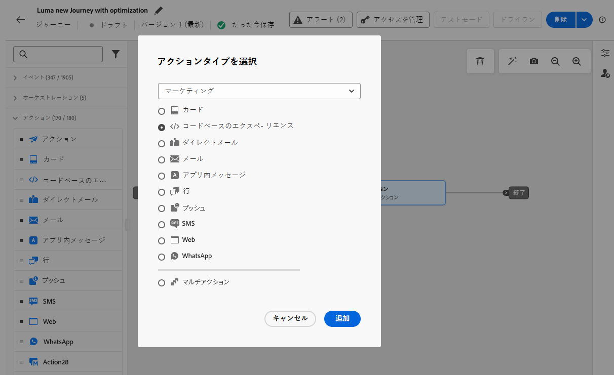
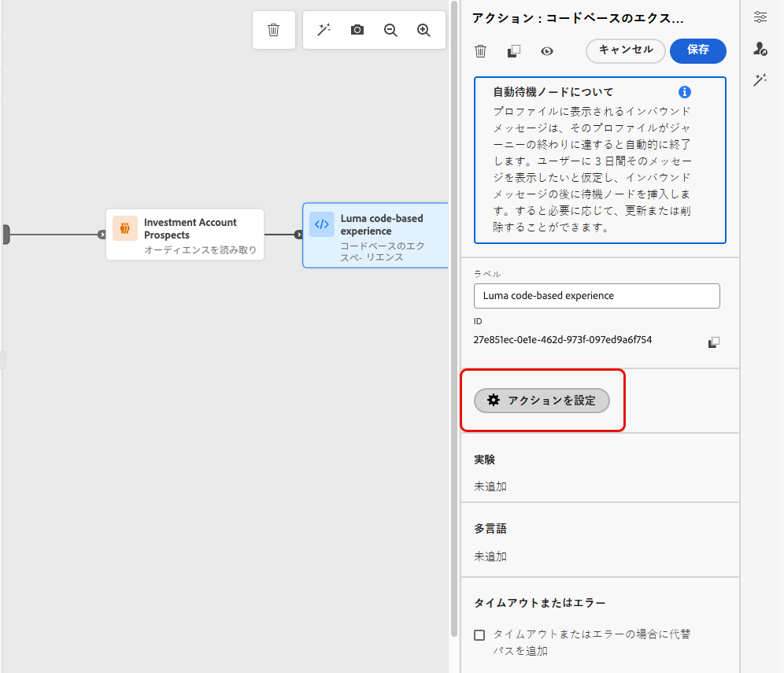
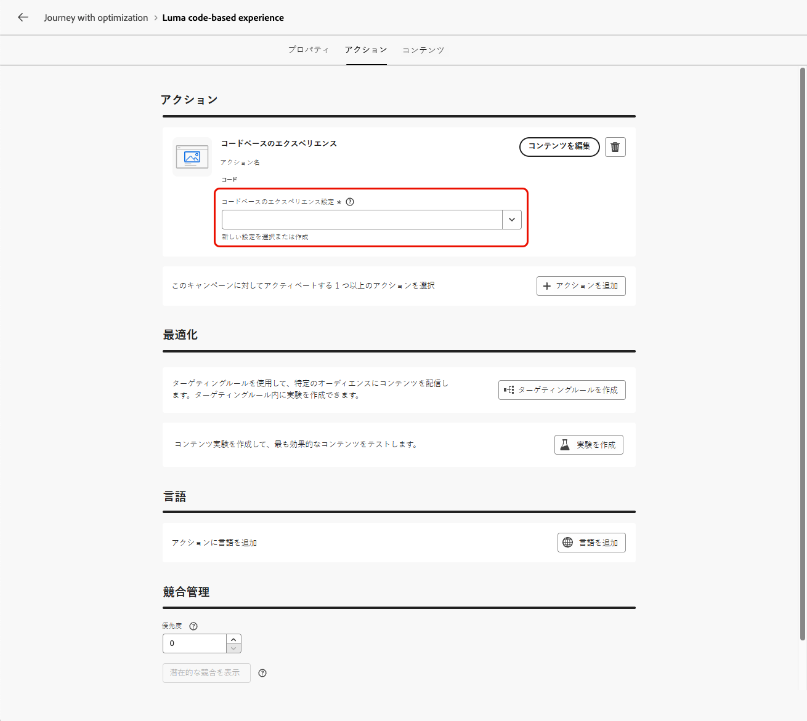
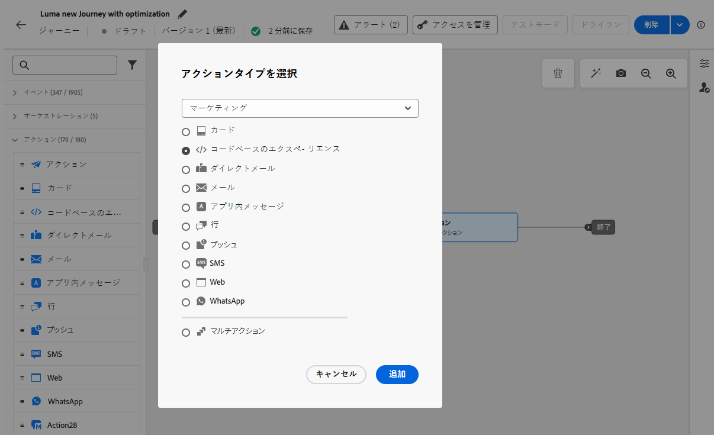
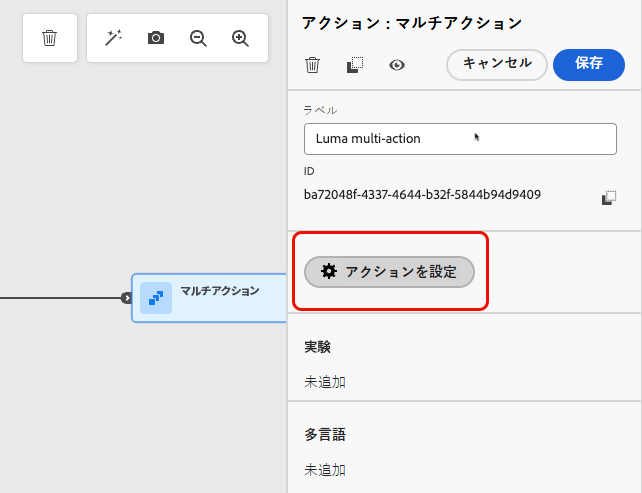
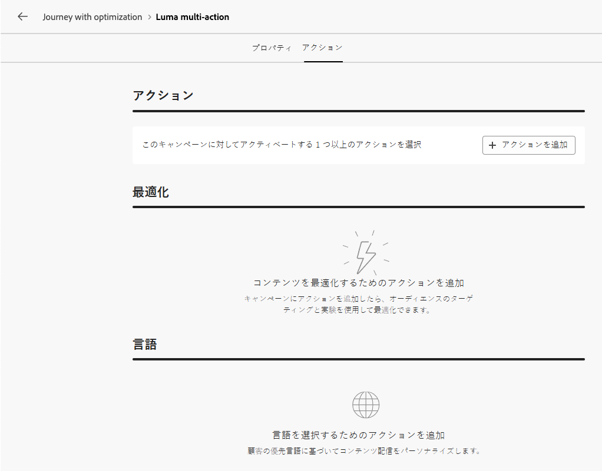
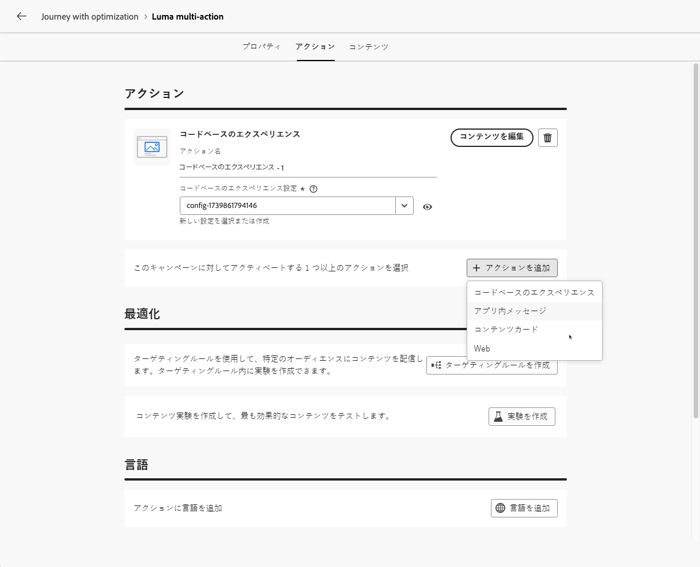

# アクションアクティビティの使用 {#add-a-message-in-a-journey}

>[!CONTEXTUALHELP]
>id="ajo_action_activity"
>title="アクションアクティビティ"
>abstract="汎用の **アクション** アクティビティを使用すると、1 つのネイティブチャネルアクションと複数のインバウンドアクティビティを設定し、任意の組み込みチャネルアクションに最適化を追加できます。"

>[!AVAILABILITY]
>
>この機能は、限定提供です。アクセス権を取得するには、アドビ担当者にお問い合わせください。

[!DNL Journey Optimizer] には、単一の組み込みチャネルアクションと複数のインバウンドアクティビティを設定できる新しい汎用 **アクション** アクティビティが付属しています。

次の操作が可能です。

* ジャーニーキャンバス内の簡素化されたネイティブアクション設定。
* 複数アクションのインバウンドアクショングループを作成する能力。
* 組み込みのチャネルアクションに最適化を追加する機能。

>[!NOTE]
>
>また、カスタムアクションを設定して、メッセージを [!DNL Journey Optimizer] で送信することもできます。 [詳細情報](#recommendation)

## ジャーニーへのアクションの追加  {#add-action}

ジャーニーにビルトインのチャネルアクションを追加するには、次の手順に従います。

1. ジャーニーを[イベント](general-events.md)または[オーディエンスを読み取り](read-audience.md)アクティビティで開始します。

1. パレットの「**[!UICONTROL アクション]**」セクションから、**[!UICONTROL アクション]** アクティビティをキャンバスにドラッグ&amp;ドロップします。

1. ジャーニーで活用する組み込みのチャネルアクティビティを選択します。

   

1. アクションにラベルを追加し、「**[!UICONTROL アクションを設定]**」を選択します。

   {width="80%"}

1. ジャーニーアクション設定画面の **[!UICONTROL アクション]** タブに移動します。

   選択したチャネルに使用する設定を選択します。

   

1. インバウンドチャネルを選択した場合は、複数のアクションを追加できます。 [詳細情報](#multi-action)

1. 選択したチャネルに従ってアクティビティを設定します。 ビルトインチャネルアクションを設定する方法については、[ この節 ](journeys-message.md) を参照してください。

1. 「**[!UICONTROL 最適化]**」セクションを使用して、コンテンツ実験を実行したり、ターゲティングルールを活用したり、実験とターゲティングの両方の詳細な組み合わせを使用したりします。 これらの様々なオプションと手順について詳しくは、[ この節 ](../campaigns/campaigns-message-optimization.md) を参照してください。

1. 「**[!UICONTROL 言語]**」セクションを使用すると、ジャーニーアクション内の複数の言語でコンテンツを作成できます。 これを行うには、「**[!UICONTROL 言語を追加]**」ボタンをクリックし、目的の&#x200B;**[!UICONTROL 言語設定]**&#x200B;を選択します。多言語機能の設定方法と使用方法について詳しくは、[ この節 ](../content-management/multilingual-gs.md) を参照してください。

選択した通信チャネルに応じて、追加の設定を使用できます。詳しくは、以下の節を展開してください。

+++**キャッピングルールの適用**（メール、ダイレクトメール、プッシュ、SMS）

**[!UICONTROL ビジネスルール]** ドロップダウンリストで、キャッピングルールをジャーニーアクションに適用するルールセットを選択します。 チャネルルールセットを活用すると、通信タイプ別のフリークエンシーキャップを設定し、類似したメッセージで顧客に過剰な負荷がかかるのを防ぐことができます。[詳しくは、ルールセットの操作方法を参照してください](../conflict-prioritization/rule-sets.md)。

+++

+++**エンゲージメントのトラッキング**（メール、SMS）。

「**[!UICONTROL アクショントラッキング]**」セクションを使用すると、受信者がメールや SMS の配信にどのように反応したかを追跡できます。ジャーニーが実行されると、ジャーニーレポートからトラッキング結果にアクセスできます。 [ ジャーニーレポートの詳細情報 ](../reports/journey-global-report-cja.md)

+++

+++**迅速配信モードを有効にする**（プッシュ）。

迅速配信モードは、キャンペーンを通じて大量のプッシュメッセージを非常に高速に送信できるようにする [!DNL Journey Optimizer] アドオンです。迅速配信は、メッセージ配信の遅延がビジネス上の重要な問題になる状況で、携帯電話に緊急のプッシュアラートを送信するときに使用します（ニュースチャネルアプリをインストールしたユーザーにニュース速報を流すなど）。迅速配信モードを使用する際のパフォーマンスについて詳しくは、[Adobe Journey Optimizer 製品の説明](https://helpx.adobe.com/jp/legal/product-descriptions/adobe-journey-optimizer.html)を参照してください。

+++

+++**優先度スコアの割り当て**（Web、アプリ内、コードベース）

「**[!UICONTROL 競合管理]**」セクションで、ジャーニーアクションに優先度スコアを割り当てます。これにより、同じチャネル設定を使用する複数のジャーニーアクションまたはキャンペーンがある場合にインバウンドアクションを優先順位付けすることができます。 数値（0～100）を入力します。数値が大きいほど優先度が高くなります。デフォルトでは、アクションの優先度スコアは、ジャーニーの全体的な優先度スコアから継承されます。 [詳しくは、ジャーニーとキャンペーンに優先度スコアを割り当てる方法を参照してください](../conflict-prioritization/priority-scores.md)。

+++

+++**追加の配信ルールの設定**（コンテンツカード）

コンテンツカードジャーニーの場合は、トリガーとなるイベントと条件を配信ルールで選択できるようにすることができます。 [詳しくは、コンテンツカードの作成方法を参照してください](../content-card/create-content-card.md)。

+++

+++**トリガーの定義**（アプリ内）

アプリ内メッセージの場合は、「**[!UICONTROL トリガーを編集]**」ボタンを使用して、メッセージをトリガーするイベントと条件を選択できます。[アプリ内メッセージの作成方法の詳細情報](../in-app/create-in-app.md)

+++

## 複数の受信アクションの追加 {#multi-action}

>[!CONTEXTUALHELP]
>id="ajo_multi_action_journey"
>title="複数の受信アクションの追加"
>abstract="1 つのジャーニー内で複数のインバウンドアクションを選択できます。 この機能により、複数のコードベースのエクスペリエンス、アプリ内メッセージ、コンテンツカード、web アクションを、各アクションに特定のコンテンツを含めて、同時に異なる場所に配信できます。"

ジャーニーオーケストレーションを簡素化するために、1 つのジャーニーアクション内に複数のインバウンドアクションを定義できます。

>[!NOTE]
>
>この処理能力は、インバウンドチャネルでのみ使用できます。 現在、メールなどのアウトバウンドチャネルはサポートされていません。

この機能を使用すると、複数のジャーニーアクションを作成することなく、様々なコードベースのエクスペリエンス、アプリ内メッセージ、コンテンツカードまたは web アクションを異なる場所に同時に配信できます。 これにより、ジャーニーのデプロイメントが容易になり、すべてのデータが 1 つのジャーニーに統合され、レポートをよりスムーズにすることができます。

例えば、コンテンツが少し異なる複数のエンドポイントにコードベースのエクスペリエンスを送信できます。 これを行うには、同じジャーニーアクション内に複数のコードベースのアクションを作成し、それぞれに異なるエンドポイント設定を指定します。

1 つのジャーニーアクションノードで複数のインバウンドアクションを定義するには、次の手順に従います。

1. ジャーニーを[イベント](general-events.md)または[オーディエンスを読み取り](read-audience.md)アクティビティで開始します。

1. パレットの「**[!UICONTROL アクション]**」セクションから、**[!UICONTROL アクション]** アクティビティをキャンバスにドラッグ&amp;ドロップします。

1. アクションタイプとして **[!UICONTROL 複数アクション]** を選択します。

   

1. 必要に応じてラベルを追加し、「**[!UICONTROL 設定アクション]**」を選択します。

   {width="60%"}

1. ジャーニーアクション設定画面の **[!UICONTROL アクション]** タブに移動します。

   {width="70%"}

1. 「**アクション**」セクションから、インバウンドアクション **** コードベースのエクスペリエンス **、** アプリ内メッセージ **、コンテンツカード** または **[!UICONTROL Web]**）を選択します。

1. チャネル設定を選択し、そのアクションに特定のコンテンツを定義します。

1. 「**[!UICONTROL アクションを追加]**」ボタンを使用して、ドロップダウンリストから別のインバウンドアクションを選択します。

   {width="80%"}

1. 同様の手順を実行して、さらにアクションを追加します。 1 つのジャーニーアクショングループに最大 10 個のインバウンドアクションを追加できます。

ジャーニーが [ ライブ ](publishing-the-journey.md) になると、すべてのアクションが同時にアクティブ化されます。
<!--
## Next steps {#next}

Once your action is configured, you can design its content. [Learn more]-->
