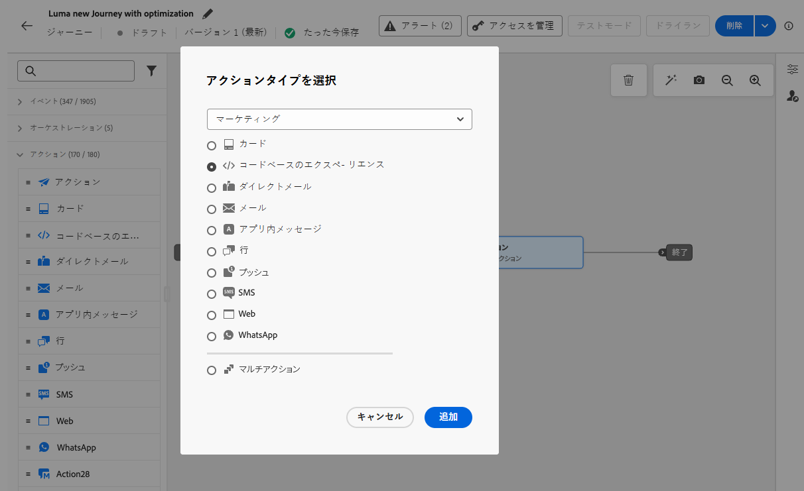
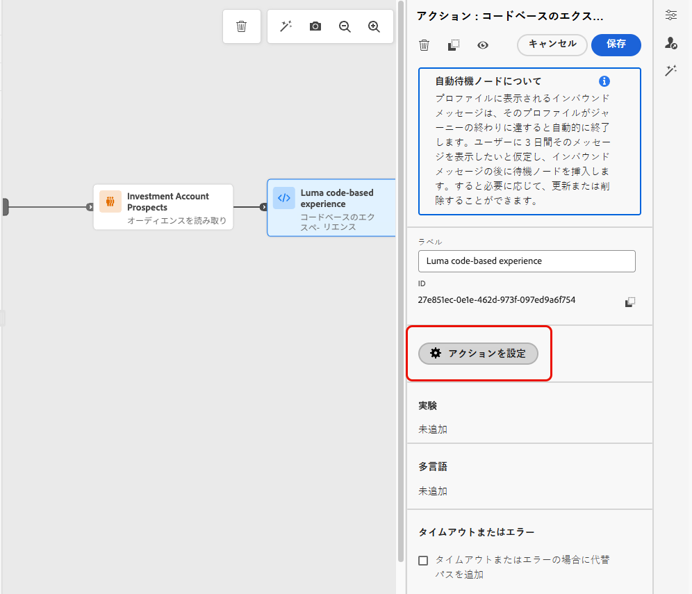
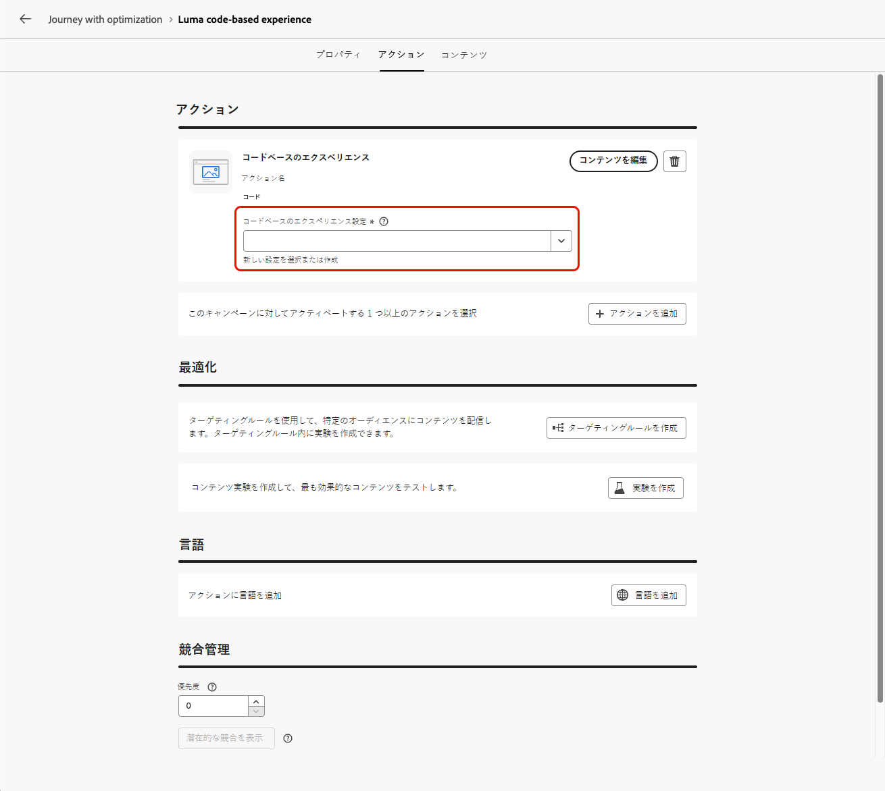
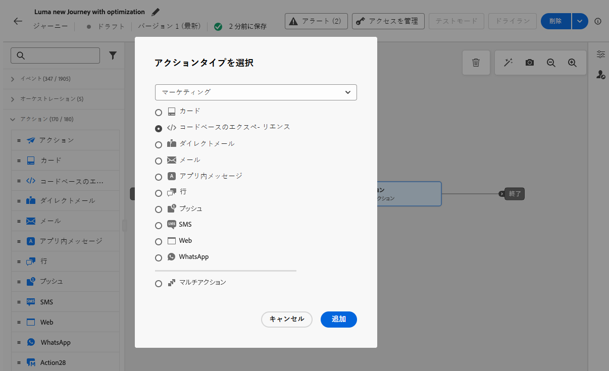
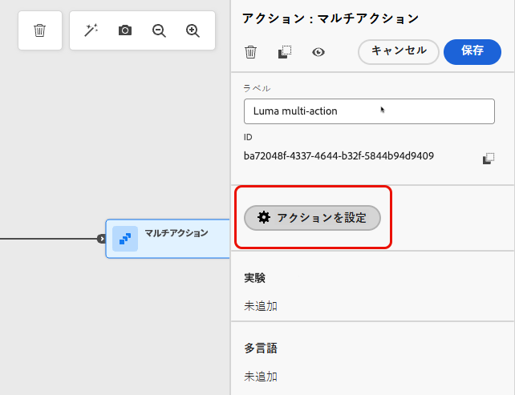
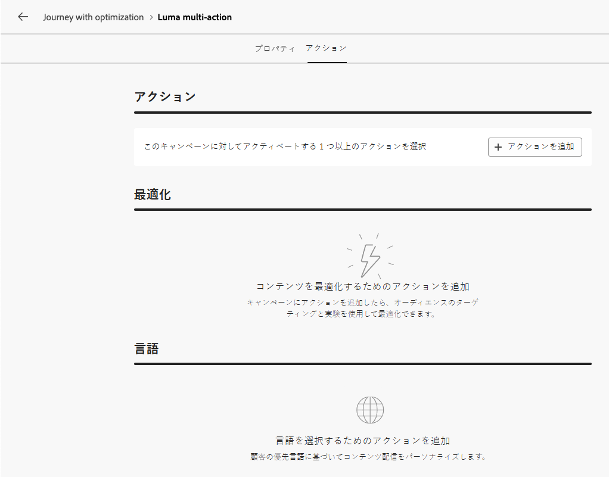
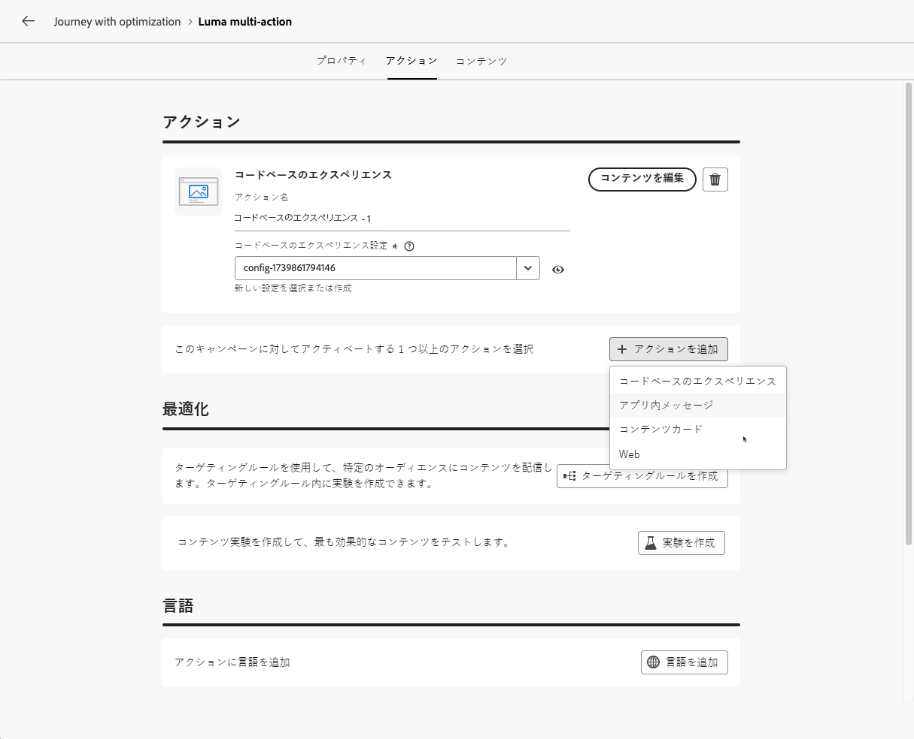
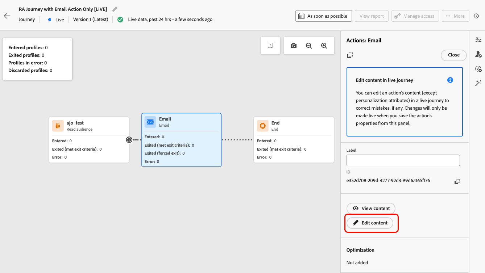

# アクションアクティビティの使用 {#add-a-message-in-a-journey}

>[!CONTEXTUALHELP]
>id="ajo_action_activity"
>title="アクションアクティビティ"
>abstract="**アクション** アクティビティでは、1 つのネイティブチャネルアクションと複数のインバウンドアクティビティを設定し、任意の組み込みチャネルアクションに最適化を追加できます。"

[!DNL Journey Optimizer] には、単一のビルトインのチャネルアクションと複数のインバウンドアクティビティを設定できる新しい汎用&#x200B;**アクション**&#x200B;アクティビティが用意されています。

アクションアクティビティの機能を次に示します。

* ジャーニーキャンバス内の簡素化されたネイティブアクション設定。
* 複数アクションのインバウンドアクショングループを作成する処理能力。
* 組み込みのチャネルアクションに最適化を追加する機能。

組み込みのチャネルアクションをジャーニーに追加するには、**アクション** アクティビティを使用します。 この統合されたアクティビティは、すべてのチャネルアクション（メール、プッシュ、SMS、アプリ内、web、コードベースのエクスペリエンスおよびコンテンツカード）を単一のアクティビティタイプに統合し、以前の個々のチャネルアクティビティに取って代わります。

>[!IMPORTANT]
>
>すべてのネイティブチャネルにアクションアクティビティからアクセスできるようになりましたが、従来のネイティブチャネルアクティビティは 3 月のリリースで非推奨（廃止予定）になります。 従来のアクションを含む既存のジャーニーは、引き続きそのまま機能します。移行は不要です。

また、[!DNL Journey Optimizer] でメッセージを送信するカスタムアクションを設定することもできます。[詳細情報](#recommendation)

## ジャーニーへのビルトインのチャネルアクションの追加  {#add-action}

**[!UICONTROL アクション]** アクティビティを使用して組み込みのチャネルアクションをジャーニーに追加するには、次の手順に従います。

ジャーニーで使用できるチャネルについて詳しくは、[ジャーニーとキャンペーンのチャネル](../channels/gs-channels.md#channels)の節にある表を参照してください。

1. ジャーニーを「[イベント](general-events.md)」または「[オーディエンスを読み取り](read-audience.md)」アクティビティで開始します。

1. パレットの「**[!UICONTROL アクション]**」セクションから、**[!UICONTROL アクション]**&#x200B;アクティビティをキャンバスにドラッグ＆ドロップします。

1. ジャーニーで活用するビルトインのチャネルアクティビティを選択します。

   

1. アクションにラベルを追加し、「**[!UICONTROL アクションを設定]**」を選択します。

   {width="80%"}

1. ジャーニーアクション設定画面の「**[!UICONTROL アクション]**」タブに移動します。

   選択したチャネルに使用する設定を選択します。

   

1. インバウンドチャネルを選択した場合は、複数のアクションを追加できます。[詳細情報](#multi-action)

1. 選択したチャネルに従ってアクティビティを設定します。設定ガイドラインについて詳しくは、以下のリンクを参照してください。

   * アウトバウンドアクションを作成する方法を次に説明します。

     <table style="table-layout:fixed">
      <tr style="border: 0;">
      <td>
      
      
<a href="../email/create-email.md"><strong>メールの作成</strong>
      

      

      </td>
      <td>
      
      

      <a href="../push/create-push.md"><strong>プッシュ通知の作成<strong></a>
      

      

      </td>
      <td>
      
      

      <a href="../sms/create-sms.md"><strong>テキストメッセージ（SMS／MMS）の作成</strong></a>
      

      

      </td>
      </tr>
      </table>

   * インバウンドアクションを作成する方法を次に説明します。

     <table style="table-layout:fixed">
      <tr style="border: 0;">
      <td>
      
      
<a href="../in-app/create-in-app.md"><strong>アプリ内メッセージの作成</strong>
      

      

      </td>
      <td>
      
      
<a href="../web/create-web.md"><strong>Web エクスペリエンスの作成</strong>
      

      

      </td>
      <td>
      
      
<a href="../content-card/create-content-card.md"><strong>コンテンツカードの作成</strong>
      

      

      </td>
      <td>
      
      

      <a href="../code-based/create-code-based.md"><strong>コードベースのエクスペリエンスの作成<strong></a>
      

      

      </td>
      </tr>
      </table>

   >[!NOTE]
   >
   >* 各インバウンドエクスペリエンスアクションには、3 日間の **待機** アクティビティが付属しています。 [詳細情報](wait-activity.md#auto-wait-node)
   >
   >* メールおよびプッシュ通知の場合、送信時間の最適化を有効にできます。[詳細情報](send-time-optimization.md)

1. アクティビティに応じて、選択したチャネルに固有の詳細設定パラメーターを表示し、実行アドレスなどの一部のデフォルト値を上書きできます。[詳細情報](about-journey-activities.md#advanced-parameters)

   >[!NOTE]
   >
   >詳細設定パラメーターが非表示になっている場合は、右側のパネルの上部にある「**[!UICONTROL 読み取り専用フィールドを表示]**」ボタンをクリックします。

1. 「**[!UICONTROL 最適化]**」セクションを使用すると、コンテンツ実験を実行したり、ターゲティングルールを活用したり、実験とターゲティングの両方の高度な組み合わせを使用したりすることができます。

   これらの様々なオプションと実行する手順について詳しくは、[この節](../content-management/gs-message-optimization.md)を参照してください。

1. 「**[!UICONTROL 言語]**」セクションを使用すると、ジャーニーアクション内の複数の言語でコンテンツを作成できます。これを行うには、「**[!UICONTROL 言語を追加]**」ボタンをクリックし、目的の&#x200B;**[!UICONTROL 言語設定]**&#x200B;を選択します。

   多言語機能の設定方法と使用方法について詳しくは、[この節](../content-management/multilingual-gs.md)を参照してください。

選択した通信チャネルに応じて、追加の設定を使用できます。詳しくは、以下の節を展開してください。

+++**キャッピングルールの適用**（メール、プッシュ、SMS）

**[!UICONTROL ビジネスルール]**&#x200B;ドロップダウンリストで、キャッピングルールをジャーニーアクションに適用するルールセットを選択します。

チャネルルールセットを活用すると、通信タイプ別のフリークエンシーキャップを設定し、類似したメッセージで顧客に過剰な負荷がかかるのを防ぐことができます。

[ルールセットの操作方法について説明します。](../conflict-prioritization/rule-sets.md)

+++

+++**エンゲージメントのトラッキング**（メール、SMS）

「**[!UICONTROL アクショントラッキング]**」セクションを使用すると、受信者がメールや SMS の配信にどのように反応したかを追跡できます。

ジャーニーが実行されると、ジャーニーレポートからトラッキング結果にアクセスできるようになります。

[ジャーニーレポートの詳細情報](../reports/journey-global-report-cja.md)

+++

+++**迅速配信モードを有効にする**（プッシュ）

迅速配信モードは、キャンペーンを通じて大量のプッシュメッセージを非常に高速に送信できるようにする [!DNL Journey Optimizer] アドオンです。

迅速配信は、メッセージ配信の遅延がビジネス上の重要な問題になる状況で、携帯電話に緊急のプッシュアラートを送信するときに使用します（ニュースチャネルアプリをインストールしたユーザーにニュース速報を配信するなど）。

プッシュ通知の迅速配信モードを有効にする方法について詳しくは、[このページ](../push/create-push.md#rapid-delivery)を参照してください。

迅速配信モードを使用する際のパフォーマンスについて詳しくは、[[!DNL Adobe Journey Optimizer]  製品説明 ](https://helpx.adobe.com/jp/legal/product-descriptions/adobe-journey-optimizer.html){target="_blank"} を参照してください。

+++

+++**優先度スコアの割り当て**（Web、アプリ内、コードベース）

「**[!UICONTROL 競合管理]**」セクションで、ジャーニーアクションに優先度スコアを割り当てることができます。これにより、同じチャネル設定を使用するジャーニーアクションまたはキャンペーンが複数ある場合、インバウンドアクションの優先順位を付けることができます。

デフォルトでは、アクションの優先度スコアは、ジャーニーの全体的な優先度スコアから継承されます。

[チャネルアクションに優先度スコアを割り当てる方法について説明します。](../conflict-prioritization/priority-scores.md#priority-action)

+++

+++**追加の配信ルールの設定**（コンテンツカード）

コンテンツカードジャーニーの場合は、追加の配信ルールを有効にして、メッセージをトリガーするイベントと条件を選択できます。

[コンテンツカードの作成方法について説明します。](../content-card/create-content-card.md)

+++

+++**トリガーの定義**（アプリ内）

アプリ内メッセージの場合は、「**[!UICONTROL トリガーを編集]**」ボタンを使用して、メッセージをトリガーするイベントと条件を選択できます。

[アプリ内メッセージの作成方法の詳細情報](../in-app/create-in-app.md)

+++

## 複数のインバウンドアクションを追加 {#multi-action}

>[!CONTEXTUALHELP]
>id="ajo_multi_action_journey"
>title="複数のインバウンドアクションを追加"
>abstract="1 つのジャーニー内で複数のインバウンドアクションを選択できます。この機能により、複数のコードベースのエクスペリエンス、アプリ内メッセージ、コンテンツカード、web アクションを、各アクションに特定のコンテンツを含めて、同時に異なる場所に配信できます。"

ジャーニーオーケストレーションの簡素化に、1 つのジャーニーアクション内に複数のインバウンドアクションを定義できます。

>[!NOTE]
>
>この処理能力は、インバウンドチャネルでのみ使用できます。現在、メールなどのアウトバウンドチャネルはサポートされていません。

この処理能力により、複数のジャーニーアクションを作成しなくても、様々なコードベースのエクスペリエンス、アプリ内メッセージ、コンテンツカード、web アクションを同時に異なる場所に配信できます。これにより、すべてのデータが 1 つのジャーニーに統合されるので、ジャーニーのデプロイメントが容易になり、レポートをよりスムーズに行うことができます。

例えば、コンテンツが少し異なる複数のエンドポイントに、コードベースのエクスペリエンスを送信できます。これを行うには、同じジャーニーアクション内に、それぞれ異なるエンドポイント設定を持つ複数のコードベースのアクションを作成します。

1 つのジャーニーアクションノードで複数のインバウンドアクションを定義するには、次の手順に従います。

1. ジャーニーを「[イベント](general-events.md)」または「[オーディエンスを読み取り](read-audience.md)」アクティビティで開始します。

1. パレットの「**[!UICONTROL アクション]**」セクションから、**[!UICONTROL アクション]**&#x200B;アクティビティをキャンバスにドラッグ＆ドロップします。

1. 「**[!UICONTROL 複数アクション]**」をアクションタイプとして選択します。

   

1. 必要に応じてラベルを追加し、「**[!UICONTROL アクションを設定]**」を選択します。

   {width="60%"}

1. ジャーニーアクション設定画面の「**[!UICONTROL アクション]**」タブに移動します。

   {width="70%"}

1. 「**[!UICONTROL アクション]**」セクションからインバウンドアクション（**コードベースのエクスペリエンス**、**アプリ内メッセージ**、**コンテンツカード**、または **web**）を選択します。

1. チャネル設定を選択し、そのアクションの特定のコンテンツを定義します。

1. 「**[!UICONTROL アクションを追加]**」ボタンを使用して、ドロップダウンリストから別のインバウンドアクションを選択します。

   {width="80%"}

1. 同様の手順を実行して、さらにアクションを追加します。ジャーニーアクショングループには、最大 10 個のインバウンドアクションを追加できます。

ジャーニーが[ライブ](publish-journey.md)になると、すべてのアクションが同時にアクティブ化されます。

## ライブコンテンツの更新 {#update-live-content}

ライブジャーニーでビルトインのチャネルアクションのコンテンツを更新できます。

コンテンツに加えられた変更は、アクションのプロパティを保存するまでジャーニーに反映されません。 [詳細情報](about-journey-activities.md#advanced-parameters)

それには、ライブジャーニーを開き、チャネルアクティビティを選択して、「**コンテンツを編集**」をクリックします。

ただし、パーソナライゼーションで使用されている属性は、プロファイル属性であるかコンテキストデータ（イベントプロパティまたはジャーニープロパティから得られるもの）であるかにかかわらず、変更できません。

* コンテキストデータを変更すると、次のエラーメッセージが表示されます：`ERR_AUTHORING_JOURNEYVERSION_201`

* プロファイル属性を変更すると、次のエラーメッセージが表示されます：`ERR_AUTHORING_JOURNEYVERSION_202`

アプリ内アクティビティの場合、ジャーニーのライブ中にコンテンツを変更できますが、アプリ内トリガーは変更できません。

## カスタムアクションを使用した送信 {#recommendation}

ビルトインのメッセージ機能を使用する代わりに、カスタムアクションを使用すると、メッセージや API 呼び出しを送信するサードパーティシステムの接続を設定できます。

* サードパーティのシステムを使用してメッセージを送信する場合は、カスタムアクションを作成できます。[詳細情報](../action/action.md)

* Adobe Campaign を操作する場合は、次の節を参照してください。

   * [[!DNL Journey Optimizer] と Campaign v7/v8](../action/acc-action.md)
   * [[!DNL Journey Optimizer] と Campaign Standard](../action/acs-action.md)
