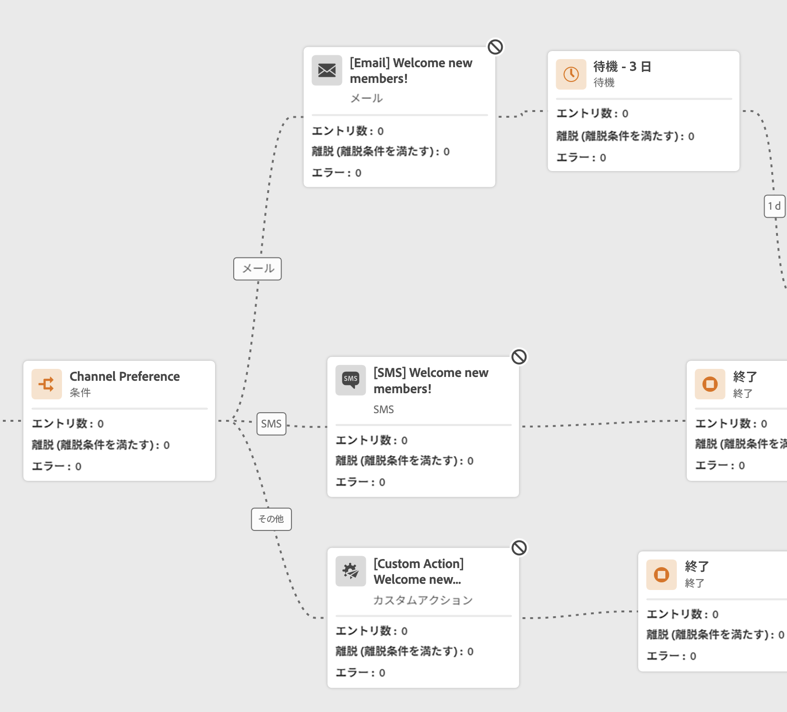
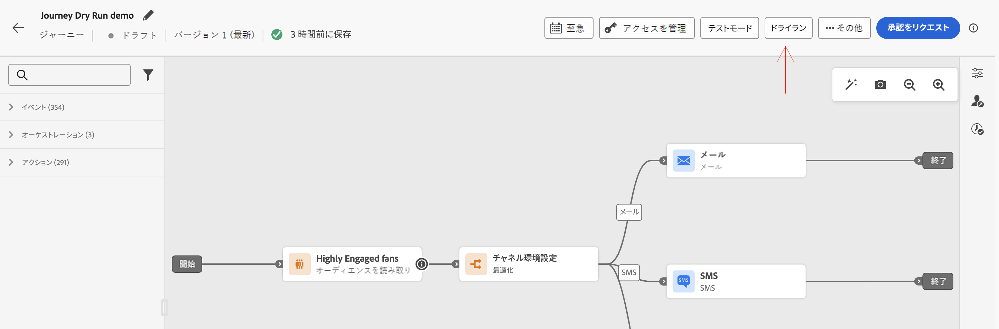
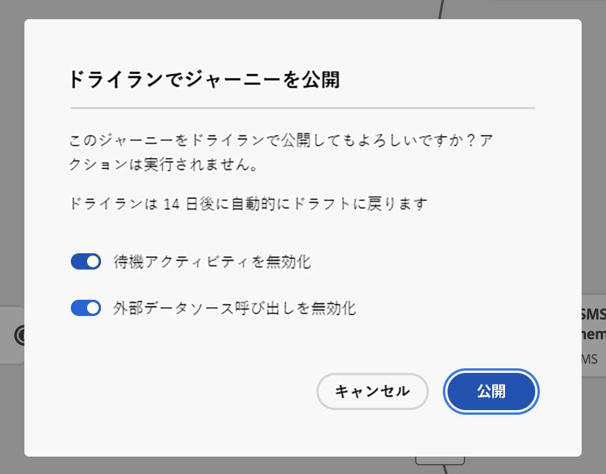
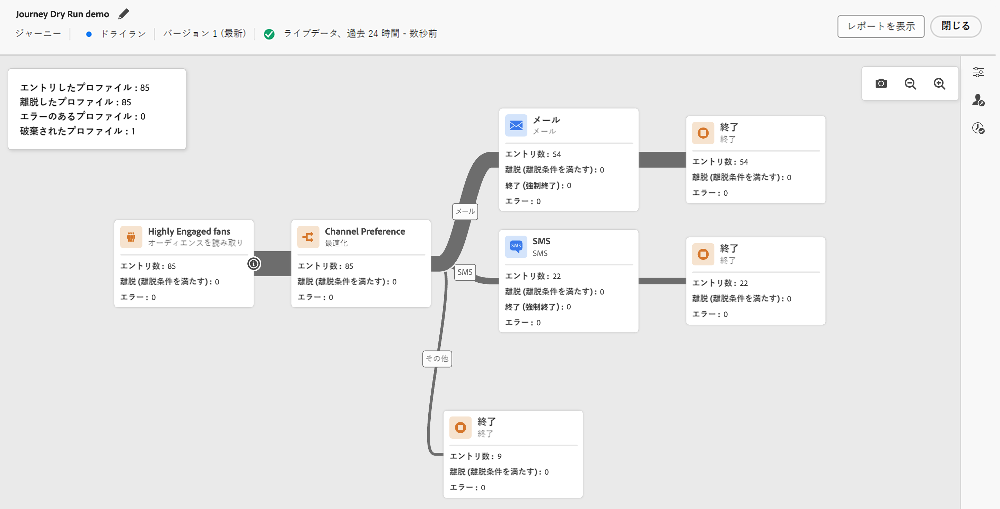
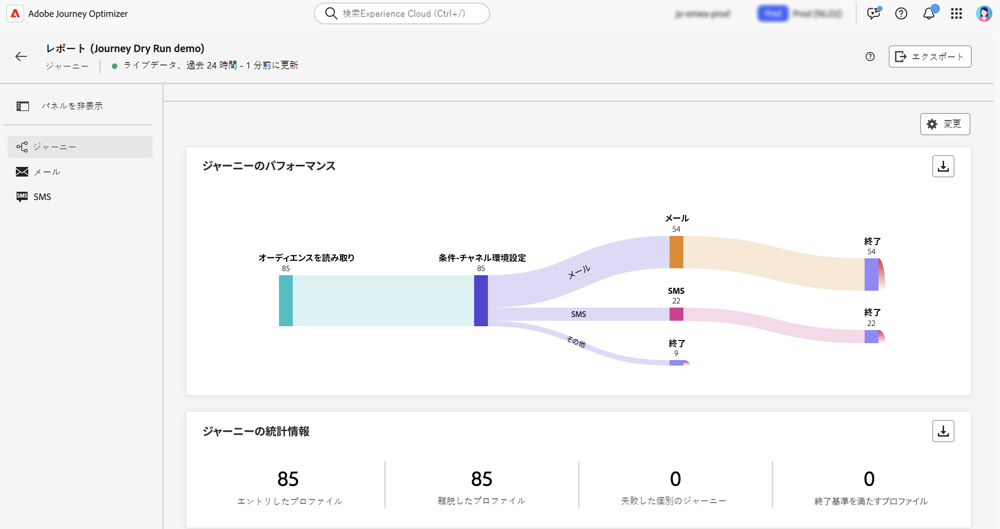
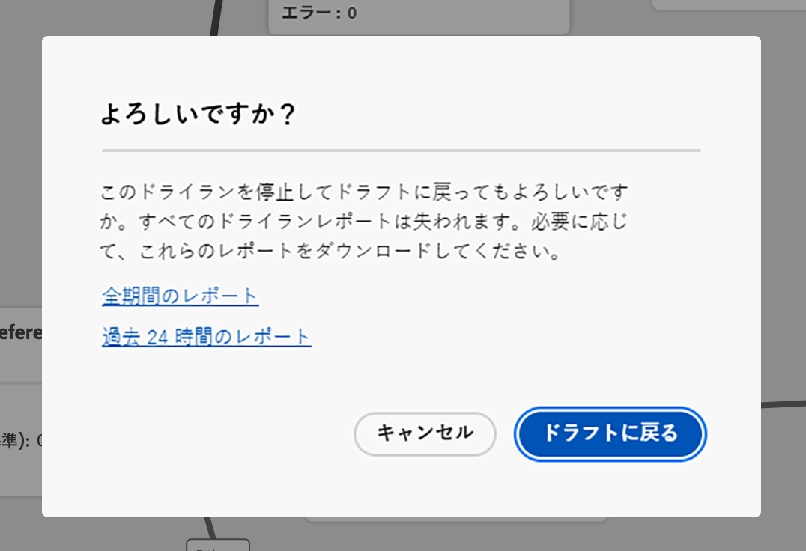
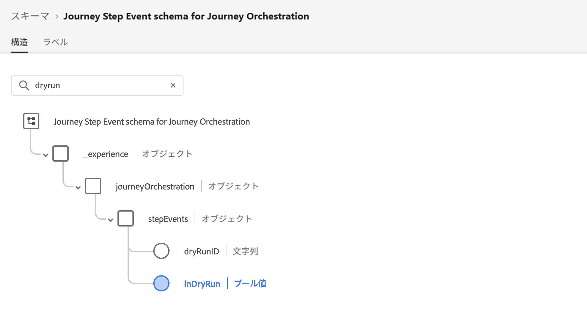

# ジャーニーのドライラン {#journey-dry-run}

>[!BEGINSHADEBOX]

**このページ：**&#x200B;実際の顧客に連絡したり、プロファイルを更新したりすることなく、実際の実稼動データを使用してジャーニーをテストするドライラン モードでジャーニーを公開する方法を説明します。これにより、本番稼働前にデザインを検証できます。

>[!ENDSHADEBOX]

>[!CONTEXTUALHELP]
>id="ajo_journey_dry_run"
>title="ドライランモード"
>abstract="このジャーニーはドライランになっています。 ジャーニーのドライランは、[!DNL Adobe Journey Optimizer] における特別なジャーニー公開モードです。このモードでは、ジャーニーの実務担当者は実際の顧客に連絡したり、プロファイル情報を更新したりすることなく、実際の本番データを使用してジャーニーをテストできます。  この機能により、ジャーニー実務担当者は、ジャーニーをライブで公開する前に、ジャーニーのデザインとオーディエンスのターゲティングに自信を持つことができます。"

>[!CONTEXTUALHELP]
>id="ajo_journey_dry_run_start"
>title="ドライランモードでのジャーニーの公開"
>abstract="ジャーニーのドライランは、[!DNL Adobe Journey Optimizer] の特別なジャーニー公開モードです。このモードでは、ジャーニーの実務担当者は、実際の本番データを使用してジャーニーをテストできます。 ジャーニーを設計したら、ドライランで、ジャーニーが機能し、手順が正しいことを確認します。 この公開モードを使用すると、通信をプロファイルに送信せずに、ジャーニーをスモークテストできます。"

ジャーニーのドライランは、[!DNL Adobe Journey Optimizer] における特別なジャーニー公開モードです。このモードでは、ジャーニーの実務担当者は実際の顧客に連絡したり、プロファイル情報を更新したりすることなく、実際の本番データを使用してジャーニーをテストできます。  この機能により、ジャーニー実務担当者は、ジャーニーをライブで公開する前に、ジャーニーのデザインとオーディエンスのターゲティングに自信を持つことができます。

➡️ [ジャーニーのドライランについて詳しくは、このビデオをご覧ください](#dry-run-video)

## 主なメリット {#journey-dry-run-benefits}

ジャーニーのドライランは、顧客に連絡したり、プロファイル情報を変更したりするリスクを伴わずに、実際の実稼動データを使用してカスタマージャーニーを安全にデータ駆動型のテストできるようにすることで、実務担当者の信頼性とジャーニーの成功を向上させます。 この機能により、ジャーニー実務担当者は、ライブになる前にオーディエンスのリーチと分岐ロジックを検証し、ジャーニーが意図したビジネス目標と一致していることを確認できます。

ジャーニーのドライランを使用すると、問題を早期に特定し、ターゲティング戦略を最適化し、前提ではなく実際のデータに基づいてジャーニーのデザインを改善できます。 ジャーニーキャンバスに直接統合されたドライランでは、主要業績評価指標に対する直感的なレポートと表示を提供することで、チームが自信を持って反復処理を行い、承認ワークフローを効率化できます。 これにより、運用効率が向上し、ローンチのリスクが軽減され、顧客エンゲージメントの結果が向上します。

最終的には、この機能により価値実現までの時間が短縮され、ジャーニーの失敗が減少します。

ジャーニーのドライランでは、以下を実現できます。

1. **安全なテスト環境**：ドライランモードのプロファイルには連絡しないので、通信を送信したり、ライブデータに影響を与えたりするリスクはありません。
1. **オーディエンスインサイト**：ジャーニー実務担当者は、ジャーニーの条件に基づいてオプトアウトや除外を含む様々なジャーニーノードでオーディエンスの到達可能性を予測できます。
1. **リアルタイムフィードバック**：指標は、ライブレポートと同様に、ジャーニーキャンバスに直接表示され、ジャーニー実務担当者はジャーニーのデザインを調整できます。

## ドライランの実行ロジック {#journey-dry-run-exec}

ドライラン中、ジャーニーはシミュレーションモードで実行され、実際のアクションをトリガーせずに、各ジャーニーアクティビティに次の特定の動作が適用されます。

* メール、SMS、プッシュ通知を含む&#x200B;**チャネルアクション**&#x200B;ノードは実行されません。
* **カスタムアクション**&#x200B;は、ドライラン中は無効になり、その応答は null に設定されます。

  読みやすさを向上させるために、ドライランの実行中はカスタムアクションとチャネルアクティビティがグレー表示されます。

  {width="80%"}

* ドライラン中は、外部データソースを含む&#x200B;**データソース**&#x200B;と&#x200B;**待機**&#x200B;アクティビティはデフォルトで無効になります。 ただし、[ドライランモードをアクティブ化すると](#journey-dry-run-start)、この動作を変更できます。

* **反応**&#x200B;ノードは実行されません。反応ノードにエントリするすべてのプロファイルは正常に終了します。 ただし、次の優先度ルールが適用されます。

   * **反応**&#x200B;ノードが 1 つまたは複数の&#x200B;**単一イベント**&#x200B;ノードと並行して使用される場合、プロファイルは常に反応イベントを通過します。
   * **反応**&#x200B;ノードが 1 つまたは複数の&#x200B;**反応イベント**&#x200B;ノードと並行して使用される場合、プロファイルは常にキャンバス内の最初のノード（上部のノード）を通過します。

>[!CAUTION]
>
>* ドライランを開始する権限は、**[!DNL Publish journeys]** の上位権限を持つユーザーに制限されます。 ドライランを停止する権限は、**[!DNL Manage journeys]** の上位権限を持つユーザーに制限されます。 [!DNL Journey Optimizer] ユーザーのアクセス権の管理について詳しくは、[この節](../administration/permissions-overview.md)を参照してください。
>
>* ドライラン機能の使用を開始する前に、[ガードレールと制限のトピックに目を通してください](#journey-dry-run-limitations)。

## ドライランの開始 {#journey-dry-run-start}

エラーのない任意のドラフトジャーニーで、ドライラン機能を使用できます。

ドライランをアクティブ化するには、次の手順に従います。

1. テストするジャーニーを開きます。
1. 「**[!UICONTROL ドライラン]**」ボタンを選択します。

   

1. **待機**&#x200B;アクティビティと&#x200B;**外部データソース**&#x200B;の呼び出しを有効または無効にする場合は選択し、ドライランの公開を確認します。

   {width="50%"}

   トランジション中は、**[!UICONTROL ドライランをアクティブ化中]**&#x200B;というステータスメッセージが表示されます。

1. アクティブ化すると、ジャーニーは&#x200B;**[!UICONTROL ドライラン]**&#x200B;モードにエントリします。

## ドライランの監視 {#journey-dry-monitor}

ドライモードの公開をローンチすると、ジャーニーの実行と、ジャーニーの分岐やノードを介したプロファイルの進行状況を視覚化できます。

指標は、ジャーニーキャンバスに直接表示されます。 ジャーニーライブレポートと指標について詳しくは、[ジャーニーキャンバスのライブレポート](report-journey.md)を参照してください。

また、ドライランの&#x200B;**過去 24 時間のレポート**&#x200B;と&#x200B;**全期間レポート**&#x200B;にアクセスすることもできます。 これらのレポートにアクセスするには、ジャーニーキャンバスの右上隅にある「**レポートを表示**」ボタンをクリックします。

>[!CAUTION]
>
> レポートデータは、ドライランが&#x200B;**アクティブ**&#x200B;の場合にのみ使用できます。  停止すると、レポートデータにアクセスできなくなります。 必要に応じて、レポートの上にある「**エクスポート**」ボタンを使用してダウンロードします。

## ドライランの停止 {#journey-dry-run-stop}

14 日後、ドライランのジャーニーは自動的に&#x200B;**[!UICONTROL ドラフト]**&#x200B;ステータスに移行します。

ドライランのジャーニーは、手動で停止することもできます。 ドライランモードを非アクティブ化するには、次の手順に従います。

1. 停止するドライランのジャーニーを開きます。
1. 「**[!UICONTROL 閉じる]**」ボタンを選択して、テストを終了します。
最後の24時間とすべての時間レポートへのリンクは、確認画面で利用できます。

   {width="50%"}

1. 「**[!UICONTROL ドラフトに戻る]**」をクリックして確定します。

## ガードレールと制限 {#journey-dry-run-limitations}

* ドライランモードのプロファイルは[&#x200B; エンゲージ可能プロファイル &#x200B;](../audience/license-usage.md)にカウントされます
* ドライランモードのジャーニーは、ライブジャーニーの割り当て量にカウントされます
* ドライランのジャーニーは、ビジネスルールには影響しません
  <!--* When creating a new journey version, if a previous journey version is **Live**, then the Dry run activation is not allowed on the new version.-->
* **ジャンプ** アクションは、ドライ実行では有効になっていません。
ソース ジャーニーが&#x200B;**ジャンプ** イベントを移動先にトリガーすると、そのジャンプ イベントはドライラン ジャーニーのバージョンには適用されません。例えば、ジャーニーの最新バージョンがドライランで、前のバージョンが&#x200B;**ライブ**&#x200B;の場合、ジャンプイベントはドライランのバージョンを無視し、**ライブ**&#x200B;のバージョンにのみ適用されます。

## ジャーニーステップイベントとドライラン {#journey-step-events}

ジャーニーのドライランでは、**stepEvents** が生成されます。 これらの stepEvents には、特定のフラグとドライラン ID（`inDryRun` と `dryRunID`）があります。

* `_experience.journeyOrchestration.stepEvents.inDryRun`は、ジャーニーがドライ実行モードの場合は`true`を返し、テストまたはライブジャーニー（ドライ以外の実行）の場合は`null`を返します。
* `_experience.journeyOrchestration.stepEvents.dryRunID`は、ドライラン モードの場合、ドライラン インスタンスのIDを返します。テスト ジャーニーまたはライブジャーニーの場合は、`null`です。

stepEvent データを&#x200B;**外部システム**&#x200B;に書き出す場合は、`inDryRun` フラグを使用してドライラン実行をフィルタリングできます。

[!DNL Adobe Experience Platform] クエリサービスを使用して&#x200B;**ジャーニーレポート指標**&#x200B;を分析する場合、ドライラン生成ステップイベントを除外する必要があります。 これを行うには、`inDryRun`が`true`のステップイベントを除外します（つまり、`inDryRun`が`null`または`false`のイベントのみを含めます）。

## よくある質問 {#faq}

**ドライランは実際の顧客にメッセージを送信しますか？**

いいえ。 ドライランは実際の実稼動データを使用しますが、プロファイルに連絡したり、プロファイル情報を更新したりしません。 チャネルアクション（電子メール、SMS、プッシュ）は実行されず、応答が`null`に設定されている場合、カスタムアクションは無効になります。

**ドライランを開始または停止するには、どのような権限が必要ですか？**

ドライランを開始するには、**[!DNL Publish journeys]**&#x200B;の高レベル権限が必要です。 ドライランを停止するには、**[!DNL Manage journeys]**&#x200B;の高レベル権限が必要です。 詳しくは、[権限の節](../administration/permissions-overview.md)を参照してください。

**ドライランを実行できるジャーニーはどれですか？**

エラーのない&#x200B;**[!UICONTROL ドラフト]** ジャーニーでドライ実行を使用できます。

**ドライランはどのくらい続きますか？**

14日後、ドライランのジャーニーは自動的に&#x200B;**[!UICONTROL ドラフト]** ステータスに戻ります。 ドライランはいつでも手動で停止することもできます。

**ドライラン中に待機アクティビティと外部データソースが実行されますか？**

デフォルトでは、**待機** アクティビティと&#x200B;**データソース** （外部データソースを含む）は、ドライ実行中に無効になります。 この動作は、[&#x200B; ドライラン モードをアクティブ化](#journey-dry-run-start)するときに変更できます。

**ドライランのプロファイルとジャーニーは、割り当て量にカウントされますか？**

はい。 ドライランモードのプロファイルは[&#x200B; エンゲージ可能なプロファイル &#x200B;](../audience/license-usage.md)にカウントされ、ドライランモードのジャーニーはライブジャーニーの割り当てにカウントされます。 ただし、ドライランジャーニーはビジネスルールには影響しません。

**テストを停止した後も、ドライランのレポートにアクセスできますか？**

いいえ。 レポート データは、ドライランが&#x200B;**アクティブ**&#x200B;の間にのみ使用できます。 停止すると、データにアクセスできなくなります。必要に応じて、レポートの上にある「**書き出し**」ボタンを使用して、事前にデータをダウンロードしてください。

**レポートからドライラン データを除外する方法を教えてください。**

ドライランは、`inDryRun`と`dryRunID`のフラグが付いた&#x200B;**stepEvents**&#x200B;を生成します。 [!DNL Adobe Experience Platform] クエリサービスでジャーニーレポート指標を分析する場合、`inDryRun`が`true`のステップイベントを除外します（`inDryRun`が`null`または`false`のイベントのみを含めます）。

## チュートリアルビデオ {#dry-run-video}

ジャーニーのドライラン方法について詳しくは、このビデオを参照してください。

>[!VIDEO](https://video.tv.adobe.com/v/3464683/?captions=jpn&learn=on&enablevpops)

+++ AI ナレッジリファレンス

このセクションには、このトピックに関連する解釈、検索、質問への回答をサポートすることを目的とした構造化された知識が含まれています。

理解を深めるには、この情報をこのページのドキュメントと組み合わせる必要があります。 どちらのソースも単独で使用することを意図していません。このページでは、機能について説明しますが、この節では、用語、意図、適用可能性、および制約の曖昧さを解消するのに役立つ追加のコンテキストを提供します。

* **TL;DR:**&#x200B;このページでは、実務担当者が顧客に連絡したり、プロファイルを変更したりすることなく、実際の実稼動データを使用してジャーニーをテストできる特別な公開モードであるジャーニードライランについて説明し、ドライラン ステップイベントを開始、監視、停止、フィルタリングする方法について説明します。

**インテント：**
* ドラフトジャーニーでドライランモードを有効にして、実際の実稼動データでオーディエンスリーチとブランチロジックを検証します
* ドライラン中にキャンバス内のジャーニー実行メトリックを監視する
* 手動でドライランを停止し、ジャーニーを「ドラフト」ステータスに戻します
* `inDryRun` フラグを使用して、レポート クエリからドライラン ステップ イベントをフィルター処理する
* ドライラン中にどのアクティビティを無効にするか、またはシミュレートするかを理解します

**用語集：**
* **ドライラン**：通信を送信したり、プロファイル情報を更新したりすることなく、実稼動データに対してジャーニーを実行する特別なジャーニー公開モード *（製品固有）*
* **stepEvent**: プロファイルがジャーニーで実行するあらゆるステップをキャプチャする、自動生成されたデータセット レコード。ドライラン ステップ イベントには、`inDryRun=true`と`dryRunID` *（製品固有）*&#x200B;が含まれます
* **inDryRun フラグ**: ドライラン実行の場合は`true`、ライブジャーニーまたはテストジャーニーの場合は`null`であるstepEventsのブール値フィールド *（製品固有）*

**ガードレール：**
* ドライ実行モードでアクティブ化できるのは、エラーのないドラフトジャーニーのみです
* ドライ実行を開始するには&#x200B;**ジャーニーを公開**&#x200B;権限が必要です。停止するには&#x200B;**ジャーニーを管理**&#x200B;する必要があります
* ドライランジャーニーは自動的にドライランモードを終了し、14日後にドラフトステータスに戻ります。 ジャーニーのコンテンツは失われません。ドライランセッションのみが終了します。
* ドライラン中に処理されたプロファイルは、エンゲージ可能プロファイルとライブジャーニー割り当てにカウントされます
* チャネルアクションノード（電子メール、SMS、プッシュ）とカスタムアクションは、ドライ実行時には実行されません
* ドライランでジャンプアクションが有効になっていない
* リアクションノードはドライラン中に実行されません。プロファイルは正常に終了し、並列ユニタリ分岐とリアクションブランチの優先ルールが適用されます
* レポート データは、ドライランがアクティブな間のみ使用できます。停止すると、データにアクセスできなくなります
* ドライランのジャーニーは、ビジネスルールには影響しません

**用語：**
* 正式名称：ジャーニードライラン – 頭字語：なし – バリアント：ドライランモード、ドライラン公開モード
* 同義語：「ドライラン」 = 「スモークテスト」（非公式）
* 混同しないでください：「ドライラン」≠「テストモード」≠「シミュレーション」 – ドライランでは、実際の実稼動データを使用し、エンゲージ可能なプロファイルとライブジャーニーの割り当てをカウントします。テストモードでは、ドラフトジャーニーで永続的なAEP テストプロファイルを使用します。シミュレーションでは、AEPに永続化されない一時的なシミュレーションユーザーを使用します

**FAQ:**
* **Q: Dry runは実際に電子メールやプッシュ通知を顧客に送信しますか？**  – いいえ。すべてのチャネルアクションノードとカスタムアクションは無効になり、ドライラン中に実行されません。
* **Q: ドライランは自動的に停止するまでにどのくらい続きますか？** - 14日間が経過すると、ジャーニーは自動的に「ドラフト」ステータスに戻ります。
* **Q: ジャーニー分析クエリからドライラン データを除外する方法を教えてください。** — `inDryRun`が`true`のステップイベントを除外します。`inDryRun`が`null`または`false`のイベントのみを含めます。
* **Q: プロファイルは、ドライラン中の制限に対してカウントされますか？**  – はい。プロファイルはエンゲージ可能プロファイルにカウントされ、ドライランジャーニーはライブジャーニー割り当てにカウントされます。
* **Q: ドライラン中に待機アクティビティと外部データソース呼び出しを有効にできますか？**  – どちらもデフォルトでは無効になっていますが、ドライランをアクティブ化する際に有効にするか無効にするかを選択できます。

+++
