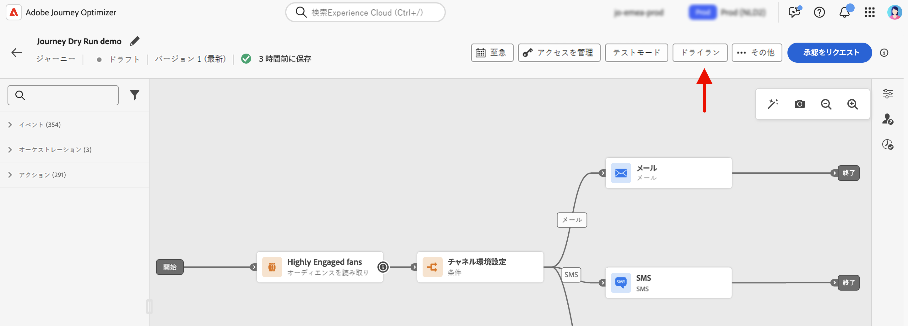

# ジャーニーのドライラン {#journey-dry-run}

>[!CONTEXTUALHELP]
>id="ajo_journey_dry_run"
>title="ドライランモード"
>abstract="このジャーニーはドライランになっています。ジャーニーのドライランは、Adobe Journey Optimizer の特別なジャーニー公開モードで、ジャーニー実務担当者は実際の顧客に連絡したり、プロファイル情報を更新したりすることなく、実際の実稼動データを使用してジャーニーをテストできます。この機能により、ジャーニー実務担当者は、ジャーニーをライブで公開する前に、ジャーニーのデザインとオーディエンスのターゲティングに自信を持つことができます。"

>[!CONTEXTUALHELP]
>id="ajo_journey_dry_run_start"
>title="ドライランモードでのジャーニーの公開"
>abstract="ジャーニーのドライランは、Adobe Journey Optimizer の特別なジャーニー公開モードで、ジャーニー実務担当者は実際の実稼動データを使用してジャーニーをテストできます。ジャーニーを設計したら、ドライランを実行して、ジャーニーが機能し、手順が正しいことを確認します。この公開モードを使用すると、通信をプロファイルに送信せずに、ジャーニーをスモークテストできます。"

ジャーニーのドライランは、Adobe Journey Optimizer の特別なジャーニー公開モードで、ジャーニー実務担当者は実際の顧客に連絡したり、プロファイル情報を更新したりすることなく、実際の実稼動データを使用してジャーニーをテストできます。この機能により、ジャーニー実務担当者は、ジャーニーをライブで公開する前に、ジャーニーのデザインとオーディエンスのターゲティングに自信を持つことができます。

>[!AVAILABILITY]
>
>この機能は、一連の組織でのみ使用でき（限定提供）、今後のリリースでグローバルにロールアウトされる予定です。

## 主なメリット {#journey-dry-run-benefits}

ジャーニーのドライランは、顧客に連絡したり、プロファイル情報を変更したりするリスクを伴わずに、実際の実稼動データを使用してカスタマージャーニーを安全にデータ駆動型のテストできるようにすることで、実務担当者の信頼性とジャーニーの成功を向上させます。この機能により、ジャーニー実務担当者は、ライブになる前にオーディエンスのリーチと分岐ロジックを検証し、ジャーニーが意図したビジネス目標と一致していることを確認できます。

ジャーニーのドライランを使用すると、問題を早期に特定し、ターゲティング戦略を最適化し、前提ではなく実際のデータに基づいてジャーニーのデザインを改善できます。ジャーニーキャンバスに直接統合されたドライランでは、主要業績評価指標に対する直感的なレポートと表示を提供することで、チームが自信を持って反復処理を行い、承認ワークフローを効率化できます。これにより、運用効率が向上し、ローンチのリスクが軽減され、顧客エンゲージメントの結果が向上します。

最終的には、この機能により価値実現までの時間が短縮され、ジャーニーの失敗が減少します。

ジャーニーのドライランでは、以下を実現できます。

1. **安全なテスト環境**：ドライランモードのプロファイルには連絡しないので、通信を送信したり、ライブデータに影響を与えたりするリスクはありません。
1. **オーディエンスインサイト**：ジャーニー実務担当者は、オプトアウト、除外、その他の条件を含む様々なジャーニーノードでオーディエンスの到達可能性を予測できます。
1. **リアルタイムフィードバック**：指標は、ライブレポートと同様に、ジャーニーキャンバスに直接表示され、ジャーニー実務担当者はジャーニーのデザインを調整できます。

ドライラン中、ジャーニーは次の特性で実行されます。

* **チャネルアクション** メール、SMS、プッシュ通知などのノードが実行されない
* **カスタムアクション** は、ドライラン中は無効になり、応答は null に設定されます
* **待機ノード**&#x200B;は、ドライラン中はバイパスされます。
  <!--You can override the wait block timeouts, then if you have wait blocks duration longer than allowed dry run journey duration, then that branch will not execute completely.-->
* 外部データソースを含む **データソース** は、デフォルトで実行されます

>[!CAUTION]
>
>* ドライランを開始する権限は、**[!DNL Publish journeys]** の高レベル権限を持つユーザーに制限されます。ドライランを停止する権限は、**[!DNL Manage journeys]** の高レベル権限を持つユーザーに制限されます。[!DNL Journey Optimizer] ユーザーのアクセス権の管理について詳しくは、[この節](../administration/permissions-overview.md)を参照してください。
>
>* ドライラン機能の使用を開始する前に、[ガードレールと制限のトピックに目を通してください](#journey-dry-run-limitations)。

## ドライランの開始 {#journey-dry-run-start}

エラーのない任意のドラフトジャーニーで、ドライラン機能を使用できます。

ドライランをアクティブ化するには、次の手順に従います。

1. テストするジャーニーを開きます。
1. 「**ドライラン** ボタンを選択します。

   

1. 公開を確認します。

   トランジション中は、**ドライランをアクティブ化中**&#x200B;というステータスメッセージが表示されます。

1. アクティブ化すると、ジャーニーは&#x200B;**ドライラン**&#x200B;モードにエントリします。

## ドライランの監視 {#journey-dry-monitor}

ドライモードの公開をローンチすると、ジャーニーの実行と、ジャーニーの分岐やノードを介したプロファイルの進行状況を視覚化できます。

指標は、ジャーニーキャンバスに直接表示されます。

各アクティビティのアクティビティボックスで、次の項目を確認できます。

* **[!UICONTROL 入力済み]**：このアクティビティにエントリした個人の合計数。 **アクション** アクティビティの場合、ドライランモードでは実行されないので、この指標は、プロファイルがを通過することを示します。
* **[!UICONTROL 退出済み（終了基準を満たす）]**：終了基準に従って、そのアクティビティからジャーニーを退出した個人の合計数。
* **[!UICONTROL 離脱済み（強制離脱）]**：ジャーニー実務担当者の設定により、一時停止中にジャーニーを離脱した個人の合計数。ドライランモードのジャーニーでは、この指標は常にゼロになります。
* **[!UICONTROL エラー]**：そのアクティビティでエラーが発生した個人の合計数。

ジャーニーレベルで、キャンバスの左上のセクションで、次の項目を確認できます。

* **エントリ済みのプロファイル**&#x200B;の合計数
* **離脱済みのプロファイル**&#x200B;の合計数
* **エラーのあるプロファイル**&#x200B;の合計数
* ジャーニーの&#x200B;**破棄されたプロファイル**&#x200B;の合計数

また、ドライランの&#x200B;**過去 24 時間のレポート**&#x200B;と&#x200B;**全期間レポート**&#x200B;にアクセスすることもできます。これらのレポートにアクセスするには、ジャーニーキャンバスの右上隅にある「**レポートを表示**」ボタンをクリックします。

>[!CAUTION]
>
> レポートデータは、ドライランが&#x200B;**アクティブ**&#x200B;の場合にのみ使用できます。停止すると、レポートデータにアクセスできなくなります。必要に応じて、レポートの上にある「**書き出し**」ボタンを使用してダウンロードします。

## ドライランの停止 {#journey-dry-run-stop}

ドライランのジャーニーは、手動で停止する&#x200B;**必要**&#x200B;があります。

「**閉じる**」ボタンをクリックしてテストを終了し、「**ドラフトに戻る**」をクリックして確認します。

<!-- After 14 days, Dry run journeys automatically transition to the **Draft** status.-->

## ガードレールと制限 {#journey-dry-run-limitations}

* 反応イベントを含んだジャーニーには、ドライラン モードは使用できません
* ドライランモードのプロファイルは、エンゲージメント可能なプロファイルにカウントされます
* ドライランモードのジャーニーは、ライブジャーニーの割り当てにカウントされます
* ドライランのジャーニーはビジネスルールに影響しません
* 新しいジャーニーバージョンを作成する際に、以前のジャーニーバージョンが&#x200B;**ライブ**&#x200B;の場合、新しいバージョンではドライランのアクティブ化は許可されません。
* ジャーニーのドライランでは、stepEvents が生成されます。これらの stepEvents には、特定のフラグとドライラン ID があります。
   * `_experience.journeyOrchestration.stepEvents.inDryRun` は、ドライランがアクティブ化されている場合は `true` を返し、それ以外の場合は `false` を返します
   * `_experience.journeyOrchestration.stepEvents.dryRunID` は、ドライランインスタンスの ID を返します

* Adobe Experience Platform クエリサービスを使用してジャーニーレポート指標を分析する場合は、ドライランで生成されたステップイベントを除外する必要があります。 これを実行するには、`inDryRun` フラグを `false` に設定します。