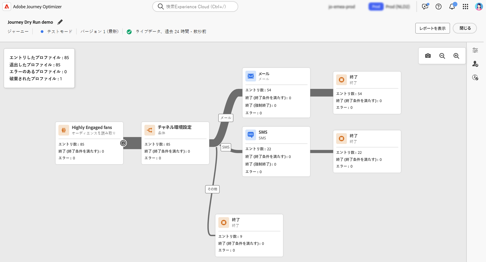

# ジャーニーのドライラン {#journey-dry-run}

>[!CONTEXTUALHELP]
>id="ajo_journey_dry_run"
>title="ドライランモード"
>abstract="このジャーニーはドライランになっています。ジャーニーのドライランは、Adobe Journey Optimizer の特別なジャーニー公開モードで、ジャーニー実務担当者は実際の顧客に連絡したり、プロファイル情報を更新したりすることなく、実際の実稼動データを使用してジャーニーをテストできます。この機能により、ジャーニー実務担当者は、ジャーニーをライブで公開する前に、ジャーニーのデザインとオーディエンスのターゲティングに自信を持つことができます。"

>[!CONTEXTUALHELP]
>id="ajo_journey_dry_run_start"
>title="ドライランモードでのジャーニーの公開"
>abstract="ジャーニーのドライランは、Adobe Journey Optimizer の特別なジャーニー公開モードで、ジャーニー実務担当者は実際の実稼動データを使用してジャーニーをテストできます。ジャーニーを設計したら、ドライランを実行して、ジャーニーが機能し、手順が正しいことを確認します。この公開モードを使用すると、通信をプロファイルに送信せずに、ジャーニーをスモークテストできます。"

ジャーニーのドライランは、Adobe Journey Optimizer の特別なジャーニー公開モードで、ジャーニー実務担当者は実際の顧客に連絡したり、プロファイル情報を更新したりすることなく、実際の実稼動データを使用してジャーニーをテストできます。この機能により、ジャーニー実務担当者は、ジャーニーをライブで公開する前に、ジャーニーのデザインとオーディエンスのターゲティングに自信を持つことができます。

## 主なメリット {#journey-dry-run-benefits}

ジャーニーのドライランは、顧客に連絡したり、プロファイル情報を変更したりするリスクを伴わずに、実際の実稼動データを使用してカスタマージャーニーを安全にデータ駆動型のテストできるようにすることで、実務担当者の信頼性とジャーニーの成功を向上させます。この機能により、ジャーニー実務担当者は、ライブになる前にオーディエンスのリーチと分岐ロジックを検証し、ジャーニーが意図したビジネス目標と一致していることを確認できます。

ジャーニーのドライランを使用すると、問題を早期に特定し、ターゲティング戦略を最適化し、前提ではなく実際のデータに基づいてジャーニーのデザインを改善できます。ジャーニーキャンバスに直接統合されたドライランでは、主要業績評価指標に対する直感的なレポートと表示を提供することで、チームが自信を持って反復処理を行い、承認ワークフローを効率化できます。これにより、運用効率が向上し、ローンチのリスクが軽減され、顧客エンゲージメントの結果が向上します。

最終的には、この機能により価値実現までの時間が短縮され、ジャーニーの失敗が減少します。

ジャーニーのドライランでは、以下を実現できます。

1. **安全なテスト環境**：ドライランモードのプロファイルには連絡しないので、通信を送信したり、ライブデータに影響を与えたりするリスクはありません。
1. **オーディエンスインサイト**：ジャーニー実務担当者は、ジャーニーの条件に基づいてオプトアウトや除外を含む様々なジャーニーノードでオーディエンスの到達可能性を予測できます。
1. **リアルタイムフィードバック**：指標は、ライブレポートと同様に、ジャーニーキャンバスに直接表示され、ジャーニー実務担当者はジャーニーのデザインを調整できます。

## ドライランの実行ロジック {#journey-dry-run-exec}

ドライラン中、ジャーニーはシミュレーションモードで実行され、実際のアクションをトリガーせずに、各ジャーニーアクティビティに次の特定の動作が適用されます。

* メール、SMS、プッシュ通知を含む&#x200B;**チャネルアクション**&#x200B;ノードは実行されません。
* **カスタムアクション**&#x200B;は、ドライラン中は無効になり、その応答は null に設定されます。

  読みやすさを向上させるために、ドライランの実行中はカスタムアクションとチャネルアクティビティがグレー表示されます。

  {width="80%" align="left"}

* ドライラン中は、外部データソースを含む&#x200B;**データソース**&#x200B;と&#x200B;**待機**&#x200B;アクティビティはデフォルトで無効になります。ただし、[ドライランモードをアクティブ化すると](#journey-dry-run-start)、この動作を変更できます。

* **反応**&#x200B;ノードは実行されません。反応ノードにエントリするすべてのプロファイルは正常に終了します。ただし、次の優先度ルールが適用されます。
   * **反応**&#x200B;ノードが 1 つまたは複数の&#x200B;**単一イベント**&#x200B;ノードと並行して使用される場合、プロファイルは常に反応イベントを通過します。
   * **反応**&#x200B;ノードが 1 つまたは複数の&#x200B;**反応イベント**&#x200B;ノードと並行して使用される場合、プロファイルは常にキャンバス内の最初のノード（上部のノード）を通過します。

>[!CAUTION]
>
>* ドライランを開始する権限は、**[!DNL Publish journeys]** の上位権限を持つユーザーに制限されます。ドライランを停止する権限は、**[!DNL Manage journeys]** の上位権限を持つユーザーに制限されます。[!DNL Journey Optimizer] ユーザーのアクセス権の管理について詳しくは、[この節](../administration/permissions-overview.md)を参照してください。
>
>* ドライラン機能の使用を開始する前に、[ガードレールと制限のトピックに目を通してください](#journey-dry-run-limitations)。

## ドライランの開始 {#journey-dry-run-start}

エラーのない任意のドラフトジャーニーで、ドライラン機能を使用できます。

ドライランをアクティブ化するには、次の手順に従います。

1. テストするジャーニーを開きます。
1. 「**ドライラン**」ボタンを選択します。

   

1. **待機**&#x200B;アクティビティと&#x200B;**外部データソース**&#x200B;の呼び出しを有効または無効にする場合は選択し、ドライランの公開を確認します。

   {width="50%" align="left"}

   トランジション中は、**ドライランをアクティブ化中**&#x200B;というステータスメッセージが表示されます。

1. アクティブ化すると、ジャーニーは&#x200B;**ドライラン**&#x200B;モードにエントリします。

## ドライランの監視 {#journey-dry-monitor}

ドライモードの公開をローンチすると、ジャーニーの実行と、ジャーニーの分岐やノードを介したプロファイルの進行状況を視覚化できます。

指標は、ジャーニーキャンバスに直接表示されます。ジャーニーライブレポートと指標について詳しくは、[ジャーニーキャンバスのライブレポート](report-journey.md)を参照してください。

また、ドライランの&#x200B;**過去 24 時間のレポート**&#x200B;と&#x200B;**全期間レポート**&#x200B;にアクセスすることもできます。これらのレポートにアクセスするには、ジャーニーキャンバスの右上隅にある「**レポートを表示**」ボタンをクリックします。

>[!CAUTION]
>
> レポートデータは、ドライランが&#x200B;**アクティブ**&#x200B;の場合にのみ使用できます。停止すると、レポートデータにアクセスできなくなります。必要に応じて、レポートの上にある「**書き出し**」ボタンを使用してダウンロードします。

## ドライランの停止 {#journey-dry-run-stop}

14 日後、ドライランのジャーニーは自動的に&#x200B;**ドラフト**&#x200B;ステータスに移行します。

ドライランのジャーニーは、手動で停止することもできます。ドライランモードを非アクティブ化するには、次の手順に従います。

1. 停止するドライランのジャーニーを開きます。
1. 「**閉じる**」ボタンを選択して、テストを終了します。
確認画面で、過去 24 時間および全期間のレポートへのリンクを使用できます。

   {width="50%" align="left"}

1. 「**ドラフトに戻る**」をクリックして確定します。

## ガードレールと制限 {#journey-dry-run-limitations}

* ドライランモードのプロファイルは、エンゲージメント可能なプロファイルにカウントされます
* ドライランモードのジャーニーは、ライブジャーニーの割り当て量にカウントされます
* ドライランのジャーニーは、ビジネスルールには影響しません
  <!--* When creating a new journey version, if a previous journey version is **Live**, then the Dry run activation is not allowed on the new version.-->
* **ジャンプ**アクションは、ドライランでは有効になりません。
ソースジャーニーが宛先ジャーニーへの**ジャンプ**&#x200B;イベントをトリガーした際、そのジャンプイベントはドライランのジャーニーバージョンには適用されません。例えば、ジャーニーの最新バージョンがドライランで、以前のバージョンが&#x200B;**ライブ**&#x200B;である場合、ジャンプイベントはドライランバージョンを無視し、**ライブ**&#x200B;バージョンにのみ適用されます。

## ジャーニーのステップイベントとドライラン {#journey-step-events}

ジャーニーのドライランでは、**stepEvents** が生成されます。これらの stepEvents には、特定のフラグとドライラン ID（`inDryRun` と `dryRunID`）があります。

* `_experience.journeyOrchestration.stepEvents.inDryRun` は、ドライランがアクティブ化されている場合は `true` を返し、それ以外の場合は `false` を返します
* `_experience.journeyOrchestration.stepEvents.dryRunID` は、ドライランインスタンスの ID を返します

stepEvent データを&#x200B;**外部システム**&#x200B;に書き出す場合は、`inDryRun` フラグを使用してドライラン実行をフィルタリングできます。

Adobe Experience Platform クエリサービスを使用して&#x200B;**ジャーニーレポート指標**&#x200B;を分析する際は、ドライランで生成されたステップイベントを除外する必要があります。これを実行するには、`inDryRun` フラグを `false` に設定します。

