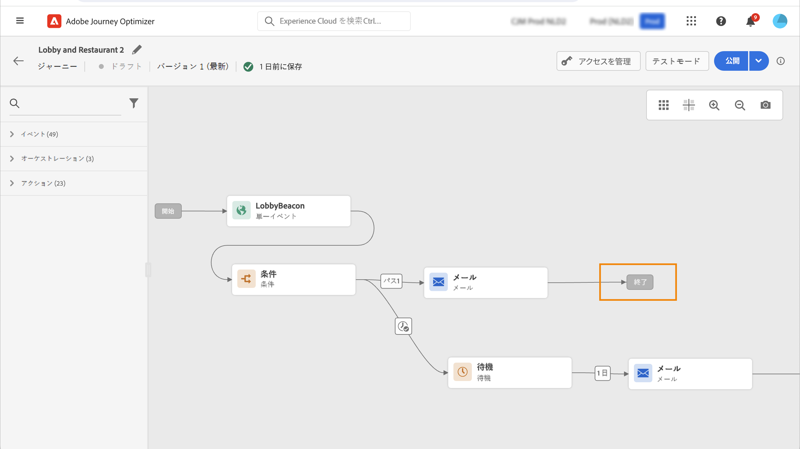

# ジャーニーライフサイクル{#journey-lifecyle}

## ジャーニー内のプロファイル{#profile-journey}

単一のジャーニーの場合：

* 再エントリが有効な場合、プロファイルはジャーニーに複数回エントリできますが、以前のジャーニーインスタンスから完全に離脱するまでは実行できません。

* 再エントリが無効な場合、プロファイルは同じジャーニーに複数回エントリできません

プロファイルの再エントリについて詳しくは、この[節](../building-journeys/journey-gs.md#change-properties)を参照してください。

セグメントを読み取りジャーニーの場合：

* 繰り返し発生しないジャーニーの場合：プロファイルはジャーニーに 1 回のみエントリします。
* 繰り返し発生するジャーニーの場合：セグメント／想定されたステータスにある場合、プロファイルは繰り返し発生するたびにジャーニーにエントリします。以前の繰り返しのジャーニーにまだ留まっていた場合は、最初から再開します。

読み取りセグメントで始まるビジネスイベントジャーニーの場合：

このジャーニーがビジネスイベントの受信に基づいていることを知っているので、プロファイルが想定されるセグメントで認定された場合は、受信した各ビジネスイベントのジャーニーにエントリします。このプロファイルは同じジャーニーで複数回同時に使用できますが、異なるビジネスイベントのコンテキストで使用できます。

（イベントまたはセグメントの選定で始まる）単一ジャーニーには、同じイベントに対してジャーニーが誤って複数回トリガーされるのを防ぐガードレールが含まれています。 プロファイルの再エントリは、デフォルトで 5 分間一時的にブロックされます。 例えば、あるイベントが特定のプロファイルのジャーニーを 12:01 にトリガーし、12:03 に別のイベントが到着した場合（それが同じイベントであっても、同じジャーニーをトリガーする別のイベントであっても）、このプロファイルのジャーニーが再び開始されることはありません。

## ジャーニーの終了{#journey-ending}

ジャーニーは、次の 2 つの特定のコンテキストで、1 人の個人に対して終了できます。

* その人物がアクティビティの最後のパスに到達した。
* その人物が&#x200B;**条件**&#x200B;アクティビティ（または条件を含む&#x200B;**待機**&#x200B;アクティビティ）に到達したが、どの条件にも一致しない。

再エントリが許可されているジャーニーの場合、その人物は再度エントリすることができます。[このページ](../building-journeys/journey-gs.md#change-properties)を参照してください。

ライブジャーニーを終了するには、ジャーニーをクローズすることをお勧めします。そうすると、ジャーニーでの新規顧客のエントリはブロックされます。既にジャーニーにエントリしている顧客は最後までジャーニーを進めることができます。[この節](../building-journeys/journey-end.md#close-journey)を参照してください

緊急事態が発生し、ジャーニー上のすべての処理を直ちに終了する必要がある場合にのみ、ジャーニーを停止できます。既にジャーニーにエントリしている人物は全員、進行が停止します。[この節](../building-journeys/journey-end.md#stop-journey)を参照してください

>[!NOTE]
>
>クローズしたジャーニーや停止したジャーニーは再開できません。

### ジャーニーの終了タグ{#end-tag}

ジャーニーの作成時に、各パスの末尾に「終了タグ」が表示されます。このノードは、ユーザーが追加できず、削除もできず、ラベルのみ変更できます。ジャーニーの各パスの末尾を示します。ジャーニーに複数のパスがある場合は、レポートを読みやすくするために、各末尾にラベルを追加することをお勧めします。[このページ](../reports/live-report.md)を参照してください。

<!--

### End activity{#journey-end-activity}

The **[!UICONTROL End]** activity allows you to mark the end of each path of the journey. It is not mandatory but recommended for visual clarity. See [this page](../building-journeys/end-activity.md)

-->

### ジャーニーをクローズ{#close-journey}

ジャーニーは、次の理由でクローズすることがあります。

* 「**[!UICONTROL 新規エントリに対してクローズ]**」ボタンを使用して手動でジャーニーをクローズする。
* セグメントベースの 1 回限りのジャーニーが終了した。
* セグメントベースの繰り返しジャーニーの最後の回が終了した後。

ジャーニーを手動でクローズすると、既にジャーニーにエントリしている顧客はパスを終了できますが、新しいユーザーはジャーニーにエントリできなくなります。（上記の理由のいずれかにより）ジャーニーをクローズした場合、ステータスは「**[!UICONTROL クローズド]**」になります。ジャーニーは、新しい個人がジャーニーにエントリするのを停止します。既にジャーニーにエントリしている人は、通常通りにジャーニーを終了することができます。デフォルトのグローバルタイムアウトである 30 日が経過すると、ジャーニーは&#x200B;**完了**&#x200B;ステータスに切り替わります。この[節](../building-journeys/journey-gs.md#global_timeout)を参照してください。

クローズしたジャーニーのバージョンは、再開または削除することはできません。クローズしたジャーニーから新しいバージョンを作成したり、複製を作成したりできます。削除できるのは完了したジャーニーのみです。

ジャーニーのリストからジャーニーをクローズするには、ジャーニー名の右側にある&#x200B;**[!UICONTROL 省略記号]**&#x200B;ボタンをクリックし、「**[!UICONTROL 新しいエントリをクローズ]**」を選択します。

以下の手順でも可能です。

1. **[!UICONTROL ジャーニー]**&#x200B;リストで、クローズするジャーニーをクリックします。
1. 右上の下向き矢印をクリックします。

   

1. 「**[!UICONTROL 新規エントリに対してクローズ]**」をクリックし、ダイアログボックスで確定します。

### ジャーニーを停止{#stop-journey}

必要に応じて、ジャーニー内のすべての個人の進行を停止することもできます。ジャーニーを停止すると、ジャーニー内のすべての個人がタイムアウトになります。ただし、ジャーニーを停止すると、既にジャーニーにエントリしている人物は全員、進行が停止します。ジャーニーは基本的にオフになります。ジャーニーを終了する場合は、ジャーニーをクローズすることをお勧めします。

停止したジャーニーのバージョンを再開することはできません。

停止すると、ジャーニーのステータスは&#x200B;**[!UICONTROL 停止済み]**&#x200B;に設定されます。

例えば、ジャーニーが誤ったオーディエンスをターゲットにしていることをマーケターが認識した場合や、メッセージの配信に想定されるカスタムアクションが正しく機能していない場合に、ジャーニーを停止できます。ジャーニーのリストからジャーニーを停止するには、ジャーニー名の右側にある&#x200B;**[!UICONTROL 省略記号]**&#x200B;ボタンをクリックし、「**[!UICONTROL 停止]**」を選択します。

以下の手順でも可能です。

1. **[!UICONTROL ジャーニー]**&#x200B;リストで、停止するジャーニーをクリックします。
1. 右上の下向き矢印をクリックします。
   
1. 「**[!UICONTROL 停止]**」をクリックし、ダイアログボックスで確定します。
