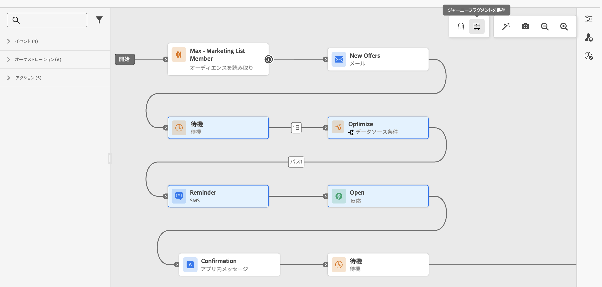
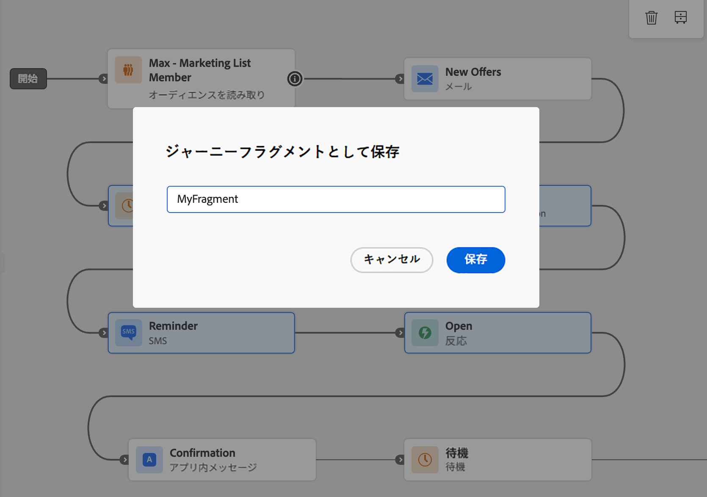
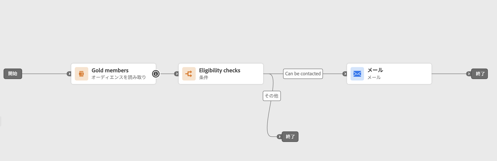
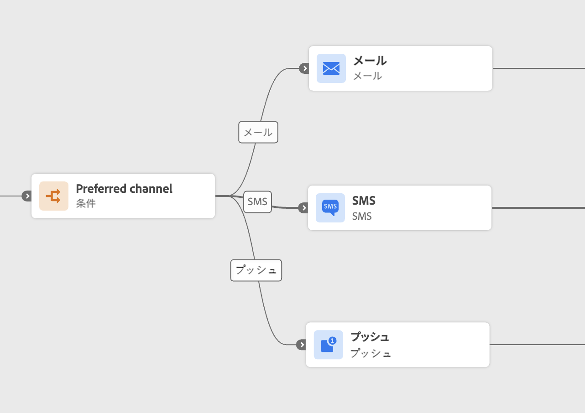
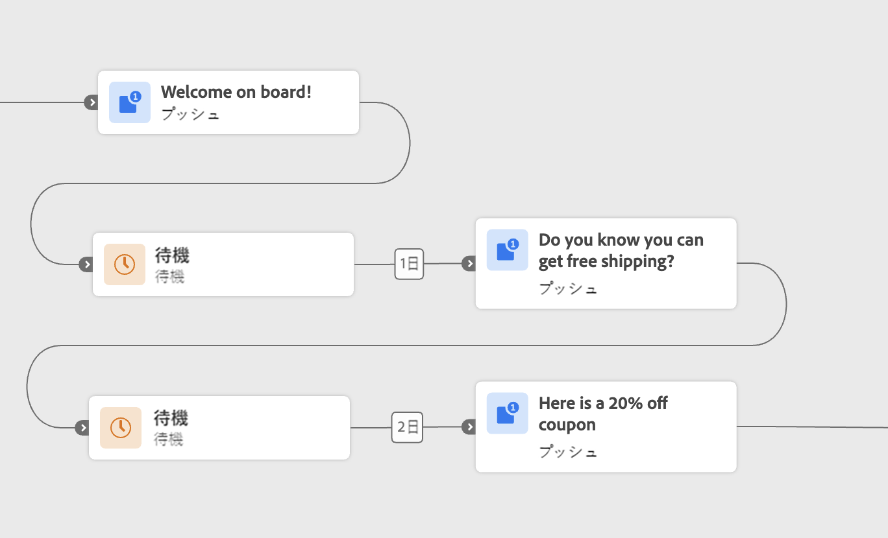
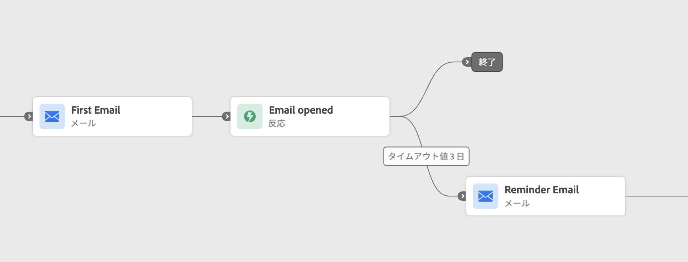

# ジャーニーフラグメント {#journey-fragments}

>[!BEGINSHADEBOX]

**このページ：**&#x200B;では、ジャーニーフラグメント（ジャーニーノードの再利用可能なセット）を作成、管理、再利用して、ジャーニーをより迅速に構築し、サンドボックス全体で一貫性を維持する方法を説明します。

>[!ENDSHADEBOX]

ジャーニーフラグメントは、一度作成すればサンドボックスをまたいで任意のジャーニーにドロップできる、再利用可能なジャーニーノードのセットです。 実施要件のチェック、好みのチャネルルーティングロジック、ウェルカムシーケンスなど、フラグメントは、同じロジックを毎回ゼロから再構築することなく、より迅速に作業し、一貫性を維持するのに役立ちます。 [ ユースケースの例を参照してください。](#examples)

作成したフラグメントは、専用の&#x200B;**[!UICONTROL フラグメント在庫]**&#x200B;に保存され、**[!UICONTROL ジャーニーフラグメント]**&#x200B;アクティビティを使用して任意のジャーニーに挿入できます。

>[!NOTE]
>ジャーニーフラグメントでは、**コピー動作**&#x200B;を使用します。ジャーニーにフラグメントを挿入すると、元のノードの静的コピーが作成されます。 元のフラグメントに対して行われた更新は、既に使用しているジャーニーには反映されません。

## 権限 {#journey-fragments-permissions}

ジャーニーフラグメントを操作するには、次の[権限](../administration/permissions.md)が必要です。

* **ジャーニーの管理** — フラグメントの作成、編集、および削除に必要です。
* **ジャーニーを公開** — フラグメントをアクティベートするために必要です。

## フラグメントインベントリへのアクセス {#journey-fragments-inventory}

ジャーニーフラグメントには、**[!UICONTROL ジャーニー]** セクションからアクセスできます。 「**[!UICONTROL フラグメント]**」タブを開き、サンドボックス内の使用可能なすべてのフラグメントを参照します。

フラグメント名、ステータス、作成日、作成者、最終変更日、またはタグでリストをフィルタリングできます。

## ジャーニーフラグメントを作成 {#create-journey-fragment}

>[!CONTEXTUALHELP]
>id="ajo_journey_fragment_create_canvas"
>title="ジャーニーフラグメントとして保存"
>abstract="保存前に、一意のフラグメント名を入力します。 選択したノードは、フラグメントの在庫で使用できる再利用可能なフラグメントとして保存されます。"

ジャーニーフラグメントは、ジャーニーキャンバスから直接（推奨）またはフラグメントインベントリから2つの方法で作成できます。

>[!BEGINTABS]

>[!TAB  ジャーニーキャンバスから]

ジャーニーノードをジャーニーキャンバスから直接フラグメントとして保存するには：

1. ジャーニーを開き、キャンバス上で1つ以上の接続されたノードを選択します。
1. ツールバーの「**[!UICONTROL フラグメントとして保存]**」アイコンをクリックします。

   ジャーニーフラグメントを挿入する

1. サンドボックス内でフラグメントの一意の名前を入力します。

   

1. 「**[!UICONTROL 保存]**」をクリックします。 フラグメントはドラフトとして保存されます。

>[!TIP]
>
>ジャーニーからフラグメントを作成する場合は、選択したノードが期待どおりに動作することを確認するために、フラグメントを保存する&#x200B;**前**&#x200B;に[ ジャーニーをテストまたはシミュレートします](testing-the-journey.md)。

>[!TAB  フラグメントインベントリから]

インベントリから直接フラグメントを作成するには：

1. 「**[!UICONTROL ジャーニー]** > **[!UICONTROL ジャーニーフラグメント]**」タブに移動します。
1. 「**[!UICONTROL ジャーニーフラグメントを作成]**」をクリックします。
1. フラグメント作成キャンバスで、ジャーニーアクティビティを追加および設定します。
1. 完了したら、**[!UICONTROL 保存]**&#x200B;をクリックして、フラグメントをドラフトとして保存します。

>[!CAUTION]
>
>テストモードとシミュレーションは、フラグメントエディターでは使用できません。 つまり、フラグメントがアクティブ化され、ジャーニーに挿入される前に、設定されたアクティビティの動作を検証することはできません。 ロジックの精度が重要なフラグメントの場合は、[ フルジャーニーでノードを構築およびテストまたはシミュレートすることを検討してください](testing-the-journey.md)。その後、上記の「キャンバス」タブからフラグメントとして保存します。

>[!ENDTABS]

## フラグメントの編集 {#edit-journey-fragment}

>[!CONTEXTUALHELP]
>id="ajo_journey_fragment_properties"
>title="ジャーニーフラグメントのプロパティ"
>abstract="在庫からフラグメントを開くと、そのノード、プロパティ、タグ、ラベルを変更できます。 アクティブなフラグメントは、編集する前に非アクティブ化する必要があります。"

フラグメントを編集するには、名前をクリックして&#x200B;**[!UICONTROL フラグメントインベントリ]**&#x200B;からフラグメントを開きます。 フラグメント作成UIでは、次のことができます。

* アクティビティを追加、削除、変更します。
* フラグメントのプロパティ（名前、タグ、ラベル）を設定または更新します。

>[!NOTE]
>
>* 編集できるのは、**[!UICONTROL ドラフト]** フラグメントのみです。 **[!UICONTROL Active]** フラグメントを変更するには、最初にフラグメントを非アクティブ化します。
>
>* テストモードとシミュレーションは、フラグメントエディターでは使用できません。 ノードをフラグメントとして保存する前に、ジャーニー全体でジャーニーレベルのロジックをテストまたはシミュレートします。
>
>* [ ジャンプ ](jump.md) アクティビティは、フラグメント内では使用できません。

## フラグメントの管理 {#manage-journey-fragments}

### フラグメントステータス {#fragment-statuses}

ジャーニーフラグメントは、次のステータスを持つライフサイクルに従います。

| ステータス | 説明 |
|---|---|
| **[!UICONTROL ドラフト]** | フラグメントは作成中のため、ジャーニーではまだ使用できません。 |
| **[!UICONTROL アクティブ]** | フラグメントはジャーニーで使用する準備ができました。 |
| **[!UICONTROL アーカイブ済み]** | フラグメントはアーカイブされ、ジャーニーで使用できなくなります。 |

フラグメントステータスの移行には、次のルールが適用されます。

* アクティブ化できるのは&#x200B;**[!UICONTROL ドラフト]** フラグメントのみです。 ドラフトフラグメントを開き、**[!UICONTROL Activate]** アイコンを使用します。
* アクティブな&#x200B;]**フラグメントのみが非アクティブ化またはアーカイブできます。**[!UICONTROL 
* アーカイブ解除できるのは、**[!UICONTROL アーカイブ済み]** フラグメントのみです。 フラグメントをアーカイブ解除すると、**[!UICONTROL ドラフト]**&#x200B;状態に戻ります。
* 削除できるのは&#x200B;**[!UICONTROL ドラフト]**&#x200B;個のフラグメントのみです。

>[!NOTE]
>フラグメントをアクティベートする場合、ジャーニーの公開中に実行されるのと同じ検証チェックのほとんどが適用されます。 ただし、**コンテキスト属性は検証されず**&#x200B;および&#x200B;**ガバナンスポリシーはアクティベーション時に適用されません**。どちらも、フラグメントがジャーニーに挿入され、使用されたときに評価されます。

### フラグメントのアクション {#fragment-actions}

フラグメントインベントリから、フラグメントに対して次のアクションを実行できます。

* **[!UICONTROL 開く]**：名前をクリックしてフラグメントを編集します。
* **[!UICONTROL 重複]**: **[!UICONTROL その他のアクション]** （。..）からフラグメントのコピーを作成します アイコン。
* **[!UICONTROL アーカイブ]**: **[!UICONTROL その他のアクション]** （。..）からフラグメントをアーカイブします（**[!UICONTROL アクティブ]** フラグメントでのみ利用可能）。 アイコン。 アーカイブされたフラグメントは、フラグメントピッカーで使用できなくなりました。
* **[!UICONTROL アーカイブ解除]**: **[!UICONTROL その他のアクション]** （。..）から、アーカイブされたフラグメントを復元します（**[!UICONTROL アーカイブ]** フラグメントでのみ使用可能）。 アイコン。 フラグメントが&#x200B;**[!UICONTROL ドラフト]**&#x200B;状態に戻ります。
* **[!UICONTROL 削除]**: **[!UICONTROL その他のアクション]** （。..）から、フラグメントを完全に削除します（**[!UICONTROL ドラフト]** フラグメントでのみ使用可能）。 アイコン。
* **[!UICONTROL タグを編集]**: **[!UICONTROL その他のアクション]** （。..）から、フラグメントのタグを追加または削除します アイコン。

## フラグメントでフラグメントを使用 {#use-journey-fragment}

>[!CONTEXTUALHELP]
>id="ajo_journey_fragment_add"
>title="ジャーニーフラグメントを追加"
>abstract="ピッカーで使用できるのは、**[!UICONTROL アクティブ]**&#x200B;なフラグメントのみです。 フラグメントを挿入すると、そのノードの&#x200B;**静的コピー**&#x200B;が作成されます。元のフラグメントに対する更新は、ジャーニーに反映されません。"

ジャーニーにフラグメントを挿入するには：

1. ジャーニーを開き、左側のパネルから「**[!UICONTROL ジャーニーフラグメント]**」アクティビティをドラッグします。
1. 既存のブランチにドロップするか、空のキャンバスにドロップします。 フラグメントピッカーが表示されます。
1. 使用するフラグメントを参照または検索します。 フラグメントを挿入する前に、フラグメントをプレビューしたり、別のタブで開いたりできます。
1. フラグメントを選択します。 そのノードは、ドロップポイントでキャンバスにコピーされます。

>[!NOTE]
>ピッカーで使用できるのは、**[!UICONTROL アクティブ]**&#x200B;なフラグメントのみです。 フラグメントを挿入すると、そのノードの&#x200B;**静的コピー**&#x200B;が作成されます。元のフラグメントに対するその後の更新は、ジャーニーに反映されません。
>
>空のキャンバスにフラグメントをドロップする場合、フラグメントは&#x200B;**[!UICONTROL オーディエンスの読み取り]**、**[!UICONTROL オーディエンスの選定]**、または&#x200B;**[!UICONTROL イベント]** ノードで開始する必要があります（ジャーニーを開始する場合と同じルール）。

## ガードレールと制限 {#guardrails}

ジャーニーフラグメントには、次のガードレールが適用されます。

**フラグメント作成**

* フラグメント名は、サンドボックス **ごとに**&#x200B;一意である必要があります。
* フラグメントには、**1つのエントリパス**&#x200B;のみを含めることができます。 複数のエントリポイントを持つ選択は、フラグメントとして保存できません。
* フラグメントとして保存できるのは、**接続されたノード**&#x200B;のみです。
* フラグメント **に[ ジャンプ ](jump.md) アクティビティ**&#x200B;を含めることはできません。
* フラグメントには、**最大20 ノード**&#x200B;を含めることができます。
* サンドボックスには、最大&#x200B;**200個のアクティブなフラグメント**&#x200B;を含めることができます。

**フラグメントの使用状況**

* ジャーニーに挿入できるのは、**[!UICONTROL アクティブ]** フラグメントのみです。
* フラグメントを挿入すると、そのノードの&#x200B;**静的コピー**&#x200B;が作成されます。 元のフラグメントに対する更新は、使用されたジャーニーには反映されません。
* フラグメントは、既存のブランチにドロップすることも、空のキャンバスにドロップすることもできます。 空のキャンバスにドロップした場合、フラグメントは&#x200B;**[!UICONTROL オーディエンスの読み取り]**、**[!UICONTROL オーディエンスの選定]**、または&#x200B;**[!UICONTROL イベント]** ノードで開始する必要があります。

**一般**

* フラグメントは、**[!UICONTROL ジャーニーフラグメント]** カテゴリーの[統合検索](../start/search-filter-categorize.md) バーを使用して見つけることができます。
* [ タグ ](tags.md)と&#x200B;**ラベル**&#x200B;は、フラグメントでサポートされています。
* [監査ログ ](../privacy/audit-logs.md)はサポートされています。
* 古いスタック（インラインキャンペーンを使用）で実行されているジャーニーは、ジャーニーフラグメントをサポートしていません。 この機能を使用する前に、このようなジャーニーを複製して新しいスタックに移動します。
* ジャーニーフラグメントは[ サンドボックスツール ](../configuration/copy-objects-to-sandbox.md)をサポートしています。 フラグメントはパッケージ化して、別のサンドボックスに書き出すことができます。

## ユースケースの例 {#examples}

次の例は、ジャーニーフラグメントとして保存および再利用できる一般的なジャーニーパターンを示しています。

**実施要件チェック**

標準のエントリパターン（[ オーディエンスを読み取り](read-audience.md) ノードに続いて実施要件フィルターなど）は、フラグメントにカプセル化できます。 これにより、プロファイルがジャーニーにエントリする方法の一貫性を維持しながら、セットアップ時間を短縮できます。 フラグメントは、[Optimize](optimize.md) アクティビティのみ、またはオーディエンスの読み取りと最適化アクティビティを一緒にすることができます。

**優先チャネル**

フラグメントは、プロファイルが好むコミュニケーションチャネル（電子メール、プッシュ通知、SMS）を評価し、それに応じてプロファイルをルーティングできます。 このロジックは、アウトバウンドメッセージを含むあらゆるジャーニーで再利用できるため、一貫したチャネル環境設定を実現できます。 フラグメントには、[Optimize](optimize.md) アクティビティと3つのチャネルブランチをすべて含めることができます。

**ウェルカムシーケンスのオンボーディング**

タイムリーなウェルカムシーケンス（製品やサービスを紹介する3つのメッセージのシリーズなど）は、フラグメントとして保存できます。 これは、様々なオーディエンスセグメントや製品ラインをまたいで新規ユーザーをオンボーディングするのに役立ちます。 フラグメントには、[Wait](wait-activity.md) アクティビティとメッセージノードを含めることができます。

**リアクションベースの待機とリマインダー**

フラグメントは、メールアクティビティの後に[反応](reaction-events.md)をカプセル化し、プロファイルが設定された日数でメールを開くのを待ち、開かなかった場合はリマインダーを送信することができます。 このロジックは、ナーチャリングジャーニーやトライアルのコンバージョンフローで一般的に再利用されます。 フラグメントには、メール アクティビティとリアクションアクティビティを含めることができます。

## よくある質問 {#faq}

**コンテンツフラグメントとジャーニーフラグメント（コンテンツフラグメント）の違いとは？**

**ジャーニーフラグメント**&#x200B;は、**[!UICONTROL ジャーニーフラグメント]** アクティビティを使用してジャーニーに挿入する、適格性チェックやチャネルルーティングロジックなど、再利用可能なジャーニーノードのセットです。 **[フラグメント](../content-management/fragments.md)**&#x200B;は、キャンペーンやジャーニーをまたいで、メール内で再利用できるコンテンツコンポーネント（ヘッダーやフッターなど）です。 つまり、ジャーニーフラグメントは&#x200B;*ロジック*&#x200B;で再利用でき、コンテンツフラグメントは&#x200B;*コンテンツ*&#x200B;で再利用できます。

**コンテンツフラグメントとAEM ジャーニーフラグメントの違いは何ですか？**

**[AEM コンテンツフラグメント](../integrations/aem-fragments.md)**&#x200B;は、Adobe Experience Managerで作成され、[!DNL Journey Optimizer]件のメッセージで再利用されます。 これらはジャーニーロジックではありません。 一方、ジャーニーフラグメントは、[!DNL Journey Optimizer]内で構築および保存され、接続されたジャーニーノードのセットを表します。

**ジャーニーフラグメントを更新すると、既存のジャーニーも更新されますか？**

いいえ。 ジャーニーフラグメントでは、**コピー動作**&#x200B;を使用します。フラグメントを挿入すると、ノードの静的コピーが作成されます。 元のフラグメントに対して行われた更新は、既に使用しているジャーニーには反映されません。
