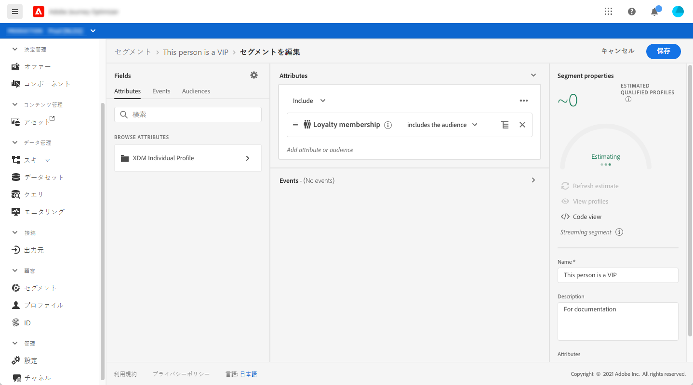
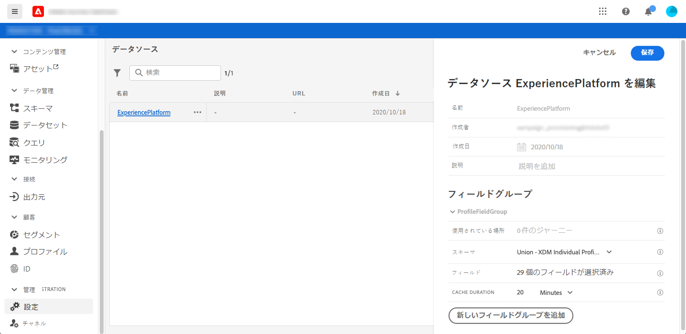
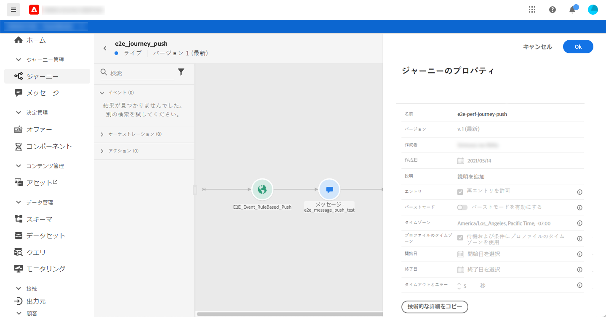
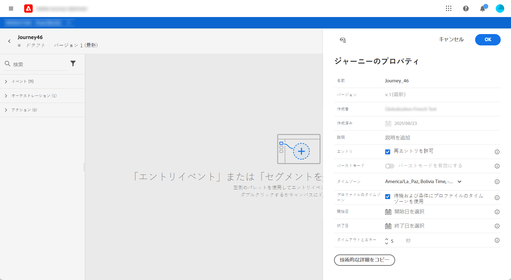
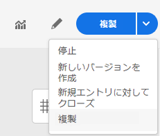

# ジャーニーの概要 {#jo-quick-start}

## 前提条件

ジャーニーでメッセージを送信するには、次の設定が必要です。

1. **イベントの設定**：イベントを受信したときに個別にジャーニーをトリガーする場合は、イベントを設定する必要があります。想定する情報とその情報の処理方法を定義します。このステップは、**技術ユーザー**&#x200B;が実行します。[詳細情報](../event/about-events.md)。

   

1. **セグメントの作成**：指定した一連のプロファイルにメッセージを一括送信するため、ジャーニーで Adobe Experience Platform のセグメントをリッスンすることもできます。この場合、セグメントを作成する必要があります。[詳細を読む](../segment/about-segments.md)。

   

1. **データソースの設定**：ジャーニーで使用する追加情報（条件など）を取得するために、システムへの接続を定義します。組み込みの Adobe Experience Platform データソースも、プロビジョニング時に設定されます。イベントのデータのみをジャーニーで活用する場合、このステップは必要ありません。このステップは、**技術ユーザー**&#x200B;が実行します。[詳細を読む](../datasource/about-data-sources.md)

   

1. **アクションの設定**：メッセージ機能は Journey Optimizer に組み込まれており、ユーザーはコンテンツのデザインと、メッセージの公開をするだけです。[この節](../get-started-content.md)を参照してください。サードパーティのシステムを使用してメッセージを送信する場合は、カスタムアクションを作成します。詳しくは、[この節](../action/action.md)を参照してください。このステップは、**技術ユーザー**&#x200B;が実行します。

   

## ジャーニーの作成 {#jo-build}

このステップは、**ビジネスユーザー**&#x200B;が実行します。ここでジャーニーを作成します。様々なイベント、オーケストレーション、アクションなどのアクティビティを組み合わせて、複数のステップから成るクロスチャネルのシナリオを作成します。

ジャーニーを介してメッセージを送信する主な手順は次のとおりです。

1. 「ジャーニー管理」セクションで、「**[!UICONTROL ジャーニー]**」をクリックします。 ジャーニーのリストが表示されます。

   

1. 「**[!UICONTROL 作成]**」をクリックして、新規のジャーニーを作成します。

1. 右側に表示される設定ペインで、ジャーニーのプロパティを編集します。詳しくは、[この節](journey-gs.md#change-properties)を参照してください。

   

1. 最初に、イベントまたは&#x200B;**セグメントの読み取り**&#x200B;アクティビティを、パレットからキャンバスにドラッグ＆ドロップします。ジャーニーのデザインの詳細については、[この節](using-the-journey-designer.md)を参照してください。

   

1. 次に個人が従う手順をドラッグ＆ドロップします。例えば、条件を追加してメッセージを送信できます。アクティビティの詳細については、[この節](using-the-journey-designer.md)を参照してください。

1. テストプロファイルを使用してジャーニーをテストします。詳しくは、[この節](testing-the-journey.md)を参照してください。

1. ジャーニーを公開してアクティブ化します。詳しくは、[この節](publishing-the-journey.md)を参照してください。

   

1. 専用のレポートツールを使用してジャーニーを監視し、ジャーニーの有効性を測定できます。詳しくは、[この節](../reports/live-report.md)を参照してください。

   

## プロパティの変更 {#change-properties}

右上の鉛筆アイコンをクリックして、ジャーニーのプロパティにアクセスします。

管理者は、ジャーニー名の変更、説明の追加、再エントリの許可、開始日と終了日の選択、**[!UICONTROL タイムアウトとエラー]**&#x200B;の時間を定義できます。

「**技術詳細をコピー**」を使用すると、ジャーニーに関するテクニカル情報をコピーし、サポートチームはこの情報をトラブルシューティングに使用できます。JourneyVersion UID、OrgID、orgName、sandboxName などの情報がコピーされます。

### エントリ{#entrance}

新規ジャーニーではデフォルトで再エントリが許可されています。「1 回限り」のジャーニー（例：入店時に 1 度だけギフトをオファーするなど）を作成するには、この再エントリのオプションをオフにします。すると、この例では、顧客がジャーニーに再エントリしてオファーを再度受け取るということがなくなります。

ジャーニーが「終了」すると、**[!UICONTROL クローズド（新規エントリなし）]**&#x200B;ステータスになります。新規エントリは停止されますが、既にジャーニーにエントリしている人は、通常どおりにジャーニーを完了することができます。

デフォルトのグローバルタイムアウトである 30 日が経過すると、ジャーニーは&#x200B;**完了**&#x200B;ステータスに切り替わります。この[節](../building-journeys/journey-gs.md#global_timeout)を参照してください。

### ジャーニーアクティビティのタイムアウトとエラー {#timeout_and_error}

アクションまたは条件のアクティビティを編集するときに、エラー時やタイムアウト時用の別のパスを定義できます。サードパーティシステムを調査するアクティビティの処理時間が、ジャーニーのプロパティ（「**[!UICONTROL タイムアウトとエラー]**」フィールド）で定義されたタイムアウト時間を超えると、第 2 パスが選択され、代替アクションが実行されます。

設定できる値は 1～30 秒です。

ジャーニーに時間的制約がある場合（例：対象者がいる場所にリアルタイムで反応するなど）は、非常に短い&#x200B;**[!UICONTROL タイムアウトとエラー]**&#x200B;値を定義することをお勧めします。これは、数秒間以上アクションを遅らせることができないからです。ジャーニーの時間的制約が緩い場合は、長めの値を使用して、呼び出されるシステムに、有効な応答を送信する時間を与えることができます。

ジャーニーではグローバルタイムアウトも使用します。[次の節](#global_timeout)を参照してください。

### グローバルジャーニーのタイムアウト {#global_timeout}

ジャーニーアクティビティで使用される[タイムアウト](#timeout_and_error)のほかに、グローバルジャーニータイムアウトも存在します。このグローバルタイムアウトはインターフェイスに表示されず、変更できません。ジャーニー内にいる人の進行は、エントリしてから 30 日経過すると、グローバルタイムアウトにより停止されます。つまり、各人のジャーニーは 30 日を超えることはできません。30 日のグローバルタイムアウト期間が過ぎると、対象者のデータは削除されます。グローバルタイムアウト期間の終了時にまだジャーニーが進行中の人がいる場合、その進行は停止され、レポートでエラーとして記録されます。

>[!NOTE]
>
>ジャーニーは、プライバシーのオプトアウト、アクセス、削除などのリクエストに対して直接反応しません。ただし、グローバルタイムアウトにより、どのジャーニーでも、エントリした人が 30 日を超えてジャーニーを継続することはありません。

ジャーニーの再エントリを許可しない設定にしていても、グローバルジャーニータイムアウトの期間が 30 日なので、再エントリのブロックが 30 日を超えて機能するかどうかは確認できません。実際、ジャーニーにエントリした人の情報はエントリから 30 日後にすべて削除されるので、30 日前より古い日時にエントリした人が誰かを特定することはできません。

### タイムゾーンとプロファイルタイムゾーン {#timezone}

タイムゾーンはジャーニーレベルで定義されます。

固定タイムゾーンを入力するか、Adobe Experience Platform プロファイルを使用してジャーニータイムゾーンを定義できます。

タイムゾーン管理の詳細については、[このページ](../building-journeys/timezone-management.md)を参照してください。

## ジャーニーの終了

個人のジャーニーは、次の 2 つの理由で終了します。

* その人物がアクティビティの最後のパスに到達した。この最後のアクティビティは、終了アクティビティまたは別のアクティビティにすることができます。必ずしも終了アクティビティでパスを終わらせなくても構いません。[このページ](../building-journeys/end-activity.md)を参照してください。
* その人物が条件アクティビティ（または条件を含む待機アクティビティ）に到達したが、どの条件にも一致しない。

再エントリが許可されているジャーニーの場合、その人物は再度エントリすることができます。[このページ](../building-journeys/journey-gs.md#change-properties)を参照してください。

ジャーニーは、次の理由でクローズすることがあります。

* 「**[!UICONTROL 新規エントリに対してクローズ]**」ボタンを使用して手動でジャーニーをクローズする。
* セグメントベースの 1 回限りのジャーニーが終了した。
* セグメントベースの繰り返しジャーニーの最後の回が終了した。

（上記の理由のいずれかにより）ジャーニーをクローズした場合、ステータスは「**[!UICONTROL クローズド（エントリなし）]**」になります。新規エントリは停止されますが、既にジャーニーにエントリしている人は、通常どおりにジャーニーを完了することができます。デフォルトのグローバルタイムアウトである 30 日が経過すると、ジャーニーは&#x200B;**完了**&#x200B;ステータスに切り替わります。この[節](../building-journeys/journey-gs.md#global_timeout)を参照してください。

必要に応じて、ジャーニー内のすべての個人の進行を停止することもできます。ジャーニーを停止すると、ジャーニー内のすべての個人がタイムアウトになります。

ジャーニーを手動でクローズまたは停止する方法を次に示します。

「**[!UICONTROL 停止]**」および「**[!UICONTROL 新規エントリをクローズ]**」オプションを使用すると、**実行中**&#x200B;のジャーニーを終了できます。ジャーニーをクローズすると、**ジャーニーに新規の顧客がエントリするのをブロック**&#x200B;しますが、既にジャーニーにエントリしている顧客は最後までジャーニーを進めることができます。顧客にとって望ましいエクスペリエンスを提供できるため、ジャーニーを終了する際は、この方法を推奨します。ジャーニーを停止すると、すでにジャーニーニエントリしているユーザーは全員、進行が停止します。ジャーニーは基本的にオフになります。

>[!NOTE]
>
>クローズしたジャーニーや停止したジャーニーは再開できません。

### ジャーニーのクローズ

ジャーニーを手動でクローズすると、すでにジャーニーにエントリしている顧客はパスを終了できますが、新しいユーザーはジャーニーにエントリできなくなります。

ジャーニーをクローズすると、ジャーニーのステータスは&#x200B;**[!UICONTROL クローズド（エントリなし）]**&#x200B;になります。デフォルトのグローバルタイムアウトである 30 日が経過すると、ジャーニーは&#x200B;**完了**&#x200B;ステータスに切り替わります。この[節](../building-journeys/journey-gs.md#global_timeout)を参照してください。

クローズしたジャーニーのバージョンは、再開または削除することはできません。クローズしたジャーニーから新しいバージョンを作成したり、複製を作成したりできます。削除できるのは完了したジャーニーのみです。

ジャーニーをクローズするには、ジャーニーのリストのジャーニーの上にカーソルを置いて、「**[!UICONTROL 新規エントリをクローズ]**」をクリックします。

以下の手順でも可能です。

1. **[!UICONTROL ジャーニー]**&#x200B;リストで、クローズするジャーニーをクリックします。
1. 右上の下向き矢印をクリックします。

   

1. 「**[!UICONTROL 新規エントリをクローズ]**」をクリックします。ダイアログボックスが表示されます。
1. 「**[!UICONTROL 新規エントリをクローズ]**」をクリックして確認します。

### ジャーニーの停止

緊急事態が発生し、ジャーニー上のすべての処理を直ちに終了する必要がある場合は、ジャーニーを停止できます。

停止したジャーニーのバージョンを再開することはできません。

ジャーニーを停止すると、ジャーニーのステータスは&#x200B;**[!UICONTROL 停止]**&#x200B;になります。

誤ったオーディエンスをターゲットにしていたことや、メッセージ配信のカスタムアクションが正しく機能していないことなどにマーケターが気付いた場合、ジャーニーを停止することができます。ジャーニーを停止するには、ジャーニーのリストでジャーニーの上にカーソルを置き、「**[!UICONTROL 停止]**」をクリックします。

以下の手順でも可能です。

1. **[!UICONTROL ジャーニー]**&#x200B;リストで、停止するジャーニーをクリックします。
1. 右上の下向き矢印をクリックします。

1. 「**[!UICONTROL 停止]**」をクリックします。ダイアログボックスが表示されます。
1. 「**[!UICONTROL 停止]**」をクリックして確認します。
