# 初めてのジャーニーを作成{#jo-quick-start}

>[!CONTEXTUALHELP]
>id="ajo_homepage_card2"
>title="ジャーニーを作成"
>abstract="**Adobe Journey Optimizer** を利用すると、イベントやデータソースに格納されているコンテキストデータを使用して、リアルタイムオーケストレーションのユースケースを構築できます。"

## 前提条件{#start-prerequisites}

ジャーニーでメッセージを送信するには、次の設定が必要です。

1. **イベントの設定**：イベントを受信したときに個別にジャーニーをトリガーする場合は、イベントを設定する必要があります。想定する情報とその情報の処理方法を定義します。このステップは、**技術ユーザー**&#x200B;が実行します。[詳細情報](../event/about-events.md)。

   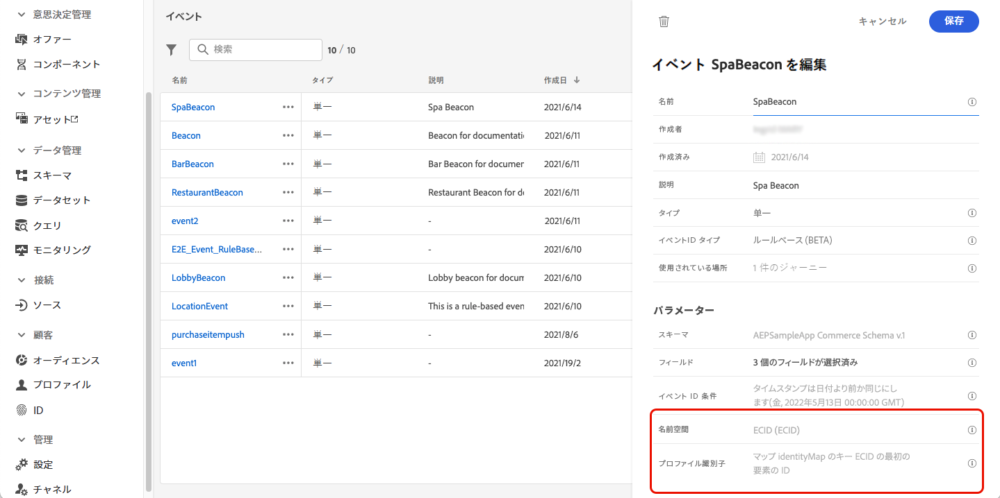

1. **オーディエンスの作成**：指定された一連のプロファイルにメッセージを一括送信するために、ジャーニーで Adobe Experience Platform オーディエンスをリッスンすることもできます。この場合、オーディエンスを作成する必要があります。[詳細情報](../audience/about-audiences.md)。

   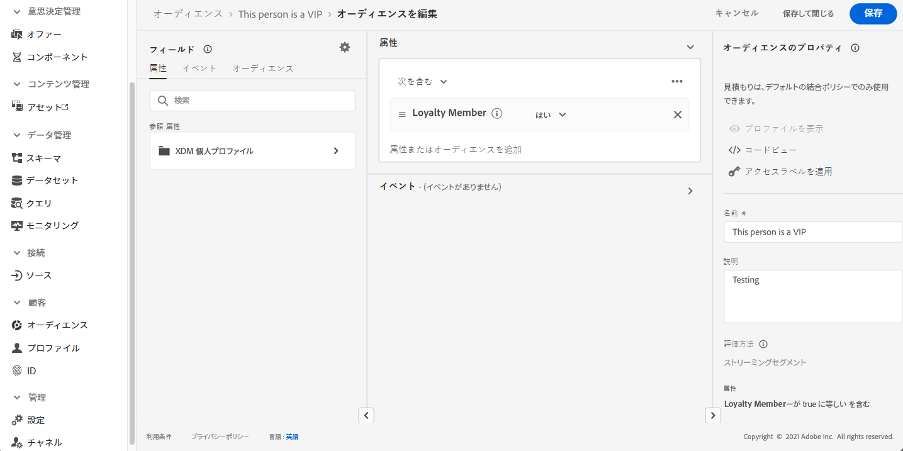

1. **データソースの設定**：ジャーニーで使用する追加情報（条件など）を取得するために、システムへの接続を定義します。組み込みの Adobe Experience Platform データソースも、プロビジョニング時に設定されます。イベントのデータのみをジャーニーで活用する場合、このステップは必要ありません。このステップは、**技術ユーザー**&#x200B;が実行します。[詳細情報](../datasource/about-data-sources.md)

   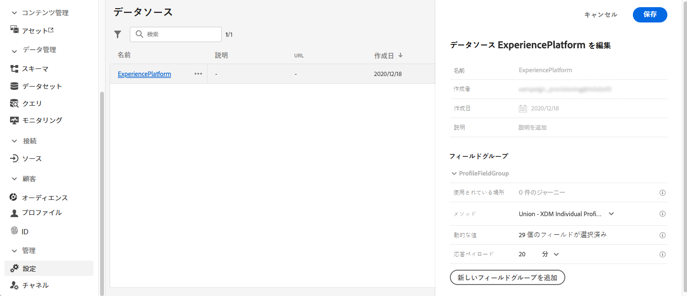

1. **アクションの設定**：サードパーティのシステムを使用してメッセージを送信する場合は、カスタムアクションを作成できます。詳しくは、[この節](../action/action.md)を参照してください。このステップは、**技術ユーザー**&#x200B;が実行します。Journey Optimizer 組み込みのメッセージ機能を使用している場合は、ジャーニーにチャネルアクションを追加し、コンテンツをデザインするだけで済みます。

   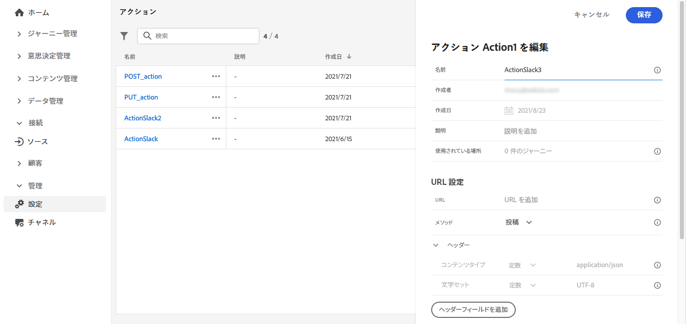

## ジャーニーへのアクセス {#journey-access}

>[!CONTEXTUALHELP]
>id="ajo_journey_create"
>title="ジャーニー"
>abstract="カスタマージャーニーを設計して、状況に即したパーソナライズされたエクスペリエンスを提供します。Journey Optimizer を利用すると、イベントやデータソースに格納されているコンテキストデータを使用して、リアルタイムオーケストレーションのユースケースを構築できます。「**概要**」タブには、ジャーニーに関連する主要指標を含むダッシュボードが表示されます。「**参照**」タブには、既存のジャーニーのリストが表示されます。"

### 主要指標とジャーニーのリスト {#access-metrics}

「ジャーニー管理」メニューセクションで、「**[!UICONTROL ジャーニー]**」をクリックします。次の 2 つのタブを使用できます。

**概要**：このタブには、ジャーニーに関連する主要指標を含む次のダッシュボードが表示されます。

* **処理済みのプロファイル**：過去 24 時間に処理されたプロファイルの合計数
* **ライブジャーニー**：過去 24 時間のトラフィックを含むライブジャーニーの合計数。ライブジャーニーには、**単一ジャーニー**（イベントベース）と&#x200B;**バッチジャーニー**（オーディエンスを読み取り）が含まれます。
* **エラー率**：過去 24 時間にエントリしたプロファイルの合計数に対する、エラーが発生したすべてのプロファイルの割合。
* **破棄率**：過去 24 時間にエントリしたプロファイルの合計数に対する、破棄されたすべてのプロファイルの割合。破棄されたプロファイルは、名前空間が正しくないことや再エントリルールを理由に、ジャーニーにエントリする資格がないユーザーを表します。

>[!NOTE]
>
>このダッシュボードでは、過去 24 時間のトラフィックを含むジャーニーが考慮されます。アクセス可能なジャーニーのみが表示されます。指標は、30 分ごとに、新しいデータが使用可能になった場合にのみ更新されます。

**参照**：このタブには、既存のジャーニーのリストが表示されます。ジャーニーを検索し、フィルターを使用して、各要素に対して基本的なアクションを実行できます。例えば、項目の複製や削除が可能です。詳しくは、[この節](../start/user-interface.md#filter-lists)を参照してください。

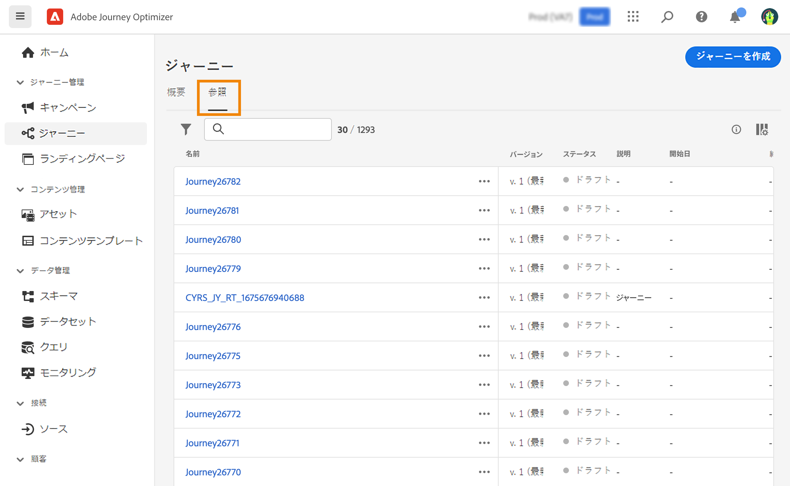

### ジャーニーのフィルタリング {#filter}

ジャーニーのリストでは、様々なフィルターを利用して、ジャーニーのリストを絞り込み、読みやすくすることができます。

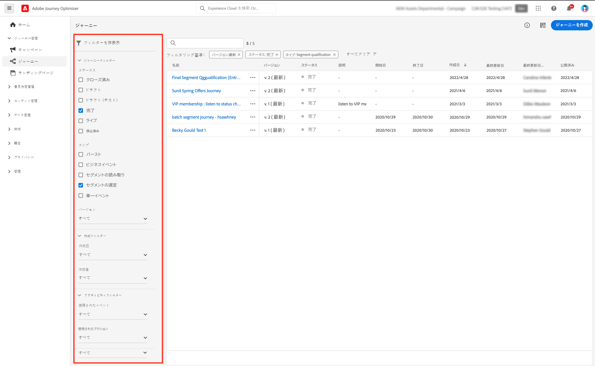

実行できる様々なフィルタリング操作を次に示します。

**[!UICONTROL ステータスフィルターとバージョンフィルター]**&#x200B;では、ステータス、タイプ、バージョンおよび割り当てられているタグに従ってジャーニーをフィルタリングできます。

タイプは、**[!UICONTROL 単一イベント]**、**[!UICONTROL オーディエンスの選定]**、**[!UICONTROL オーディエンスを読み取り]**、**[!UICONTROL ビジネスイベント]**、**[!UICONTROL バースト]**&#x200B;のいずれかになります。

ステータスには次の種類があります。

* **閉じる**：ジャーニーは、 **新しい流入に対してクローズ** 」ボタンをクリックします。 ジャーニーは、新しい個人がジャーニーにエントリするのを停止します。既にジャーニーに参加しているユーザーは、通常どおりにジャーニーを完了できます。
* **ドラフト**：ジャーニーは最初のステージです。 まだ公開されていません。
* **ドラフト（テスト）**：テストモードは、 **テストモード** 」ボタンをクリックします。
* **完了**：ジャーニーは、デフォルトのグローバルタイムアウト（30 日）の後、自動的にこのステータスに切り替わります。 既にジャーニーにエントリしているプロファイルは、通常どおりにジャーニーを終了できます。新しいプロファイルは、ジャーニーにエントリできなくなりました。
* **ライブ**：ジャーニーは、 **公開** 」ボタンをクリックします。
* **停止**：ジャーニーが **停止** 」ボタンをクリックします。 すべての個人が即座にジャーニーを終了します。

>[!NOTE]
>
>また、ジャーニーオーサリングライフサイクルには、「公開」（「ドラフト」と「ライブ」の間）、「テストモードの有効化」または「テストモードの無効化」(「ドラフト」と「ドラフト（テスト）」の間 )、「ライブ」と「停止」の間の中間ステータスも含まれます。 ジャーニーが中間状態の場合は、読み取り専用です。

**[!UICONTROL 作成フィルター]**&#x200B;を使用すると、作成日またはジャーニーを作成したユーザーに従ってジャーニーをフィルタリングできます。

**[!UICONTROL アクティビティフィルター]**&#x200B;と&#x200B;**[!UICONTROL データフィルター]**&#x200B;では、特定のイベント、フィールドグループまたはアクションを使用するジャーニーを表示できます。

**[!UICONTROL 公開フィルター]**&#x200B;を使用すると、公開日またはユーザーを選択できます。例えば、昨日公開されたライブジャーニーの最新バージョンのみを表示するように選択できます。

特定の日付範囲に基づいてジャーニーをフィルタリングするには、**[!UICONTROL 公開済み]**&#x200B;ドロップダウンリストから「**[!UICONTROL カスタム]**」を選択します。

イベント、データソースまたはアクションの設定ペインの「**[!UICONTROL 使用されている場所]**」フィールドには、特定のイベント、フィールドグループまたはアクションを使用するジャーニーの数が表示されます。「**[!UICONTROL ジャーニーを表示]**」ボタンをクリックすると、対応するジャーニーのリストを表示できます。

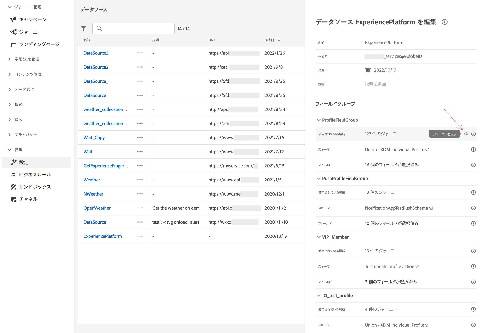

## ジャーニーをビルド{#jo-build}

このステップは、**ビジネスユーザー**&#x200B;が実行します。ここでジャーニーを作成します。様々なイベント、オーケストレーション、アクションなどのアクティビティを組み合わせて、複数のステップから成るクロスチャネルのシナリオを構築します。

ジャーニーを介してメッセージを送信する主な手順は次のとおりです。

1. 「**参照**」タブから、「**[!UICONTROL ジャーニーを作成]**」をクリックして新しいジャーニーを作成します。

1. 右側に表示される設定ペインで、ジャーニーのプロパティを編集します。詳しくは、[この節](journey-gs.md#change-properties)を参照してください。

   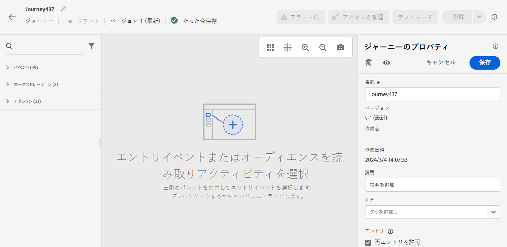

1. まず、イベントまたは&#x200B;**オーディエンスを読み取り**&#x200B;アクティビティを、パレットからキャンバスにドラッグ＆ドロップします。ジャーニーのデザインの詳細については、[この節](using-the-journey-designer.md)を参照してください。

   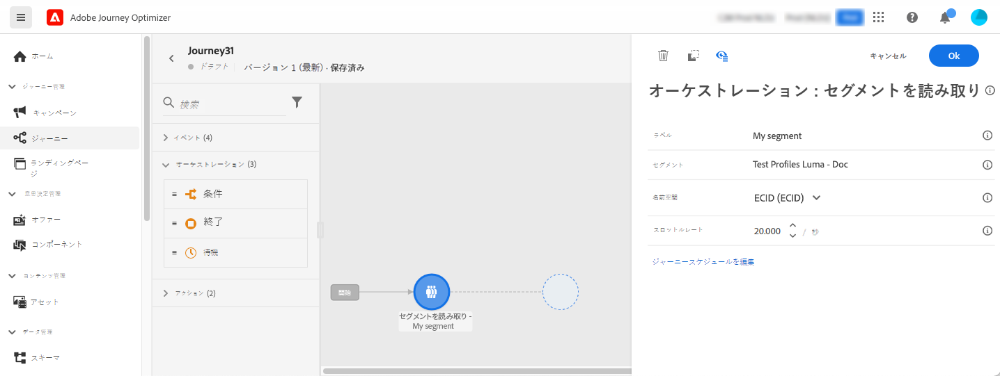

1. 次に個人が従う手順をドラッグ＆ドロップします。例えば、条件に続いてチャネルアクションも追加できます。アクティビティの詳細については、[この節](using-the-journey-designer.md)を参照してください。

1. テストプロファイルを使用してジャーニーをテストします。詳しくは、[この節](testing-the-journey.md)を参照してください。

1. ジャーニーを公開してアクティブ化します。詳しくは、[この節](publishing-the-journey.md)を参照してください。

   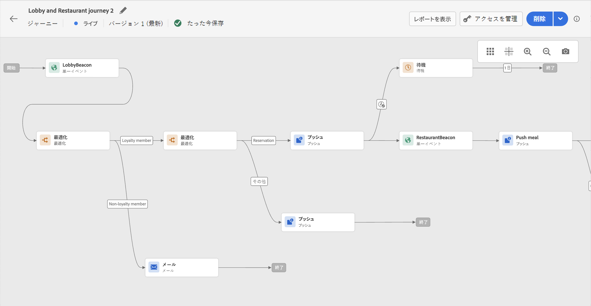

1. 専用のレポートツールを使用してジャーニーを監視し、ジャーニーの有効性を測定できます。詳しくは、[この節](../reports/live-report.md)を参照してください。

   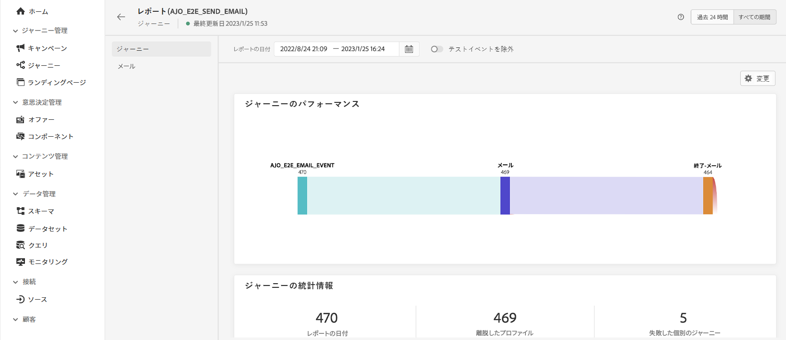

## ジャーニーのプロパティを定義する {#change-properties}

>[!CONTEXTUALHELP]
>id="ajo_journey_properties"
>title="ジャーニーのプロパティ"
>abstract="この節では、ジャーニーのプロパティについて説明します。デフォルトでは、読み取り専用のパラメーターは非表示です。使用可能な設定は、ジャーニーのステータス、権限および製品設定によって異なります。"

ジャーニーの名前の横にある鉛筆アイコンをクリックして、そのプロパティにアクセスします。

ユーザーは、ジャーニー名の変更、説明の追加、再エントリの許可、開始日と終了日の選択ができ、管理者は、**[!UICONTROL タイムアウトとエラー]**&#x200B;の時間の定義ができます。また、Adobe Experience Platform 統合タグをジャーニーに割り当てることもできます。これにより、キャンペーンを簡単に分類し、キャンペーンリストからの検索を改善できます。[タグの操作方法については、こちらを参照してください](../start/search-filter-categorize.md#tags)

ライブジャーニーの場合、この画面には、ジャーニーを公開した日付とユーザーの名前が表示されます。

「**技術的な詳細をコピー**」を使用すると、ジャーニーに関する技術情報をコピーでき、サポートチームはこの情報をトラブルシューティングに使用できます。JourneyVersion UID、OrgID、orgName、sandboxName、lastDeployedBy、lastDeployedAt などの情報がコピーされます。

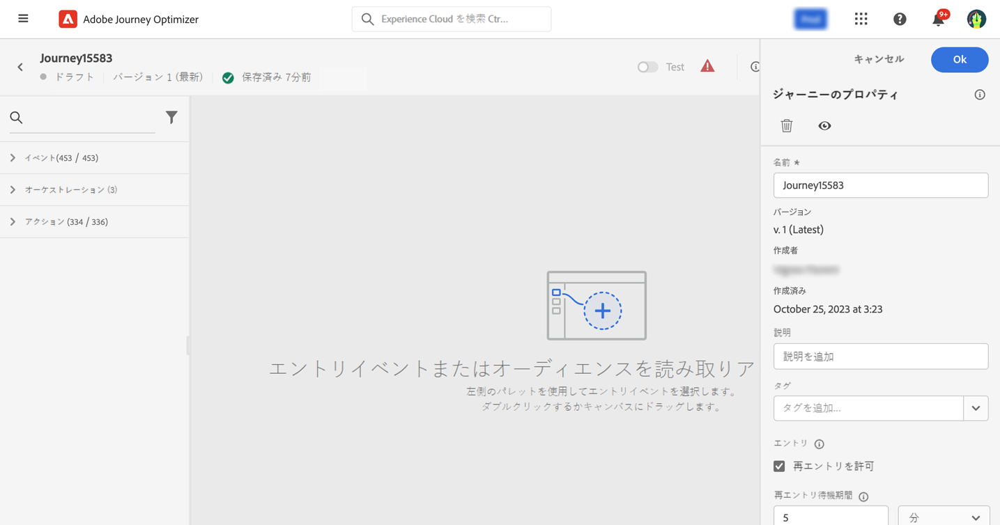

### エントリと再エントリ {#entrance}

デフォルトでは、新規ジャーニーで再エントリが許可されています。「1 回限り」のジャーニー（例：入店時に 1 度だけギフトをオファーするなど）を作成するには、この「**再エントリを許可**」オプションをオフにします。

 「**再エントリを許可**」オプションがアクティベートされると、「**再エントリ待機期間**」フィールドが表示されます。このフィールドでは、（イベントまたはオーディエンスの選定で始まる）単一ジャーニーで、プロファイルがジャーニーに再度エントリできるようになるまでの待機時間を定義できます。これにより、ジャーニーが同じイベントに対して誤って複数回トリガーされるのを防ぎます。デフォルトでは、このフィールドは 5 分に設定されています。最大期間は 29 日です。

プロファイルのエントリと再エントリの管理について詳しくは、[この節](entry-management.md)を参照してください。

### アクセスの管理 {#manage-access}

カスタムデータ使用ラベルまたはコアデータ使用ラベルをジャーニーに割り当てるには、「**[!UICONTROL アクセスを管理]**」ボタンをクリックします。[オブジェクトレベルのアクセス制御（OLA）について詳しくはこちらから](../administration/object-based-access.md)

### ジャーニーとプロファイルのタイムゾーン {#timezone}

タイムゾーンはジャーニーレベルで定義されます。固定タイムゾーンを入力するか、Adobe Experience Platform プロファイルを使用してジャーニーのタイムゾーンを定義できます。Adobe Experience Platform プロファイルでタイムゾーンが定義されている場合は、ジャーニーでそのタイムゾーンを取得できます。

タイムゾーン管理の詳細については、[このページ](../building-journeys/timezone-management.md)を参照してください。

### 開始日と終了日 {#dates}

**開始日**&#x200B;を定義できます。 指定していない場合は、公開時に自動的に定義されます。

**終了日**&#x200B;も追加できます。これにより、日付に達したプロファイルは自動的に終了します。 終了日を指定しない場合、プロファイルは[グローバルジャーニータイムアウト](#global_timeout)（通常は 30 日、Healthcare Shield アドオン機能では 7 日に短縮）まで保持されます。唯一の例外は、「**繰り返し時に再エントリを強制する**」が有効になっている繰り返しの「オーディエンスを読み取り」ジャーニーで、これは次回の実行の開始日に終了します。

### ジャーニーアクティビティのタイムアウトとエラー {#timeout_and_error}

アクションまたは条件のアクティビティを編集するときに、エラーやタイムアウトが発生した場合の代替パスを定義できます。サードパーティシステムに問い合わせを行うアクティビティの処理時間が、ジャーニーのプロパティ（「**[!UICONTROL タイムアウトとエラー]**」フィールド）で定義されたタイムアウト時間を超えると、第 2 パスが選択されて、可能な代替アクションが実行されます。

設定できる値は 1～30 秒です。

ジャーニーに時間的制約がある場合（例：対象者がいる場所にリアルタイムで反応するなど）は、非常に短い&#x200B;**[!UICONTROL タイムアウトとエラー]**&#x200B;値を定義することをお勧めします。これは、数秒間以上アクションを遅らせることができないからです。ジャーニーの時間的制約が緩い場合は、長めの値を使用して、呼び出されるシステムに、有効な応答を送信する時間を与えることができます。

ジャーニーではグローバルタイムアウトも使用します。[次の節](#global_timeout)を参照してください。

### グローバルジャーニーのタイムアウト {#global_timeout}

ジャーニーアクティビティで使用される[タイムアウト](#timeout_and_error)のほかに、グローバルジャーニータイムアウトも存在します。こちらはインターフェイスに表示されず、変更もできません。

ジャーニー内にいる個人の進捗は、エントリしてから **30 日**&#x200B;経過すると、このグローバルタイムアウトにより停止されます。Healthcare Shield アドオン機能を使用すると、このタイムアウトが **7 日**&#x200B;に短縮されます。つまり、個人のジャーニーは 30 日（または 7 日）を超えることはできません。タイムアウト期間が経過すると、個人のデータは削除されます。タイムアウト期間が終了してもまだジャーニーに流入してくる個人がいる場合、それらは流入を停止され、レポートでは考慮されません。したがって、離脱する人物よりもジャーニーにエントリする人物の方が多くなる可能性があります。

>[!NOTE]
>
>ジャーニーは、プライバシーのオプトアウト、アクセス、削除などのリクエストに対して直接反応しません。ただし、グローバルタイムアウトにより、どのジャーニーでも、エントリした人が 30 日を超えてジャーニーを継続することはありません。

ジャーニーの再エントリを許可しない設定にしていても、グローバルジャーニータイムアウトの期間が 30 日なので、再エントリのブロックが 30 日を超えて機能するかどうかは確認できません。実際、ジャーニーにエントリしたユーザーの情報はエントリから 30 日後にすべて削除されるので、30 日前より古い日時にエントリしたユーザーが誰かを特定することはできません。

個人が待機アクティビティにエントリできるのは、30 日のジャーニータイムアウトより前に待機期間を完了するのに十分な時間がジャーニーに残っている場合のみです。[このページ](../building-journeys/wait-activity.md)を参照してください。

## ジャーニーの複製 {#duplicate-a-journey}

既存のジャーニーは、「**参照**」タブから複製できます。すべてのオブジェクトと設定は、ジャーニーコピーに複製されます。

手順は次のとおりです。

1. コピーするジャーニーに移動し、**その他のアクション**&#x200B;アイコン（ジャーニー名の横の 3 つのドット）をクリックします。
1. 「**複製**」を選択します。

   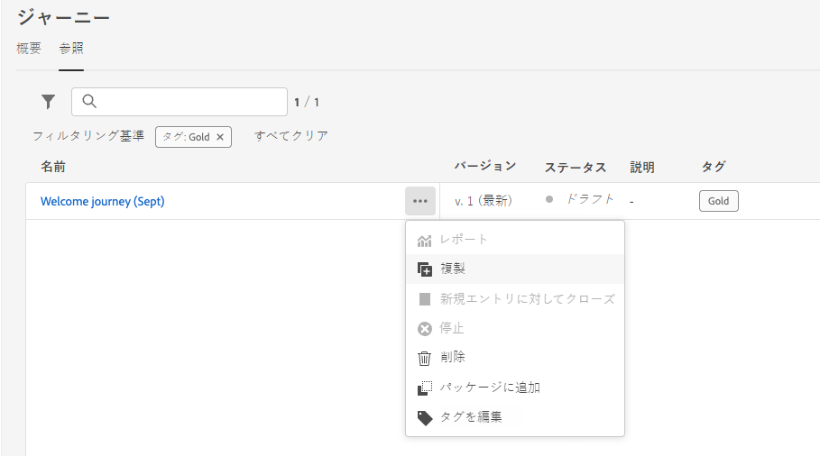

1. ジャーニーの名前を入力して確定します。ジャーニーのプロパティ画面で名前を変更することもできます。デフォルトでは、名前は `[JOURNEY-NAME]_copy` のように設定されます。

   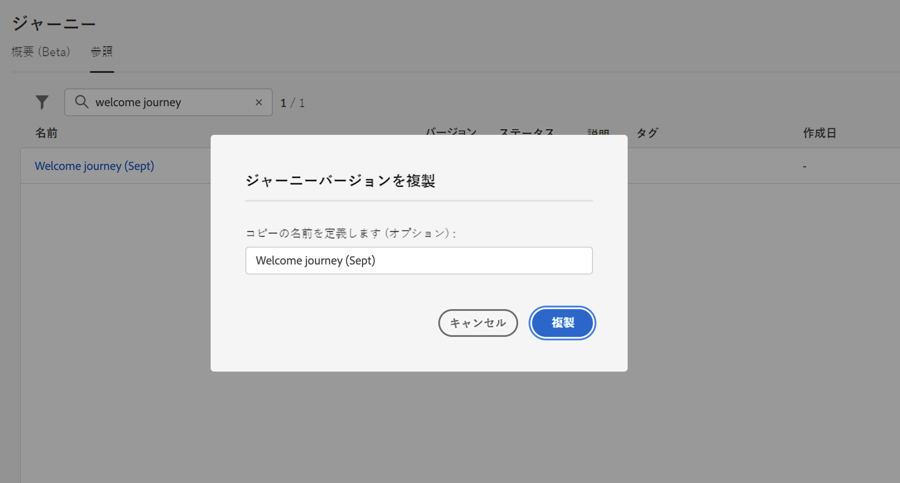

1. 新しいジャーニーが作成され、ジャーニーリストで使用できます。
