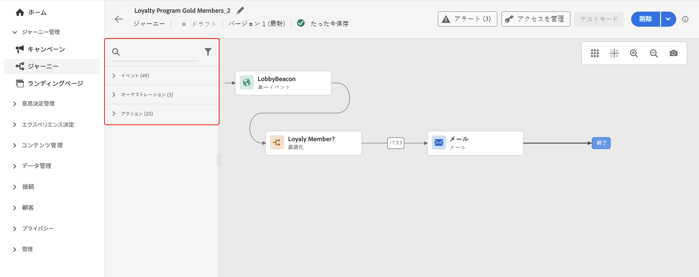
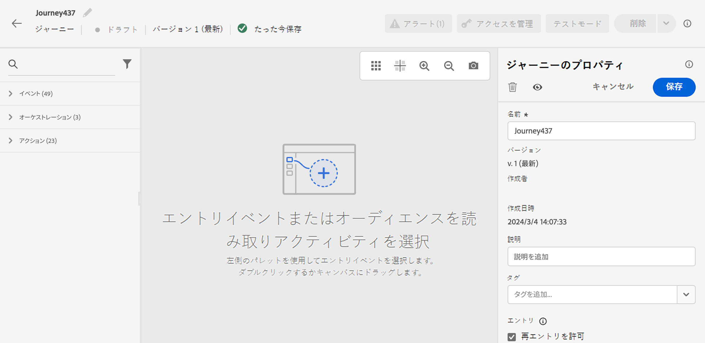
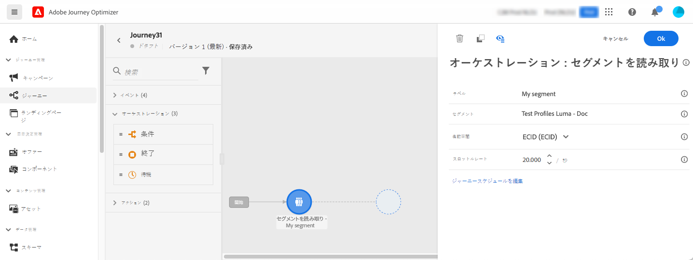
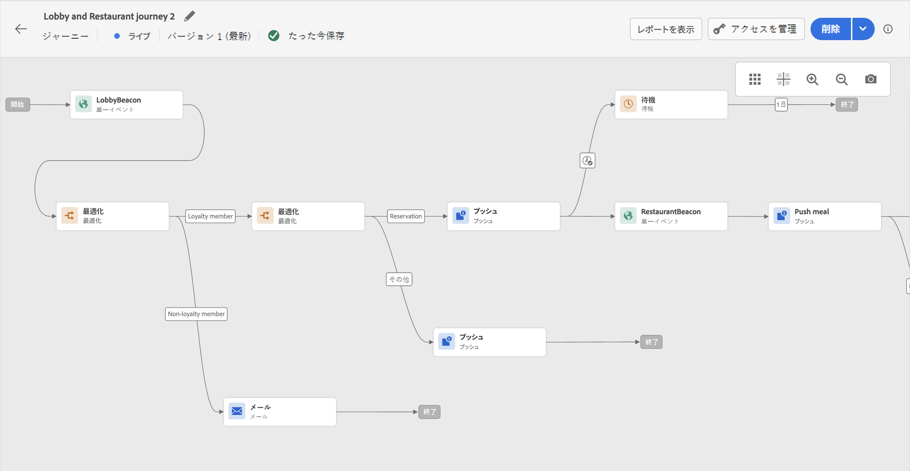
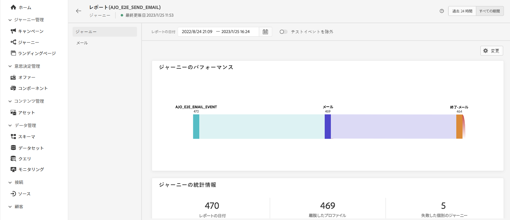

# 最初のジャーニーを作成 {#jo-quick-start}

>[!CONTEXTUALHELP]
>id="ajo_homepage_card2"
>title="ジャーニーを作成"
>abstract="**[!DNL Adobe Journey Optimizer]** を使用すると、イベントやデータソースに保存されたコンテキストデータを活用して、リアルタイムオーケストレーションの使用例を作成できます。"

>[!CONTEXTUALHELP]
>id="ajo_journey_create"
>title="ジャーニー"
>abstract="カスタマージャーニーを設計して、状況に即したパーソナライズされたエクスペリエンスを提供します。Journey Optimizer を利用すると、イベントやデータソースに格納されているコンテキストデータを使用して、リアルタイムオーケストレーションのユースケースを構築できます。「**概要**」タブには、ジャーニーに関連する主要指標を含むダッシュボードが表示されます。「**参照**」タブには、既存のジャーニーのリストが表示されます。"

[!DNL Adobe Journey Optimizer] には、マーケターがマーケティングアウトリーチを 1 対 1 の顧客エンゲージメントと調和させるためのオムニチャネルオーケストレーションキャンバスが含まれています。 ユーザーインターフェイスを使用すると、パレットからキャンバスにアクティビティを簡単にドラッグ＆ドロップして、ジャーニーを作成できます。ジャーニーのユーザーインターフェイスについて詳しくは、[このページ](journey-ui.md)を参照してください。

ジャーニーを作成する主な手順について詳しくは、このページを参照してください。次のように効率化されています。

このガイドでは、以下を行います。

* ジャーニーエントリポイント（オーディエンスセグメントまたはリアルタイムイベント）を定義します
* チャネル（メール、プッシュまたは SMS）をまたいだメッセージアクションの追加
* アクティベーション前にテストプロファイルでジャーニーをテスト
* ジャーニーを公開し、そのパフォーマンスを監視する

複数の手順から成るカスタマージャーニーを作成し、チャネルをまたいでインタラクション、オファーおよびメッセージのシーケンスをリアルタイムで開始します。このアプローチにより、お客様の行動と関連するビジネスシグナルに基づいて、最適なタイミングで顧客と関与できるようになります。ターゲットオーディエンスは、行動、コンテキストデータ、ビジネスイベントに基づいて定義されます。前提条件は、ユースケースと、作成する[ジャーニーのタイプ](entry-management.md#types-of-journeys)によって異なります。

プロファイルがジャーニーを通じてフローする仕組みとジャーニーの処理率について詳しくは、[この節](entry-management.md#journey-processing-rate)を参照してください。

<!--
>[!TIP]
>
>Not sure whether to use a journey or a campaign? [Learn how to choose the right approach](../start/journeys-vs-campaigns.md).
-->

## 事前準備 {#prerequisites}

作成する前に設定する必要があるのは、ジャーニーがどのようにトリガーされるかによって異なります。 ほとんどのジャーニーは、次の 2 つのエントリポイントのいずれかから開始されます。

* **オーディエンスベースのエントリ** - ジャーニーは、定義された一連のプロファイルに対して、スケジュールされた時間に実行されます。 ジャーニーを構築する前に、Adobe Experience Platformで [&#x200B; オーディエンスを作成 &#x200B;](../audience/about-audiences.md) します。 Journey Optimizerを初めて使用する場合は、このドキュメントから開始することをお勧めします。

* **イベントベースのエントリ** – 個人が購入やサインアップなどのアクションを実行すると、ジャーニーがリアルタイムでトリガーされます。 [&#x200B; イベントの設定 &#x200B;](../event/about-events.md)：イベントと、トリガーに保持するデータを定義します。

次の要素はオプションですが、ユースケースによっては必須になる場合があります。

* **データソース** – 外部システムからのデータでジャーニー条件やパーソナライゼーションを強化するには、[&#x200B; データソース &#x200B;](../datasource/about-data-sources.md) を設定します。

* **カスタムアクション** – 組み込みチャネルではなくサードパーティシステムを使用してメッセージを配信する場合は、[&#x200B; カスタムアクション &#x200B;](../action/action.md) を設定します。

>[!NOTE]
>
>技術的な設定（イベント、データソース、アクション）を担当するデータエンジニアの場合は、[&#x200B; この節 &#x200B;](../configuration/about-data-sources-events-actions.md) を参照してください。

>[!NOTE]
>
>ジャーニーガードレールと制限について詳しくは、[&#x200B; このページ &#x200B;](../start/guardrails.md) を参照してください。

## ジャーニーの作成 {#jo-build}

複数の手順から成るジャーニーを作成するには、次の手順に従います。

1. 「ジャーニー管理」メニューセクションで、「**[!UICONTROL ジャーニー]**」をクリックします。

1. 「**[!UICONTROL ジャーニーを作成]**」ボタンをクリックして、新しいジャーニーを作成します。

1. ジャーニーの設定パネルを編集して、ジャーニーの名前を定義し、そのプロパティを設定します。ジャーニーのプロパティを設定する方法について詳しくは、[このページ](journey-properties.md)を参照してください。

   >[!TIP]
   >
   >**どのジャーニータイプを選択すればよいですか？** Journey Optimizerを初めて使用する場合は、**[!UICONTROL オーディエンスを読み取り]** アクティビティを使用したオーディエンスベースのジャーニーから開始します。これは、事前のイベント設定を必要とせず、キャンバスに慣れる最も簡単な方法です。 リアルタイムのイベントトリガーエクスペリエンス（購入やフォーム送信に対する反応など）の場合は、最初にイベントを設定し、イベントベースのエントリを使用します。 詳しくは、[ジャーニータイプ](entry-management.md#types-of-journeys)を参照してください。

   

その後、ジャーニーのデザインを開始できます。

## ジャーニーのデザイン {#jo-design}

ジャーニーデザイナーを使用すると、直感的なドラッグ&amp;ドロップインターフェイスを使用して、複数の手順から成るジャーニーを作成できます。 左側のパレットのアクティビティは、**イベント**、**オーケストレーション**、**アクション** の 3 つのカテゴリに整理されています。 キャンバスとそのコントロールの概要については、[&#x200B; このページ &#x200B;](using-the-journey-designer.md) を参照してください。

ジャーニーをデザインするには、次の手順に従います。

1. **エントリポイントの追加** - イベントまたは **[!UICONTROL オーディエンスを読み取り]** アクティビティを、パレットからキャンバスにドラッグします。 これにより、プロファイルがジャーニーにどのようにエントリするかを定義します。リアルタイム（イベントベース）で個別に入力することも、定義したオーディエンス（オーディエンスベース）から一度にすべて入力することもできます。

   

1. **メッセージアクションの追加** - パレットの「**[!UICONTROL アクション]**」セクションから、チャネルアクションをキャンバスにドラッグして、ジャーニーを進むプロファイルにメッセージを送信します。 アクションは、メール、プッシュ通知、SMS などに使用できます。

1. **オーケストレーションアクティビティの追加** - **[!UICONTROL 条件]** アクティビティを使用すると、プロファイル属性や動作に基づいて、ジャーニーを複数のパスに分岐できます。 **[!UICONTROL 待機]** アクティビティを使用すると、ステップ間に時間遅延を導入できます。

>[!TIP]
>
>複数のフェーズまたは多くのタッチポイントを持つジャーニーの場合は、エンドツーエンドのフローを、**[!UICONTROL ジャンプ]** アクティビティに接続されるより小さなサブジャーニーに分割することを検討します。 これにより、複雑さが軽減され、各サブジャーニーを個別にテストしやすくなります。 詳しくは、[&#x200B; 設計戦略：一口サイズのサブジャーニー &#x200B;](jump.md#jump-strategy) を参照してください。

## ジャーニーのテスト {#jo-test}

ジャーニーを作成したら、公開する前にテストします。Journey Optimizer では、ジャーニーに沿って進む際にテストプロファイルを表示し、アクティブ化の前に潜在的なエラーを検出する方法として、**テストモード**&#x200B;を提供しています。クイックテストを実行すると、ジャーニーが正しく動作することを確認できるので、自信を持って公開できます。ジャーニーをテストする方法について詳しくは、[この節](testing-the-journey.md)を参照してください。

また、**ドライラン**&#x200B;でジャーニーを実行することもできます。ジャーニーのドライランは、Adobe Journey Optimizer の特別なジャーニー公開モードで、ジャーニー実務担当者は実際の顧客に連絡したり、プロファイル情報を更新したりすることなく、実際の実稼動データを使用してジャーニーをテストできます。この機能により、ジャーニー実務担当者は、ジャーニーをライブで公開する前に、ジャーニーのデザインとオーディエンスのターゲティングに自信を持つことができます。ドライランモードでのジャーニーの公開方法について詳しくは、[この節](journey-dry-run.md)を参照してください。

## ジャーニーの公開 {#jo-pub}

ジャーニーをアクティブ化し、新しいプロファイルが入力できるようにするには、ジャーニーを公開する必要があります。ジャーニーを公開する前に、そのジャーニーが有効で、エラーがないことを確認します。エラーのあるジャーニーは公開できません。ジャーニーの公開について詳しくは、この[節](publish-journey.md)を参照してください。

公開したら、専用のレポートツールを使用してジャーニーを監視し、ジャーニーの有効性を測定できます。

ジャーニーレポートについて詳しくは、[この節](../reports/live-report.md)を参照してください。

## よくあるユースケース {#use-cases}

どこから始めればよいかわかりませんか？ ジャーニーが最も大きな価値を提供する典型的な 3 つのシナリオを次に示します。

<table style="table-layout:fixed">
  <tr style="border: 0;">
    <td>
      
      
<strong> ようこそシリーズ </strong>  新規登録後に、一連のメッセージを使用して新しいユーザーを自動的にオンボーディングし、製品やサービスを通じてユーザーをガイドします。

    </td>
    <td>
      
      
<strong> 買い物かごの放棄 </strong>  パーソナライズされたコンテンツを含むタイムリーなリマインダーを送信することで、購入を完了せずに去った顧客を再び引き付けます。

    </td>
    <td>
      
      
<strong> 再エンゲージメント </strong>  非アクティブなユーザーを取り戻し、最後に判明した行動に基づいて、ターゲット設定されたオファーや更新を提供します。

    </td>
  </tr>
  <tr style="border: 0;">
    <td align="center"></td>
    <td align="center"></td>
    <td align="center"></td>
  </tr>
</table>

## その他のリソース

* **[ジャーニーデザイナーの概要](using-the-journey-designer.md)** - ジャーニーキャンバスインターフェイスを習得して、カスタマージャーニーをデザインおよび調整します。
* **[ジャーニーアクティビティ](about-journey-activities.md)** - イベント、アクション、オーケストレーションコンポーネントを含む、使用可能なすべてのアクティビティを検出します。
* **[ジャーニーのテスト](testing-the-journey.md)** - 実稼動環境に公開する前に、テストモードを使用してジャーニーをテストする方法について説明します。
* **[ジャーニーの公開](publish-journey.md)** - ジャーニーの公開プロセスとライブジャーニーの管理方法について説明します。
* **[ジャーニーレポート](report-journey.md)** - 詳細な指標とインサイトを使用して、ジャーニーのパフォーマンスを追跡および分析します。
* **[ジャーニーのトラブルシューティング](troubleshooting.md)** - 一般的なジャーニーの問題に対する解決策とデバッグのベストプラクティスについて説明します。
* **[ジャーニーのチュートリアル](https://experienceleague.adobe.com/ja/docs/journey-optimizer-learn/tutorials/journeys/introduction-to-building-a-journey){target="_blank"}** - ジャーニーの作成とベストプラクティスに関するステップバイステップのビデオチュートリアルを参照してください。

