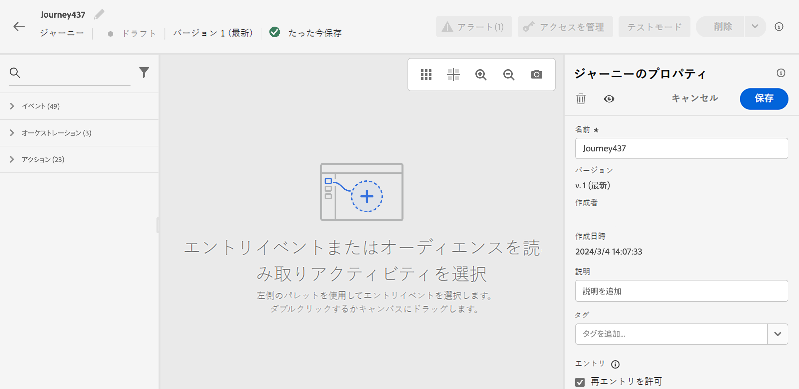
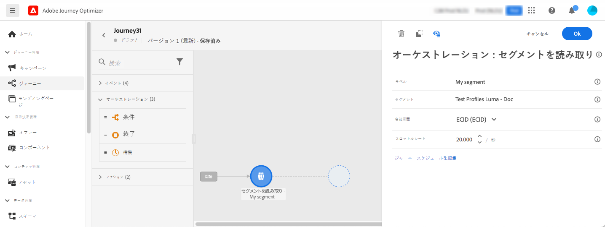
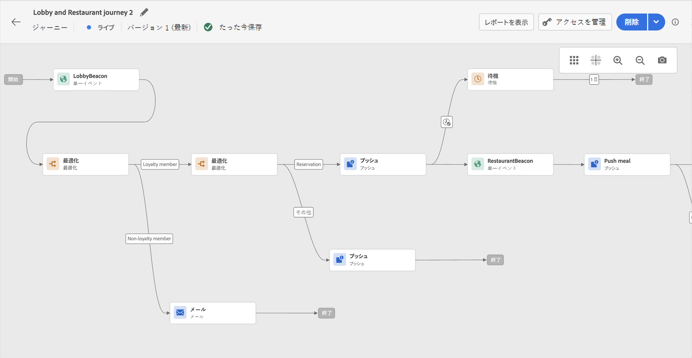
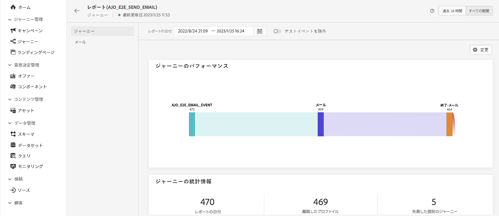

# 最初のジャーニーを作成 {#jo-quick-start}

>[!BEGINSHADEBOX]

**このページでは、** エントリのオーディエンスまたはイベントの定義からアクションの追加および公開に至るまで、Adobe Journey Optimizerで最初のジャーニーを構築するための主な手順について説明します。

>[!ENDSHADEBOX]

>[!CONTEXTUALHELP]
>id="ajo_homepage_card2"
>title="ジャーニーを作成"
>abstract="**[!DNL Adobe Journey Optimizer]** を使用すると、イベントやデータソースに保存されたコンテキストデータを活用して、リアルタイムオーケストレーションのユースケースを作成できます。"

>[!CONTEXTUALHELP]
>id="ajo_journey_create"
>title="ジャーニー"
>abstract="カスタマージャーニーでは、パーソナライズされたコンテキストエクスペリエンスを提供します。 Journey Optimizer を利用すると、イベントやデータソースに格納されているコンテキストデータを使用して、リアルタイムオーケストレーションのユースケースを構築できます。 「**概要**」タブには、ジャーニーに関連する主要指標を含むダッシュボードが表示されます。 「**参照**」タブには、既存のジャーニーのリストが表示されます。"

[!DNL Adobe Journey Optimizer]には、マーケターが一対一の顧客エンゲージメントとマーケティング アウトリーチを連携できるようにする、オムニチャネルオーケストレーションキャンバスが含まれています。 ユーザーインターフェイスを使用すると、パレットからキャンバスにアクティビティを簡単にドラッグ＆ドロップして、ジャーニーを作成できます。 ジャーニーのユーザーインターフェイスについて詳しくは、[このページ](journey-ui.md)を参照してください。

ジャーニーを作成する主な手順について詳しくは、このページを参照してください。 次のように効率化されています。

この記事では、デジタル CXの概要、重要性、ベストプラクティスを解説します。

* ジャーニーのエントリポイント（オーディエンスセグメントまたはリアルタイムイベント）を定義
* 電子メール、プッシュ通知、SMS、アプリ内メッセージ、web、コードベースのエクスペリエンス、コンテンツカードなど、チャネル全体でメッセージアクションを追加できます。 [ サポートされているチャネルを見る](journey-action.md)
* アクティベーション前にプロファイルをテストして、ジャーニーをテスト
* ジャーニーを公開し、そのパフォーマンスを監視する

複数の手順から成るカスタマージャーニーを作成し、チャネルをまたいでインタラクション、オファーおよびメッセージのシーケンスをリアルタイムで開始します。 このアプローチにより、お客様の行動と関連するビジネスシグナルに基づいて、最適なタイミングで顧客と関与できるようになります。

<!--
>[!TIP]
>
>Not sure whether to use a journey or a campaign? [Learn how to choose the right approach](../start/journeys-vs-campaigns.md).
-->

## 事前準備 {#prerequisites}

構築する前に設定すべきことは、ジャーニーがどのようにトリガーされるかによって異なります。 多くのジャーニーは、次のふたつのエントリーポイントのどちらかから始まります。

* **オーディエンスベースのエントリ** — ジャーニーは、スケジュールされた時間に定義されたプロファイルのセットに対して実行されます。 ジャーニーを構築する前に、Adobe Experience Platformで[ オーディエンス ](../audience/about-audiences.md)を作成します。 Journey Optimizerを初めて使用する場合は、これを出発点として使用することをお勧めします。

* **イベントベースのエントリ** – 個人が購入やサインアップなどのアクションを実行すると、ジャーニーがリアルタイムでトリガーされます。 [トリガーとそのデータを定義するようにイベント ](../event/about-events.md)を設定します。

**使用するエントリポイントが不明ですか？** 次の表は、最も一般的なユースケースを適切な開始アクティビティにマッピングしています。 詳しくは、[ジャーニー型選択行列](journey-types-selection.md)を参照してください。

| エントリポイント | 次の場合に使用… | プロファイル入力 |
|---|---|---|
| **[オーディエンスを読み取り](read-audience.md)** | スケジュールされたメッセージまたは定期的なメッセージを、定義されたプロファイルのセット（ニュースレター、プロモーション、オンボーディングシリーズ）に送信する場合。 | バッチオーディエンスからのすべてのプロファイルを一度またはスケジュールで取得できます。 [ オーディエンスの書き出しとタイミングについて説明します](https://experienceleague.adobe.com/en/docs/experience-platform/run-and-operate/overview){target="_blank"} |
| **[オーディエンスの選定](audience-qualification-events.md)** | プロファイルがオーディエンスに出入りしたときに、リアルタイムで対応する必要があります（ロイヤルティ層のアップグレード、解約リスクフラグ）。 | ストリーミングオーディエンスの適格性を判断した時点で、プロファイルを1つずつ作成します。 |
| **単一イベント** | プロファイルアクションは、即座のレスポンス（カート放棄、フォーム送信、アプリログイン）をトリガーします。 | リアルタイムで単一のプロファイルを構築。 |
| **[ビジネスイベント](../event/about-creating-business.md)** | プロファイル以外のイベントは、一度に複数のユーザーに影響を与えます（フライトキャンセル、株式補充、速報アラート）。 | イベントに関連付けられたすべてのプロファイルは、自動オーディエンス読み取りステップを介して表示されます。 |

次の要素はオプションですが、ユースケースに応じて必要になる場合があります。

* **データソース** – 外部システムからのデータでジャーニーの条件やパーソナライゼーションを強化するには、[ データソース ](../datasource/about-data-sources.md)を設定します。

* **カスタムアクション** – 組み込みチャネルではなくサードパーティシステムを介してメッセージを配信する場合は、[ カスタムアクション ](../action/action.md)を設定します。

>[!NOTE]
>
>* 技術的な設定（イベント、データソース、アクション）を担当するデータエンジニアの場合は、[この節](../configuration/about-data-sources-events-actions.md)を参照してください。
>
>* ジャーニーのガードレールと制限について詳しくは、[このページ ](../start/guardrails.md)を参照してください。

## ジャーニーの作成 {#jo-build}

複数の手順から成るジャーニーを作成するには、次の手順に従います。

1. 「ジャーニー管理」メニューセクションで、「**[!UICONTROL ジャーニー]**」をクリックします。

1. 「**[!UICONTROL ジャーニーを作成]**」ボタンをクリックして、新しいジャーニーを作成します。

1. ジャーニーの設定パネルを編集して、ジャーニーの名前を定義し、そのプロパティを設定します。 ジャーニーのプロパティを設定する方法について詳しくは、[このページ](journey-properties.md)を参照してください。

   >[!TIP]
   >
   >**どのジャーニータイプを選択すればよいですか？** Journey Optimizerを初めて使用する場合は、**[!UICONTROL オーディエンスを読み取り]** アクティビティを使用してオーディエンスベースのジャーニーを開始します。事前のイベント設定は必要なく、カンバスに慣れるには最も簡単な方法です。 リアルタイムのイベントトリガー型エクスペリエンス（購入やフォーム送信への反応など）の場合は、まずイベントを設定し、イベントベースのエントリを使用します。 さらなる詳細は、 [すべてのジャーニータイプとそのエントリルールを確認](entry-management.md#types-of-journeys)。

   

その後、ジャーニーのデザインを開始できます。

## ジャーニーのデザイン {#jo-design}

ジャーニーデザイナーでは、直感的なドラッグ&amp;ドロップ操作のインターフェイスを使用して、マルチステップのジャーニーを構築できます。 左側のパレットのアクティビティは、**イベント**、**オーケストレーション**、**アクション**&#x200B;の3つのカテゴリに分類されます。 キャンバスとその制御の概要については、[このページ ](using-the-journey-designer.md)を参照してください。

ジャーニーをデザインするには、次の手順に従います。

1. **エントリポイントを追加** — イベントまたは&#x200B;**[!UICONTROL オーディエンスの読み取り]** アクティビティをパレットからキャンバスにドラッグします。 これにより、プロファイルがジャーニーに入る方法を定義します。個々にリアルタイム（イベントベース）で、または定義されたオーディエンスから一度にすべて（オーディエンスベース）で指定します。

   

1. **メッセージアクションを追加** — パレットの&#x200B;**[!UICONTROL アクション]** セクションから、チャネルアクションをキャンバスにドラッグして、ジャーニーを流れるプロファイルにメッセージを送信します。 アクションは、電子メール、プッシュ通知、SMSなどで利用できます。

1. **オーケストレーションアクティビティを追加** — **[!UICONTROL 条件]** アクティビティを使用して、プロファイル属性または行動に基づいてジャーニーを複数のパスに分岐します。 **[!UICONTROL 待機]** アクティビティを使用して、ステップ間に時間の遅延を導入します。

>[!TIP]
>
>複数のフェーズまたは多数のタッチポイントを含むジャーニーの場合は、**[!UICONTROL ジャンプ]** アクティビティに接続された小さなサブジャーニーにエンドツーエンドのフローを分割することを検討してください。 これにより、複雑さが軽減され、各サブジャーニーの独自のテストが容易になります。 詳しくは、[ デザイン戦略：一口サイズのサブジャーニー](jump.md#jump-strategy)を参照してください。

## ジャーニーのテスト {#jo-test}

ジャーニーを作成したら、公開する前にテストします。 Journey Optimizer では、ジャーニーに沿って進む際にテストプロファイルを表示し、アクティブ化の前に潜在的なエラーを検出する方法として、**テストモード**&#x200B;を提供しています。 クイックテストを実行すると、ジャーニーが正しく動作することを確認できるので、自信を持って公開できます。 ジャーニーをテストする方法について詳しくは、[この節](testing-the-journey.md)を参照してください。

また、**ドライラン**&#x200B;でジャーニーを実行することもできます。 ジャーニーのドライランは、Adobe Journey Optimizer の特別なジャーニー公開モードで、ジャーニー実務担当者は実際の顧客に連絡したり、プロファイル情報を更新したりすることなく、実際の実稼動データを使用してジャーニーをテストできます。 この機能により、ジャーニー実務担当者は、ジャーニーをライブで公開する前に、ジャーニーのデザインとオーディエンスのターゲティングに自信を持つことができます。 ドライランモードでのジャーニーの公開方法について詳しくは、[この節](journey-dry-run.md)を参照してください。

## ジャーニーの公開 {#jo-pub}

ジャーニーをアクティブ化し、新しいプロファイルが入力できるようにするには、ジャーニーを公開する必要があります。 ジャーニーを公開する前に、そのジャーニーが有効で、エラーがないことを確認します。 エラーのあるジャーニーは公開できません。 ジャーニーの公開について詳しくは、この[ セクション ](publish-journey.md)を参照してください。

公開したら、専用のレポートツールを使用してジャーニーを監視し、ジャーニーの有効性を測定できます。

ジャーニーレポートについて詳しくは、[この節](../reports/live-report.md)を参照してください。

## よくあるユースケース {#use-cases}

どこから始めてよいかわからないものは、 ここでは、ジャーニーが最も価値を提供する3つの典型的なシナリオを紹介します。

<table style="table-layout:fixed">
  <tr style="border: 0;">
    <td>
      
      
<strong> ウェルカムシリーズ </strong>  サインアップ後、一連のメッセージを新規ユーザーに自動的にオンボーディングし、製品またはサービスを通じてユーザーを導きます。

    </td>
    <td>
      
      
<strong> カートの放棄</strong>  パーソナライズされたコンテンツを含むタイムリーなリマインダーを送信して、購入を完了せずに離脱した顧客をリエンゲージします。

    </td>
    <td>
      
      
<strong> リエンゲージメント </strong> 最後に確認した行動に基づいて、ターゲットを絞ったオファーまたはアップデートを使用して、非アクティブなユーザーを取り戻します。

    </td>
  </tr>
  <tr style="border: 0;">
    <td align="center"></td>
    <td align="center"></td>
    <td align="center"></td>
  </tr>
</table>

## その他のリソース

* **[ジャーニーの種類とプロファイルのエントリ](entry-management.md)** – すべてのジャーニーの種類（単一イベント、ビジネスイベント、読み取りオーディエンス、オーディエンスの選定）と、プロファイルがジャーニーを入力、再入力、フローする方法を理解します。
* **[ジャーニーデザイナーの概要](using-the-journey-designer.md)** - ジャーニーキャンバスインターフェイスを習得して、カスタマージャーニーをデザインおよび調整します。
* **[ジャーニーアクティビティ](about-journey-activities.md)** - イベント、アクション、オーケストレーションコンポーネントを含む、使用可能なすべてのアクティビティを検出します。
* **[ジャーニーのテスト](testing-the-journey.md)** - 実稼動環境に公開する前に、テストモードを使用してジャーニーをテストする方法について説明します。
* **[ジャーニーの公開](publish-journey.md)** - ジャーニーの公開プロセスとライブジャーニーの管理方法について説明します。
* **[ジャーニーレポート](report-journey.md)** - 詳細な指標とインサイトを使用して、ジャーニーのパフォーマンスを追跡および分析します。
* **[ジャーニーのトラブルシューティング](troubleshooting.md)** - 一般的なジャーニーの問題に対する解決策とデバッグのベストプラクティスについて説明します。
* **[ジャーニーのチュートリアル](https://experienceleague.adobe.com/ja/docs/journey-optimizer-learn/tutorials/journeys/introduction-to-building-a-journey){target="_blank"}** - ジャーニーの作成とベストプラクティスに関するステップバイステップのビデオチュートリアルを参照してください。

+++ AI ナレッジリファレンス

このセクションには、このトピックに関連する解釈、検索、質問への回答をサポートすることを目的とした構造化された知識が含まれています。

理解を深めるには、この情報をこのページのドキュメントと組み合わせる必要があります。 どちらのソースも単独で使用することを意図していません。このページでは、機能について説明しますが、この節では、用語、意図、適用可能性、および制約の曖昧さを解消するのに役立つ追加のコンテキストを提供します。

* **TL;DR:**&#x200B;このページでは、Adobe Journey Optimizerで最初のジャーニーを作成するための4つの重要なステップ（エントリポイントの定義、キャンバスの設計、テストモードまたはドライランでのテスト、公開）と、適切なエントリタイプを選択するためのガイダンスについて説明します。

**インテント：**
* 新しいジャーニーを作成し、ジャーニー管理メニューでそのプロパティを設定します
* 特定のユースケースの正しいエントリポイント（オーディエンス、オーディエンスの選定、単一イベント、ビジネスイベントの読み取り）を選択します
* イベント、オーケストレーションアクティビティ、チャネルアクションをキャンバスにドラッグ&amp;ドロップすることで、マルチステップのジャーニーを設計できます
* 公開前に、シミュレーション、永続的なAEP テストプロファイルを使用したテストモード、またはドライランを使用してジャーニーをテストします
* ドライランを実行して、顧客に連絡することなく、実際の実稼動データでオーディエンスターゲティングを検証します
* ジャーニーを公開して公開し、レポートツールでそのパフォーマンスを監視します

**用語集：**
* **オーディエンスの読み取り**: バッチオーディエンス内のすべてのプロファイルを一度にまたはスケジュール *（製品固有）*&#x200B;で処理するエントリアクティビティ
* **オーディエンスの選定**: プロファイルがストリーミングオーディエンス *（製品固有）*&#x200B;に出入りしたときに、リアルタイムでトリガーされるエントリアクティビティ
* **単一トリガー**：特定のアクションが発生した際に、ジャーニーに一度に1つのプロファイルを入力するリアルタイム イベント *（製品固有）*
* **ビジネスイベント**：自動読み取りオーディエンス手順&#x200B;*（製品固有）を介して、複数のプロファイルに対して同時にジャーニーをトリガーするプロファイル以外のイベント（フライトのキャンセル、在庫補充など）*
* **テストモード**：公開前にドラフトジャーニーをトラバースするために、永続的なAdobe Experience Platform テストプロファイル（テストプロファイルとして明示的にフラグ付け）を使用する検証モード *（製品固有）*
* **Simulation**：一時的なシミュレートされたユーザーを即座に生成する検証モード。シミュレートされたユーザーはAdobe Experience Platform *（製品固有）*&#x200B;に保持されません
* **ドライラン**：実際の実稼動データを使用して、実際の顧客に連絡したり、プロファイルを更新したりすることなくジャーニーロジックを検証する特別な公開モード *（製品固有）*

**ガードレール：**
* ジャーニーにエラーが含まれている場合は公開できません。すべてのエラーを最初に解決する必要があります
* イベント設定（イベントベースのエントリの場合）は、ジャーニーを構築する前に、データエンジニアが完了する必要があります
* ジャーニーのガードレールと制限事項は別途文書化されており、大規模に設計する前に確認する必要があります
* Adobe Experience Platformでのオーディエンス作成は、オーディエンスベースのジャーニーの前提条件となります

**用語：**
* 正規名：ジャーニー – 頭字語：なし – バリエーション：カスタマージャーニー、オーケストレーションフロー
* 同義語：「テストモード」 = 「ジャーニーテスト」、「ドライラン」 = 「ドライランモード」
* 混同しないでください：「シミュレーション」≠「テストモード」≠「ドライラン」 – シミュレーションは一時的なシミュレーションユーザーを使用します。テストモードは永続的なAEP テストプロファイルを使用します。ドライランは、お客様に連絡したりプロファイルを更新したりすることなく、実稼動データを使用します

**FAQ:**
* **Q: イベント トリガーのジャーニーを作成する前に最初に行う必要があることは何ですか？** — トリガーとそのデータを定義するためにデータエンジニアとイベントを設定します。次に、ジャーニーのエントリポイントとしてイベントを参照します。
* **Q: Journey Optimizerを初めて利用する場合に推奨されるエントリーポイントはどれですか？** — オーディエンスを読み取りアクティビティを使用して、オーディエンスベースのジャーニーを開始します。事前のイベント設定は必要なく、キャンバスに慣れるのに最も簡単な方法です。
* **Q: ジャーニーが公開される前にテストできますか？**  – はい。一時的なシミュレーションユーザーを使用したシミュレーション、永続的なAEP テストプロファイルを使用したテストモード、またはドライランを使用して、通信を送信せずに実際の実稼動データに対して実行します。
* **Q：公開しようとしたときにジャーニーにエラーが発生した場合はどうなりますか？** — エラーのあるジャーニーを公開することはできません。すべての設定エラーは、公開前に解決する必要があります。
* **Q：多数の手順で複雑なジャーニーを分割するにはどうすればよいですか？** - ジャンプ アクティビティを使用して小さなサブジャーニーを接続し、複雑さを軽減して、各サブジャーニーを個別にテストしやすくします。

+++
