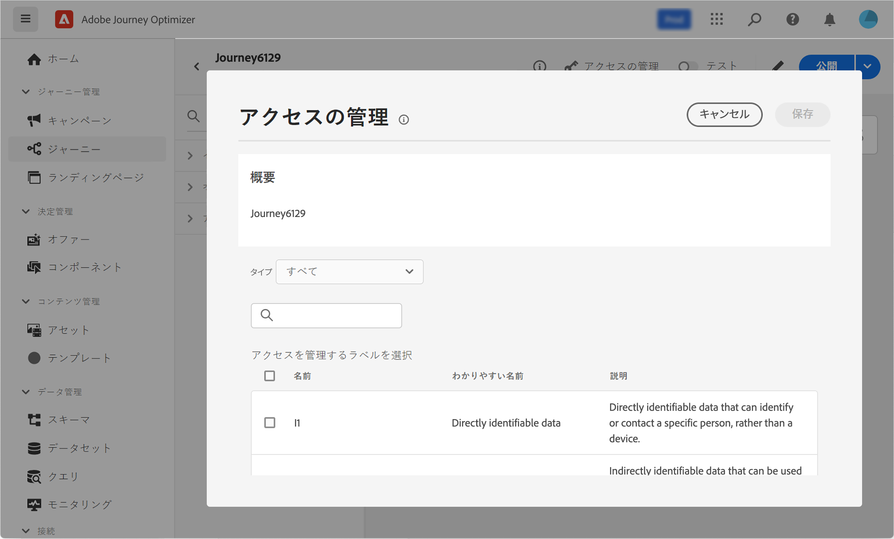

# 初めてのジャーニーの作成{#jo-quick-start}

## 前提条件{#start-prerequisites}

ジャーニーでメッセージを送信するには、次の設定が必要です。

1. **イベントの設定**：イベントを受信したときに個別にジャーニーをトリガーする場合は、イベントを設定する必要があります。想定する情報とその情報の処理方法を定義します。このステップは、**技術ユーザー**&#x200B;が実行します。[詳細情報](../event/about-events.md)。

   

1. **セグメントの作成**：指定した一連のプロファイルにメッセージを一括送信するため、ジャーニーで Adobe Experience Platform のセグメントをリッスンすることもできます。この場合、セグメントを作成する必要があります。[詳細情報](../segment/about-segments.md)。

   

1. **データソースの設定**：ジャーニーで使用する追加情報（条件など）を取得するために、システムへの接続を定義します。組み込みの Adobe Experience Platform データソースも、プロビジョニング時に設定されます。イベントのデータのみをジャーニーで活用する場合、このステップは必要ありません。このステップは、**技術ユーザー**&#x200B;が実行します。[詳細情報](../datasource/about-data-sources.md)

   

1. **アクションの設定**：サードパーティのシステムを使用してメッセージを送信する場合は、カスタムアクションを作成できます。詳しくは、[この節](../action/action.md)を参照してください。このステップは、**技術ユーザー**&#x200B;が実行します。Journey Optimizer 組み込みのメッセージ機能を使用している場合は、ジャーニーにチャネルアクションを追加し、コンテンツをデザインするだけで済みます。

   

## ジャーニーへのアクセス {#journey-access}

「ジャーニー管理」メニューセクションで、「**[!UICONTROL ジャーニー]**」をクリックします。次の 2 つのタブを使用できます。

**参照**:このタブには、既存のジャーニーのリストが表示されます。 ジャーニーを検索し、フィルターを使用して、各要素に対して基本的なアクションを実行できます。 例えば、項目の複製や削除が可能です。詳しくは、[この節](../start/user-interface.md#filter-lists)を参照してください。

**概要**:このタブには、ジャーニーに関連する主要指標を含むダッシュボードが表示されます。

* **処理済みのプロファイル**:過去 24 時間に処理されたプロファイルの合計数
* **ライブジャーニー**:過去 24 時間のトラフィックを含むライブジャーニーの合計数。 ライブジャーニーには次が含まれます **単一のジャーニー** （イベントベース）および **バッチジャーニー** （セグメントを読み取り）。
* **エラー率**:過去 24 時間に入力したプロファイルの合計数に対する、エラーが発生したすべてのプロファイルの割合。
* **破棄率**:過去 24 時間に入力したプロファイルの合計数に対する、分割されたすべてのプロファイルの割合。

>[!NOTE]
>
>このダッシュボードでは、過去 24 時間のトラフィックを含むジャーニーが考慮されます。 アクセス権のあるジャーニーのみが表示されます。

## ジャーニーの作成{#jo-build}

>[!CONTEXTUALHELP]
>id="ajo_journey_create"
>title="ジャーニーの作成"
>abstract="この画面には、既存のジャーニーのリストが表示されます。ジャーニーを開くか「ジャーニーを作成」をクリックして、様々なイベント、オーケストレーション、アクションなどのアクティビティを組み合わせて、複数のステップから成るクロスチャネルのシナリオを作成します。"

このステップは、**ビジネスユーザー**&#x200B;が実行します。ここでジャーニーを作成します。様々なイベント、オーケストレーション、アクションなどのアクティビティを組み合わせて、複数のステップから成るクロスチャネルのシナリオを構築します。

ジャーニーを介してメッセージを送信する主な手順は次のとおりです。

1. 次の **参照** タブ、クリック **[!UICONTROL 作成ジャーニー]** をクリックして、新しいジャーニーを作成します。

1. 右側に表示される設定ペインで、ジャーニーのプロパティを編集します。詳しくは、[この節](journey-gs.md#change-properties)を参照してください。

   

1. 最初に、イベントまたは「**セグメントを読み取り**」アクティビティを、パレットからキャンバスにドラッグ＆ドロップします。ジャーニーのデザインの詳細については、[この節](using-the-journey-designer.md)を参照してください。

   

1. 次に個人が従う手順をドラッグ＆ドロップします。例えば、条件に続いてチャネルアクションも追加できます。アクティビティの詳細については、[この節](using-the-journey-designer.md)を参照してください。

1. テストプロファイルを使用してジャーニーをテストします。詳しくは、[この節](testing-the-journey.md)を参照してください。

1. ジャーニーを公開してアクティブ化します。詳しくは、[この節](publishing-the-journey.md)を参照してください。

   

1. 専用のレポートツールを使用してジャーニーを監視し、ジャーニーの有効性を測定できます。詳しくは、[この節](../reports/live-report.md)を参照してください。

   

## ジャーニーのプロパティを定義する {#change-properties}

>[!CONTEXTUALHELP]
>id="ajo_journey_properties"
>title="ジャーニーのプロパティ"
>abstract="この節では、ジャーニーのプロパティについて説明します。デフォルトでは、読み取り専用のパラメーターは非表示です。使用可能な設定は、ジャーニーのステータス、権限および製品設定によって異なります。"

右上の鉛筆アイコンをクリックして、ジャーニーのプロパティにアクセスします。

ユーザーは、ジャーニー名の変更、説明の追加、再エントリの許可、開始日と終了日の選択ができ、管理者は、**[!UICONTROL タイムアウトとエラー]**&#x200B;の時間の定義ができます。

ライブジャーニーの場合、この画面には、ジャーニーを公開した日付とユーザーの名前が表示されます。

「**技術的な詳細をコピー**」を使用すると、ジャーニーに関する技術情報をコピーでき、サポートチームはこの情報をトラブルシューティングに使用できます。JourneyVersion UID、OrgID、orgName、sandboxName、lastDeployedBy、lastDeployedAt などの情報がコピーされます。

### エントリ{#entrance}

デフォルトでは、新規ジャーニーで再エントリが許可されています。「1 回限り」のジャーニー（例：入店時に 1 度だけギフトをオファーするなど）を作成するには、この「**再エントリを許可**」オプションをオフにします。

 「**再エントリを許可**」オプションがアクティベートされると、「**再エントリ待機期間**」フィールドが表示されます。このフィールドでは、（イベントまたはセグメントの資格で始まる）単一のジャーニーで、プロファイルがジャーニーに再度エントリできるようにするまでの待機時間を定義できます。これにより、ジャーニーが同じイベントに対して誤って複数回トリガーされるのを防ぎます。デフォルトでは、このフィールドは 5 分に設定されています。

プロファイルのエントリ管理について詳しくは、[この節](entry-management.md)を参照してください。

### アクセスの管理 {#access}

カスタムデータ使用ラベルまたはコアデータ使用ラベルをジャーニーに割り当てるには、「**[!UICONTROL アクセスを管理]**」ボタンをクリックします。[オブジェクトレベルのアクセス制御（OLA）について詳しくはこちらから](../administration/object-based-access.md)

### タイムゾーンとプロファイルタイムゾーン {#timezone}

タイムゾーンはジャーニーレベルで定義されます。

固定タイムゾーンを入力するか、Adobe Experience Platform プロファイルを使用してジャーニータイムゾーンを定義できます。

Adobe Experience Platform プロファイルでタイムゾーンが定義されている場合は、ジャーニーでそのタイムゾーンを取得できます。

タイムゾーン管理の詳細については、[このページ](../building-journeys/timezone-management.md)を参照してください。

### 開始日と終了日 {#dates}

**開始日**&#x200B;を定義できます。 指定していない場合は、公開時に自動的に定義されます。

**終了日**&#x200B;も追加できます。これにより、日付に達したプロファイルは自動的に終了します。 終了日を指定しない場合、プロファイルはデフォルトのジャーニータイムアウト（通常は 30 日、Healthcare Shield アドオン機能では 7 日）まで保持されます。唯一の例外は、「**繰り返し時に再エントリを強制**」をアクティベートした繰り返しのセグメントを読み取りジャーニーで、次の発生の開始日に終了します。

### ジャーニーアクティビティのタイムアウトとエラー {#timeout_and_error}

アクションまたは条件のアクティビティを編集するときに、エラー時やタイムアウト時用の別のパスを定義できます。サードパーティシステムを調査するアクティビティの処理時間が、ジャーニーのプロパティ（「**[!UICONTROL タイムアウトとエラー]**」フィールド）で定義されたタイムアウト時間を超えると、第 2 パスが選択され、代替アクションが実行されます。

設定できる値は 1～30 秒です。

ジャーニーに時間的制約がある場合（例：対象者がいる場所にリアルタイムで反応するなど）は、非常に短い&#x200B;**[!UICONTROL タイムアウトとエラー]**&#x200B;値を定義することをお勧めします。これは、数秒間以上アクションを遅らせることができないからです。ジャーニーの時間的制約が緩い場合は、長めの値を使用して、呼び出されるシステムに、有効な応答を送信する時間を与えることができます。

ジャーニーではグローバルタイムアウトも使用します。[次の節](#global_timeout)を参照してください。

### グローバルジャーニーのタイムアウト {#global_timeout}

ジャーニーアクティビティで使用される[タイムアウト](#timeout_and_error)のほかに、グローバルジャーニータイムアウトも存在します。こちらはインターフェイスに表示されず、変更もできません。ジャーニー内にいる人の進行は、エントリしてから 30 日経過すると、グローバルタイムアウトにより停止されます。つまり、各人のジャーニーは 30 日を超えることはできません。30 日のグローバルタイムアウト期間が過ぎると、対象者のデータは削除されます。グローバルタイムアウト期間の終了時にまだジャーニーが進行中の人がいる場合、その進行は停止され、レポートでエラーとして記録されます。

>[!NOTE]
>
>ジャーニーは、プライバシーのオプトアウト、アクセス、削除などのリクエストに対して直接反応しません。ただし、グローバルタイムアウトにより、どのジャーニーでも、エントリした人が 30 日を超えてジャーニーを継続することはありません。

ジャーニーの再エントリを許可しない設定にしていても、グローバルジャーニータイムアウトの期間が 30 日なので、再エントリのブロックが 30 日を超えて機能するかどうかは確認できません。実際、ジャーニーにエントリした人の情報はエントリから 30 日後にすべて削除されるので、30 日前より古い日時にエントリした人が誰かを特定することはできません。

