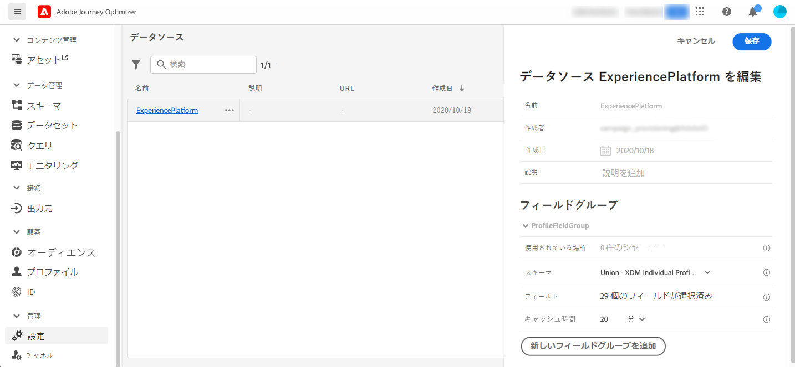
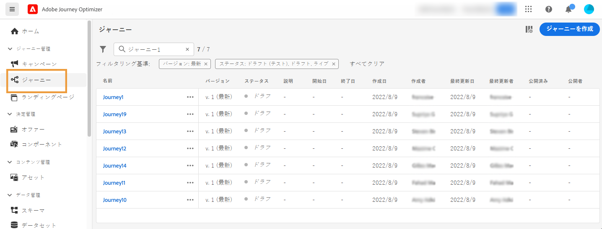
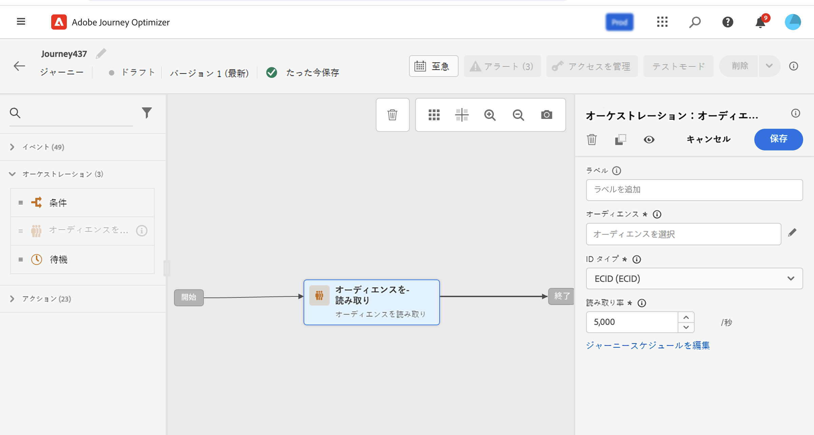

# 初めての旅の作成{#jo-quick-start}

## 知識{#start-prerequisites}

Journeys を使用してメッセージを送信するには、次の設定を行う必要があります。

1. **イベント** を設定します。イベントの受信時に journeys unitarily をトリガーする場合は、イベントを設定する必要があります。 必要な情報とその処理方法を定義します。 この手順は、 **テクニカルユーザー** によって実行されます。 [詳しく ](../event/about-events.md) は、こちらを参照してください。

   

1. **セグメント** の作成: 移動は、指定された一連のプロファイルに、メッセージをバッチ処理するために Adobe エクスペリエンスプラットフォームセグメントに耳化することもできます。 これを行うには、セグメントを作成する必要があります。 [詳しく ](../segment/about-segments.md) は、こちらを参照してください。

   

1. **データソース** の設定: journeys で使用されるその他の情報を取得するために、システムへの接続を定義することができます。例えば、状況によってはその他の情報を取得することができます。 Adobe エクスペリエンスプラットフォームデータソースは、事前に設定しておくこともできます。 イベントのデータのみを使用して作業している場合は、この手順は必要ありません。 この手順は、 **テクニカルユーザー** によって実行されます。 [詳細を読む](../datasource/about-data-sources.md)

   

1. **アクションを設定します。これ** により、サードパーティ製システムを使用してメッセージを送信している場合に、カスタムアクションを作成することができます。 詳しくは、ここを  参照してください。 この手順は、 **テクニカルユーザー** によって実行されます。 旅オプティマイザーに組み込まれたメッセージ機能を使用している場合は、チャネルアクションをフライトに追加し、コンテンツをデザインするだけで済みます。

   

## 旅の作成{#jo-build}

>[!CONTEXTUALHELP]
>id="ajo_journey_create"
>title="旅の作成"
>abstract="この画面には、既存の journeys のリストが表示されます。 「旅を作成」をクリックするか、複数のイベント、オーケストレーションおよびアクションの操作を組み合わせて、マルチステップのクロスチャンネルシナリオを構築します。"

この手順は、 **ビジネスユーザー** によって実行されます。 ここでは、journeys を作成します。 様々なイベント、オーケストレーション、アクションの操作を組み合わせて、マルチステップのクロスチャンネルシナリオを構築します。

以下に、journeys を使用してメッセージを送信する主な手順を示します。

1. 「旅の管理メニュー」の「」をクリック **[!UICONTROL Journeys]** します。 Journeys のリストが表示されます。

   

1. 新しい旅を作成するには、これをクリック **[!UICONTROL Create Journey]** します。

1. 右側に表示される設定ペインで、その旅のプロパティを編集します。 詳しくは、ここを  参照してください。

   

1. まず、パレットから canvas にイベントまたは **「セグメント** の読み取り」アクティビティーをドラッグ &amp; ドロップします。 旅のデザインについて詳しくは、ここ ](using-the-journey-designer.md) を [ 参照してください。

   

1. 各ユーザーが従う次のステップをドラッグ &amp; ドロップします。 例えば、条件を追加し、その後にチャンネルアクションを実行することができます。 アクティビティについて詳しくは、次の項 ](using-the-journey-designer.md) を [ 参照してください。

1. テストプロファイルを使用して、旅をテストします。 詳しくは、ここを [ 参照してください。](testing-the-journey.md)

1. 旅をパブリッシュして、アクティブにします。 詳しくは、ここを  参照してください。

   

1. 専用のレポートツールを使用して、旅の実効性を測定することによって、自分の旅を監視してください。 詳しくは、ここを  参照してください。

   

## 旅のプロパティの定義 {#change-properties}

>[!CONTEXTUALHELP]
>id="ajo_journey_properties"
>title="旅のプロパティ"
>abstract="この節では、旅のプロパティについて説明します。 初期設定では、読み取り専用パラメーターは非表示になっています。 使用可能な設定は、アクセス許可や製品コンフィギュレーションにおいて、その過程の状態によって異なります。"

右上にある鉛筆アイコンをクリックして、旅のプロパティにアクセスします。

このような場合は、旅の名前の変更、説明の追加、「re の再開始」をクリックして、開始日と終了日を選択し、管理者ユーザーが期間を **[!UICONTROL Timeout and error]** 定義することができます。

ライブ journeys については、この画面には、パブリケーションの日付と、その旅をパブリッシュしたユーザーの名前が表示されます。

「テクニカル **情報のコピー」では** 、サポートチームがトラブルシューティングに使用できる旅に関する技術情報をコピーできます。次の情報がコピーされます: JourneyVersion UID、OrgID、Orgid、sandboxName、lastdeployedby lastDeployedAt。

### アピール{#entrance}

デフォルトでは、新しい journeys により再入り口が許可されます。 例えば、ユーザーが会社に入力したときに、1回だけ贈答品を提供する場合は、「ワン journeys」オプションをオフにすることができます。

この節 ](entry-management.md) で [ は、プロファイルの入口の mannagement について詳しく説明しています。

### 旅のアクティビティにおけるタイムアウトとエラー {#timeout_and_error}

アクションまたは条件のアクティビティーを編集するときに、エラーまたはタイムアウトが発生したときに別のパスを定義することができます。 サードパーティシステム interrogating アクティビティの処理が、その他の「プロパティ **[!UICONTROL Timeout and  error]** 」フィールドで定義されているタイムアウト時間を超える場合は、2番目のパスを選択して、潜在的なフォールバックアクションを実行します。

承認される値は、1 ~ 30 秒です。

時間に依存しないように注意してください (例えば、人の実際の位置に反応している場合は、操作を数秒以上遅らせることはできないので、非常に短い **[!UICONTROL Timeout and error]** 値を定義することをお勧めします)。 注意事項が少ない場合は、長めの値を使用して、システムが有効な応答を送信するのにより長い時間をかけることができます。

Journeys でもグローバルタイムアウトが使用されます。 次の項 ](#global_timeout) を [ 参照してください。

### グローバルな旅タイムアウト {#global_timeout}

旅の操作に使用されるタイムアウト ](#timeout_and_error) に [ 加えて、グローバルな旅タイムアウトもありますが、これはインターフェイスには表示されません。変更することはできません。このタイムアウトにより、その時間が経過すると、その人物の進行状況を30日後に停止します。 これは、1人の旅が30日間よりも長くはならないことを意味します。 30日間のタイムアウト時間が経過すると、個人のデータが削除されます。 タイムアウト時間が経過した後も、その旅に流れている個人は停止され、報告時にエラーとして扱われます。

>[!NOTE]
>
>Journeys は、プライバシーのオプトアウト、アクセスまたは削除の要求に直接対応していません。 ただし、グローバルなタイムアウトによって、個々のユーザーが移動しても30日間を超えないようにすることができます。

30日間の旅タイムアウトにより、旅の再開始が許可されていない場合は、入口のブロックが30日間を超えて機能するようにすることはできません。 実際には、入力後30日後に入力した人物に関するすべての情報が削除されるので、以前に入力した人物については知ることができません。

### Timezone and profile profile timezone {#timezone}

タイムゾーンは、旅レベルで定義されています。

固定のタイムゾーンを入力するか、または Adobe エクスペリエンスプラットフォームのプロファイルを使用して、旅のタイムゾーンを定義することができます。

タイムゾーンが Adobe エクスペリエンスプラットフォームプロファイルに定義されている場合は、その機能を取得することができます。

タイムゾーンの管理について詳しくは、このページ ](../building-journeys/timezone-management.md) を参照してください [ 。

### アクセスの管理 {#access}

カスタムまたは核データ使用状況ラベルを旅に割り当てるには、ボタンをクリック **[!UICONTROL Manage access]** します。 [オブジェクトレベルのアクセス制御について詳しくは、(OLA)](../administration/object-based-access.md)

