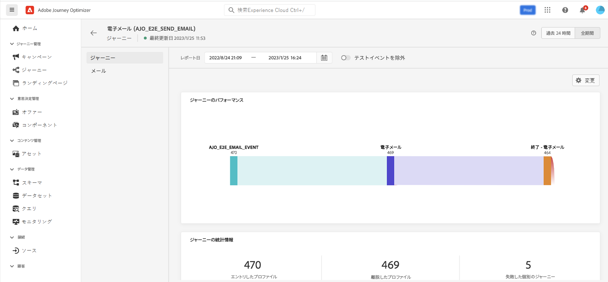

# 初めてのジャーニーの作成 {#jo-quick-start}

>[!CONTEXTUALHELP]
>id="ajo_homepage_card2"
>title="ジャーニーを作成"
>abstract="**Adobe Journey Optimizer** を利用すると、イベントやデータソースに格納されているコンテキストデータを使用して、リアルタイムオーケストレーションのユースケースを構築できます。"

>[!CONTEXTUALHELP]
>id="ajo_journey_create"
>title="ジャーニー"
>abstract="カスタマージャーニーを設計して、状況に即したパーソナライズされたエクスペリエンスを提供します。Journey Optimizer を利用すると、イベントやデータソースに格納されているコンテキストデータを使用して、リアルタイムオーケストレーションのユースケースを構築できます。「**概要**」タブには、ジャーニーに関連する主要指標を含むダッシュボードが表示されます。「**参照**」タブには、既存のジャーニーのリストが表示されます。"

Adobe Journey Optimizer には、マーケターがマーケティングアウトリーチを 1 対 1 の顧客エンゲージメントと調和させるためのオムニチャネルオーケストレーションキャンバスが含まれています。ユーザーインターフェイスを使用すると、パレットからキャンバスにアクティビティを簡単にドラッグ＆ドロップして、ジャーニーを作成できます。ジャーニーのユーザーインターフェイスについて詳しくは、[このページ](journey-ui.md)を参照してください。

ジャーニーを作成する主な手順について詳しくは、このページを参照してください。次のように効率化されています。

複数の手順から成るカスタマージャーニーを作成し、チャネルをまたいでインタラクション、オファーおよびメッセージのシーケンスをリアルタイムで開始します。このアプローチにより、お客様の行動と関連するビジネスシグナルに基づいて、最適なタイミングで顧客と関与できるようになります。ターゲットオーディエンスは、行動、コンテキストデータ、ビジネスイベントに基づいて定義されます。前提条件は、ユースケースと、作成する[ジャーニーのタイプ](entry-management.md#types-of-journeys)によって異なります。

ジャーニーの作成を開始する前に、関連する設定手順が完了していることを確認します。

* イベントを受信した際に個別にジャーニーをトリガーする場合は、**イベントを設定**&#x200B;します。想定する情報とその情報の処理方法を定義します。[詳細情報](../event/about-events.md)。

<!--     -->

* 指定された一連のプロファイルにメッセージを一括送信するのに、ジャーニーで Adobe Experience Platform オーディエンスをリッスンすることもできます。これには、**オーディエンスを作成**&#x200B;します。[詳細情報](../audience/about-audiences.md)。

<!--     -->

* システムへの接続を定義して、ジャーニーで使用する追加情報（条件など）を取得します。この接続は、**データソース**&#x200B;に基づいています。[詳細情報](../datasource/about-data-sources.md)。

<!--     -->

* Journey Optimizer には、[ビルトインのメッセージ](../building-journeys/journeys-message.md)機能が含まれています。サードパーティシステムを使用してメッセージを送信する場合は、**カスタムアクションを作成**&#x200B;できます。詳しくは、[この節](../action/action.md)を参照してください。

<!--      -->

データエンジニアとして、データソース、イベント、アクションを含むジャーニーを設定する手順について詳しくは、[この節](../configuration/about-data-sources-events-actions.md)を参照してください。

>[!NOTE]
>
>ジャーニーのガードレールと制限について詳しくは、[このページ](../start/guardrails.md)を参照してください

## ジャーニーの作成 {#jo-build}

複数の手順から成るジャーニーを作成するには、次の手順に従います。

1. 「ジャーニー管理」メニューセクションで、「**[!UICONTROL ジャーニー]**」をクリックします。

1. 「**[!UICONTROL ジャーニーを作成]**」ボタンをクリックして、新しいジャーニーを作成します。

1. ジャーニーの設定パネルを編集して、ジャーニーの名前を定義し、そのプロパティを設定します。ジャーニーのプロパティを設定する方法について詳しくは、[このページ](journey-properties.md)を参照してください。

   

その後、ジャーニーのデザインを開始できます。

## ジャーニーのデザイン {#jo-design}

オムニチャネルジャーニー designer は、直感的なドラッグ&amp;ドロップインターフェイスを用いて、ターゲットオーディエンス、リアルタイムの顧客やビジネスインタラクションに基づく最新情報、およびオムニチャネルメッセージを使用した、複数手順のジャーニーを作成できるようユーザーを支援します。

1. まず、イベントまたは&#x200B;**オーディエンスを読み取り**&#x200B;アクティビティを、パレットからキャンバスにドラッグ＆ドロップします。ジャーニーのデザインについて詳しくは、[この節](using-the-journey-designer.md)を参照してください。

   

1. まず、イベントまたは&#x200B;**オーディエンスを読み取り**&#x200B;アクティビティを、パレットからキャンバスにドラッグ＆ドロップします。ジャーニーのデザインについて詳しくは、[この節](using-the-journey-designer.md)を参照してください。

## ジャーニーのテスト {#jo-test}

ジャーニーを作成したら、公開する前にテストします。Journey Optimizer では、ジャーニーに沿って進む際にテストプロファイルを表示し、アクティブ化の前に潜在的なエラーを検出する方法として、**テストモード**&#x200B;を提供しています。クイックテストを実行すると、ジャーニーが正しく動作することを確認できるので、自信を持って公開できます。ジャーニーをテストする方法について詳しくは、[この節](testing-the-journey.md)を参照してください。

また、**ドライラン**&#x200B;でジャーニーを実行することもできます。ジャーニーのドライランは、Adobe Journey Optimizer の特別なジャーニー公開モードで、ジャーニー実務担当者は実際の顧客に連絡したり、プロファイル情報を更新したりすることなく、実際の実稼動データを使用してジャーニーをテストできます。この機能により、ジャーニー実務担当者は、ジャーニーをライブで公開する前に、ジャーニーのデザインとオーディエンスのターゲティングに自信を持つことができます。ドライランモードでのジャーニーの公開方法について詳しくは、[この節](journey-dry-run.md)を参照してください。

## ジャーニーの公開 {#jo-pub}

ジャーニーをアクティブ化し、新しいプロファイルが入力できるようにするには、ジャーニーを公開する必要があります。ジャーニーを公開する前に、そのジャーニーが有効で、エラーがないことを確認します。エラーのあるジャーニーは公開できません。ジャーニーの公開について詳しくは、この[節](publishing-the-journey.md)を参照してください。

公開したら、専用のレポートツールを使用してジャーニーを監視し、ジャーニーの有効性を測定できます。

ジャーニーレポートについて詳しくは、[この節](../reports/live-report.md)を参照してください。

>[!NOTE]
>
>**ライブ**&#x200B;ジャーニーを変更する必要がある場合は、ジャーニーの[新しいバージョンを作成](journey-ui.md#journey-versions)します。
