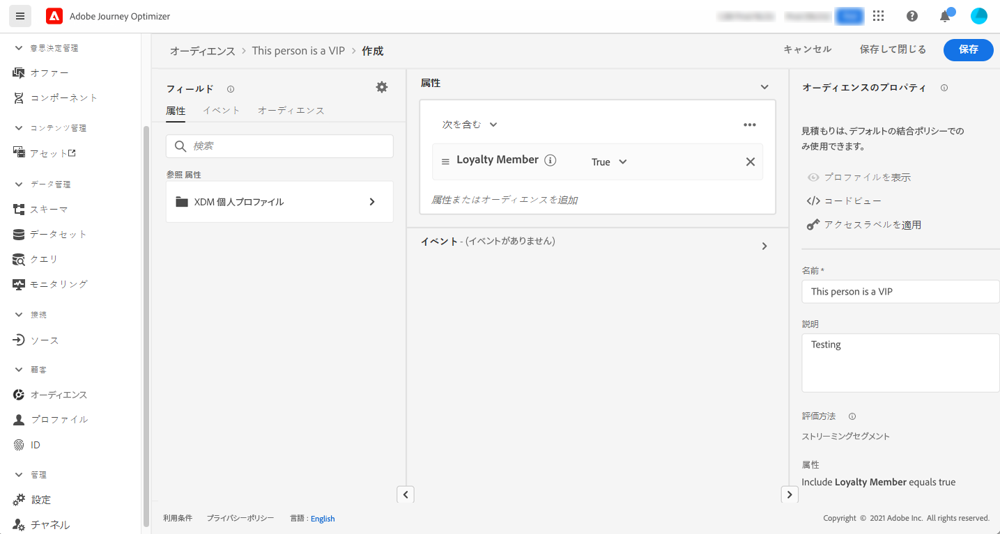

# 初めてのジャーニーを作成{#jo-quick-start}

>[!CONTEXTUALHELP]
>id="ajo_homepage_card2"
>title="ジャーニーを作成"
>abstract="**Adobe Journey Optimizer** を利用すると、イベントやデータソースに格納されているコンテキストデータを使用して、リアルタイムオーケストレーションのユースケースを構築できます。"

## 前提条件{#start-prerequisites}

ジャーニーでメッセージを送信するには、次の設定が必要です。

1. **イベントの設定**：イベントを受信したときに個別にジャーニーをトリガーする場合は、イベントを設定する必要があります。想定する情報とその情報の処理方法を定義します。このステップは、**技術ユーザー**&#x200B;が実行します。[詳細情報](../event/about-events.md)。

   

1. **オーディエンスの作成**：指定された一連のプロファイルにメッセージを一括送信するために、ジャーニーで Adobe Experience Platform オーディエンスをリッスンすることもできます。この場合、オーディエンスを作成する必要があります。[詳細情報](../audience/about-audiences.md)。

   

1. **データソースの設定**：ジャーニーで使用する追加情報（条件など）を取得するために、システムへの接続を定義します。プロビジョニング時に、組み込みの Adobe Experience Platform データソースも設定されます。イベントのデータのみをジャーニーで活用する場合、このステップは必要ありません。このステップは、**技術ユーザー**&#x200B;が実行します。[詳細情報](../datasource/about-data-sources.md)

   

1. **アクションの設定**：サードパーティのシステムを使用してメッセージを送信する場合は、カスタムアクションを作成できます。詳しくは、[この節](../action/action.md)を参照してください。このステップは、**技術ユーザー**&#x200B;が実行します。Journey Optimizer 組み込みのメッセージ機能を使用している場合は、ジャーニーにチャネルアクションを追加し、コンテンツをデザインするだけで済みます。

   

## ジャーニーへのアクセス {#journey-access}

>[!CONTEXTUALHELP]
>id="ajo_journey_create"
>title="ジャーニー"
>abstract="カスタマージャーニーを設計して、状況に即したパーソナライズされたエクスペリエンスを提供します。Journey Optimizer を利用すると、イベントやデータソースに格納されているコンテキストデータを使用して、リアルタイムオーケストレーションのユースケースを構築できます。「**概要**」タブには、ジャーニーに関連する主要指標を含むダッシュボードが表示されます。「**参照**」タブには、既存のジャーニーのリストが表示されます。"

### 主要指標とジャーニーのリスト {#access-metrics}

「ジャーニー管理」メニューセクションで、「**[!UICONTROL ジャーニー]**」をクリックします。次の 2 つのタブを使用できます。

**概要**：このタブには、ジャーニーに関連する主要指標を含む次のダッシュボードが表示されます。

* **処理済みのプロファイル**：過去 24 時間に処理されたプロファイルの合計数
* **ライブジャーニー**：過去 24 時間のトラフィックを含むライブジャーニーの合計数。ライブジャーニーには、**単一ジャーニー**（イベントベース）と&#x200B;**バッチジャーニー**（オーディエンスを読み取り）が含まれます。
* **エラー率**：過去 24 時間にエントリしたプロファイルの合計数に対する、エラーが発生したすべてのプロファイルの割合。
* **破棄率**：過去 24 時間にエントリしたプロファイルの合計数に対する、破棄されたすべてのプロファイルの割合。破棄されたプロファイルは、名前空間が正しくないことや再エントリルールを理由に、ジャーニーにエントリする資格がないユーザーを表します。

>[!NOTE]
>
>このダッシュボードでは、過去 24 時間のトラフィックを含むジャーニーが考慮されます。アクセス可能なジャーニーのみが表示されます。指標は、30 分ごとに、新しいデータが使用可能になった場合にのみ更新されます。

**参照**：このタブには、既存のジャーニーのリストが表示されます。ジャーニーを検索し、フィルターを使用して、各要素に対して基本的なアクションを実行できます。例えば、項目の複製や削除が可能です。詳しくは、[この節](../start/user-interface.md#filter-lists)を参照してください。

### ジャーニーのフィルタリング {#filter}

ジャーニーのリストでは、様々なフィルターを利用して、ジャーニーのリストを絞り込み、読みやすくすることができます。

実行できる様々なフィルタリング操作を次に示します。

**[!UICONTROL ステータスフィルターとバージョンフィルター]**&#x200B;では、ステータス、タイプ、バージョンおよび割り当てられているタグに従ってジャーニーをフィルタリングできます。

タイプは、**[!UICONTROL 単一イベント]**、**[!UICONTROL オーディエンスの選定]**、**[!UICONTROL オーディエンスを読み取り]**、**[!UICONTROL ビジネスイベント]**&#x200B;のいずれかになります。

ステータスには次の種類があります。

* **クローズ済み**：「**新規エントリに対してクローズ**」ボタンを使用してジャーニーが終了しました。ジャーニーは、新しい個人がジャーニーにエントリするのを停止します。既にジャーニーにエントリしているユーザーは、通常どおりにジャーニーを終了できます。
* **ドラフト**：ジャーニーは最初のステージです。まだ公開されていません。
* **ドラフト（テスト）**：「**テストモード**」ボタンを使用してテストモードがアクティブ化されています。
* **完了**:91 日が経過すると、ジャーニーは自動的にこのステータスに切り替わります [デフォルトのタイムアウト](journey-gs.md#global_timeout). 既にジャーニーにエントリしているプロファイルは、通常どおりにジャーニーを終了できます。新しいプロファイルは、そのジャーニーにエントリできなくなります。
* **ライブ**：ジャーニーは「**公開**」ボタンを使用して公開されています。
* **停止済み**：「**停止**」ボタンを使用してジャーニーがオフになっています。すべての個人のジャーニーが即座に終了します。

>[!NOTE]
>
>ジャーニーオーサリングライフサイクルには、フィルタリングできない一連の中間ステータス（「公開」（「ドラフト」と「ライブ」の間）、「テストモードのアクティブ化」または「テストモードの非アクティブ化」（「ドラフト」と「ドラフト（テスト）」の間）、「停止」（「ライブ」と「停止済み」）が含まれます。 ジャーニーが中間の状態にある場合は、読み取り専用です。

**[!UICONTROL 作成フィルター]**&#x200B;を使用すると、作成日またはジャーニーを作成したユーザーに従ってジャーニーをフィルタリングできます。

**[!UICONTROL アクティビティフィルター]**&#x200B;と&#x200B;**[!UICONTROL データフィルター]**&#x200B;では、特定のイベント、フィールドグループまたはアクションを使用するジャーニーを表示できます。

**[!UICONTROL 公開フィルター]**&#x200B;を使用すると、公開日またはユーザーを選択できます。例えば、昨日公開されたライブジャーニーの最新バージョンのみを表示するように選択できます。

特定の日付範囲に基づいてジャーニーをフィルタリングするには、**[!UICONTROL 公開済み]**&#x200B;ドロップダウンリストから「**[!UICONTROL カスタム]**」を選択します。

イベント、データソースまたはアクションの設定ペインの「**[!UICONTROL 使用されている場所]**」フィールドには、特定のイベント、フィールドグループまたはアクションを使用するジャーニーの数が表示されます。「**[!UICONTROL ジャーニーを表示]**」ボタンをクリックすると、対応するジャーニーのリストを表示できます。

## ジャーニーをビルド{#jo-build}

このステップは、**ビジネスユーザー**&#x200B;が実行します。ここでジャーニーを作成します。様々なイベント、オーケストレーション、アクションなどのアクティビティを組み合わせて、複数のステップから成るクロスチャネルのシナリオを構築します。

➡️ [この機能をビデオで確認](journey.md#video)

ジャーニーを介してメッセージを送信する主な手順は次のとおりです。

1. 「**参照**」タブから、「**[!UICONTROL ジャーニーを作成]**」をクリックして新しいジャーニーを作成します。

1. 右側に表示される設定ペインで、ジャーニーのプロパティを編集します。詳しくは、[この節](journey-gs.md#change-properties)を参照してください。

   

1. まず、イベントまたは&#x200B;**オーディエンスを読み取り**&#x200B;アクティビティを、パレットからキャンバスにドラッグ＆ドロップします。ジャーニーのデザインの詳細については、[この節](using-the-journey-designer.md)を参照してください。

   

1. 次に個人が従う手順をドラッグ＆ドロップします。例えば、条件に続いてチャネルアクションも追加できます。アクティビティの詳細については、[この節](using-the-journey-designer.md)を参照してください。

1. テストプロファイルを使用してジャーニーをテストします。詳しくは、[この節](testing-the-journey.md)を参照してください。

1. ジャーニーを公開してアクティブ化します。詳しくは、[この節](publishing-the-journey.md)を参照してください。

   

1. 専用のレポートツールを使用してジャーニーを監視し、ジャーニーの有効性を測定できます。詳しくは、[この節](../reports/live-report.md)を参照してください。

   

## ジャーニーのプロパティを定義する {#change-properties}

>[!CONTEXTUALHELP]
>id="ajo_journey_properties"
>title="ジャーニーのプロパティ"
>abstract="この節では、ジャーニーのプロパティについて説明します。デフォルトでは、読み取り専用のパラメーターは非表示です。使用可能な設定は、ジャーニーのステータス、権限および製品設定によって異なります。"

>[!CONTEXTUALHELP]
>id="ajo_journey_exit_criterias"
>title="ジャーニー終了基準"
>abstract="このセクションには、終了基準オプションが表示されます。ジャーニーに 1 つ以上の終了基準ルールを作成できます。"

ジャーニーの名前の横にある鉛筆アイコンをクリックして、そのプロパティにアクセスします。

ユーザーは、ジャーニー名の変更、説明の追加、再エントリの許可、開始日と終了日の選択ができ、管理者は、**[!UICONTROL タイムアウトとエラー]**&#x200B;の時間の定義ができます。また、Adobe Experience Platform 統合タグをジャーニーに割り当てることもできます。これにより、キャンペーンを簡単に分類し、キャンペーンリストからの検索を改善できます。[タグの操作方法については、こちらを参照してください](../start/search-filter-categorize.md#tags)

ライブジャーニーの場合、この画面には、ジャーニーを公開した日付とユーザーの名前が表示されます。

「**技術的な詳細をコピー**」を使用すると、ジャーニーに関する技術情報をコピーでき、サポートチームはこの情報をトラブルシューティングに使用できます。JourneyVersion UID、OrgID、orgName、sandboxName、lastDeployedBy、lastDeployedAt などの情報がコピーされます。

### エントリと再エントリ {#entrance}

デフォルトでは、新規ジャーニーで再エントリが許可されています。「1 回限り」のジャーニー（例：入店時に 1 度だけギフトをオファーするなど）を作成するには、この「**再エントリを許可**」オプションをオフにします。

 「**再エントリを許可**」オプションがアクティベートされると、「**再エントリ待機期間**」フィールドが表示されます。このフィールドでは、（イベントまたはオーディエンスの選定で始まる）単一ジャーニーで、プロファイルがジャーニーに再度エントリできるようになるまでの待機時間を定義できます。これにより、ジャーニーが同じイベントに対して誤って複数回トリガーされるのを防ぎます。デフォルトでは、このフィールドは 5 分に設定されています。最大期間は 29 日です。

プロファイルのエントリと再エントリの管理について詳しくは、[この節](entry-management.md)を参照してください。

### アクセスの管理 {#manage-access}

カスタムデータ使用ラベルまたはコアデータ使用ラベルをジャーニーに割り当てるには、「**[!UICONTROL アクセスを管理]**」ボタンをクリックします。[オブジェクトレベルのアクセス制御（OLA）について詳しくはこちらから](../administration/object-based-access.md)

### ジャーニーとプロファイルのタイムゾーン {#timezone}

タイムゾーンはジャーニーレベルで定義されます。固定タイムゾーンを入力するか、Adobe Experience Platform プロファイルを使用してジャーニーのタイムゾーンを定義できます。Adobe Experience Platform プロファイルでタイムゾーンが定義されている場合は、ジャーニーでそのタイムゾーンを取得できます。

タイムゾーン管理の詳細については、[このページ](../building-journeys/timezone-management.md)を参照してください。

### 開始日と終了日 {#dates}

**開始日**&#x200B;を定義できます。 指定していない場合は、公開時に自動的に定義されます。

**終了日**&#x200B;も追加できます。これにより、日付に達したプロファイルは自動的に終了します。 終了日を指定しない場合、プロファイルは[グローバルジャーニータイムアウト](#global_timeout)（通常は 91 日、Healthcare Shield アドオン機能では 7 日に短縮）まで保持されます。唯一の例外は、「**繰り返し時に再エントリを強制する**」が有効になっている繰り返しの「オーディエンスを読み取り」ジャーニーで、これは次回の実行の開始日に終了します。

### ジャーニーアクティビティのタイムアウトとエラー {#timeout_and_error}

アクションまたは条件のアクティビティを編集するときに、エラーやタイムアウトが発生した場合の代替パスを定義できます。サードパーティシステムに問い合わせを行うアクティビティの処理時間が、ジャーニーのプロパティ（「**[!UICONTROL タイムアウトとエラー]**」フィールド）で定義されたタイムアウト時間を超えると、第 2 パスが選択されて、可能な代替アクションが実行されます。

許可される値は 1 ～ 30 秒です。

ジャーニーの時間が限られている場合（例：人のリアルタイムの位置情報に反応するなど）、アクションを数秒以上遅らせることができないため、非常に短い時間の&#x200B;**[!UICONTROL タイムアウトとエラー]**&#x200B;値を定義することをお勧めします。ジャーニーにそれほど時間的制約がない場合は、より長い値を使用して、有効な応答を送るために呼び出されるシステムにより多くの時間をを付与することができます。

ジャーニーではグローバルタイムアウトも使用します。[次の節](#global_timeout)を参照してください。

### グローバルジャーニーのタイムアウト {#global_timeout}

ジャーニーアクティビティで使用される[タイムアウト](#timeout_and_error)のほかに、グローバルジャーニータイムアウトも存在します。こちらはインターフェイスに表示されず、変更もできません。

ジャーニー内にいる個人の進捗は、エントリしてから **91 日**&#x200B;経過すると、このグローバルタイムアウトにより停止されます。Healthcare Shield アドオン機能を使用すると、このタイムアウトが **7 日**&#x200B;に短縮されます。つまり、個人のジャーニーは 91 日（または 7 日）を超えることはできません。タイムアウト期間が経過すると、個人のデータは削除されます。タイムアウト期間が終了してもまだジャーニーに流入してくる個人がいる場合、それらは流入を停止され、レポートでは考慮されません。したがって、離脱する人物よりもジャーニーにエントリする人物の方が多くなる可能性があります。

>[!NOTE]
>
>ジャーニーは、プライバシーのオプトアウト、アクセス、削除などのリクエストに対して直接反応しません。ただし、グローバルタイムアウトにより、個人がどのジャーニーでも 91 日以上滞在することはなくなります。

ジャーニーの 91 日間のタイムアウトにより、ジャーニーの再エントリが許可されていない場合、再エントリのブロックが 91 日以上機能するかどうかを確認できません。 実際、ジャーニーにエントリしたユーザーの情報はエントリから 91 日後にすべて削除されるので、91 日前より古い日時にエントリしたユーザーが誰かを特定することはできません。

個人が待機アクティビティにエントリできるのは、91 日のジャーニータイムアウトより前に待機期間を完了するのに十分な時間がジャーニーに残っている場合のみです。[このページ](../building-journeys/wait-activity.md)を参照してください。

#### Time-to-Live （TTL）とデータレンテンションに関するよくある質問 {#timeout-faq}

**単一ジャーニー用**
<table style="table-layout:auto">
  <tr style="border: 1;">
    <td>
      
TTL 拡張機能のロールアウト後に公開されたジャーニーはどうなりますか？

    </td>
    <td>
      
新しいジャーニーにエントリするプロファイルの TTL は自動的に 91 日になります。

    </td>
  </tr>
  <tr style="border: 1;">
    <td>
      
TTL 拡張機能のローンチ前に公開されたジャーニーにエントリするプロファイルはどうなりますか。

    </td>
    <td>
      
プロファイルの TTL は、ジャーニーが最初に公開された時間と一致して 91 日（HIPAA の場合は 7 日）になります。

    </td>
  </tr>
  <tr style="border: 1;">
    <td>
      
TTL 拡張機能の起動時に、既にジャーニーにエントリしているプロファイルはどうなりますか。

    </td>
    <td>
      
プロファイルは、ジャーニーの元の公開時間に従って、91 日（HIPAA の場合は 7 日）の TTL を保持します。

    </td>
  </tr>
  <tr style="border: 1;">
    <td>
      
TTL 拡張機能の起動後に再公開された以前のジャーニーバージョンのプロファイルはどうなりますか。

    </td>
    <td>
      
プロファイルは、元のジャーニーバージョンの公開時間と整合させて、91 日（HIPAA の場合は 7 日）の TTL を維持します。

    </td>
  </tr>
  <tr style="border: 1;">
    <td>
      
TTL 拡張機能の起動後に新しいプロファイルが再公開されたジャーニーバージョンに入るとどうなりますか。

    </td>
    <td>
      
プロファイルの TTL は 91 日で、新しく再公開されたジャーニーバージョンの TTL と一致します。

    </td>
  </tr>
</table>

**セグメントトリガージャーニー用**

<table style="table-layout:auto">
  <tr style="border: 1;">
    <td>
      
TTL 拡張機能の後に公開された新しい 1 回限りのジャーニーはどうなりますか？

    </td>
    <td>
      
新しいジャーニーにエントリするプロファイルの TTL は自動的に 91 日になります。

    </td>
  </tr>
  <tr style="border: 1;">
    <td>
      
TTL 拡張機能後に公開された強制的な再エントリを伴わない、新しい繰り返しジャーニーはどうなりますか。

    </td>
    <td>
      
新しいジャーニーにエントリするプロファイルの TTL は自動的に 91 日になります。

    </td>
  </tr>
  <tr style="border: 1;">
    <td>
      
TTL 拡張機能後に強制的な再エントリが公開された新しい繰り返しジャーニーはどうなりますか。

    </td>
    <td>
      
新しいジャーニーにエントリするプロファイルには、繰り返し期間と同じ TTL が割り当てられます。 例えば、ジャーニーが毎日実行される場合、TTL は 1 日になります。

    </td>
  </tr>
  <tr style="border: 1;">
    <td>
      
TTL 拡張機能のローンチ前に公開されたジャーニーにエントリするプロファイルはどうなりますか。

    </td>
    <td>
      
プロファイルの TTL は、元の公開時間と一致して 91 日（HIPAA の場合は 7 日）になります。 強制的に再エントリする繰り返しジャーニーの場合、TTL は繰り返し期間と一致します。

    </td>
  </tr>
  <tr style="border: 1;">
    <td>
      
TTL 拡張機能が起動すると、ジャーニーを実行中のプロファイルはどうなりますか。

    </td>
    <td>
      
プロファイルは、ジャーニーの元の公開時間に従って、91 日（HIPAA の場合は 7 日）の TTL を保持します。 強制的に再エントリする繰り返しジャーニーの場合、TTL は繰り返し期間と一致します。

    </td>
  </tr>
  <tr style="border: 1;">
    <td>
      
TTL 拡張機能の起動後に再公開された以前のジャーニーバージョンの実行中のプロファイルはどうなりますか。

    </td>
    <td>
      
プロファイルは、元のジャーニーバージョンの公開時間と整合させて、91 日（HIPPA の場合は 7 日）の TTL を維持します。 強制的に再エントリする繰り返しジャーニーの場合、TTL は繰り返し期間と一致します。

    </td>
  </tr>
  <tr style="border: 1;">
    <td>
      
TTL 拡張機能の起動後に新しいプロファイルが再公開されたジャーニーバージョンに入るとどうなりますか。

    </td>
    <td>
      
プロファイルの TTL は 91 日で、新しく再公開されたジャーニーバージョンの TTL と一致します。 強制的に再エントリする繰り返しジャーニーの場合、TTL は繰り返し期間と一致します。

    </td>
  </tr>
</table>

### 結合ポリシー {#merge-policies}

ジャーニーは、Adobe Experience Platform からプロファイルデータを取得するときにマージポリシーを使用します。ジャーニータイプに応じて、異なる結合ポリシーが使用されます。

* オーディエンスを読み取りジャーニーまたはオーディエンスの選定ジャーニーの場合：オーディエンスからの結合ポリシーが使用されます
* イベントトリガージャーニーの場合：デフォルトの結合ポリシーが使用されます
* ビジネスイベントジャーニーでは、次のオーディエンスを読み取りアクティビティのターゲットオーディエンスの結合ポリシーを使用します

ジャーニーでは、ジャーニー全体を通して使用される結合ポリシーに従います。 したがって、1 つのジャーニーで複数のオーディエンスが使用されている場合（「inAudience」関数など）、ジャーニーで使用されている結合ポリシーとの不一致が発生すると、エラーが発生し、公開がブロックされます。 ただし、一貫性のないオーディエンスがメッセージのパーソナライゼーションで使用された場合は、一貫性がないにもかかわらず、アラートは発生しません。 そのため、このオーディエンスをメッセージのパーソナライゼーションに使用する場合は、オーディエンスに関連付けられている結合ポリシーを確認することを強くお勧めします。

結合ポリシーの詳細については、を参照してください。 [Adobe Experience Platform ドキュメント](https://experienceleague.adobe.com/ja/docs/experience-platform/profile/merge-policies/overview){target="_blank"}.

## ジャーニーの複製 {#duplicate-a-journey}

既存のジャーニーは、「**参照**」タブから複製できます。すべてのオブジェクトと設定は、ジャーニーコピーに複製されます。

手順は次のとおりです。

1. コピーするジャーニーに移動し、**その他のアクション**&#x200B;アイコン（ジャーニー名の横の 3 つのドット）をクリックします。
1. 「**複製**」を選択します。

   

1. ジャーニーの名前を入力して確定します。ジャーニーのプロパティ画面で名前を変更することもできます。デフォルトでは、名前は `[JOURNEY-NAME]_copy` のように設定されます。

   

1. 新しいジャーニーが作成され、ジャーニーリストで使用できます。
