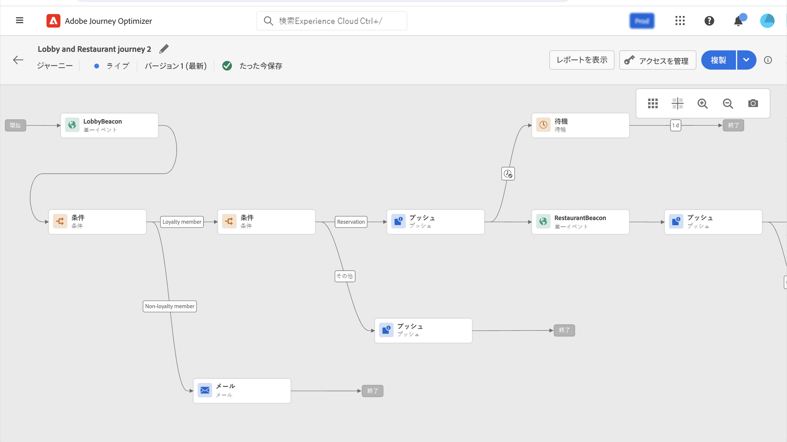

# 初めてのジャーニーの作成 {#jo-quick-start}

>[!CONTEXTUALHELP]
>id="ajo_homepage_card2"
>title="ジャーニーを作成"
>abstract="**Adobe Journey Optimizer** を利用すると、イベントやデータソースに格納されているコンテキストデータを使用して、リアルタイムオーケストレーションのユースケースを構築できます。"

>[!CONTEXTUALHELP]
>id="ajo_journey_create"
>title="ジャーニー"
>abstract="カスタマージャーニーを設計して、状況に即したパーソナライズされたエクスペリエンスを提供します。Journey Optimizer を利用すると、イベントやデータソースに格納されているコンテキストデータを使用して、リアルタイムオーケストレーションのユースケースを構築できます。「**概要**」タブには、ジャーニーに関連する主要指標を含むダッシュボードが表示されます。「**参照**」タブには、既存のジャーニーのリストが表示されます。"

Adobe Journey Optimizer には、マーケターがマーケティングアウトリーチを 1 対 1 の顧客エンゲージメントと調和させるためのオムニチャネルオーケストレーションキャンバスが含まれています。ユーザーインターフェイスを使用すると、パレットからキャンバスにアクティビティを簡単にドラッグ＆ドロップして、ジャーニーを作成できます。ジャーニーのユーザーインターフェイスについて詳しくは、[ このページ ](journey-ui.md) を参照してください。

ジャーニーを作成するための主な手順については、このページを参照してください。 次のように効率化されています。

複数の手順から成るカスタマージャーニーを作成し、チャネルをまたいでインタラクション、オファーおよびメッセージのシーケンスをリアルタイムで開始します。このアプローチにより、お客様の行動と関連するビジネスシグナルに基づいて、最適なタイミングで顧客と関与できるようになります。ターゲットオーディエンスは、行動、コンテキストデータ、ビジネスイベントに基づいて定義できます。前提条件は、ユースケースと、作成する[ジャーニーのタイプ](entry-management.md#types-of-journeys)によって異なります。

ジャーニーの作成を開始する前に、関連する設定手順が完了していることを確認します。

* イベントを受信したときに個別にジャーニーをトリガーする場合は、**イベントを設定**&#x200B;する必要があります。想定する情報とその情報の処理方法を定義します。[詳細情報](../event/about-events.md)。

<!--     -->

* 指定された一連のプロファイルにメッセージを一括送信するのに、ジャーニーで Adobe Experience Platform オーディエンスをリッスンすることもできます。この場合、**オーディエンスを作成**&#x200B;する必要があります。[詳細情報](../audience/about-audiences.md)。

<!--     -->

* システムへの接続を定義して、ジャーニーで使用する追加情報（条件など）を取得できます。この接続は、**データソース**&#x200B;に基づいています。[詳細情報](../datasource/about-data-sources.md)

<!--     -->

* Journey Optimizer には、[組み込みのメッセージ](../building-journeys/journeys-message.md)機能が含まれています。サードパーティシステムを使用してメッセージを送信する場合は、**カスタムアクションを作成**&#x200B;できます。詳しくは、[この節](../action/action.md)を参照してください。

<!--      -->

データエンジニアとして、データソース、イベント、アクションを含むジャーニーを設定する手順について詳しくは、[この節](../configuration/about-data-sources-events-actions.md)を参照してください。

>[!NOTE]
>
>ジャーニーガードレールと制限について詳しくは、[ このページ ](../start/guardrails.md) を参照してください

## ジャーニーの作成 {#jo-build}

複数の手順から成るジャーニーを作成するには、次の手順に従います。

1. 「ジャーニー管理」メニューセクションで、「**[!UICONTROL ジャーニー]**」をクリックします。

1. 「**[!UICONTROL ジャーニーを作成]**」ボタンをクリックして、新しいジャーニーを作成します。

1. ジャーニーの設定パネルを編集して、ジャーニーの名前を定義し、そのプロパティを設定します。ジャーニーのプロパティを設定する方法については、[ このページ ](journey-properties.md) を参照してください。

   

その後、ジャーニーのデザインを開始できます。

## ジャーニーのデザイン {#jo-design}

オムニチャネルジャーニーデザイナーは、直感的なドラッグ＆ドロップインターフェイスを用いて、ターゲットオーディエンス、リアルタイムの顧客やビジネスインタラクションに基づく最新情報、およびオムニチャネルメッセージを使用した、複数手順のジャーニーの作成を支援します。

1. まず、イベントまたは&#x200B;**オーディエンスを読み取り**&#x200B;アクティビティを、パレットからキャンバスにドラッグ＆ドロップします。ジャーニーのデザインの詳細については、[この節](using-the-journey-designer.md)を参照してください。

   

1. 次に個人が従う手順をドラッグ＆ドロップします。例えば、条件に続いてチャネルアクションも追加できます。アクティビティについて詳しくは、[この節](about-journey-activities.md)を参照してください。

## ジャーニーのテスト {#jo-test}

ジャーニーを作成したら、公開する前にテストできます。Journey Optimizer では、ジャーニーに沿って進む際にテストプロファイルを表示し、アクティブ化の前に潜在的なエラーを検出する方法として、「テストモード」を提供しています。クイックテストを実行すると、ジャーニーが正しく動作することを確認できるので、自信を持って公開できます。

詳しくは、[この節](testing-the-journey.md)を参照してください。

## ジャーニーの公開 {#jo-pub}

ジャーニーをアクティブ化し、新しいプロファイルが入力できるようにするには、ジャーニーを公開する必要があります。ジャーニーを公開する前に、そのジャーニーが有効であること、エラーがないことを確認します。エラーのあるジャーニーは公開できません。ジャーニーの公開について詳しくは、[この節](publishing-the-journey.md)を参照してください。

公開したら、専用のレポートツールを使用してジャーニーを監視し、ジャーニーの有効性を測定できます。

ジャーニーレポートについて詳しくは、[この節](../reports/live-report.md)を参照してください。

>[!NOTE]
>
>**ライブ**&#x200B;ジャーニーを変更する必要がある場合は、ジャーニーの[新しいバージョンを作成](journey-ui.md#journey-versions)します。
