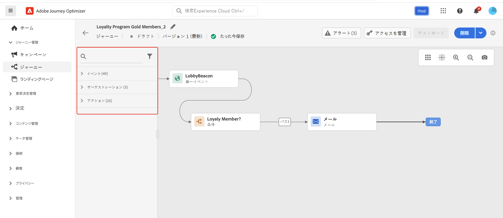
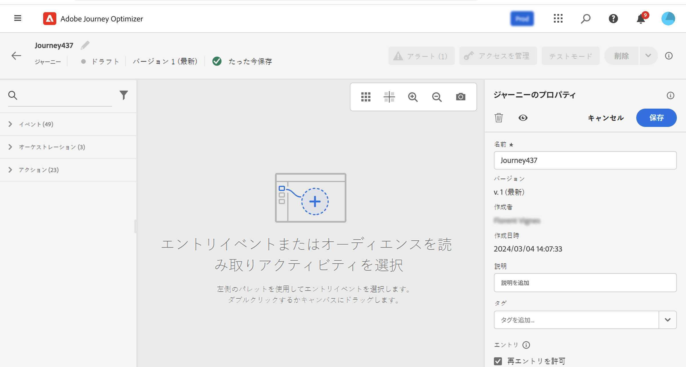

# 初めてのジャーニーの作成 {#jo-quick-start}

>[!CONTEXTUALHELP]
>id="ajo_homepage_card2"
>title="ジャーニーを作成"
>abstract="**Adobe Journey Optimizer** を利用すると、イベントやデータソースに格納されているコンテキストデータを使用して、リアルタイムオーケストレーションのユースケースを構築できます。"

>[!CONTEXTUALHELP]
>id="ajo_journey_create"
>title="ジャーニー"
>abstract="カスタマージャーニーを設計して、状況に即したパーソナライズされたエクスペリエンスを提供します。Journey Optimizer を利用すると、イベントやデータソースに格納されているコンテキストデータを使用して、リアルタイムオーケストレーションのユースケースを構築できます。「**概要**」タブには、ジャーニーに関連する主要指標を含むダッシュボードが表示されます。「**参照**」タブには、既存のジャーニーのリストが表示されます。"

Adobe Journey Optimizer には、マーケターがマーケティングアウトリーチを 1 対 1 の顧客エンゲージメントと調和させるためのオムニチャネルオーケストレーションキャンバスが含まれています。ユーザーインターフェイスを使用すると、パレットからキャンバスにアクティビティを簡単にドラッグ＆ドロップして、ジャーニーを作成できます。ジャーニーのユーザーインターフェイスについて詳しくは、[ このページ ](journey-ui.md) を参照してください。

チャネルをまたいで、インタラクション、オファーおよびメッセージのシーケンスをリアルタイムで開始する、複数のステップから成るカスタマージャーニーを作成します。 このアプローチにより、顧客の行動と関連するビジネスシグナルに基づいて、最適な瞬間に顧客が関与できるようになります。

ジャーニーを作成する主な手順については、このページを参照してください。 次のように合理化されます。

## 前提条件 {#start-prerequisites}

ジャーニーでメッセージを送信するには、次の前提条件が必要です。

1. **イベントの設定**：イベントを受信したときに個別にジャーニーをトリガーする場合は、イベントを設定する必要があります。想定する情報とその情報の処理方法を定義します。このステップは、**技術ユーザー**&#x200B;が実行します。[詳細情報](../event/about-events.md)。

   

1. **オーディエンスの作成**：指定された一連のプロファイルにメッセージを一括送信するために、ジャーニーで Adobe Experience Platform オーディエンスをリッスンすることもできます。この場合、オーディエンスを作成する必要があります。[詳細情報](../audience/about-audiences.md)。

   

1. **データソースの設定**：ジャーニーで使用する追加情報（条件など）を取得するために、システムへの接続を定義します。プロビジョニング時に、組み込みの Adobe Experience Platform データソースも設定されます。イベントのデータのみをジャーニーで活用する場合、このステップは必要ありません。このステップは、**技術ユーザー**&#x200B;が実行します。[詳細情報](../datasource/about-data-sources.md)

   

1. **アクションの設定**：サードパーティのシステムを使用してメッセージを送信する場合は、カスタムアクションを作成できます。詳しくは、[この節](../action/action.md)を参照してください。このステップは、**技術ユーザー**&#x200B;が実行します。Journey Optimizer 組み込みのメッセージ機能を使用している場合は、ジャーニーにチャネルアクションを追加し、コンテンツをデザインするだけで済みます。

   

データエンジニアとして、データソース、イベント、アクションを含むジャーニーを設定する手順について詳しくは、[この節](../configuration/about-data-sources-events-actions.md)を参照してください。

>[!NOTE]
>
>ジャーニーのガードレールと制限について詳しくは、[こちらのページ](../start/guardrails.md)をご覧ください。

## 複数ステップのジャーニーの作成 {#jo-build}

複数ステップのジャーニーを作成するには、次の手順に従います。

1. [ジャーニーの管理 ] メニューセクションで、[**[!UICONTROL ジャーニー]**] をクリックします。

1. 「**[!UICONTROL ジャーニーを作成]**」ボタンをクリックして、新規のジャーニーを作成します。

1. ジャーニーの設定ペインを編集してジャーニーの名前を定義し、プロパティを設定します。 ジャーニーのプロパティを設定する方法については、[ このページ ](journey-properties.md) を参照してください。

   

その後、ジャーニーのデザインを開始できます。

## ジャーニーの設計 {#jo-design}

オムニチャネルジャーニーデザイナーは、直感的なドラッグ&amp;ドロップインターフェイスを用いて、ターゲットオーディエンス、リアルタイムの顧客やビジネスインタラクションに基づく最新情報、およびオムニチャネルメッセージを使用した、複数手順のジャーニーを作成できるようユーザーを支援します。

1. まず、イベントまたは&#x200B;**オーディエンスを読み取り**&#x200B;アクティビティを、パレットからキャンバスにドラッグ＆ドロップします。ジャーニーのデザインの詳細については、[この節](using-the-journey-designer.md)を参照してください。

   

1. 次に個人が従う手順をドラッグ＆ドロップします。例えば、条件に続いてチャネルアクションも追加できます。アクティビティの詳細については、[この節](about-journey-activities.md)を参照してください。

## ジャーニーのテスト {#jo-test}

ジャーニーを作成したら、公開する前にテストできます。 Journey Optimizerでは、ジャーニーに沿って進む際にテストプロファイルを確認し、アクティブ化の前に潜在的なエラーを検出する方法として、「テストモード」を提供しています。 クイックテストを実行すると、ジャーニーが正しく動作することを確認できるので、自信を持って公開できます。

詳しくは、[この節](testing-the-journey.md)を参照してください。

## ジャーニーの公開 {#jo-pub}

ジャーニーを公開してアクティブ化し、新しいプロファイルが入力できるようにする必要があります。 ジャーニーを公開する前に、そのジャーニーが有効であること、エラーがないことを確認します。エラーのあるジャーニーは公開できません。 ジャーニーの公開について詳しくは、この [ 節 ](publishing-the-journey.md) を参照してください。

公開したら、専用のレポートツールを使用してジャーニーを監視し、ジャーニーの有効性を測定できます。

ジャーニーレポートについて詳しくは、この [ 節 ](../reports/live-report.md) を参照してください。

>[!NOTE]
>
>**ライブ** ジャーニーを変更する必要がある場合は、ジャーニーの [ 新しいバージョンを作成 ](journey-ui.md#journey-versions) します。
