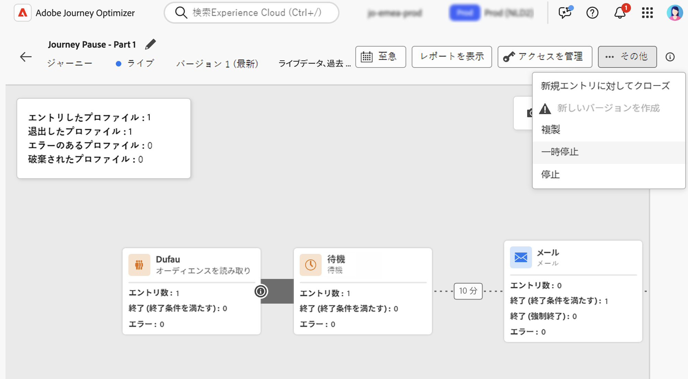

# ジャーニーの一時停止 {#journey-pause}

>[!CONTEXTUALHELP]
>id="ajo_journey_pause"
>title="ジャーニーの一時停止"
>abstract="新しいプロファイルがエントリしないように、ライブジャーニーを一時停止します。ジャーニー内の現在のプロファイルを破棄するか、そのまま保持するかを選択します。保持した場合、ジャーニーを再開すると、次のアクションアクティビティでプロファイルの実行が再開されます。進行状況を失うことなく、更新や緊急停止するのに最適です。"

いつでもライブジャーニーを一時停止し、必要なすべての変更を実行して、再開できます。<!--You can choose whether the journey is resumed at the end of the pause period, or whether it stops completely. -->一時停止中に、[プロファイル属性の終了条件を適用](#journey-exit-criteria)して、属性に基づいてプロファイルを除外できます。ジャーニーは、一時停止期間の終了時に自動的に再開されます。また、[手動で再開](#journey-resume-steps)することもできます。

## 主なメリット {#journey-pause-benefits}

ジャーニーの一時停止と再開により、顧客体験を中断することなくライブジャーニーを一時的に中断できるので、ジャーニー実務担当者はより優れた制御と柔軟性を得ることができます。一時停止すると、通信は送信されず、ジャーニーが再開されるまでプロファイルは中断状態のままになります。

この機能により、エラーや更新（例：メッセージコンテンツの変更）中に意図しないメッセージを送信するリスクが軽減され、より安全なジャーニー管理がサポートされ、実務担当者の信頼性が向上します。一時停止したジャーニーとそのステータスを UI で直接確認できるので、透明性と運用の俊敏性がさらに向上します。

>[!CAUTION]
>
>* ジャーニーを一時停止および再開する権限は、**[!DNL Publish journeys]** の高レベル権限を持つユーザーに制限されます。[!DNL Journey Optimizer] ユーザーのアクセス権の管理について詳しくは、[この節](../administration/permissions-overview.md)を参照してください。
>
>* 一時停止／再開機能の使用を開始する前に、[ガードレールと制限のトピックに目を通してください](#journey-pause-guardrails)。


## ジャーニーを一時停止する方法 {#journey-pause-steps}

任意の&#x200B;**ライブ**&#x200B;ジャーニーを一時停止できます。

ジャーニーを一時停止するには、次の手順に従います。

1. 一時停止するジャーニーを開きます。
1. ジャーニーキャンバスの右上のセクションにある「**...その他**」ボタンをクリックし、「**一時停止**」を選択します。

   

1. 現在ジャーニーにあるプロファイルの管理方法を選択します。

   {width="50%" align="left"}

   実行できる操作は、次のとおりです。

   * プロファイルを&#x200B;**保持** - ジャーニーが再開されるまで、プロファイルは次の&#x200B;**アクション**&#x200B;ノードで待機します
   * プロファイルを&#x200B;**破棄** - 次の&#x200B;**アクション**&#x200B;ノードのジャーニーから、プロファイルは除外されます

   ジャーニーを一時停止すると、ある時点で再開する予定であると想定されます。ただし、ジャーニーは無期限に一時停止したままにすることはできません。これを防ぐには、ジャーニーを一時停止する期間（1～14 日間）を定義します。選択した日数が経過すると、ジャーニーは自動的に再開されます。

1. 「**一時停止**」ボタンをクリックして、確定します。

組織の一時停止中ジャーニーに保持できるプロファイルの最大数は、ジャーニーインベントリに表示されます。1 つ以上のジャーニーを一時停止している場合にのみ表示されます。また、このインジケーターには、一時停止したジャーニーの合計数も表示されます。これは 30 分ごとに更新されます。詳しくは、[ガードレールと制限](#guardrails-and-limitations)を参照してください。

{width="50%" align="left"}

ジャーニーのリストから、1 つまたは複数の&#x200B;**ライブ**&#x200B;ジャーニーを一時停止できます。ジャーニーのグループを一時停止（_一括一時停止_）するには、リストでジャーニーを選択し、画面下部の青いバーにある「**一時停止**」ボタンをクリックします。「**一時停止**」ボタンは、**ライブ**&#x200B;ジャーニーを選択した場合にのみ使用できます。


## 一時停止したジャーニーの実行ロジック {#journey-pause-exec}

ジャーニーを一時停止した場合、保持／破棄モードに関係なく、新しいエントリは常に破棄されます。

ジャーニーを一時停止した場合、プロファイル管理とアクティビティの実行はアクティビティによって異なります。動作の詳細は次のとおりです。完全に理解するには、この[エンドツーエンドのサンプル](#journey-pause-sample)も参照してください。


| ジャーニーアクティビティ | ジャーニーが一時停止している場合 |
|-------------------------|--------------------------------------------------|
| [オーディエンスの選定](audience-qualification-events.md) | <ul> <li>キャンバスの最初のノードの場合：オーディエンスに対するプロファイルの選定は破棄されます </li><li>他のノードの場合：ライブジャーニーと同じ動作ですが、オーディエンスの選定が<strong>アクション</strong>アクティビティの後にあり、ユーザーがそのアクションで一時停止している場合、オーディエンスの選定は破棄されます。 </li></ul> |
| [単一イベント](general-events.md) | <ul> <li>キャンバスの最初のノードの場合：イベントは破棄されます</li><li>他のノードの場合：ライブジャーニーと同じ動作ですが、イベントが<strong>アクション</strong>アクティビティの後にあり、ユーザーがそのアクションで一時停止している場合、イベントは破棄されます。 </li></ul> |
| [オーディエンスを読み取り](read-audience.md) | ライブジャーニーと同じ動作ですが、特異性がいくつかあります。 <ol> <li> <strong>オーディエンスを読み取り</strong>アクティビティの開始後に「<strong>一時停止</strong>」を押した場合、ジャーニーにエントリしたプロファイルは（次の<strong>アクション</strong>アクティビティまで）続行されます。ジャーニーは一定の速度でオーディエンスを読み取るので、完全なオーディエンスがまだエントリしていない場合、キューに残っているプロファイルは破棄されます。</li><li> 単一実行の場合：スケジュール済みの日付が再開日より前であった場合、再開時にエラーは表示されません。そのスケジュールは無視されます。</li><li>増分ジャーニーの場合： <ul><li>最初の発生前に一時停止が発生した場合、再開時に完全なオーディエンスが再生されます。 </li><li>例えば、毎日の繰り返しの 4 日目に一時停止が発生し、ジャーニーが 9 日目まで一時停止されたままの場合、再開時には 4 日目から 9 日目までにエントリしたすべてのプロファイルが含まれます。  </li></ul></ol> |
| [反応](reaction-events.md) | ライブジャーニーと同じ動作ですが、反応が<strong>アクション</strong>アクティビティの後にあり、ユーザーがそのアクションで一時停止している場合、反応イベントは破棄されます。 |
| [待機](wait-activity.md) | ライブジャーニーと同じ動作です |
| [条件](condition-activity.md) | ライブジャーニーと同じ動作です |
| [コンテンツの決定](content-decision.md) | プロファイルは、ジャーニーを一時停止した際に、ユーザーが選択した内容に基づいて保持または破棄されます。 |
| [チャネルアクション](journeys-message.md) | プロファイルは、ジャーニーを一時停止した際に、ユーザーが選択した内容に基づいて保持または破棄されます。 |
| [カスタムアクション](../action/action.md) | プロファイルは、ジャーニーを一時停止した際に、ユーザーが選択した内容に基づいて保持または破棄されます。 |
| [プロファイルを更新](update-profiles.md)および[ジャンプ](jump.md) | プロファイルは、ジャーニーを一時停止した際に、ユーザーが選択した内容に基づいて保持または破棄されます。 |
| [外部データソース](../datasource/external-data-sources.md) | ライブジャーニーと同じ動作です |
| [終了条件](journey-properties.md#exit-criteria) | ライブジャーニーと同じ動作です |


破棄をトラブルシューティングする方法について詳しくは、[この節](#discards-troubleshoot)を参照してください。

## 一時停止したジャーニーを再開する方法 {#journey-resume-steps}

>[!CONTEXTUALHELP]
>id="ajo_journey_resume"
>title="ジャーニーを再開"
>abstract="新しいプロファイルが再びエントリできるように、一時停止したジャーニーを再開します。プロファイルが一時停止中に待機していた場合、ジャーニーは続行されます。更新または一時停止後にジャーニーを安全に再開するのに最適です。"

一時停止したジャーニーは、14 日間の最大一時停止期間の終了時に自動的に再開されます。いつでも手動で再開できます。一時停止したジャーニーを再開すると、新しいプロファイルが再びエントリできます。プロファイルが一時停止中に待機していた場合、ジャーニーは続行されます。更新または一時停止後にジャーニーを安全に再開するのに最適です。

一時停止したジャーニーを再開し、ジャーニーイベントのリッスンを再開するには、次の手順に従います。

1. 再開するジャーニーを開きます。
1. ジャーニーキャンバスの右上のセクションにある「**...その他**」ボタン、「**再開**」の順に選択します。

   ジャーニーは&#x200B;**再開中**&#x200B;ステータスに切り替わります。ジャーニーが再開すると、1 分以内に新しいエントリが開始されます。保持されたプロファイルの再開には時間がかかる場合があります - プロファイルは 5k tps の速度で再開されます。ジャーニーを再び&#x200B;**ライブ**&#x200B;にするには、すべてのプロファイルを再開する必要があり、**再開中**&#x200B;ステータスから&#x200B;**ライブ**&#x200B;ステータスへのトランジションには時間がかかる場合があります。

1. 「**再開**」ボタンをクリックして、確定します。


ジャーニーのリストから、1 つまたは複数の&#x200B;**一時停止した**&#x200B;ジャーニーを再開できます。ジャーニーのグループを再開（_一括再開_）するには、ジャーニーを選択し、画面下部の青いバーにある「**再開**」ボタンをクリックします。「**再開**」ボタンは、**一時停止した**&#x200B;ジャーニーを選択した場合にのみ使用できます。


## 一時停止したジャーニーへの終了条件の適用 {#journey-exit-criteria}

ジャーニーを一時停止した場合、プロファイル属性に基づいて終了条件を適用できます。このフィルターを使用すると、再開時に、定義済みの式に一致するプロファイルを除外できます。プロファイル属性ベースの終了条件が設定されると、新しいプロファイルのエントリの場合でも、アクションノードでこの条件が適用されます。条件に一致する既存のプロファイルとジャーニーにエントリする新しいプロファイルは、発生する&#x200B;**次のアクションノード**&#x200B;でジャーニーから除外されます。

例えば、すべてのフランス人の顧客を一時停止したジャーニーから除外するには、次の手順に従います。

1. 変更する一時停止したジャーニーを参照します。

1. **終了条件**&#x200B;アイコンを選択します。

   

1. **終了条件**&#x200B;設定で、「**終了条件を追加**」をクリックし、プロファイル属性に基づいてフィルターを定義します。

1. 式を設定して、国属性がフランスに等しいプロファイルを除外します。

   

1. フィルターを保存し、「**ジャーニーを更新**」ボタンをクリックして変更を適用します。

1. [ジャーニーを再開します](#journey-resume-steps)。

   再開時に、国属性がフランスに設定されたすべてのプロファイルが、次のアクションノードでジャーニーから自動的に除外されます。ジャーニーへのエントリを試みる、国属性がフランスに設定された新しいプロファイルは、次のアクションノードでもブロックされます。

現在ジャーニー内にあるプロファイルと新しいプロファイルのプロファイル除外は、**アクションノードに到達した場合**&#x200B;にのみ発生します。

>[!CAUTION]
>
>* ジャーニーごとに設定できるプロファイル属性ベースの終了条件は **1 つ**&#x200B;のみです。
>
>* **一時停止した**&#x200B;ジャーニーでは、プロファイル属性ベースの終了条件の作成、更新、削除のみ行うことができます。
>
>* プロファイル属性ベースの終了条件について詳しくは、[この節](journey-properties.md#profile-exit-criteria)を参照してください。

## ガードレールと制限 {#journey-pause-guardrails}

* ジャーニーバージョンは最大 **14 日間**&#x200B;一時停止できます。一時停止したジャーニーでは、組織全体で最大 **1,000 万のプロファイル**が許可されます。
この制限は 30 分ごとに確認されます。つまり、一時的に 1,000 万のしきい値を超える可能性がありますが、システムが検出すると、追加のプロファイルは自動的に破棄されます。

  保留中のプロファイルの数を制限以下に戻すのにジャーニーを再開すると、ジャーニーはすぐに再開されますが、プロファイル数が更新されるまでに最大 30 分かかる場合があります。その間、システムは、引き続きこれらのプロファイルを一時停止中であると見なす場合があります。

* [インバウンドアクティビティ](../channels/gs-channels.md#inbound-channels)（例：アプリ内、web など）を含むジャーニーの場合、ジャーニーを一時停止しても、既にトリガーされている通信は中断されません。プロファイルが一時停止の前にインバウンドアクティビティの対象として選定した場合、対応するメッセージは引き続き配信されます。すべてのインバウンド通信を完全に停止するには、ジャーニーを停止する必要があります。
* 一時停止したジャーニーは、ライブジャーニーの割り当て量にカウントされます
* ジャーニーにエントリしたが、一時停止中に破棄されたプロファイルは、引き続きエンゲージメント可能なプロファイルとしてカウントされます
* 一時停止したジャーニーは、ライブの場合と同様に、すべてのビジネスルールで考慮されます
* ジャーニーのグローバルタイムアウトは、一時停止したジャーニーに引き続き適用されます。例えば、プロファイルが 90 日間ジャーニー内にあり、そのジャーニーを一時停止した場合、このプロファイルは 91 日目にジャーニーから離脱します
* プロファイルは、アクションアクティビティに到達すると、一時停止したジャーニーで&#x200B;**破棄**&#x200B;されます。ジャーニーの一時停止中に待機のままで、ジャーニーを再開した後に待機から離脱すると、ジャーニーは続行され、破棄されません。[エンドツーエンドのサンプルを参照してください](#journey-pause-sample)
* 一時停止後もイベントは引き続き処理されるので、これらのイベントは 1 秒あたりのジャーニーイベント数の割り当て量にカウントされ、その後は単一イベントにスロットルが適用されます
* プロファイルを一時停止したジャーニーで保持すると、再開時にプロファイル属性が更新されます
* 一時停止したジャーニーで条件は引き続き実行されるので、データ品質の問題によりジャーニーが一時停止している場合は、アクションノードの前の任意の条件が誤ったデータで評価される場合があります
* 増分オーディエンスベースの&#x200B;**オーディエンスを読み取り**&#x200B;ジャーニーの場合は、一時停止の時間が考慮されます。これは、オーディエンスの選定またはイベントベースのジャーニーには当てはまりません（一時停止中にオーディエンスの選定またはイベントを受信し、ジャーニーの最初のアクティビティである場合、これらのイベントは破棄されます）
* プロファイルをジャーニーで保持し、このジャーニーを数日後に自動的に再開する場合、プロファイルはジャーニーを続行し、ドロップされません。ドロップする場合は、ジャーニーを停止する必要があります
* 一時停止したジャーニーでは、[バッチセグメントアラート](../reports/alerts.md#alert-read-audiences)のアラートは発生しません
* ジャーニーの 14 日間一時停止状態が終了すると、システムに監査ログが残りません
* 破棄されたプロファイルの一部は、ジャーニーステップイベントには表示されますが、レポートには表示されません。例：
   * **オーディエンスを読み取り**&#x200B;のビジネスイベントが破棄される
   * 一時停止したジャーニーにより、**オーディエンスを読み取り**&#x200B;ジョブがドロップされる
   * プロファイルが待機していたアクションの後にイベントアクティビティがあった場合、**イベント**&#x200B;は破棄される


## エンドツーエンドのサンプル {#journey-pause-sample}

次のジャーニーを例に取ります。

{zoomable="yes"}

このジャーニーを一時停止する際に、プロファイルを&#x200B;**破棄**&#x200B;するか&#x200B;**保持**&#x200B;するかを選択すると、プロファイル管理は次のようになります。

1. **買い物かごに追加**&#x200B;アクティビティ：すべての新しいプロファイルのエントリがブロックされます。プロファイルが一時停止の前に既にジャーニーにエントリしている場合、次のアクションノードに進みます。
1. **待機**&#x200B;アクティビティ：ジャーニーが一時停止している場合でも、プロファイルは引き続きノードで通常どおりに待機し、ノードを終了します。
1. **条件**：プロファイルは、引き続き条件を通過し、条件で定義された式に基づいて適切な分岐に移動します。
1. **プッシュ**／**メール**&#x200B;アクティビティ：一時停止したジャーニー中、プロファイルは次のアクションノードで待機を開始するか、破棄されます（一時停止時のユーザーの選択に基づきます）。そのため、プロファイルはそこで待機を開始するか、破棄されます。
1. **アクション**&#x200B;ノードの後の&#x200B;**イベント**：プロファイルが&#x200B;**アクション**&#x200B;ノードで待機していて、その後に&#x200B;**イベント**&#x200B;アクティビティがある場合、そのイベントが発生すると、イベントは破棄されます。

この動作により、一時停止したジャーニーでプロファイル数が増加していることを確認できます。主に&#x200B;**アクション**&#x200B;アクティビティの前のアクティビティで増加します。例えば、この例では、**待機**&#x200B;アクティビティは有効になっているので、離脱する際に、**条件**&#x200B;アクティビティを通過するプロファイル数が増加します。

このジャーニーを再開した場合：

1. 1 分以内に新しいジャーニーのエントリが開始されます。
1. **アクション**&#x200B;アクティビティのジャーニーで現在待機していたプロファイルは、5k tps の速度で再開されます。その後、待機していた&#x200B;**アクション**&#x200B;にエントリし、ジャーニーを続行できます。

## 一時停止したジャーニーでのプロファイル破棄のトラブルシューティング {#discards-troubleshoot}

[Adobe Experience Platform クエリサービス](https://experienceleague.adobe.com/docs/experience-platform/query/api/getting-started.html?lang=ja){target="_blank"}を使用すると、ステップイベントのクエリを実行できます。これにより、プロファイルの破棄が発生したタイミングに応じて、プロファイルの破棄に関する詳細情報が提供されます。

* プロファイルがジャーニーにエントリする前に破棄が発生する場合は、次のコードを使用します。

  ```sql
  SELECT
  TIMESTAMP,
  _experience.journeyOrchestration.profile.ID,
  to_json(_experience.journeyOrchestration)
  FROM
  journey_step_events
  WHERE
  _experience.journeyOrchestration.serviceEvents.dispatcher.eventType = 'PAUSED_JOURNEY_VERSION'
  AND _experience.journeyOrchestration.journey.versionID=<jvId>  
  ```

  これにより、ジャーニーのエントリ時に発生した破棄がリストされます。

   1. オーディエンスジャーニーが実行中で、最初のノードがまだ処理中の場合、ジャーニーが一時停止すると、未処理のプロファイルはすべて破棄されます。

   1. ジャーニーの一時停止中に、開始ノードに新しい単一イベントが（エントリをトリガーするために）到達すると、そのイベントは破棄されます。

* プロファイルが既にジャーニー内にある際に破棄が発生する場合は、次のコードを使用します。

  ```sql
  SELECT
  TIMESTAMP,
  _experience.journeyOrchestration.profile.ID,
  to_json(_experience.journeyOrchestration)
  FROM
  journey_step_events
  WHERE
  _experience.journeyOrchestration.serviceEvents.stateMachine.eventType = 'JOURNEY_IN_PAUSED_STATE'
  AND _experience.journeyOrchestration.journey.versionID=<jvId> 
  ```

  このコマンドにより、プロファイルがジャーニー内にある際に発生した破棄がリストされます。

   1. 破棄オプションを有効にしてジャーニーを一時停止し、一時停止前にプロファイルが既にエントリしている場合、そのプロファイルは、次のアクションノードに到達すると破棄されます。

   1. 保持オプションを選択してジャーニーを一時停止したが、1,000 万の割り当て量を超えたことによりプロファイルが破棄された場合、それらのプロファイルは次のアクションノードに到達した際にも破棄されます。


