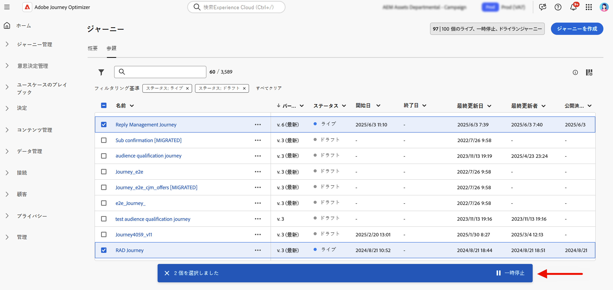
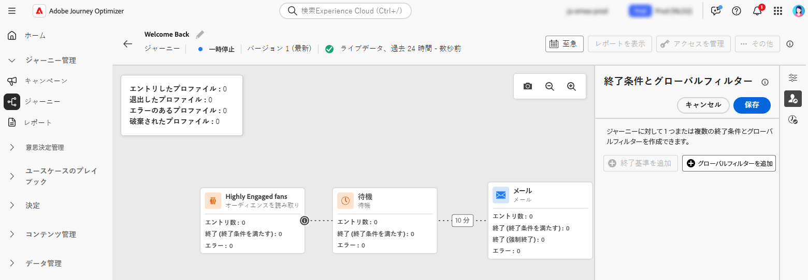

# ジャーニーの一時停止 {#journey-pause}

>[!CONTEXTUALHELP]
>id="ajo_journey_pause"
>title="ジャーニーを一時停止"
>abstract="ライブジャーニーを一時停止して、新しいプロファイルがエントリしないようにします。 ジャーニー内の現在のプロファイルを破棄するか、そのまま残すかを選択します。 保持すると、ジャーニーが再開された次のアクションアクティビティで実行が再開されます。 アップデートや緊急停止に最適で、進捗を失うことはありません。"

ライブジャーニーは一時停止し、必要なすべての変更を実行して、いつでも再開できます。<!--You can choose whether the journey is resumed at the end of the pause period, or whether it stops completely. --> 一時停止中に [ グローバルフィルターを適用 ](#journey-global-filters) して、属性に基づいてプロファイルを除外できます。 ジャーニーは、一時停止期間が終了すると自動的に再開されます。 また、[ 手動で再開する ](#journey-resume-steps) こともできます。

>[!AVAILABILITY]
>
>この機能は一連の組織（限定提供）でのみ使用でき、今後のリリースでグローバルに展開されます。

## 主なメリット {#journey-pause-benefits}

ジャーニーの一時停止と再開は、ジャーニー実務担当者に対して、カスタマーエクスペリエンスを中断することなくライブジャーニーを一時的に停止できるようにすることで、コントロールと柔軟性を高めます。 一時停止すると、通信は送信されず、プロファイルはジャーニーが再開されるまで休止状態のままになります。

この機能により、エラーや更新（例：メッセージコンテンツの変更）中に意図しないメッセージが送信されるリスクが軽減され、より安全なジャーニー管理がサポートされ、実務担当者の信頼性が高まります。 一時停止されたジャーニーとそのステータスを UI で直接確認できるので、透明性と運用の俊敏性がさらに高まります。

>[!CAUTION]
>
>* ジャーニーを一時停止および再開する権限は、**[!DNL Publish journeys]** の高レベル権限を持つユーザーに制限されます。 [!DNL Journey Optimizer] ユーザーのアクセス権の管理について詳しくは、[この節](../administration/permissions-overview.md)を参照してください。
>
>* 一時停止/再開機能の使用を開始する前に、[ ガードレールと制限事項を参照 ] (journey-pause-guardrails) してください。

## ジャーニーの一時停止方法 {#journey-pause-steps}

任意の **ライブ** ジャーニーを一時停止できます。

ジャーニーを一時停止するには、次の手順に従います。

1. 一時停止するジャーニーを開きます。
1. ジャーニーキャンバスの右上のセクションにある「**...その他**」ボタンをクリックし、「**一時停止**」を選択します。

   {width="80%" align="left"}

1. ジャーニーに現在あるプロファイルの管理方法を選択します。

   {width="50%" align="left"}

   実行できる操作は、次のとおりです。

   * **保留** プロファイル – プロファイルは、ジャーニーが再開されるのを待ちます
   * **破棄** プロファイル – プロファイルは、次のアクションノードでジャーニーから除外されます

1. **一時停止** ボタンをクリックして確定します。

ジャーニーのリストから、1 つまたは複数の **ライブ** ジャーニーを一時停止できます。 ジャーニーのグループを一時停止（_一括一時停止_）するには、リストでジャーニーを選択し、画面下部の青いバーにある **一時停止** ボタンをクリックします。 **一時停止** ボタンは、**ライブ** ジャーニーが選択されている場合にのみ使用できます。

{width="80%" align="left"}

### 一時停止したジャーニーの動作

ジャーニーが一時停止すると、保留/破棄モードに関係なく、新しいエントリは常に破棄されます。

ジャーニーの一時停止時のプロファイル管理は、アクティビティによって異なります。 動作について詳しくは、以下を参照してください。 詳しくは、この [ エンドツーエンドのサンプル ](#journey-pause-sample) も参照してください。

| ジャーニーアクティビティ | プロファイル管理 | メモ |
|-------------------------|--------------------------------------------------|------------------------|
| [ オーディエンスの選定 ](audience-qualification-events.md) | 最初のノード：破棄された   その他のノード：ライブジャーニーの場合と同じ動作ですが、オーディエンスの選定がアクションアクティビティの後にあり、ユーザーがそのアクションで一時停止した場合、オーディエンスの選定は破棄されます。 |          |
| [ ビジネスイベント ](general-events.md) | 破棄 |    |
| [ 単一イベント ](general-events.md) | 最初のノード：破棄   その他のノード：ライブジャーニーの場合と同じ動作ですが、イベントがアクションアクティビティの後にあり、そのアクションでユーザーが一時停止した場合、イベントは破棄されます。 | メッセージを作成 |
| [ オーディエンスを読み取り ](read-audience.md) | ライブジャーニーの場合と同じ動作ですが、特異性がいくつかあります。  オーディエンスを読み取りアクティビティが開始された後に「一時停止」を押した場合、ジャーニーにエントリしたプロファイルは（次のアクションアクティビティまで）継続します。 ジャーニーが一定の速度でオーディエンスを読み取る際、オーディエンス全体がまだエントリしていない場合、キュー内の残りのプロファイルは破棄されます。 | - 1 回実行の場合：スケジュールされた日付が再開日より前の場合、再開時にエラーは表示されません。 そのスケジュールは無視されます。   – 増分ジャーニーの場合：  最初の発生より前に一時停止が発生した場合は、再開時にオーディエンス全体が再生されます。   例えば、一時停止が毎日の繰り返しの 4 日目に発生した場合、ジャーニーは 9 日目まで一時停止されたままになり、再開時には、4 日から 9 日までにエントリしたすべてのプロファイルが含まれます |
| [ 反応 ](reaction-events.md) | ライブジャーニーの場合と同じ動作ですが、反応がアクションアクティビティの後にあり、ユーザーがそのアクションで一時停止した場合、イベントは破棄されます。 |
| [待機](wait-activity.md) | ライブジャーニーと同じ動作 |           |
| [条件](condition-activity.md) | ライブジャーニーと同じ動作 |         |
| コンテンツの決定 | プロファイルは、ジャーニーが一時停止された際にユーザーが選択した内容に基づいて保留または破棄されます |            |
| [ チャネルアクション ](journeys-message.md) | プロファイルは、ジャーニーが一時停止された際にユーザーが選択した内容に基づいて保留または破棄されます |          |
| [ カスタムアクション ](../action/action.md) | プロファイルは、ジャーニーが一時停止された際にユーザーが選択した内容に基づいて保留または破棄されます |            |
| [ プロファイルを更新 ](update-profiles.md) &amp; [ ジャンプ ](jump.md) |  |       |
| [ 外部データのSource](../datasource/external-data-sources.md) | ライブジャーニーと同じ動作 |           |
| [ 終了条件 ](journey-properties.md#exit-criteria) | ライブジャーニーと同じ動作 |           |

## 一時停止したジャーニーの再開方法 {#journey-resume-steps}

>[!CONTEXTUALHELP]
>id="ajo_journey_resume"
>title="ジャーニーの再開"
>abstract="一時停止したジャーニーを再開して、新しいプロファイルが再びエントリできるようにします。 プロファイルが一時停止中に待機していた場合、ジャーニーは続行されます。 更新や一時停止の後にジャーニーを安全に再開する場合に最適です。"

一時停止されたジャーニーは、14 日間の最大一時停止期間の最後に、自動的に再開されます。 いつでも手動で再開できます。 一時停止したジャーニーを再開すると、新しいプロファイルを再び入力できます。 プロファイルが一時停止中に待機していた場合、ジャーニーは続行されます。 更新や一時停止の後にジャーニーを安全に再開する場合に最適です。

一時停止したジャーニーを再開し、ジャーニーイベントのリッスンを再開するには、次の手順に従います。

1. 再開するジャーニーを開きます。
1. ジャーニーキャンバスの右上のセクションにある「**...その他**」ボタンをクリックし、「**再開**」を選択します。

   ジャーニーは **再開中** ステータスに切り替わります。 ジャーニーが再開されると、1 分以内に新しいエントリが開始されます。 保持されたプロファイルの再開には時間がかかる場合があります。  ジャーニーを再度 **ライブ** にするには、すべてのプロファイルを再開する必要があるので、**再開中** ステータスから **ライブ** ステータスへの移行に時間がかかることがあります。

1. **再開** ボタンをクリックして確定します。

ジャーニーのリストから、1 つまたは複数の **一時停止** ジャーニーを再開できます。 ジャーニーのグループ（_一括再開_）を再開するには、ジャーニーを選択し、画面の下部にある青いバーにある **再開** ボタンをクリックします。 「**再開** ボタンは、**一時停止** ジャーニーが選択された場合にのみ使用できます。

## 一時停止したジャーニーのプロファイルへのグローバルフィルターの適用  {#journey-global-filters}

ジャーニーが一時停止している場合、プロファイル属性に基づいてグローバルフィルターを適用できます。 このフィルターを使用すると、再開時に、定義した式に一致するプロファイルを除外できます。 グローバルフィルターを設定すると、新しいプロファイルエントリに対しても、アクションノードに適用されます。 条件に一致するプロファイルと、入力を試みる新しいプロファイルは、発生した **次のアクションノードで** ジャーニーから除外されます。

例えば、一時停止したジャーニーからすべてのフランス人の顧客を除外するには、次の手順に従います。

1. 変更する一時停止のジャーニーを参照します。

1. **条件とグローバルフィルターを終了** アイコンをクリックします。

   {width="50%" align="left"}

1. **終了条件とグローバルフィルター** 設定で「**グローバルフィルターを追加**」をクリックし、プロファイル属性に基づいてフィルターを定義します。

1. 式を設定して、国属性がフランスに等しいプロファイルを除外します。

   {width="50%" align="left"}

1. フィルターを保存し、「**ジャーニーを更新**」ボタンをクリックして変更を適用します。

1. [ ジャーニーを再開します ](#journey-resume-steps)。

   再開時に、国属性がフランスに設定されたすべてのプロファイルは、次のアクションノードでジャーニーから自動的に除外されます。 ジャーニーへのエントリを試みる際、国属性がフランスに設定された新しいプロファイルは、次のアクションノードでブロックされます。

現在ジャーニー内にあるプロファイルと新しいプロファイルのプロファイル除外は、アクションノードに到達した場合にのみ発生することに注意してください。

>[!CAUTION]
>
>* ジャーニーごとに設定できる **1** グローバルフィルターは 1 つだけです。
>
>* **一時停止** ジャーニーでは、グローバルフィルターの作成、更新、削除のみ行えます。

## ガードレールと制限 {#journey-pause-guardrails}

* ジャーニーのバージョンは、最大 14 日間一時停止できます。
* 一時停止されたジャーニーは、すべてのビジネスルールで、ライブの場合と同様に考慮されます。
* プロファイルは、アクションアクティビティに到達すると、一時停止されたジャーニーで「破棄」されます。 ジャーニーの一時停止中に待機し、再開後に待機を終了した場合、ジャーニーは続行され、破棄されません。
* 一時停止した後もイベントが処理され続けると、これらのイベントは 1 秒あたりのジャーニーイベント数の割り当てにカウントされ、その後にスロットルが単一イベントとして認識されます。
* ジャーニーにエントリしたが、一時停止中に破棄されたプロファイルは、引き続きエンゲージメント可能なプロファイルとしてカウントされます。
* プロファイルが一時停止したジャーニーを保持すると、再開時にプロファイル属性が更新されます
* 条件は一時停止したジャーニーでも実行されるので、データ品質の問題が原因でジャーニーが一時停止された場合、アクションノード前の条件を誤ったデータで評価できます。
* 増分オーディエンスベースのオーディエンスを読み取りジャーニーの場合は、一時停止の時間が考慮されます。 例えば、毎日のジャーニーの場合、2 日に一時停止して月の 5 日に再開した場合、6 日に実行すると、1 日から 6 日までに選定されたすべてのプロファイルが取得されます。 これは、オーディエンスの選定またはイベントベースのジャーニーには当てはまりません（オーディエンスの選定またはイベントを一時停止中に受け取った場合、それらのイベントは破棄されます）。
* 一時停止したジャーニーは、ライブジャーニーの割り当てにカウントされます。
* ジャーニーのグローバルタイムアウトは、一時停止されたジャーニーにも適用されます。 例えば、プロファイルが 90 日間ジャーニーにあり、ジャーニーを一時停止した場合、このプロファイルは 91 日目にジャーニーを終了します。
* プロファイルがジャーニーに保持され、このジャーニーが数日後に自動的に再開された場合、プロファイルはジャーニーを継続し、ドロップされません。 ドロップする場合は、ジャーニーを停止する必要があります。
* 一時停止したジャーニーでは、バッチセグメントアラートに対してアラートは実行されません。
* ジャーニーの 14 日間一時停止状態が終了すると、システムに監査ログが残りません。
* 破棄されたプロファイルの中には、ジャーニーステップイベントには表示できても、レポートには表示されないものもあります。 例えば、「オーディエンスを読み取り」のビジネスイベントを破棄する、ジャーニーの一時停止によってオーディエンスを読み取りジョブが破棄される、イベントアクティビティがアクションの後でプロファイルが待機していた場合にイベントが破棄される、などがあります。
  <!--* There is a guardrail (at an org level) on the max number of profiles that can be held in paused journeys. This guardrail is per org, and is visible in the journey inventory on a new bar (only visible when there are paused journeys).-->

## エンドツーエンドのサンプル {#journey-pause-sample}

次のジャーニーの例を見てみましょう。

{width="50%" align="left"}

このジャーニーを一時停止する際は、プロファイルを **破棄** するか **保持** するかを選択します。次に、プロファイル管理を次に示します。

1. **AddToCart** アクティビティ：すべての新しいプロファイルのエントリがブロックされます。 プロファイルが一時停止の前に既にジャーニーにエントリしている場合、そのプロファイルは次のアクションノードに進みます。
1. **待機** アクティビティ：ジャーニーが一時停止している場合でも、プロファイルは引き続きノードで通常どおりに待機し、ノードから終了します。
1. **条件**：プロファイルは、引き続き条件を通過し、条件に定義された式に基づいて右側の分岐に移動します。
1. **プッシュ**/**メール** アクティビティ：一時停止したジャーニー中、プロファイルは待機を開始するか、次のアクションノードで（一時停止時のユーザーの選択に基づいて）破棄されます。 そのため、プロファイルはそこで待機を開始するか、破棄されます。
1. アクションノードの後の **イベント**：プロファイルがアクションノードを待機していて、その後にイベントがある場合、そのイベントが発生すると、プロファイルは破棄されます。

この動作に従って、一時停止したジャーニー（主にアクションの前のアクティビティ）で、プロファイル数が増加していることがわかります。 例えば、この例では、「待機」は無視され、条件アクティビティを実行するプロファイルの数が増えます。

このジャーニーを再開した場合：

1. 1 分以内に新しいジャーニーのエントリが開始されます
1. アクションアクティビティのジャーニーで現在待機しているプロファイルは、5,000 件の速度で再開されます。 その後、待機していたアクションに入り、ジャーニーを続行します。
