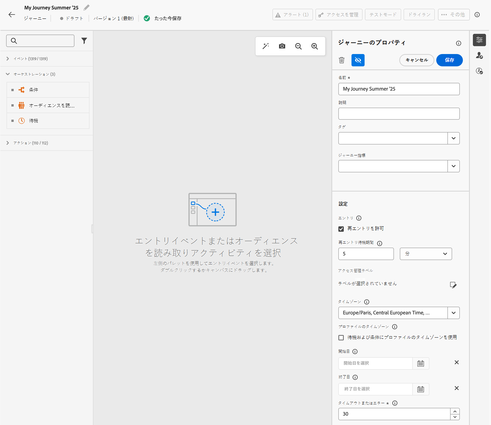
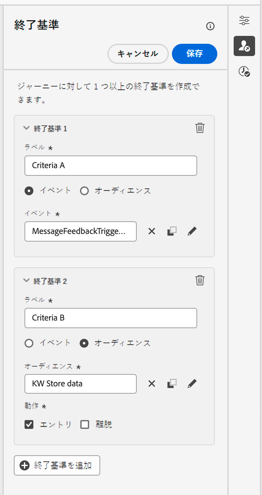

# ジャーニーのプロパティの設定 {#jo-properties}

>[!CONTEXTUALHELP]
>id="ajo_journey_properties"
>title="ジャーニーのプロパティ"
>abstract="この節では、ジャーニーのプロパティについて説明します。デフォルトでは、読み取り専用のパラメーターは非表示です。使用可能な設定は、ジャーニーのステータス、権限および製品設定によって異なります。"

## ジャーニーのプロパティへのアクセス {#access-properties}

ジャーニーのプロパティは、右側のパネルで一元化されます。このセクションは、新しいジャーニーを作成する際にデフォルトで表示されます。既存のジャーニーの場合は、ジャーニー名の横にある鉛筆アイコンをクリックして開きます。

このセクションでは、ジャーニーの名前を定義し、説明を追加して、ジャーニーのグローバルプロパティを設定します。

実行できる操作は、次のとおりです。

* ジャーニーを簡単に分類し、キャンペーンリストからの検索を向上させるために、Adobe Experience Platform 統合タグをジャーニーに割り当てます。[タグの操作方法の詳細情報](../start/search-filter-categorize.md#tags)
* ジャーニー指標を選択します。[ジャーニー指標の設定とトラッキング方法の詳細情報](success-metrics.md)
* [エントリと再エントリ](#entrance)を管理します。プロファイルエントリ管理は、ジャーニーのタイプに応じて異なります。詳しくは、[このページ](entry-management.md)を参照してください
* [データへのアクセス](#manage-access)を管理します
* ジャーニーとプロファイルの[タイムゾーン](#timezone)を選択します
* カスタムの[開始日と終了日](#dates)を選択します
* ジャーニーアクティビティの[タイムアウト期間](#timeout)を定義します（管理者ユーザーのみ）
* [競合管理ツール](#conflict)を使用して、競合を監視し、ジャーニーに優先順位を付けます

{width="80%"}{zoomable="yes"}

>[!NOTE]
>
>ライブジャーニーの場合、この画面には、ジャーニーを公開した日付とユーザーの名前のみが表示されます。

「**技術的な詳細をコピー**」オプションを使用すると、ジャーニーに関する技術情報をコピーでき、サポートチームはこの情報をトラブルシューティングに使用できます。 `JourneyVersion UID`、`OrgID`、`orgName`、`sandboxName`、`lastDeployedBy`、`lastDeployedAt` の情報がコピーされます。

特定のプロファイルのジャーニーに関連する技術的なフィールドとその使用方法について詳しくは、[このページ](expression/journey-properties.md)を参照してください。

## エントリと再エントリ {#entrance}

プロファイルエントリモードは、右側の設定パネルのジャーニーレベルで定義されます。設定は次のとおりです。

プロファイルエントリ管理は、ジャーニーのタイプに応じて異なります。プロファイルのエントリと再エントリの管理について詳しくは、[このページ](entry-management.md)を参照してください。

### 再エントリを許可  {#allow-reentrance}

>[!CONTEXTUALHELP]
>id="ajo_journey_properties_entrance"
>title="再エントリを許可"
>abstract="デフォルトでは、新規ジャーニーで再エントリが許可されています。例えば、入店時に 1 度だけギフトをオファーする場合は、この「**再エントリを許可**」オプションをオフにします。"
>additional-url="https://experienceleague.adobe.com/ja/docs/journey-optimizer/using/orchestrate-journeys/manage-journey/entry-management" text="プロファイルエントリ管理"

デフォルトでは、新規ジャーニーで再エントリが許可されています。「1 回限り」のジャーニー（例：入店時に 1 度だけギフトをオファーするなど）を作成するには、この「**再エントリを許可**」オプションをオフにします。

### 再エントリ待機期間  {#reentrance-wait}

>[!CONTEXTUALHELP]
>id="ajo_journey_properties_re-entrance_wait"
>title="再エントリ待機期間"
>abstract="単一のジャーニー内でプロファイルがジャーニーに再度エントリできるようになるまでの、待機時間を設定します。これにより、選択した期間、ユーザーはジャーニーに再エントリできなくなります。最大期間：90 日。"
>additional-url="https://experienceleague.adobe.com/ja/docs/journey-optimizer/using/orchestrate-journeys/manage-journey/entry-management" text="プロファイルエントリ管理"

「**再エントリを許可**」オプションがアクティベートされると、「**再エントリ待機期間**」フィールドが表示されます。このフィールドでは、（イベントまたはオーディエンスの選定で始まる）単一ジャーニーで、プロファイルがジャーニーに再度エントリできるようになるまでの待機時間を定義できます。これにより、ジャーニーが同じイベントに対して誤って複数回トリガーされるのを防ぎます。デフォルトでは、このフィールドは 5 分に設定されています。最大期間は 90 日です。

## アクセスの管理 {#manage-access}

アクセスラベルに基づいて、ジャーニーへのアクセスを制限できます。

カスタムデータ使用ラベルをジャーニーに割り当てるには、「**[!UICONTROL アクセスラベルを管理]**」アイコンをクリックし、1 つまたは複数のラベルを選択します。

[オブジェクトレベルのアクセス制御（OLAC）の詳細情報](../administration/object-based-access.md)

## ジャーニーとプロファイルのタイムゾーン {#timezone}

タイムゾーンはジャーニーレベルで定義されます。 固定タイムゾーンを入力するか、Adobe Experience Platform プロファイルを使用してジャーニーのタイムゾーンを定義できます。Adobe Experience Platform プロファイルでタイムゾーンが定義されている場合は、ジャーニーでそのタイムゾーンを取得できます。

[タイムゾーン管理の詳細情報](../building-journeys/timezone-management.md)

## 開始日と終了日 {#dates}

>[!CONTEXTUALHELP]
>id="ajo_journey_properties_start_date"
>title="開始日"
>abstract="プロファイルがジャーニーへのエントリを開始できる日付を選択します。開始日を設定しない場合、デフォルトでジャーニーの公開日になります。"

>[!CONTEXTUALHELP]
>id="ajo_journey_properties_end_date"
>title="終了日"
>abstract="ジャーニーが終了する日付を設定します。この日付で、アクティブなプロファイルはジャーニーを自動的に終了し、新しいエントリは許可されません。"

デフォルトでは、プロファイルは公開されるとすぐにジャーニーにエントリでき、[グローバルジャーニータイムアウト](#global_timeout)に達するまでそのまま残ります。唯一の例外は、「**繰り返し時に再エントリを強制する**」が有効になっている繰り返しのオーディエンスを読み取りジャーニーで、これは次回の実行の開始日に終了します。

必要に応じて、カスタムの&#x200B;**開始日**&#x200B;と&#x200B;**終了日**&#x200B;を定義できます。これにより、プロファイルは特定の日付にジャーニーにエントリし、終了日に達すると自動的に終了できます。

## タイムアウト {#timeout}

### ジャーニーアクティビティのタイムアウト {#timeout_and_error}

>[!CONTEXTUALHELP]
>id="ajo_journey_properties_timeout"
>title="タイムアウトまたはエラー"
>abstract="タイムアウトとして処理する前に、ジャーニーがアクションの実行または条件の評価を試行する時間を指定します。推奨値は 1～30 秒です。"

アクションまたは条件のアクティビティを編集するときに、エラーやタイムアウトが発生した場合の代替パスを定義できます。サードパーティシステムに問い合わせを行うアクティビティの処理が、ジャーニーのプロパティの「**[!UICONTROL タイムアウトまたはエラー]**」フィールドで定義されたタイムアウト時間を超えると、第 2 パスが選択されて、可能な代替アクションが実行されます。

推奨値は 1～30 秒です。

ジャーニーの時間が限られている場合（例：人のリアルタイムの位置情報に反応するなど）、アクションを数秒以上遅らせることができないため、非常に短い時間の&#x200B;**[!UICONTROL タイムアウトまたはエラー]**&#x200B;値を定義することをお勧めします。ジャーニーにそれほど時間的制約がない場合は、より長い値を使用して、有効な応答を送るために呼び出されるシステムにより多くの時間をを付与することができます。

ジャーニーでは、以下に詳しく説明するようにグローバルタイムアウトも使用します。

### グローバルジャーニーのタイムアウト {#global_timeout}

ジャーニーアクティビティで使用される[タイムアウト](#timeout_and_error)に加えて、グローバルジャーニーのタイムアウトが適用されます。インターフェイスに表示されず、変更できません。

ジャーニー内にいる個人の進捗は、エントリしてから **91 日**&#x200B;経過すると、このグローバルタイムアウトにより停止されます。つまり、個人のジャーニーは 91 日を超えることはできません。タイムアウト期間が経過すると、個人のデータは削除されます。タイムアウト期間が終了してもまだジャーニーに流入してくる個人がいる場合、それらは流入を停止され、レポートでは考慮されません。したがって、離脱する人物よりもジャーニーにエントリする人物の方が多くなる可能性があります。

91 日間のジャーニータイムアウトにより、ジャーニーの再エントリが許可されていない場合、再エントリのブロックが 91 日を超えて機能することは保証できません。実際、ジャーニーにエントリしたユーザーの情報はエントリから 91 日後にすべて削除されるので、91 日前より古い日時にエントリしたユーザーが誰かを特定することはできません。

個人が待機アクティビティにエントリできるのは、91 日のジャーニータイムアウトより前に待機期間を完了するのに十分な時間がジャーニーに残っている場合のみです。[このページ](../building-journeys/wait-activity.md)を参照してください。

#### 有効期間（TTL）とデータ保持に関する FAQ {#timeout-faq}

Adobe Journey Optimizer 2024年6月リリース以降、ジャーニーのグローバルタイムアウトが 30 日から 91 日に変更されました。影響については、以下の FAQ を参照してください。

**単一ジャーニーの場合**
<table style="table-layout:auto">
  <tr style="border: 1;">
    <td>
      
TTL 拡張機能のロールアウト後に公開されたジャーニーはどうなりますか？

    </td>
    <td>
      
新しいジャーニーにエントリするプロファイルの TTL は自動的に 91 日間になります。

    </td>
  </tr>
  <tr style="border: 1;">
    <td>
      
TTL 拡張機能の起動前に公開されたジャーニーにエントリするプロファイルはどうなりますか？

    </td>
    <td>
      
プロファイルの TTL は、ジャーニーが最初に公開された時間と一致して、30 日間（HIPAA の場合は 7 日間）になります。

    </td>
  </tr>
  <tr style="border: 1;">
    <td>
      
TTL 拡張機能の起動時に、既にジャーニーにエントリしているプロファイルはどうなりますか？

    </td>
    <td>
      
プロファイルは、ジャーニーの元の公開時間に従って、30 日間（HIPAA の場合は 7 日間）の TTL を保持します。

    </td>
  </tr>
  <tr style="border: 1;">
    <td>
      
TTL 拡張機能の起動後に再公開された以前のジャーニーバージョンのプロファイルはどうなりますか？

    </td>
    <td>
      
プロファイルは、元のジャーニーバージョンの公開時間に合わせて、30 日間（HIPAA の場合は 7 日間）の TTL を維持します。

    </td>
  </tr>
  <tr style="border: 1;">
    <td>
      
TTL 拡張機能の起動後に再公開されたジャーニーバージョンにエントリする新しいプロファイルはどうなりますか？

    </td>
    <td>
      
プロファイルの TTL は、新しく再公開されたジャーニーバージョンの TTL と一致して、91 日間になります。

    </td>
  </tr>
</table>

**セグメントトリガージャーニーの場合**

<table style="table-layout:auto">
  <tr style="border: 1;">
    <td>
      
TTL 拡張機能の後に公開された新しい 1 回限りのジャーニーはどうなりますか？

    </td>
    <td>
      
新しいジャーニーにエントリするプロファイルの TTL は自動的に 91 日間になります。

    </td>
  </tr>
  <tr style="border: 1;">
    <td>
      
TTL 拡張機能の後に公開された強制的な再エントリを伴わない、新しい繰り返しジャーニーはどうなりますか？

    </td>
    <td>
      
新しいジャーニーにエントリするプロファイルの TTL は自動的に 91 日間になります。

    </td>
  </tr>
  <tr style="border: 1;">
    <td>
      
TTL 拡張機能の後に公開された強制的な再エントリを伴う、新しい繰り返しジャーニーはどうなりますか？

    </td>
    <td>
      
新しいジャーニーにエントリするプロファイルの TTL は繰り返し期間と同じになります。例えば、ジャーニーが毎日実行される場合、TTL は 1 日間になります。

    </td>
  </tr>
  <tr style="border: 1;">
    <td>
      
TTL 拡張機能の起動前に公開されたジャーニーにエントリするプロファイルはどうなりますか？

    </td>
    <td>
      
プロファイルの TTL は、元の公開時間と一致して、30 日間（HIPAA の場合は 7 日間）になります。強制的な再エントリを伴う、繰り返しジャーニーの場合、TTL は繰り返し期間と一致します。

    </td>
  </tr>
  <tr style="border: 1;">
    <td>
      
TTL 拡張機能の起動時に、ジャーニーを実行中のプロファイルはどうなりますか？

    </td>
    <td>
      
プロファイルは、ジャーニーの元の公開時間に従って、30 日間（HIPAA の場合は 7 日間）の TTL を保持します。強制的な再エントリを伴う、繰り返しジャーニーの場合、TTL は繰り返し期間と一致します。

    </td>
  </tr>
  <tr style="border: 1;">
    <td>
      
TTL 拡張機能の起動後に再公開された以前のジャーニーバージョンの実行中のプロファイルはどうなりますか？

    </td>
    <td>
      
プロファイルは、元のジャーニーバージョンの公開時間に合わせて、30 日間（HIPPA の場合は 7 日間）の TTL を維持します。強制的な再エントリを伴う、繰り返しジャーニーの場合、TTL は繰り返し期間と一致します。

    </td>
  </tr>
  <tr style="border: 1;">
    <td>
      
TTL 拡張機能の起動後に再公開されたジャーニーバージョンにエントリする新しいプロファイルはどうなりますか？

    </td>
    <td>
      
プロファイルの TTL は、新しく再公開されたジャーニーバージョンの TTL と一致して、91 日間になります。強制的な再エントリを伴う、繰り返しジャーニーの場合、TTL は繰り返し期間と一致します。

    </td>
  </tr>
</table>

## 結合ポリシー {#merge-policies}

Adobe Journey Optimizer は、Adobe Experience Platform からプロファイルデータを取得する際に結合ポリシーを使用します。ジャーニータイプに応じて、異なる結合ポリシーが使用されます。

* オーディエンスを読み取りジャーニーまたはオーディエンスの選定ジャーニーの場合：オーディエンスからの結合ポリシーが使用されます
* 単一イベントジャーニーの場合：デフォルトの結合ポリシーが使用されます
* ビジネスイベントジャーニーの場合：次の「オーディエンスを読み取り」アクティビティのターゲットオーディエンスからの結合ポリシーが使用されます

Adobe Journey Optimizer は、ジャーニー全体を通じて使用される結合ポリシーを適用します。したがって、1 つのジャーニーで複数のオーディエンスが使用されている場合（例：[`inAudience` 関数](functions/functioninaudience.md)内での使用）、これにより、ジャーニーで使用される結合ポリシーとの不一致が生じると、エラーが発生して、公開がブロックされます。ただし、メッセージのパーソナライゼーションで一貫性のないオーディエンスが使用されると、一貫性がないにもかかわらず、アラートは発生しません。このため、このオーディエンスをメッセージのパーソナライゼーションに使用する場合は、オーディエンスに関連付けられた結合ポリシーを確認することを強くお勧めします。

結合ポリシーについて詳しくは、[Adobe Experience Platform ドキュメント](https://experienceleague.adobe.com/ja/docs/experience-platform/profile/merge-policies/overview){target="_blank"}を参照してください。

>[!NOTE]
>
>オーディエンスの結合ポリシーを更新する際、このオーディエンスを参照するアクティブなジャーニーを再公開（または複製）する必要があります。結合ポリシーを変更すると、進行中のジャーニーではアクセスできない「新しい」オーディエンスが効果的に作成され、データの一貫性が確保されます。

## 終了条件 {#exit-criteria}

>[!CONTEXTUALHELP]
>id="ajo_journey_exit_criterias"
>title="ジャーニー終了基準"
>abstract="このセクションには、終了基準オプションが表示されます。ジャーニーに 1 つ以上の終了基準ルールを作成できます。"

### 説明 {#exit-criteria-desc}

終了条件を追加して、イベント（例：購買）が発生した直後やオーディエンスに適合した直後に、プロファイルによってジャーニーを終了させます。これにより、ユーザーはジャーニーからそれ以降の通信を受信できなくなります。

ジャーニーの目的を満たさなくなったプロファイルをジャーニーから削除したい場合があります。これは、目標管理と密接に関連する&#x200B;**グローバル終了条件**&#x200B;によって達成できます。

**サンプルのユースケース**

マーケターは、一連のコミュニケーションを含むプロモーションジャーニーを持っています。この通信のそれぞれは、顧客が購入を行うことを促すことを目的としています。購入が行われるとすぐに、シリーズの残りのメッセージを顧客に配信するのを停止する必要があります。終了条件を定義すると、購入を行ったすべてのプロファイルがジャーニーから削除されます。

### 設定と使用法 {#exit-criteria-config}

終了条件はジャーニーレベルで設定します。1 つのジャーニーに複数の終了条件を設定できます。複数の終了条件を設定した場合、`OR` のロジックを使用して上から下に評価が行われます。そのため、終了条件 A と終了条件 B がある場合、そのジャーニーは A **OR** B として評価されます。条件は、ジャーニーのすべてのステップで評価されます。

終了条件を&#x200B;**作成**&#x200B;するには、次の手順に従います。

1. ジャーニーを開きます。

1. ジャーニーキャンバスの右上のセクションにある  **[!UICONTROL 終了条件を表示]**&#x200B;アイコンをクリックします。

1. 「**[!UICONTROL 終了条件を追加]**」を選択します。

1. **ラベル**&#x200B;を入力し、終了条件が&#x200B;**イベント**&#x200B;または&#x200B;**オーディエンス**&#x200B;のどちらに基づいているかを選択します。

   * アプリのダウンロードやカートへの買い物かごの製品の追加など、イベントに基づく終了条件の場合は、単一イベントのみを選択します。
   * オーディエンスに基づく終了条件（例えば、お客様が過去 24 時間以内に購入したかどうかを確認するオーディエンス）では、オーディエンスを選択します。メモ：オーディエンスを使用した終了条件が有効になるまで、最大 10 分かかる場合があります。

複数の終了条件を追加できます。

{width="40%" align="left"}

### ガードレールと制限 {#exit-criteria-guardrails}

ジャーニー終了条件機能には、次のガードレールと制限が適用されます。

* 終了条件はドラフト状態でのみ定義されます
* イベントとジャーニーベースの終了条件の間のジャーニー名前空間の一貫性

## ジャーニースケジュール {#schedule}

「**[!UICONTROL スケジュール]**」セクションは、**[!UICONTROL オーディエンスを読み取り]**&#x200B;アクティビティがキャンバスにドロップされた場合にのみ使用できます。これにより、ジャーニーを実行する特定の日付／時刻と頻度を定義できます。[オーディエンスを読み取りジャーニーのスケジュール方法の詳細情報](../building-journeys/read-audience.md)

## 競合管理 {#conflict}

ジャーニーのプロパティの「**[!UICONTROL 競合管理]**」セクションを使用すると、競合を監視し、ジャーニーに優先順位を付けることができます。実行できる操作は、次のとおりです。

* **ルールセット**&#x200B;を適用し、キャッピングルールに基づいて、オーディエンスの一部に対してこのジャーニーを除外します。[ルールセットの使用方法を学ぶ](../conflict-prioritization/rule-sets.md)

* 0～100 の範囲で、ジャーニーに&#x200B;**優先度スコア**&#x200B;を割り当てます。数値が大きいほど、優先度が高くなります。ここで挿入した優先度の値は、このジャーニーに含まれるすべてのインバウンドアクション（アプリ内など）に継承されます。[優先度スコアの使用方法を学ぶ](../conflict-prioritization/priority-scores.md)

  この同じインバウンドチャネル設定を他のキャンペーンやジャーニーで使用する場合、優先度スコアが最も高いインバウンドアクションが受信者に表示されます。複数のジャーニーまたはキャンペーンのスコアが同じ場合は、最後に変更した要素が選択されます。

* 他のジャーニー、キャンペーンまたはチャネル設定との&#x200B;**競合を表示**&#x200B;します。オーディエンス、開始日と終了日、チャネル設定、チャネルまたはルールセットの重複を識別する場合は、ここで潜在的な競合を確認できます。[ジャーニーの潜在的な競合の特定方法を学ぶ](../conflict-prioritization/conflicts.md)
