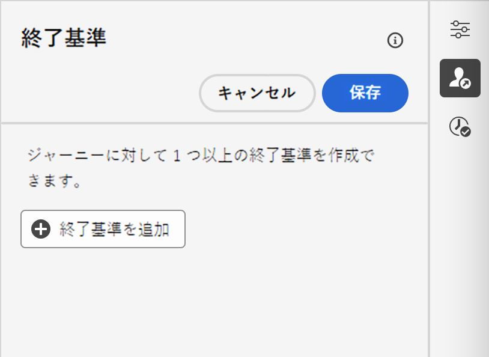

# ジャーニーのプロパティの設定 {#jo-properties}

>[!CONTEXTUALHELP]
>id="ajo_journey_properties"
>title="ジャーニーのプロパティ"
>abstract="この節では、ジャーニーのプロパティについて説明します。デフォルトでは、読み取り専用のパラメーターは非表示です。使用可能な設定は、ジャーニーのステータス、権限および製品設定によって異なります。"

## ジャーニーのプロパティへのアクセス {#access-properties}

ジャーニーのプロパティは、右側のパネルで一元化されます。このセクションは、新しいジャーニーを作成する際にデフォルトで表示されます。既存のジャーニーの場合は、ジャーニーの名前の横にある鉛筆アイコンをクリックして開きます。

このセクションでは、ジャーニーの名前を定義し、説明を追加して、次の操作を行うことができます。

* [ エントリおよび再エントリ ](#entrance) の管理
* 開始日と終了[日](#dates)を選択
* [データへのアクセス](#manage-access)を管理
* ジャーニーアクティビティの[タイムアウト期間](#timeout)を定義（管理者ユーザーのみ）
* ジャーニーとプロファイルの[タイムゾーン](#timezone)を選択
* ジャーニーを簡単に分類し、キャンペーンリストからの検索を向上させるために、Adobe Experience Platform 統合タグをジャーニーに割り当てます。[タグの操作方法について詳しくは、こちらを参照してください](../start/search-filter-categorize.md#tags)

>[!NOTE]
>
>ライブジャーニーの場合、この画面には、ジャーニーを公開した日付とユーザーの名前のみが表示されます。

「**技術的な詳細をコピー**」を使用すると、ジャーニーに関する技術情報をコピーでき、サポートチームはこの情報をトラブルシューティングに使用できます。`JourneyVersion UID`、`OrgID`、`orgName`、`sandboxName`、`lastDeployedBy`、`lastDeployedAt` の情報がコピーされます。

特定のプロファイルのジャーニーに関連する技術的なフィールドと、その使用方法について詳しくは、[このページ](expression/journey-properties.md)を参照してください。

## エントリおよび再エントリ {#entrance}

プロファイルエントリモードは、右側の設定パネルのジャーニーレベルで定義されます。設定は次のとおりです。

プロファイルエントリ管理は、ジャーニーのタイプに応じて異なります。プロファイルのエントリおよび再エントリ管理について詳しくは、[ このページ ](entry-management.md) を参照してください。

### 再エントリを許可  {#allow-reentrance}

>[!CONTEXTUALHELP]
>id="ajo_journey_properties_entrance"
>title="再エントリを許可"
>abstract="デフォルトでは、新規ジャーニーで再エントリが許可されています。例えば、入店時に 1 度だけギフトをオファーする場合は、この「**再エントリを許可**」オプションをオフにします。"
>additional-url="https://experienceleague.adobe.com/ja/docs/journey-optimizer/using/orchestrate-journeys/manage-journey/entry-management" text="プロファイルエントリ管理"

デフォルトでは、新規ジャーニーで再エントリが許可されています。「1 回限り **のジャーニー（例：入店時に 1 度だけギフトをオファーするなど）を作成するには、この「再エントリを許可**」オプションをオフにします。

### 再エントリ待機期間  {#reentrance-wait}

>[!CONTEXTUALHELP]
>id="ajo_journey_properties_re-entrance_wait"
>title="再エントリ待機期間"
>abstract="単一のジャーニー内でプロファイルがジャーニーに再度エントリできるようになるまでの、待機時間を設定します。これにより、選択した期間、ユーザーはジャーニーに再エントリできなくなります。最大期間：90 日。"
>additional-url="https://experienceleague.adobe.com/ja/docs/journey-optimizer/using/orchestrate-journeys/manage-journey/entry-management" text="プロファイルエントリ管理"

「**再エントリを許可**」オプションがアクティベートされると、「**再エントリ待機期間**」フィールドが表示されます。 このフィールドでは、（イベントまたはオーディエンスの選定で始まる）単一ジャーニーで、プロファイルがジャーニーに再度エントリできるようになるまでの待機時間を定義できます。これにより、ジャーニーが同じイベントに対して誤って複数回トリガーされるのを防ぎます。デフォルトでは、このフィールドは 5 分に設定されています。最大期間は 90 日です。

## アクセスの管理 {#manage-access}

カスタムデータ使用ラベルまたはコアデータ使用ラベルをジャーニーに割り当てるには、「**[!UICONTROL アクセスを管理]**」ボタンをクリックします。[オブジェクトレベルのアクセス制御（OLAC）について詳しくはこちらを参照してください](../administration/object-based-access.md)

## ジャーニーとプロファイルのタイムゾーン {#timezone}

タイムゾーンはジャーニーレベルで定義されます。固定タイムゾーンを入力するか、Adobe Experience Platform プロファイルを使用してジャーニーのタイムゾーンを定義できます。Adobe Experience Platform プロファイルでタイムゾーンが定義されている場合は、ジャーニーでそのタイムゾーンを取得できます。

タイムゾーン管理の詳細については、[このページ](../building-journeys/timezone-management.md)を参照してください。

## 開始日と終了日 {#dates}

>[!CONTEXTUALHELP]
>id="ajo_journey_properties_start_date"
>title="開始日"
>abstract="ジャーニーへのエントリを開始できる日付を選択します。 開始日を指定しない場合、公開時に自動的に設定されます。"

>[!CONTEXTUALHELP]
>id="ajo_journey_properties_end_date"
>title="終了日"
>abstract="ジャーニーの終了日を選択します。 指定した日付に達すると、そのジャーニーのプロファイルは自動的に終了し、新規プロファイルがエントリできなくなります。"

**開始日**&#x200B;を定義できます。指定していない場合は、公開時に自動的に定義されます。

**終了日**&#x200B;も追加できます。これにより、日付に達したプロファイルは自動的に終了します。 終了日が指定されていない場合、プロファイルは[グローバルジャーニータイムアウト](#global_timeout)（通常は 91 日間）まで保持されます。唯一の例外は、「繰り返し時に再エントリを強制 **をアクティベートした繰り返しのオーディエンスを読み取りジャーニーで** 次回の開始日に終了します。

## タイムアウト {#timeout}

### ジャーニーアクティビティのタイムアウトまたはエラー {#timeout_and_error}

>[!CONTEXTUALHELP]
>id="ajo_journey_properties_timeout"
>title="タイムアウト"
>abstract="タイムアウトと見なされる前に、ジャーニーがアクションの実行または条件の検証を試行する時間を定義します。"

アクションまたは条件のアクティビティを編集するときに、エラーやタイムアウトが発生した場合の代替パスを定義できます。サードパーティシステムに問い合わせを行うアクティビティの処理が、ジャーニーのプロパティの「**[!UICONTROL タイムアウトまたはエラー]**」フィールドで定義されたタイムアウト時間を超えると、第 2 パスが選択されて、可能な代替アクションが実行されます。

許可される値は 1 ～ 30 秒です。

ジャーニーの時間が限られている場合（例：人のリアルタイムの位置情報に反応するなど）、アクションを数秒以上遅らせることができないため、非常に短い時間の&#x200B;**[!UICONTROL タイムアウトまたはエラー]**&#x200B;値を定義することをお勧めします。ジャーニーにそれほど時間的制約がない場合は、より長い値を使用して、有効な応答を送るために呼び出されるシステムにより多くの時間をを付与することができます。

ジャーニーでは、以下に詳しく説明するようにグローバルタイムアウトも使用します。

### グローバルジャーニーのタイムアウト {#global_timeout}

ジャーニーアクティビティで使用される[タイムアウト](#timeout_and_error)に加えて、グローバルジャーニーのタイムアウトが適用されます。インターフェイスに表示されず、変更できません。

ジャーニー内にいる個人の進捗は、エントリしてから **91 日**&#x200B;経過すると、このグローバルタイムアウトにより停止されます。つまり、個人のジャーニーは 91 日を超えることはできません。タイムアウト期間が経過すると、個人のデータは削除されます。タイムアウト期間が終了してもまだジャーニーに流入してくる個人がいる場合、それらは流入を停止され、レポートでは考慮されません。したがって、離脱する人物よりもジャーニーにエントリする人物の方が多くなる可能性があります。

ジャーニーの 91 日間のタイムアウトにより、ジャーニーの再エントリが許可されていない場合、再エントリのブロックが 91 日以上機能するかどうかを確認できません。 実際、ジャーニーにエントリしたユーザーの情報はエントリから 91 日後にすべて削除されるので、91 日前より古い日時にエントリしたユーザーが誰かを特定することはできません。

個人が待機アクティビティにエントリできるのは、91 日のジャーニータイムアウトより前に待機期間を完了するのに十分な時間がジャーニーに残っている場合のみです。[このページ](../building-journeys/wait-activity.md)を参照してください。

#### 有効期間（TTL）とデータ保持に関する FAQ {#timeout-faq}

Adobe Journey Optimizer 2024年6月リリース以降、ジャーニーのグローバルタイムアウトが 30 日から 91 日に変更されました。影響については、以下の FAQ を参照してください。

**単一ジャーニーの場合**
<table style="table-layout:auto">
  <tr style="border: 1;">
    <td>
      
TTL 拡張機能のロールアウト後に公開されたジャーニーはどうなりますか？

    </td>
    <td>
      
新しいジャーニーにエントリするプロファイルの TTL は自動的に 91 日間になります。

    </td>
  </tr>
  <tr style="border: 1;">
    <td>
      
TTL 拡張機能の起動前に公開されたジャーニーにエントリするプロファイルはどうなりますか？

    </td>
    <td>
      
プロファイルの TTL は、ジャーニーが最初に公開された時間と一致して、30 日間（HIPAA の場合は 7 日間）になります。

    </td>
  </tr>
  <tr style="border: 1;">
    <td>
      
TTL 拡張機能の起動時に、既にジャーニーにエントリしているプロファイルはどうなりますか？

    </td>
    <td>
      
プロファイルは、ジャーニーの元の公開時間に従って、30 日間（HIPAA の場合は 7 日間）の TTL を保持します。

    </td>
  </tr>
  <tr style="border: 1;">
    <td>
      
TTL 拡張機能の起動後に再公開された以前のジャーニーバージョンのプロファイルはどうなりますか？

    </td>
    <td>
      
プロファイルは、元のジャーニーバージョンの公開時間に合わせて、30 日間（HIPAA の場合は 7 日間）の TTL を維持します。

    </td>
  </tr>
  <tr style="border: 1;">
    <td>
      
TTL 拡張機能の起動後に再公開されたジャーニーバージョンにエントリする新しいプロファイルはどうなりますか？

    </td>
    <td>
      
プロファイルの TTL は、新しく再公開されたジャーニーバージョンの TTL と一致して、91 日間になります。

    </td>
  </tr>
</table>

**セグメントトリガージャーニーの場合**

<table style="table-layout:auto">
  <tr style="border: 1;">
    <td>
      
TTL 拡張機能の後に公開された新しい 1 回限りのジャーニーはどうなりますか？

    </td>
    <td>
      
新しいジャーニーにエントリするプロファイルの TTL は自動的に 91 日間になります。

    </td>
  </tr>
  <tr style="border: 1;">
    <td>
      
TTL 拡張機能の後に公開された強制的な再エントリを伴わない、新しい繰り返しジャーニーはどうなりますか？

    </td>
    <td>
      
新しいジャーニーにエントリするプロファイルの TTL は自動的に 91 日間になります。

    </td>
  </tr>
  <tr style="border: 1;">
    <td>
      
TTL 拡張機能の後に公開された強制的な再エントリを伴う、新しい繰り返しジャーニーはどうなりますか？

    </td>
    <td>
      
新しいジャーニーにエントリするプロファイルの TTL は繰り返し期間と同じになります。例えば、ジャーニーが毎日実行される場合、TTL は 1 日間になります。

    </td>
  </tr>
  <tr style="border: 1;">
    <td>
      
TTL 拡張機能の起動前に公開されたジャーニーにエントリするプロファイルはどうなりますか？

    </td>
    <td>
      
プロファイルの TTL は、元の公開時間と一致して、30 日間（HIPAA の場合は 7 日間）になります。強制的な再エントリを伴う、繰り返しジャーニーの場合、TTL は繰り返し期間と一致します。

    </td>
  </tr>
  <tr style="border: 1;">
    <td>
      
TTL 拡張機能の起動時に、ジャーニーを実行中のプロファイルはどうなりますか？

    </td>
    <td>
      
プロファイルは、ジャーニーの元の公開時間に従って、30 日間（HIPAA の場合は 7 日間）の TTL を保持します。強制的な再エントリを伴う、繰り返しジャーニーの場合、TTL は繰り返し期間と一致します。

    </td>
  </tr>
  <tr style="border: 1;">
    <td>
      
TTL 拡張機能の起動後に再公開された以前のジャーニーバージョンの実行中のプロファイルはどうなりますか？

    </td>
    <td>
      
プロファイルは、元のジャーニーバージョンの公開時間に合わせて、30 日間（HIPPA の場合は 7 日間）の TTL を維持します。強制的な再エントリを伴う、繰り返しジャーニーの場合、TTL は繰り返し期間と一致します。

    </td>
  </tr>
  <tr style="border: 1;">
    <td>
      
TTL 拡張機能の起動後に再公開されたジャーニーバージョンにエントリする新しいプロファイルはどうなりますか？

    </td>
    <td>
      
プロファイルの TTL は、新しく再公開されたジャーニーバージョンの TTL と一致して、91 日間になります。強制的な再エントリを伴う、繰り返しジャーニーの場合、TTL は繰り返し期間と一致します。

    </td>
  </tr>
</table>

## 結合ポリシー {#merge-policies}

ジャーニーは、Adobe Experience Platform からプロファイルデータを取得するときにマージポリシーを使用します。ジャーニータイプに応じて、異なる結合ポリシーが使用されます。

* オーディエンスを読み取りジャーニーまたはオーディエンスの選定ジャーニーの場合：オーディエンスからの結合ポリシーが使用されます
* 単一イベントジャーニーの場合：デフォルトの結合ポリシーが使用されます
* ビジネスイベントジャーニーの場合：次の「オーディエンスを読み取り」アクティビティのターゲットオーディエンスからの結合ポリシーが使用されます

ジャーニーでは、ジャーニー全体を通じて使用される結合ポリシーを遵守します。したがって、1 つのジャーニーで複数のオーディエンスが使用されている場合（例：「inAudience」関数内）、ジャーニーで使用される結合ポリシーとの不一致が生じると、エラーが発生して、公開がブロックされます。ただし、メッセージのパーソナライゼーションで一貫性のないオーディエンスが使用されると、一貫性がないにもかかわらず、アラートは発生しません。このため、このオーディエンスをメッセージのパーソナライゼーションに使用する場合は、オーディエンスに関連付けられた結合ポリシーを確認することを強くお勧めします。

結合ポリシーについて詳しくは、[Adobe Experience Platform ドキュメント](https://experienceleague.adobe.com/ja/docs/experience-platform/profile/merge-policies/overview){target="_blank"}を参照してください。

## 終了条件 {#exit-criteria}

>[!CONTEXTUALHELP]
>id="ajo_journey_exit_criterias"
>title="ジャーニー終了基準"
>abstract="このセクションには、終了基準オプションが表示されます。ジャーニーに 1 つ以上の終了基準ルールを作成できます。"

### 説明 {#exit-criteria-desc}

終了条件を追加して、イベント（例：購買）が発生した直後やオーディエンスに適合した直後に、プロファイルによってジャーニーを終了させます。これにより、ユーザーはジャーニーからそれ以降の通信を受信できなくなります。

ジャーニーの目的を満たさなくなったプロファイルをジャーニーから削除したい場合があります。 これは、目標管理と密接に関連する **グローバル終了条件** によって達成できます。

**サンプルユースケース**

マーケターは、一連のコミュニケーションを含むプロモーションジャーニーを持っています。 この通信のそれぞれは、顧客が購入を行うことを促すことを目的としています。 購入が行われるとすぐに、顧客はシリーズの残りのメッセージを受け取るべきではありません。 終了条件を定義すると、購入を行ったすべてのプロファイルがジャーニーから削除されます。

### 設定と使用法 {#exit-criteria-config}

終了条件はジャーニーレベルで設定します。 1 つのジャーニーに複数の終了条件を設定できます。 複数の終了条件を設定した場合、`OR` のロジックを使用して上から下に評価が行われます。 そのため、終了条件 A と終了条件 B がある場合、それは **OR** B として評価されます。条件は、ジャーニーのすべてのステップで評価されます。

終了条件を **作成** するには、次の手順に従います。

1. ジャーニーを開きます。

1. ジャーニーキャンバスの右上のセクションにある「**[!UICONTROL 終了条件を表示]**」アイコンをクリックします。
   {width="40%" align="left"}
1. 「**[!UICONTROL 終了条件を追加]**」ボタンをクリックします。
   {width="40%" align="left"}
1. **ラベル** を入力し、終了条件を **イベント** または **オーディエンス** のどちらに基づいているかを選択します。

* イベントに基づく終了条件の場合は、単一イベントのみを選択します。
* 「オーディエンスに基づく終了条件」で、オーディエンスを選択します。 メモ：オーディエンスを使用した終了条件が有効になるまで、最大 10 分かかる場合があります。

複数の終了条件を追加できます。

{width="40%" align="left"}

### ガードレールと制限 {#exit-criteria-guardrails}

ジャーニー終了条件機能には、次のガードレールと制限が適用されます。

* 終了条件はドラフト状態でのみ定義されます
* イベントとジャーニーベースの終了条件の間のイベントネームスペースの一貫性

