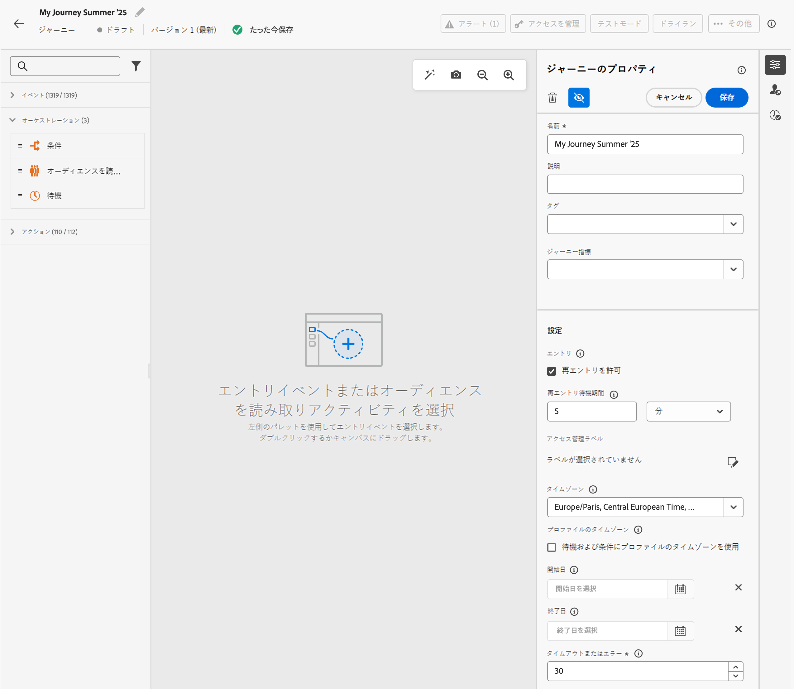
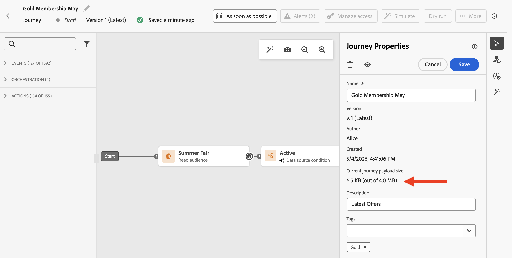
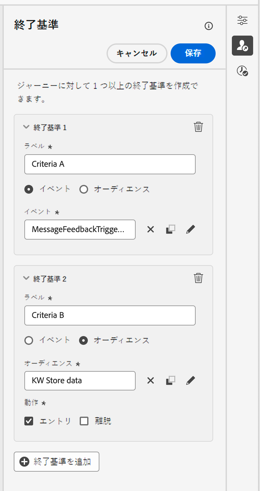

# ジャーニーのプロパティの設定 {#jo-properties}

>[!BEGINSHADEBOX]

**このページ：**&#x200B;では、オーサリング中に、ジャーニーの名前、入口ルール、タイムゾーン、開始日と終了日、タイムアウト、出口基準、競合管理などのジャーニーのグローバルプロパティを右側のパネルから設定する方法について説明します。

>[!ENDSHADEBOX]

ジャーニープロパティを使用して、ジャーニーの名前、入口ルール、タイムゾーン、開始日と終了日、タイムアウト時間、出口基準、競合管理など、ジャーニーのグローバル設定を設定します。 プロパティには、ジャーニーオーサリングのどの段階でも、右側のパネルからアクセスできます。

>[!CONTEXTUALHELP]
>id="ajo_journey_properties"
>title="ジャーニーのプロパティ"
>abstract="ジャーニーのプロパティでは、このジャーニーのグローバル設定（名前、タグ、エントリルール、タイムゾーン、日付、タイムアウト、競合管理など）を保持します。 読み取り専用パラメーターは、デフォルトでは非表示です。 使用可能なオプションは、ジャーニーのステータス、権限および製品設定によって異なります。"

## ジャーニーのプロパティへのアクセス {#access-properties}

ジャーニーのプロパティは、右側のパネルで一元化されます。 このセクションは、新しいジャーニーを作成する際にデフォルトで表示されます。 既存のジャーニーの場合は、ジャーニーの名前の横にある鉛筆アイコンをクリックして開きます。

このセクションでは、ジャーニーの名前を定義し、説明を追加して、ジャーニーのグローバルプロパティを設定します。

実行できる操作は、次のとおりです。

* [!DNL Adobe Experience Platform]個の統合タグをジャーニーに割り当てて、簡単に分類し、キャンペーンリストから検索を改善します。 [タグの操作方法について詳しくは、こちらを参照してください](../start/search-filter-categorize.md#tags)。
* ジャーニー指標を選択します。 [ジャーニー指標の設定とトラッキング方法の詳細情報](success-metrics.md)
* [エントリと再エントリ](#entrance)を管理します。 プロファイルエントリ管理は、ジャーニーのタイプに応じて異なります。 詳しくは、[このページ](entry-management.md)を参照してください
* [データへのアクセス](#manage-access)を管理します
* ジャーニーとプロファイルの[タイムゾーン](#timezone)を選択します
* カスタムの[開始日と終了日](#dates)を選択します
* ジャーニーアクティビティの[タイムアウト期間](#timeout)を定義します（管理者ユーザーのみ）
* 公開エラーを回避するために、[現在のジャーニーペイロードサイズ ](#journey-payload-size)を監視します
* [競合管理ツール](#conflict)を使用して、競合を監視し、ジャーニーに優先順位を付けます

{width="80%"}{zoomable="yes"}

>[!NOTE]
>
>ライブジャーニーの場合、この画面には、ジャーニーを公開した日付とユーザーの名前のみが表示されます。

「**技術的な詳細をコピー**」オプションを使用すると、ジャーニーに関する技術情報をコピーでき、サポートチームはこの情報をトラブルシューティングに使用できます。 次の情報がコピーされます。

**一般**

* `JourneyVersion UID` – このバージョンのジャーニーの一意のID
* `OrgID` – 組織の（IMS） ID
* `orgName` – 組織の名前
* `sandboxName` - ジャーニーが実行されるサンドボックスの名前
* `lastDeployedBy` - ジャーニーを最後に公開したユーザー
* `lastDeployedAt` – 最後の公開の日時

**一時停止して再開** （ジャーニーが少なくとも1回一時停止されている場合に含まれます）

* `lastPausedAt` - ジャーニーが最後に一時停止された日時
* `lastPausedBy` – 最後の一時停止を実行したユーザーの表示名
* `lastPausedById` – 前回の一時停止を実行したユーザーの内部識別子
* `lastResumedAt` - ジャーニーが最後に再開された日時
* `lastResumedBy` – 前回の履歴書を実行したユーザーの表示名
* `lastResumedById` – 前回の履歴書を実行したユーザーの内部識別子

**一時停止したジャーニー設定** （ジャーニーが一時停止されている、または一時停止されている場合は`pausedJourneySettings`で）

* `pauseBehavior` - ジャーニーを一時停止した際にジャーニー内のプロファイルはどうなるか（例：プロファイルを破棄するか、または配置しておくなど）
* `maxPauseDurationInMinutes` - ジャーニーが自動的に再開されるまでの最大一時停止の時間（分単位）（20160 = 14日など）
* `transitionStateForAutoResume` – 一時停止期間の終了時にジャーニーが自動的に再開されたときに適用される状態（停止または続行など）
* `pauseId` – 現在の一時停止インスタンスの一意のID

特定のプロファイルのジャーニーに関連する技術的なフィールドとその使用方法について詳しくは、[このページ](expression/journey-properties.md)を参照してください。

## エントリと再エントリ {#entrance}

プロファイルエントリモードは、右側の設定パネルのジャーニーレベルで定義されます。 設定は次のとおりです。

プロファイルエントリ管理は、ジャーニーのタイプに応じて異なります。 プロファイルのエントリと再エントリの管理について詳しくは、[このページ](entry-management.md)を参照してください。 ジャーニーの処理率とプロファイルがジャーニーを通じてフローする仕組みについて詳しくは、[この節](entry-management.md#journey-processing-rate)を参照してください。

### 再エントリを許可  {#allow-reentrance}

>[!CONTEXTUALHELP]
>id="ajo_journey_properties_entrance"
>title="再エントリを許可"
>abstract="デフォルトでは、新規ジャーニーで再エントリが許可されています。 例えば、入店時に 1 度だけギフトをオファーする場合、「**再エントリを許可**」オプションをオフにすると、ユーザーがそのジャーニーに再エントリすることを防ぐことができます。"
>additional-url="https://experienceleague.adobe.com/ja/docs/journey-optimizer/using/orchestrate-journeys/manage-journey/entry-management" text="プロファイルエントリ管理"

デフォルトでは、新規ジャーニーで再エントリが許可されています。 「1 回限り」のジャーニー（例：入店時に 1 度だけギフトをオファーするなど）を作成するには、この「**再エントリを許可**」オプションをオフにします。

### 再エントリ待機期間  {#reentrance-wait}

>[!CONTEXTUALHELP]
>id="ajo_journey_properties_re-entrance_wait"
>title="再エントリ待機期間"
>abstract="再エントリ待機期間は、単一のジャーニー内でプロファイルがジャーニーに再エントリできるようになるまでの待機時間です。 これにより、選択した期間、ユーザーはジャーニーに再エントリできなくなります。 最大期間：90 日。"
>additional-url="https://experienceleague.adobe.com/ja/docs/journey-optimizer/using/orchestrate-journeys/manage-journey/entry-management" text="プロファイルエントリ管理"

「**再エントリを許可**」オプションがアクティベートされると、「**再エントリ待機期間**」フィールドが表示されます。 このフィールドでは、（イベントまたはオーディエンスの選定で始まる）単一ジャーニーで、プロファイルがジャーニーに再度エントリできるようになるまでの待機時間を定義できます。 これにより、ジャーニーが同じイベントに対して誤って複数回トリガーされるのを防ぎます。 デフォルトでは、このフィールドは 5 分に設定されています。 最大期間は 90 日です。

## アクセスの管理 {#manage-access}

アクセスラベルに基づいて、ジャーニーへのアクセスを制限できます。

カスタムデータ使用ラベルをジャーニーに割り当てるには、「**[!UICONTROL アクセスラベルを管理]**」アイコンをクリックし、1 つまたは複数のラベルを選択します。

[オブジェクトレベルのアクセス制御（OLAC）の詳細情報](../administration/object-based-access.md)

## ジャーニーペイロードサイズ {#journey-payload-size}

>[!CONTEXTUALHELP]
>id="ajo_journey_properties_payload_size"
>title="現在のジャーニーペイロードサイズ"
>abstract="設定された制限と比較したジャーニーペイロードの現在のサイズを表示します。 このインジケーターを使用すると、公開前にジャーニーの複雑さを監視し、ペイロードサイズ制限の超過によるエラーを回避できます。"

ジャーニープロパティパネルの&#x200B;**[!UICONTROL 現在のジャーニーペイロードサイズ]** フィールドには、設定された制限に関するジャーニーのペイロードの現在のサイズが表示されます（例：*1.5 MB （2 MB中）*）。 この読み取り専用インジケーターは、ジャーニーオーサリングのどの段階でも表示されます。

{width="50%" zoomable="yes"}

この情報を使用して、公開前にジャーニーの複雑さを監視します。 ペイロードのサイズが制限に近づいているか、制限を超えている場合、ジャーニーの公開は失敗します。 サイズを小さくするには、ジャーニーロジックを簡素化するか、アクティビティの数を減らすことを検討してください。

デフォルトの制限は4 MBです。 お客様の組織の上限を引き上げる必要がある場合は、Adobe カスタマーケアにお問い合わせください。

しきい値、警告とエラーメッセージ、およびトラブルシューティング手順の詳細については、[ジャーニーペイロードサイズの検証](../start/guardrails.md#journey-payload-size)および[一般的なジャーニーガードレール ](../start/guardrails.md#journeys-guardrails-journeys)を参照してください。

## ジャーニーとプロファイルのタイムゾーン {#timezone}

タイムゾーンはジャーニーレベルで定義されます。 固定タイムゾーンを入力するか、[!DNL Adobe Experience Platform] プロファイルを使用してジャーニータイムゾーンを定義できます。 タイムゾーンが[!DNL Adobe Experience Platform] プロファイルで定義されている場合は、ジャーニーで取得できます。

[タイムゾーン管理の詳細情報](../building-journeys/timezone-management.md)

## 開始日と終了日 {#dates}

>[!CONTEXTUALHELP]
>id="ajo_journey_properties_start_date"
>title="開始日"
>abstract="開始日は、プロファイルがジャーニーへのエントリを開始できる日付です。 開始日を設定しない場合、デフォルトでジャーニーの公開日になります。"

>[!CONTEXTUALHELP]
>id="ajo_journey_properties_end_date"
>title="終了日"
>abstract="終了日は、ジャーニーの終了日です。 この日付で、アクティブなプロファイルはジャーニーを自動的に終了し、新しいエントリは許可されません。"

デフォルトでは、プロファイルは公開されるとすぐにジャーニーにエントリでき、[グローバルジャーニータイムアウト](#global_timeout)に達するまでそのまま残ります。 唯一の例外は、「**繰り返し時に再エントリを強制する**」が有効になっている繰り返しのオーディエンスを読み取りジャーニーで、これは次回の実行の開始日に終了します。

必要に応じて、カスタムの&#x200B;**開始日**&#x200B;と&#x200B;**終了日**&#x200B;を定義できます。 これにより、プロファイルは特定の日付にジャーニーにエントリし、終了日に達すると自動的に終了できます。

## タイムアウト {#timeout}

タイムアウト設定は、ジャーニーがアクティビティの実行を待機する時間と、ジャーニーにプロファイルを残すことができる時間を制御します。

### ジャーニーアクティビティのタイムアウト {#timeout_and_error}

>[!CONTEXTUALHELP]
>id="ajo_journey_action_timeout"
>title="タイムアウトまたはエラー"
>abstract="「**タイムアウトまたはエラー**」オプションは、アクションがタイムアウトするかエラーを返す場合に、ジャーニー内の代替パスを定義します。これにより、プロファイルはこの手順で停止する代わりに、フォールバックパスを通じて続行します。 推奨値は 1～30 秒です。"

アクションまたは条件のアクティビティを編集するときに、エラーやタイムアウトが発生した場合の代替パスを定義できます。 サードパーティシステムに問い合わせを行うアクティビティの処理が、ジャーニーのプロパティの「**[!UICONTROL タイムアウトまたはエラー]**」フィールドで定義されたタイムアウト時間を超えると、第 2 パスが選択されて、可能な代替アクションが実行されます。

推奨値は 1～30 秒です。

ジャーニーの時間が限られている場合（例：人のリアルタイムの位置情報に反応するなど）、アクションを数秒以上遅らせることができないため、非常に短い時間の&#x200B;**[!UICONTROL タイムアウトまたはエラー]**&#x200B;値を定義することをお勧めします。 ジャーニーにそれほど時間的制約がない場合は、より長い値を使用して、有効な応答を送るために呼び出されるシステムにより多くの時間をを付与することができます。

ジャーニーでは、次に示すように、グローバルなタイムアウトも使用します。

### グローバルジャーニーのタイムアウト {#global_timeout}

ジャーニーアクティビティで使用される[タイムアウト](#timeout_and_error)に加えて、グローバルジャーニーのタイムアウトが適用されます。 インターフェイスに表示されず、変更できません。

ジャーニー内にいる個人の進捗は、エントリしてから **91 日**&#x200B;経過すると、このグローバルタイムアウトにより停止されます。 つまり、個人のジャーニーは 91 日を超えることはできません。 タイムアウト期間が経過すると、個人のデータは削除されます。 タイムアウト期間が終了してもまだジャーニーに流入してくる個人がいる場合、それらは流入を停止され、レポートでは考慮されません。 したがって、離脱する人物よりもジャーニーにエントリする人物の方が多くなる可能性があります。

>[!NOTE]
>
>ジャーニーを「完了」と見なすタイミングの正確な定義は、ジャーニーのタイプによって異なります。 [詳細な条件を確認](end-journey.md#journey-finished-definition)。

91 日間のジャーニータイムアウトにより、ジャーニーの再エントリが許可されていない場合、再エントリのブロックが 91 日を超えて機能することは保証できません。 実際、ジャーニーにエントリしたユーザーの情報はエントリから 91 日後にすべて削除されるので、91 日前より古い日時にエントリしたユーザーが誰かを特定することはできません。

個人が待機アクティビティにエントリできるのは、91 日のジャーニータイムアウトより前に待機期間を完了するのに十分な時間がジャーニーに残っている場合のみです。 詳しくは、[このページ](../building-journeys/wait-activity.md)を参照してください。

### TTL （Time-to-Live）とデータ保持に関するFAQ {#timeout-faq}

2024年6月リリースの[!DNL Adobe Journey Optimizer]以降、ジャーニーのグローバル タイムアウトが30日から91日に変更されました。 影響について詳しくは、以下の FAQ を参照してください。

**単一ジャーニーの場合**

<table style="table-layout:auto">
  <tr style="border: 1;">
    <td>
      
TTL 拡張機能のロールアウト後に公開されたジャーニーはどうなりますか？

    </td>
    <td>
      
新しいジャーニーにエントリするプロファイルの TTL は自動的に 91 日間になります。

    </td>
  </tr>
  <tr style="border: 1;">
    <td>
      
TTL 拡張機能の起動前に公開されたジャーニーにエントリするプロファイルはどうなりますか？

    </td>
    <td>
      
プロファイルの TTL は、ジャーニーが最初に公開された時間と一致して、30 日間（HIPAA の場合は 7 日間）になります。

    </td>
  </tr>
  <tr style="border: 1;">
    <td>
      
TTL 拡張機能の起動時に、既にジャーニーにエントリしているプロファイルはどうなりますか？

    </td>
    <td>
      
プロファイルは、ジャーニーの元の公開時間に従って、30 日間（HIPAA の場合は 7 日間）の TTL を保持します。

    </td>
  </tr>
  <tr style="border: 1;">
    <td>
      
TTL 拡張機能の起動後に再公開された以前のジャーニーバージョンのプロファイルはどうなりますか？

    </td>
    <td>
      
プロファイルは、元のジャーニーバージョンの公開時間に合わせて、30 日間（HIPAA の場合は 7 日間）の TTL を維持します。

    </td>
  </tr>
  <tr style="border: 1;">
    <td>
      
TTL 拡張機能の起動後に再公開されたジャーニーバージョンにエントリする新しいプロファイルはどうなりますか？

    </td>
    <td>
      
プロファイルの TTL は、新しく再公開されたジャーニーバージョンの TTL と一致して、91 日間になります。

    </td>
  </tr>
</table>

**セグメントトリガージャーニーの場合**

<table style="table-layout:auto">
  <tr style="border: 1;">
    <td>
      
TTL 拡張機能の後に公開された新しい 1 回限りのジャーニーはどうなりますか？

    </td>
    <td>
      
新しいジャーニーにエントリするプロファイルの TTL は自動的に 91 日間になります。

    </td>
  </tr>
  <tr style="border: 1;">
    <td>
      
TTL 拡張機能の後に公開された強制的な再エントリを伴わない、新しい繰り返しジャーニーはどうなりますか？

    </td>
    <td>
      
新しいジャーニーにエントリするプロファイルの TTL は自動的に 91 日間になります。

    </td>
  </tr>
  <tr style="border: 1;">
    <td>
      
TTL 拡張機能の後に公開された強制的な再エントリを伴う、新しい繰り返しジャーニーはどうなりますか？

    </td>
    <td>
      
新しいジャーニーにエントリするプロファイルの TTL は繰り返し期間と同じになります。 例えば、ジャーニーが毎日実行される場合、TTL は 1 日間になります。

    </td>
  </tr>
  <tr style="border: 1;">
    <td>
      
TTL 拡張機能の起動前に公開されたジャーニーにエントリするプロファイルはどうなりますか？

    </td>
    <td>
      
プロファイルの TTL は、元の公開時間と一致して、30 日間（HIPAA の場合は 7 日間）になります。 強制的な再エントリを伴う、繰り返しジャーニーの場合、TTL は繰り返し期間と一致します。

    </td>
  </tr>
  <tr style="border: 1;">
    <td>
      
TTL 拡張機能の起動時に、ジャーニーを実行中のプロファイルはどうなりますか？

    </td>
    <td>
      
プロファイルは、ジャーニーの元の公開時間に従って、30 日間（HIPAA の場合は 7 日間）の TTL を保持します。 強制的な再エントリを伴う、繰り返しジャーニーの場合、TTL は繰り返し期間と一致します。

    </td>
  </tr>
  <tr style="border: 1;">
    <td>
      
TTL 拡張機能の起動後に再公開された以前のジャーニーバージョンの実行中のプロファイルはどうなりますか？

    </td>
    <td>
      
プロファイルは、元のジャーニーバージョンの公開時間に合わせて、30 日間（HIPAA の場合は 7 日間）の TTL を維持します。 強制的な再エントリを伴う、繰り返しジャーニーの場合、TTL は繰り返し期間と一致します。

    </td>
  </tr>
  <tr style="border: 1;">
    <td>
      
TTL 拡張機能の起動後に再公開されたジャーニーバージョンにエントリする新しいプロファイルはどうなりますか？

    </td>
    <td>
      
プロファイルの TTL は、新しく再公開されたジャーニーバージョンの TTL と一致して、91 日間になります。 強制的な再エントリを伴う、繰り返しジャーニーの場合、TTL は繰り返し期間と一致します。

    </td>
  </tr>
  <tr style="border: 1;">
    <td>
      
常時稼働の「オーディエンスを読み取り」ジャーニーは、91日後に停止しますか？

    </td>
    <td>
      
いいえ。 終了日のない繰り返し読み取りオーディエンスジャーニーは、公開されている限り<strong> ライブ </strong>のままです。 <strong>完了</strong> ステータスに移行するのは、前回の<strong>件の実行</strong>からわずか91日後です。 91日間のグローバルタイムアウトは、ジャーニーのライブステータスではなく、ジャーニーを流れる個々のプロファイル（プロファイルごとに最大アクティブ期間）に適用されます。

    </td>
  </tr>
  <tr style="border: 1;">
    <td>
      
91日間のジャーニータイムアウトと91日間のレポートウィンドウの違いは何ですか？

    </td>
    <td>
      
これらは2つの異なる概念です。 <strong> ジャーニーグローバルタイムアウト </strong> （91日）は、ジャーニー内で個々のプロファイルをアクティブのままにできる最大時間です。91日後に、プロファイルが終了し、データが削除されます。 <strong> レポートウィンドウ </strong> （約91日）は、UIの表示制限です。91日を超えるパフォーマンスデータはレポートに表示されなくなりましたが、ジャーニー自体は実行され続け、新しいプロファイルは引き続き入力されます。

    </td>
  </tr>
</table>

## 結合ポリシー {#merge-policies}

>[!CONTEXTUALHELP]
>id="ajo_journey_properties_merge_policy"
>title="結合ポリシー"
>abstract="結合ポリシーは、選択したイベントまたはオーディエンスに基づいて自動的に取得されます。 この結合ポリシーは、ジャーニー全体を通じて使用されます。"

[!DNL Adobe Journey Optimizer]は、[!DNL Adobe Experience Platform]からプロファイルデータを取得する際に結合ポリシーを使用します。 ジャーニータイプに応じて、異なる結合ポリシーが使用されます。

* **[オーディエンスの読み取り](read-audience.md)**&#x200B;または&#x200B;**[オーディエンスの選定](audience-qualification-events.md)** ジャーニーでは、オーディエンスからの結合ポリシーが使用されます
* **[単一イベント](../event/about-events.md)** ジャーニーでは、デフォルトの結合ポリシーが使用されます
* **[ビジネスイベント](../event/about-creating-business.md)**&#x200B;のジャーニーでは、次の「オーディエンスを読み取り」アクティビティのターゲットオーディエンスからの結合ポリシーが使用されます

[!DNL Adobe Journey Optimizer]は、ジャーニー全体で使用される結合ポリシーを適用します。 したがって、1 つのジャーニーで複数のオーディエンスが使用されている場合（例：[`inAudience` 関数](functions/functioninaudience.md)内での使用）、これにより、ジャーニーで使用される結合ポリシーとの不一致が生じると、エラーが発生して、公開がブロックされます。 ただし、メッセージのパーソナライゼーションで一貫性のないオーディエンスが使用されると、一貫性がないにもかかわらず、アラートは発生しません。 このため、このオーディエンスをメッセージのパーソナライゼーションに使用する場合は、オーディエンスに関連付けられた結合ポリシーを確認することを強くお勧めします。

結合ポリシーについて詳しくは、[[!DNL Adobe Experience Platform]  ドキュメント ](https://experienceleague.adobe.com/ja/docs/experience-platform/profile/merge-policies/overview){target="_blank"}を参照してください。

>[!NOTE]
>
>オーディエンスの結合ポリシーを更新する際、このオーディエンスを参照するアクティブなジャーニーを再公開（または複製）する必要があります。 結合ポリシーを変更すると、進行中のジャーニーではアクセスできない「新しい」オーディエンスが効果的に作成され、データの一貫性が確保されます。

## 終了条件 {#exit-criteria}

>[!CONTEXTUALHELP]
>id="ajo_journey_exit_criterias"
>title="終了条件"
>abstract="このセクションでは、ジャーニーに対して 1 つまたは複数の終了条件ルールとフィルターを定義できる終了条件オプションが示されます。"

### ジャーニー終了条件 {#exit-criteria-desc}

離脱基準を追加することで、イベントが発生した場合（購入など）、またはオーディエンスの対象となるとすぐに、プロファイルをジャーニーから離脱させることができます。 これにより、ユーザーはジャーニーからそれ以降の通信を受信できなくなります。

ジャーニーの目的を満たさなくなったプロファイルをジャーニーから削除したい場合があります。 これは、目標管理と密接に関連する&#x200B;**グローバル終了条件**&#x200B;によって達成できます。

>[!TIP]
>
>実際の例を使用した実用的なガイダンスをお探しですか？ エントリ設定と終了設定の両方、ベストプラクティス、最適化戦略を備えた完全なユースケースを含む、[ジャーニーのエントリ条件と終了条件に関する包括的なガイド](entry-exit-criteria-guide.md)を参照してください。

**サンプルのユースケース**

マーケターは、一連のコミュニケーションを含むプロモーションジャーニーを持っています。 この通信のそれぞれは、顧客が購入を行うことを促すことを目的としています。 購入が行われるとすぐに、シリーズの残りのメッセージを顧客に配信するのを停止する必要があります。 終了条件を定義すると、購入を行ったすべてのプロファイルがジャーニーから削除されます。

### 設定と使用法 {#exit-criteria-config}

終了条件はジャーニーレベルで設定します。 1 つのジャーニーに複数の終了条件を設定できます。 複数の終了条件を設定した場合、`OR` のロジックを使用して上から下に評価が行われます。 そのため、終了条件 A と終了条件 B がある場合、そのジャーニーは A **OR** B として評価されます。条件は、ジャーニーのすべてのステップで評価されます。

終了条件を&#x200B;**作成**&#x200B;するには、次の手順に従います。

1. ジャーニーを開きます。

1. ジャーニーキャンバスの右上のセクションにある  **[!UICONTROL 終了条件を表示]** アイコンをクリックします。

1. 「**[!UICONTROL 終了条件を追加]**」を選択します。

1. **ラベル**&#x200B;を入力し、終了条件が&#x200B;**イベント**&#x200B;または&#x200B;**オーディエンス**&#x200B;のどちらに基づいているかを選択します。

   * アプリのダウンロードやカートへの買い物かごの製品の追加など、イベントに基づく終了条件の場合は、単一イベントのみを選択します。
   * オーディエンスに基づく終了条件（例えば、お客様が過去 24 時間以内に購入したかどうかを確認するオーディエンス）では、オーディエンスを選択します。 メモ：オーディエンスを使用した終了条件が有効になるまで、最大 10 分かかる場合があります。

複数の終了条件を追加できます。 出口基準がアクティブになり、ジャーニーの各ステップで評価されます。

{width="40%"}

### プロファイル属性ベースの終了条件 {#profile-exit-criteria}

プロファイル属性ベースの終了条件を使用すると、ジャーニーが再開される前に特定のプロファイルを自動的に削除するルールを定義できるので、一時停止したジャーニーをより詳細に制御できます。 場所、ステータス、環境設定などのプロファイル属性に基づいて終了条件を設定し、再開後に関連するプロファイルのみがジャーニーを続行するようにできます。

例えば、[ジャーニーを一時停止](journey-pause.md)し、フランスにあるすべてのプロファイルを削除する終了条件を追加し、次のアクションステップでこれらのプロファイルが除外されることを認識しながらジャーニーを再開できます。 このロジックは、既にジャーニー内にあるプロファイルと、ジャーニーの再開後に選定された新しいプロファイルの両方に適用されます。

この機能は、一時停止／再開機能と連携して動作し、より安全で柔軟にジャーニーを管理するのに役立ちます。 これにより、手動による介入を最小限に抑え、無関係な通信や準拠していない通信を送信するリスクを軽減し、ジャーニーロジックを現在のビジネス要件に合わせて維持できます。

[一時停止したジャーニーでプロファイル属性の終了条件を使用](journey-pause.md#journey-pause-sample)する方法について詳しくは、この節を参照してください。

### ガードレールと制限 {#exit-criteria-guardrails}

[ジャーニー終了条件](#exit-criteria-desc)機能には、次のガードレールと制限が適用されます。

* 終了条件はドラフト状態でのみ定義されます
* イベントとジャーニーベースの終了条件の間のジャーニー名前空間の一貫性

[プロファイル属性ベースの終了条件](#profile-exit-criteria)機能を使用する場合は、次のガードレールが適用されます。

* **終了条件はアクションレベルで適用される**\
  「プロファイル属性」終了条件は、アクションステップでのみ評価されます。 他の終了条件タイプとは異なり、ジャーニーをまたいでグローバルには適用されません。\
  ジャーニーを再開し、一部のプロファイルが終了条件を満たした場合、これらのプロファイルは次のアクションノードで除外されます。\
  再開後にジャーニーにエントリする新しいプロファイルも、条件を満たしている場合は最初のアクションノードで評価および除外されます。

* **ジャーニーごとに 1 つのプロファイルベースの終了ルール**\
  ジャーニーごとに定義できる「プロファイル属性」終了条件は 1 つだけです。 この制限により、ジャーニーロジックの明確さが維持され、競合を回避できます。

* **一時停止したジャーニーでのみ使用可能**\
  「プロファイル属性」終了条件を追加または編集できるのは、ジャーニーを一時停止した場合のみです。

   * **ドラフトジャーニー**&#x200B;では、「*プロファイル属性*」オプションは無効（読み取り専用）と表示されますが、「*イベント*」オプションと「*オーディエンス*」オプションはアクティブなままです。
   * **一時停止したジャーニー**&#x200B;では、「*プロファイル属性*」オプションは編集可能になり、「*イベント*」オプションと「*オーディエンス*」オプションは読み取り専用になります。

### 関連トピック {#exit-criteria-related}

* [ジャーニーのエントリ条件と終了条件ガイド](entry-exit-criteria-guide.md) - 実際の例とベストプラクティスを含む完全なガイド
* [プロファイルエントリ管理](entry-management.md) - プロファイルがジャーニーにエントリする方法を設定します
* [ ジャーニーの終了方法](end-journey.md) - 自然なジャーニーの完了について説明します
* [プロファイル属性終了条件を使用したジャーニーの一時停止](journey-pause.md#journey-exit-criteria) - ジャーニーを一時停止する際に終了条件を使用します

## ジャーニースケジュール {#schedule}

「**[!UICONTROL スケジュール]**」セクションは、**[!UICONTROL オーディエンスを読み取り]**&#x200B;アクティビティがキャンバスにドロップされた場合にのみ使用できます。 これにより、ジャーニーを実行する特定の日付／時刻と頻度を定義できます。 [オーディエンスを読み取りジャーニーのスケジュール方法の詳細情報](read-audience.md#schedule)

>[!TIP]
>
>ジャーニーのスケジュールを設定する際に、ウェーブ送信を設定して、ジャーニーアクションを時間をかけて一括で配信することもできます。 [ ジャーニーでウェーブを使用して送信する方法を学ぶ](send-using-waves.md)

## 競合管理 {#conflict}

ジャーニーのプロパティの「**[!UICONTROL 競合管理]**」セクションを使用すると、競合を監視し、ジャーニーに優先順位を付けることができます。 実行できる操作は、次のとおりです。

* **ルールセット**&#x200B;を適用し、キャップルールに基づいて、オーディエンスの一部に対してこのジャーニーを除外します。 [ルールセットの使用方法を学ぶ](../conflict-prioritization/rule-sets.md)

* 0～100 の範囲で、ジャーニーに&#x200B;**優先度スコア**&#x200B;を割り当てます。 数値が大きいほど、優先度が高くなります。 ここで挿入した優先度の値は、このジャーニーに含まれるすべてのインバウンドアクション（アプリ内など）に継承されます。 [優先度スコアの使用方法を学ぶ](../conflict-prioritization/priority-scores.md)

  この同じインバウンドチャネル設定を他のキャンペーンやジャーニーで使用する場合、優先度スコアが最も高いインバウンドアクションが受信者に表示されます。 複数のジャーニーまたはキャンペーンのスコアが同じ場合は、最も最近変更された要素が選択されます。

* 他のジャーニー、キャンペーンまたはチャネル設定との&#x200B;**競合を表示**&#x200B;します。 オーディエンス、開始日と終了日、チャネル設定、チャネルまたはルールセットの重複を識別する場合は、ここで潜在的な競合を確認できます。 [ジャーニーの潜在的な競合の特定方法を学ぶ](../conflict-prioritization/conflicts.md)

## よくある質問 {#faq}

**ジャーニーのプロパティはどこにありますか？**

プロパティは、ジャーニーキャンバスの右側のパネルにあります。 新しいジャーニーを作成すると、デフォルトで表示されます。 既存のジャーニーの場合、ジャーニー名の横にある鉛筆アイコンをクリックして開きます。 ライブジャーニーの場合、パネルにはジャーニーを公開した日付とユーザーの名前のみが表示されます。 [ ジャーニーのプロパティへのアクセス ](#access-properties)を参照してください。

**ライブジャーニーのプロパティを変更できますか？**

ほとんどのプロパティは、ジャーニーがライブになると読み取り専用になります。 変更するには、新しいジャーニーのバージョンを作成するか、ジャーニーを複製し、ドラフトで変更を加え、もう一度[公開](publish-journey.md)します。

**再エントリの設定と再エントリの待機期間の違いは何ですか？**

**[再エントリを許可](#allow-reentrance)**&#x200B;は、プロファイルがジャーニーに複数回入力できるかどうかを制御します。 **[再エントリの待機期間](#reentrance-wait)** （再エントリが許可されている場合にのみ表示）は、同じプロファイルが単一ジャーニーに再エントリできるまでの待機時間を定義します。 デフォルトは5分、最大は90日です。 詳しくは、[ プロファイルのエントリ管理](entry-management.md)を参照してください。

**プロファイルはジャーニーにどれくらいの期間滞在できますか？**

[ グローバルジャーニータイムアウト ](#global_timeout)は、プロファイルの入力から&#x200B;**91日**&#x200B;後に停止します。個人のジャーニーはそれ以上は続きません。 このタイムアウトはインターフェイスに表示されないので、変更できません。 プロファイルデータは91日後に削除されるため、その期間を超えて再エントリのブロックを保証することはできません。 [ ジャーニーの終了](end-journey.md#journey-finished-definition)方法も参照してください。

**ペイロードのサイズが原因でジャーニーの公開に失敗する理由は何ですか？**

**[!UICONTROL 現在のジャーニーペイロードサイズ]** インジケーターは、設定された制限（デフォルトでは4 MB）に対するジャーニーのペイロードを示します。 ペイロードが制限に近づいているか、制限を超えている場合、公開は失敗します。 ジャーニーロジックを簡素化したり、アクティビティ数を減らしたりしてサイズを小さくするか、Adobe カスタマーケアにお問い合わせいただき、上限を上げてください。 [ジャーニーペイロードサイズ ](#journey-payload-size)、[ジャーニーペイロードサイズの検証](../start/guardrails.md#journey-payload-size)、[一般的なジャーニーガードレール ](../start/guardrails.md#journeys-guardrails-journeys)を参照してください。

**ジャーニーで使用する結合ポリシーはどれですか？**

ジャーニーの種類によって異なります。[ オーディエンスの読み取り](read-audience.md)および[ オーディエンスの選定](audience-qualification-events.md)のジャーニーはオーディエンスの結合ポリシーを使用し、[単一イベント ](../event/about-events.md)のジャーニーはデフォルトの結合ポリシーを使用し、[ ビジネスイベント ](../event/about-creating-business.md)のジャーニーは次の「オーディエンスの読み取り」アクティビティでターゲットオーディエンスの結合ポリシーを使用します。 ジャーニー全体を通じて同じ結合ポリシーが適用されます。 オーディエンス結合ポリシーが更新された場合、そのオーディエンスを参照するアクティブなジャーニーは再公開または複製する必要があります。 [結合ポリシー](#merge-policies)を参照してください。

**91日間のジャーニータイムアウトと91日間のレポートウィンドウの違いは何ですか？**

これらは別々の概念です。 **[ジャーニーグローバルタイムアウト](#global_timeout)** （91日）は、ジャーニーで個々のプロファイルをアクティブのままにできる最大時間です。その後、プロファイルが終了し、そのデータが削除されます。 **レポートウィンドウ** （約91日）はUI表示制限です。最大91日より古いパフォーマンスデータは表示されなくなりましたが、ジャーニーは実行され続け、新しいプロファイルが入力され続けます。 TTLとデータ保持の詳細については、[Time-to-Live （TTL）とデータ保持に関するFAQ](#timeout-faq)を参照してください。

## 関連トピック {#related-topics}

* [ プロファイルのエントリ管理](entry-management.md) - プロファイルがジャーニーを入力および再入力する方法を設定します
* [ジャーニーのエントリ条件と終了条件ガイド](entry-exit-criteria-guide.md) - 実際の例とベストプラクティスを含む完全なガイド
* [ ジャーニーの終了方法](end-journey.md) – 自然なジャーニーの完了とプロファイルの終了について
* [ ジャーニーを一時停止](journey-pause.md) - プロファイル属性の終了条件を使用してジャーニーを一時停止および再開する
* [ タイムゾーン管理](timezone-management.md) - ジャーニーとプロファイルのタイムゾーンを設定します
* [競合管理と優先順位付け](../conflict-prioritization/conflicts.md) - ジャーニーとキャンペーン間の競合を特定して解決します

+++ AI ナレッジリファレンス

このセクションには、このトピックに関連する解釈、検索、質問への回答をサポートすることを目的とした構造化された知識が含まれています。

理解を深めるには、この情報をこのページのドキュメントと組み合わせる必要があります。 どちらのソースも単独で使用することを意図していません。このページでは、機能について説明しますが、この節では、用語、意図、適用可能性、および制約の曖昧さを解消するのに役立つ追加のコンテキストを提供します。

* **TL;DR:**&#x200B;このページでは、エントリ ルール、タイムゾーン、開始日/終了日、タイムアウト動作、出口条件、ペイロード サイズ、競合管理など、ジャーニーのすべてのグローバル設定を設定および管理する方法について説明します。

**インテント：**

* プロファイルのジャーニーのエントリと再エントリのルールの設定
* プロファイルがジャーニーを開始または終了できる日時を制御する開始日と終了日を設定します
* ビジネス条件が満たされたときにプロファイルを自動的に削除する終了条件を定義します
* オブジェクトレベルのアクセス制御ラベルを使用して、ジャーニーへのアクセスを管理する
* 公開エラーを防ぐためにジャーニーペイロードサイズを監視する
* 競合を解決し、ジャーニーとキャンペーンをまたいで優先順位のスコアを割り当て

**用語集：**

* **ジャーニーのプロパティ**: ジャーニーの名前、エントランス ルール、タイムゾーン、日付、タイムアウト、ペイロード サイズ、競合管理を制御するグローバル設定パネル（右側のパネル）。 *（製品固有）*
* **再入場待機期間**: プロファイルが単一ジャーニーを再入力するために許可されるまでに待機する必要がある最小時間。最大90日です。 *（製品固有）*
* **グローバルジャーニータイムアウト（TTL）**: プロファイルがジャーニー内でアクティブであり続けることができる最大期間（現在は91日間）。その後、プロファイルは終了し、そのデータは削除されます。 *（製品固有）*
* **終了条件**：指定されたイベントが発生するか、オーディエンス条件が満たされたときに、ジャーニーからプロファイルを自動的に削除するジャーニーレベルで定義されたルール。 *（製品固有）*
* **プロファイル属性ベースの終了条件**: プロファイル属性（場所、ステータスなど）に基づく終了ルール。アクションの手順で評価され、ジャーニーが一時停止されたときにのみ編集できます。 *（製品固有）*
* **結合ポリシー**: Adobe Experience Platformが複数のソースからのプロファイルデータを組み合わせるために使用するルールセット。ジャーニー全体で一貫して適用されます。 *（製品固有）*
* **競合管理**：優先度スコアの割り当て、ルールセットの適用、重複するジャーニーまたはキャンペーンの識別を行うためのジャーニープロパティのツール。 *（製品固有）*
* **ジャーニーペイロードのサイズ**：設定された制限と比較したジャーニーの定義ペイロードの現在のサイズ。制限ブロックの公開を超えています。 *（製品固有）*
* **OLAC （オブジェクトレベルのアクセス制御）**: データ使用ラベルを使用して個々のジャーニーへのアクセスを制限する権限モデル。

**ガードレール：**

* 再入場待機期間の最大値は90日です
* グローバルジャーニーのタイムアウトは91日です。この期間が経過すると、プロファイルデータが削除され、プロファイルは終了します
* ジャーニーペイロードのデフォルトの制限は4 MBです。これを超えると公開できません。上限が高い場合は、Adobe カスタマーケアにお問い合わせください
* 離脱条件は、ドラフト状態（イベント/オーディエンスタイプ）でのみ設定できます。プロファイル属性の離脱条件は、ジャーニーが一時停止されたときにのみ編集できます
* ジャーニーごとに1つのプロファイル属性の終了条件ルールのみが許可されます
* プロファイル属性の終了条件は、アクションステップでのみ評価され、グローバルでは評価されません
* オーディエンス結合ポリシーが更新されると、そのオーディエンスを参照するアクティブなジャーニーを再公開する必要があります
* ジャーニーブロックのパブリケーションで結合ポリシーに一貫性がなく、メッセージのパーソナライゼーションに一貫性がないとアラートが発生しない
* ライブジャーニーの場合、プロパティパネルには公開日とパブリッシャー名のみが表示されます

**用語：**

* 正規の名前：ジャーニープロパティ – 頭字語：なし – バリアント：ジャーニー設定、ジャーニー設定パネル
* 同義語：「グローバルジャーニータイムアウト」 = 「TTL」 = 「Time-to-Live」
* 混同しないでください。「グローバルジャーニータイムアウト（91日）」≠「レポートウィンドウ（約91日）」 – ジャーニーの個々のプロファイル期間をタイムアウトで制限します。レポートウィンドウは、分析データのUI表示制限です

**FAQ:**

* **Q: プロファイルはジャーニーにどれくらいの期間滞在できますか？**  – 最大91日間（グローバルジャーニータイムアウト）。この期間が経過すると、プロファイルは自動的に終了し、そのデータは削除されます。
* **Q: ジャーニーの公開中にジャーニーのプロパティを編集できますか？** — ライブジャーニーの場合、プロパティパネルには公開日とパブリッシャー名のみが表示されます。構造的な変更には新しいバージョンが必要です。
* **Q：複数の終了条件が設定されている場合はどうなりますか？** — ジャーニーの各段階でOR ロジックを使用して上から下に評価されます。いずれかの基準を満たすと、プロファイルが終了します。
* **Q: プロファイルがジャーニーに再入力されるのを防ぐ方法を教えてください。** — ジャーニープロパティの「再エントリを許可」オプションのチェックを外します。これは、ギフトオファーなどの1回限りのエクスペリエンスに適しています。
* **Q: ジャーニーのタイムアウトと終了日の違いは何ですか？** — 91日間のグローバル タイムアウトは、ジャーニーの終了日に関係なく、入力した時点からプロファイルごとに適用されます。
* **Q: ジャーニーの結合ポリシーはどのように決定されますか？** — ジャーニーのタイプによって異なります。オーディエンスの読み取りとオーディエンスの選定ジャーニーでは、オーディエンスの結合ポリシーを使用します。単一イベントジャーニーでは、デフォルトの結合ポリシーを使用します。ビジネスイベントジャーニーでは、後続のオーディエンスの読み取りアクティビティで、ターゲットオーディエンスの結合ポリシーを使用します。

+++
