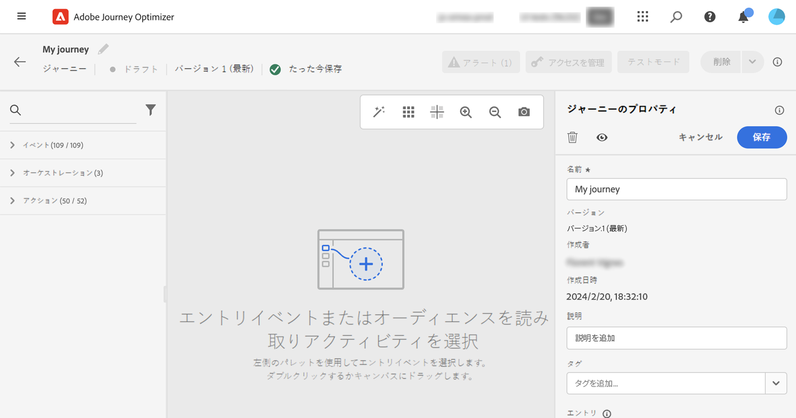

# ジャーニーのプロパティを設定 {#jo-properties}

>[!CONTEXTUALHELP]
>id="ajo_journey_properties"
>title="ジャーニーのプロパティ"
>abstract="この節では、ジャーニーのプロパティについて説明します。デフォルトでは、読み取り専用のパラメーターは非表示です。使用可能な設定は、ジャーニーのステータス、権限および製品設定によって異なります。"

>[!CONTEXTUALHELP]
>id="ajo_journey_exit_criterias"
>title="ジャーニー終了基準"
>abstract="このセクションには、終了基準オプションが表示されます。ジャーニーに 1 つ以上の終了基準ルールを作成できます。"

ジャーニープロパティは、ジャーニーの右側のパネルに一元化されています。 このセクションは、新規ジャーニーを作成する際にデフォルトで表示されます。 既存のジャーニーの場合は、ジャーニー名の横にある鉛筆アイコンをクリックして、プロパティにアクセスします。

このセクションを使用して、ジャーニーの名前の設定、説明の追加などを行います。

* 管理 [エントリと再エントリ](#entrance),
* 開始と終了を選択 [の日付](#dates),
* 管理 [データへのアクセス](#manage-access),
* を定義 [タイムアウト時間](#timeout) ジャーニーアクティビティ（管理者ユーザーのみ）
* ジャーニーとプロファイルを選択します [タイムゾーン](#timezone)
* Adobe Experience Platform統合タグをジャーニーに割り当てると、ジャーニーを簡単に分類し、キャンペーンリストからの検索を改善できます。 [タグの操作方法について詳しくは、こちらを参照してください](../start/search-filter-categorize.md#tags)

>[!NOTE]
>
>ライブジャーニーの場合、この画面には、ジャーニーを公開した日付とユーザーの名前のみが表示されます。

「**技術的な詳細をコピー**」を使用すると、ジャーニーに関する技術情報をコピーでき、サポートチームはこの情報をトラブルシューティングに使用できます。次の情報がコピーされます。 `JourneyVersion UID`, `OrgID`, `orgName`, `sandboxName`, `lastDeployedBy`, `lastDeployedAt`.

## エントリと再エントリ {#entrance}

デフォルトでは、新規ジャーニーで再エントリが許可されています。「1 回限り」のジャーニー（例：入店時に 1 度だけギフトをオファーするなど）を作成するには、この「**再エントリを許可**」オプションをオフにします。

 「**再エントリを許可**」オプションがアクティベートされると、「**再エントリ待機期間**」フィールドが表示されます。このフィールドでは、（イベントまたはオーディエンスの選定で始まる）単一ジャーニーで、プロファイルがジャーニーに再度エントリできるようになるまでの待機時間を定義できます。これにより、ジャーニーが同じイベントに対して誤って複数回トリガーされるのを防ぎます。デフォルトでは、このフィールドは 5 分に設定されています。最大期間は 29 日です。

プロファイルのエントリと再エントリの管理について詳しくは、[この節](entry-management.md)を参照してください。

## アクセスの管理 {#manage-access}

カスタムデータ使用ラベルまたはコアデータ使用ラベルをジャーニーに割り当てるには、「**[!UICONTROL アクセスを管理]**」ボタンをクリックします。[オブジェクトレベルのアクセス制御（OLAC）について詳しくはこちらを参照してください](../administration/object-based-access.md)

## ジャーニーとプロファイルのタイムゾーン {#timezone}

タイムゾーンはジャーニーレベルで定義されます。固定タイムゾーンを入力するか、Adobe Experience Platform プロファイルを使用してジャーニーのタイムゾーンを定義できます。Adobe Experience Platform プロファイルでタイムゾーンが定義されている場合は、ジャーニーでそのタイムゾーンを取得できます。

タイムゾーン管理の詳細については、[このページ](../building-journeys/timezone-management.md)を参照してください。

## 開始日と終了日 {#dates}

**開始日**&#x200B;を定義できます。 指定していない場合は、公開時に自動的に定義されます。

**終了日**&#x200B;も追加できます。これにより、日付に達したプロファイルは自動的に終了します。 終了日を指定しない場合、プロファイルは[グローバルジャーニータイムアウト](#global_timeout)（通常は 91 日、Healthcare Shield アドオン機能では 7 日に短縮）まで保持されます。唯一の例外は、「**繰り返し時に再エントリを強制する**」が有効になっている繰り返しの「オーディエンスを読み取り」ジャーニーで、これは次回の実行の開始日に終了します。

## タイムアウト {#timeout}

### ジャーニーアクティビティのタイムアウトまたはエラー {#timeout_and_error}

アクションまたは条件のアクティビティを編集するときに、エラーやタイムアウトが発生した場合の代替パスを定義できます。サードパーティシステムに照会するアクティビティの処理が、で定義されたタイムアウト時間を超えた場合 **[!UICONTROL タイムアウトまたはエラー]** ジャーニーのプロパティのフィールドである 2 番目のパスが、潜在的なフォールバックアクションを実行するために選択されます。

許可される値は 1 ～ 30 秒です。

非常に短いものを定義することをお勧めします **[!UICONTROL タイムアウトまたはエラー]** ジャーニーが時間的制約を受ける場合（例：ユーザーのリアルタイムの場所への反応）の値（アクションを数秒以上遅らせることはできません）。 ジャーニーにそれほど時間的制約がない場合は、より長い値を使用して、有効な応答を送るために呼び出されるシステムにより多くの時間をを付与することができます。

ジャーニーでは、以下に詳しく説明するようにグローバルタイムアウトも使用します。

### グローバルジャーニーのタイムアウト {#global_timeout}

に加えて [timeout](#timeout_and_error) ジャーニーアクティビティで使用すると、グローバルジャーニータイムアウトが適用されます。 インターフェイスに表示されず、変更もできません。

ジャーニー内にいる個人の進捗は、エントリしてから **91 日**&#x200B;経過すると、このグローバルタイムアウトにより停止されます。Healthcare Shield アドオン機能を使用すると、このタイムアウトが **7 日**&#x200B;に短縮されます。つまり、個人のジャーニーは 91 日（または 7 日）を超えることはできません。タイムアウト期間が経過すると、個人のデータは削除されます。タイムアウト期間が終了してもまだジャーニーに流入してくる個人がいる場合、それらは流入を停止され、レポートでは考慮されません。したがって、離脱する人物よりもジャーニーにエントリする人物の方が多くなる可能性があります。

>[!NOTE]
>
>ジャーニーは、プライバシーのオプトアウト、アクセス、削除などのリクエストに対して直接反応しません。ただし、グローバルタイムアウトにより、個人がどのジャーニーでも 91 日以上滞在することはなくなります。

ジャーニーの 91 日間のタイムアウトにより、ジャーニーの再エントリが許可されていない場合、再エントリのブロックが 91 日以上機能するかどうかを確認できません。 実際、ジャーニーにエントリしたユーザーの情報はエントリから 91 日後にすべて削除されるので、91 日前より古い日時にエントリしたユーザーが誰かを特定することはできません。

個人が待機アクティビティにエントリできるのは、91 日のジャーニータイムアウトより前に待機期間を完了するのに十分な時間がジャーニーに残っている場合のみです。[このページ](../building-journeys/wait-activity.md)を参照してください。

#### Time-to-Live （TTL）とデータレンテンションに関するよくある質問 {#timeout-faq}

Adobe Journey Optimizerの 2024 年 6 月のリリースより、ジャーニーのグローバルタイムアウトは 30 日から 91 日に変更されました。 影響については、以下の FAQ を参照してください。

**単一ジャーニー用**
<table style="table-layout:auto">
  <tr style="border: 1;">
    <td>
      
TTL 拡張機能のロールアウト後に公開されたジャーニーはどうなりますか？

    </td>
    <td>
      
新しいジャーニーにエントリするプロファイルの TTL は自動的に 91 日になります。

    </td>
  </tr>
  <tr style="border: 1;">
    <td>
      
TTL 拡張機能のローンチ前に公開されたジャーニーにエントリするプロファイルはどうなりますか。

    </td>
    <td>
      
プロファイルの TTL は、ジャーニーが最初に公開された時間と一致して 91 日（HIPAA の場合は 7 日）になります。

    </td>
  </tr>
  <tr style="border: 1;">
    <td>
      
TTL 拡張機能の起動時に、既にジャーニーにエントリしているプロファイルはどうなりますか。

    </td>
    <td>
      
プロファイルは、ジャーニーの元の公開時間に従って、91 日（HIPAA の場合は 7 日）の TTL を保持します。

    </td>
  </tr>
  <tr style="border: 1;">
    <td>
      
TTL 拡張機能の起動後に再公開された以前のジャーニーバージョンのプロファイルはどうなりますか。

    </td>
    <td>
      
プロファイルは、元のジャーニーバージョンの公開時間と整合させて、91 日（HIPAA の場合は 7 日）の TTL を維持します。

    </td>
  </tr>
  <tr style="border: 1;">
    <td>
      
TTL 拡張機能の起動後に新しいプロファイルが再公開されたジャーニーバージョンに入るとどうなりますか。

    </td>
    <td>
      
プロファイルの TTL は 91 日で、新しく再公開されたジャーニーバージョンの TTL と一致します。

    </td>
  </tr>
</table>

**セグメントトリガージャーニー用**

<table style="table-layout:auto">
  <tr style="border: 1;">
    <td>
      
TTL 拡張機能の後に公開された新しい 1 回限りのジャーニーはどうなりますか？

    </td>
    <td>
      
新しいジャーニーにエントリするプロファイルの TTL は自動的に 91 日になります。

    </td>
  </tr>
  <tr style="border: 1;">
    <td>
      
TTL 拡張機能後に公開された強制的な再エントリを伴わない、新しい繰り返しジャーニーはどうなりますか。

    </td>
    <td>
      
新しいジャーニーにエントリするプロファイルの TTL は自動的に 91 日になります。

    </td>
  </tr>
  <tr style="border: 1;">
    <td>
      
TTL 拡張機能後に強制的な再エントリが公開された新しい繰り返しジャーニーはどうなりますか。

    </td>
    <td>
      
新しいジャーニーにエントリするプロファイルには、繰り返し期間と同じ TTL が割り当てられます。 例えば、ジャーニーが毎日実行される場合、TTL は 1 日になります。

    </td>
  </tr>
  <tr style="border: 1;">
    <td>
      
TTL 拡張機能のローンチ前に公開されたジャーニーにエントリするプロファイルはどうなりますか。

    </td>
    <td>
      
プロファイルの TTL は、元の公開時間と一致して 91 日（HIPAA の場合は 7 日）になります。 強制的に再エントリする繰り返しジャーニーの場合、TTL は繰り返し期間と一致します。

    </td>
  </tr>
  <tr style="border: 1;">
    <td>
      
TTL 拡張機能が起動すると、ジャーニーを実行中のプロファイルはどうなりますか。

    </td>
    <td>
      
プロファイルは、ジャーニーの元の公開時間に従って、91 日（HIPAA の場合は 7 日）の TTL を保持します。 強制的に再エントリする繰り返しジャーニーの場合、TTL は繰り返し期間と一致します。

    </td>
  </tr>
  <tr style="border: 1;">
    <td>
      
TTL 拡張機能の起動後に再公開された以前のジャーニーバージョンの実行中のプロファイルはどうなりますか。

    </td>
    <td>
      
プロファイルは、元のジャーニーバージョンの公開時間と整合させて、91 日（HIPPA の場合は 7 日）の TTL を維持します。 強制的に再エントリする繰り返しジャーニーの場合、TTL は繰り返し期間と一致します。

    </td>
  </tr>
  <tr style="border: 1;">
    <td>
      
TTL 拡張機能の起動後に新しいプロファイルが再公開されたジャーニーバージョンに入るとどうなりますか。

    </td>
    <td>
      
プロファイルの TTL は 91 日で、新しく再公開されたジャーニーバージョンの TTL と一致します。 強制的に再エントリする繰り返しジャーニーの場合、TTL は繰り返し期間と一致します。

    </td>
  </tr>
</table>

## 結合ポリシー {#merge-policies}

ジャーニーは、Adobe Experience Platform からプロファイルデータを取得するときにマージポリシーを使用します。ジャーニータイプに応じて、異なる結合ポリシーが使用されます。

* オーディエンスを読み取りジャーニーまたはオーディエンスの選定ジャーニーの場合：オーディエンスからの結合ポリシーが使用されます
* 単一イベントジャーニーの場合：デフォルトの結合ポリシーが使用されます
* ビジネスイベントジャーニーでは、次のオーディエンスを読み取りアクティビティのターゲットオーディエンスの結合ポリシーを使用します

ジャーニーでは、ジャーニー全体を通して使用される結合ポリシーに従います。 したがって、1 つのジャーニーで複数のオーディエンスが使用されている場合（「inAudience」関数など）、ジャーニーで使用されている結合ポリシーとの不一致が発生すると、エラーが発生し、公開がブロックされます。 ただし、一貫性のないオーディエンスがメッセージのパーソナライゼーションで使用された場合は、一貫性がないにもかかわらず、アラートは発生しません。 そのため、このオーディエンスをメッセージのパーソナライゼーションに使用する場合は、オーディエンスに関連付けられている結合ポリシーを確認することを強くお勧めします。

結合ポリシーの詳細については、を参照してください。 [Adobe Experience Platform ドキュメント](https://experienceleague.adobe.com/ja/docs/experience-platform/profile/merge-policies/overview){target="_blank"}.

