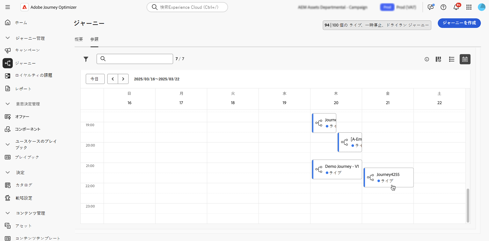
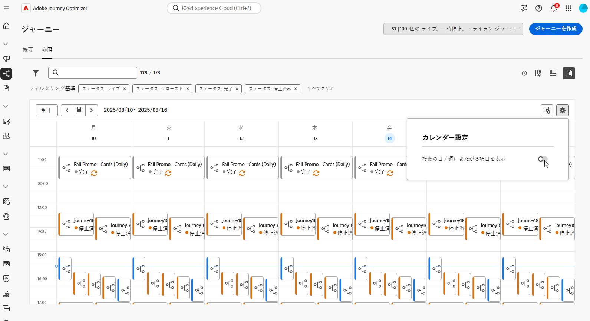
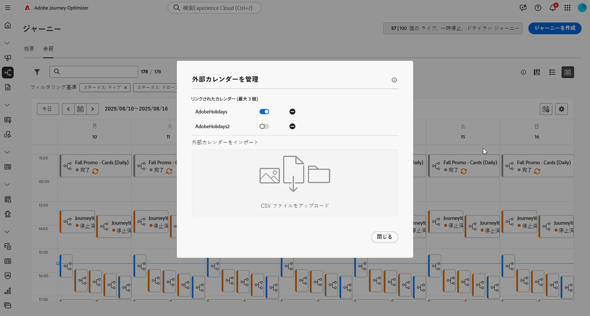
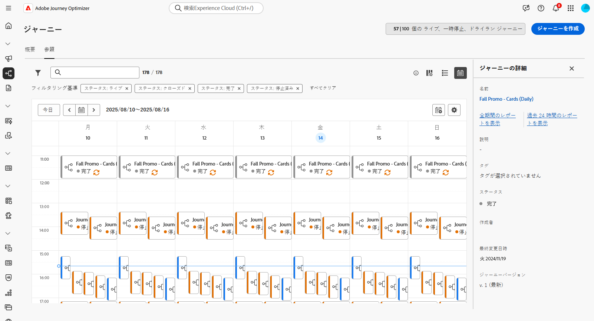

# ジャーニーの参照とフィルタリング {#browse-journeys}

>[!CONTEXTUALHELP]
>id="ajo_journey_view"
>title="ジャーニーリストとカレンダー表示"
>abstract="[!DNL Journey Optimizer]では、ジャーニーリストに加えて、ジャーニーのカレンダー表示が提供され、ジャーニーのスケジュールが明確に視覚的に表現されます。これらのボタンを使用すると、リスト表示とカレンダー表示をいつでも切り替えることができます。"

## ジャーニーダッシュボード {#dashboard-jo}

「ジャーニー管理」メニューセクションで、「**[!UICONTROL ジャーニー]**」をクリックします。「**[!UICONTROL 概要]**」と「**[!UICONTROL 参照]**」の 2 つのタブが使用できます。

### ジャーニーの概要

「**[!UICONTROL 概要]**」タブには、ジャーニーに関連する主要指標を含むダッシュボードが表示されます。

* **処理済みのプロファイル**：過去 24 時間に処理されたプロファイルの合計数
* **ライブジャーニー**：過去 24 時間のトラフィックを含むライブジャーニーの合計数。ライブジャーニーには、**単一ジャーニー**（イベントベース）と&#x200B;**バッチジャーニー**（オーディエンスを読み取り）が含まれます。
* **エラー率**：過去 24 時間にエントリしたプロファイルの合計数に対する、エラーが発生したすべてのプロファイルの割合。
* **破棄率**：過去 24 時間にエントリしたプロファイルの合計数に対する、破棄されたすべてのプロファイルの割合。破棄されたプロファイルは、例えば、名前空間や再エントリルールが正しくないので、ジャーニーにエントリする資格がないユーザーを表します。

>[!NOTE]
>
>このダッシュボードでは、過去 24 時間のトラフィックを含むジャーニーが考慮されます。アクセス可能なジャーニーのみが表示されます。指標は、30 分ごとに、新しいデータが使用可能になった場合にのみ更新されます。

### ジャーニーリスト

「**[!UICONTROL 参照]**」タブには、既存のジャーニーのリストが表示されます。ジャーニーを検索し、フィルターを使用して、各要素に対して基本的なアクションを実行できます。例えば、項目の複製や削除が可能です。

ジャーニーリストには、すべてのジャーニーバージョンがバージョン番号と共に表示されます。ジャーニーを検索すると、アプリを初めて開いたときに、リストの先頭に最新のバージョンが表示されます。次に、必要な並べ替えを定義します。アプリケーションはこの定義をユーザーの環境設定として扱います。ジャーニーのバージョンは、ジャーニー版インターフェイスの上部（キャンバスの上）にも表示されます。詳しくは、[ジャーニーバージョン管理](publish-journey.md#journey-versions)を参照してください。

### ジャーニーカレンダー {#calendar}

[!DNL Journey Optimizer] では、ジャーニーリストに加えて、ジャーニーのカレンダー表示が提供され、ジャーニーのスケジュールが明確に視覚的に表現されます。

ジャーニーの表現方法：

* デフォルトでは、カレンダーグリッドには、選択した週のすべてのライブジャーニーとスケジュールされたジャーニーが表示されます。追加のフィルターオプションを使用すると、完了、停止、終了したアクティブ化を表示できます。
* ドラフトジャーニーとテストモードのジャーニーは表示されません。
* 複数日にまたがるジャーニーは、カレンダーグリッドの上部に表示されます。
* 開始時間を指定していない場合は、最も近い手動アクティブ化時刻を使用してカレンダーに配置されます。
* ジャーニーは 1 時間の期間として表示されますが、実際の送信時間または完了時間は反映されません。

ジャーニーカレンダーに移動するには：

1. カレンダー表示にアクセスするには、ジャーニーリストを開き、「 アイコンをクリックします。

1. 週間を移動するには、カレンダーの上にある矢印ボタンまたは日付セレクターを使用します。

   カレンダーには、現在の週にスケジュールされているすべてのジャーニーが表示されます。

   

1.  アイコンをクリックして、複数の日または週にまたがる項目の表示を切り替えます。

   

1.  アイコンをクリックして、最大 3 つの外部カレンダーを管理および追加します。

   

1. イベント名、開始日および終了日を含む CSV ファイルをドラッグ＆ドロップします。

   アップロードされたイベントは、組織内のすべてのユーザーが閲覧でき、ジャーニーカレンダーとキャンペーンカレンダーの両方に表示されます。

   +++CSV 形式は次のようになります。

   | 列 1 | 列 2 | 列 3 |
   |-|-|-|
   | イベント名 | 開始日（mm/dd/yy 形式） | 終了日（mm/dd/yy 形式） |

   +++

1. 必要に応じて、追加した外部カレンダーを表示するか非表示にしたり、削除したりできます。

   

1. ジャーニーの詳細を表示するには、視覚的なブロックをクリックして詳細を開き、確認します。

   

## ジャーニーのフィルタリング {#journey-filter}

ジャーニーのリストでは、様々なフィルターを使用して、ジャーニーのリストを絞り込みます。

**[!UICONTROL ステータスフィルターとバージョンフィルター]**&#x200B;では、[ステータス](#journey-statuses)、[タイプ](#journey-types)、[バージョン](publish-journey.md#journey-versions)および割り当てられている[タグ](../start/search-filter-categorize.md#tags)に従ってジャーニーをフィルタリングできます。

**[!UICONTROL 作成フィルター]**&#x200B;を使用すると、作成日またはジャーニーを作成したユーザーに従ってジャーニーをフィルタリングできます。

**[!UICONTROL アクティビティフィルター]**&#x200B;と&#x200B;**[!UICONTROL データフィルター]**&#x200B;から特定のイベント、フィールドグループまたはアクションを使用するジャーニーを表示します。

**[!UICONTROL 公開フィルター]**&#x200B;を使用すると、公開日またはユーザーを選択できます。例えば、昨日公開されたライブジャーニーの最新バージョンのみを表示するように選択できます。

特定の日付範囲に基づいてジャーニーをフィルタリングするには、**[!UICONTROL 公開済み]**&#x200B;ドロップダウンリストから「**[!UICONTROL カスタム]**」を選択します。

イベント、データソースまたはアクションの設定ペインの「**[!UICONTROL 使用されている場所]**」フィールドには、特定のイベント、フィールドグループまたはアクションを使用するジャーニーの数が表示されます。「**[!UICONTROL ジャーニーを表示]**」ボタンをクリックすると、対応するジャーニーのリストを表示できます。

## ジャーニーのタイプ {#journey-types}

ジャーニーのタイプは、そのジャーニーで使用されるアクティビティによって異なります。これには、以下のようなものがあります。

* **[!UICONTROL 単一イベント]** - 単一イベントジャーニーは、特定のプロファイルにリンクされます。イベントは、ユーザーの行動またはユーザーとリンクして発生した事象（例えば、ユーザーが 10,000 ロイヤルティポイントに到達したなど）に関連しています。[詳細情報](../event/about-events.md)
* **[!UICONTROL ビジネスイベント]**。ビジネスイベントジャーニーは、プロファイルに関連しないイベントで開始します。イベントの設定は技術系ユーザーが実行し、編集はできません。[詳細情報](../event/about-events.md)
* **[!UICONTROL オーディエンスの選定]** - オーディエンスの選定ジャーニーは Adobe Experience Platform オーディエンスへのプロファイルのエントリや離脱をリッスンして、個人をジャーニーにエントリさせたりジャーニー内を前進させたりすることができます。[詳細情報](audience-qualification-events.md)
* **[!UICONTROL オーディエンスを読み取り]** - オーディエンスを読み取りジャーニーでは、オーディエンス内のすべての個人がジャーニーにエントリし、ジャーニーに含まれるメッセージを受け取ります。[詳細情報](read-audience.md)

ジャーニーのタイプと関連するエントリの管理について詳しくは、[このページ](entry-management.md)を参照してください。

## ジャーニーのステータス {#journey-statuses}

ジャーニーのステータスは、ライフサイクルに応じて異なります。これには、以下のようなものがあります。

* **ドラフト**：ジャーニーは最初のステージです。まだ公開されていません。
* **ドラフト（テスト）**：「**テストモード**」ボタンを使用してテストモードがアクティブ化されています。[詳細情報](../building-journeys/testing-the-journey.md)
* **完了済み**：91 日の[グローバルタイムアウト](journey-properties.md#global_timeout)が経過すると、ジャーニーは自動的にこのステータスに切り替わります。既にジャーニーにエントリしているプロファイルは、通常どおりにジャーニーを終了できます。新しいプロファイルは、そのジャーニーにエントリできなくなります。
* **ライブ**：ジャーニーは「**公開**」ボタンを使用して公開されています。[詳細情報](../building-journeys/publish-journey.md)
* **一時停止済み**：ライブジャーニーは「**一時停止**」ボタンを使用して一時停止されています。[詳細情報](../building-journeys/journey-pause.md)
* **停止済み**：「**停止**」ボタンを使用してジャーニーがオフになっています。すべての個人のジャーニーが即座に終了します。[詳細情報](../building-journeys/end-journey.md#stop-journey)
* **クローズ済み**：「**新規エントリに対してクローズ**」ボタンを使用してジャーニーが終了しました。ジャーニーは、新しい個人がジャーニーにエントリするのを停止します。既にジャーニーにエントリしている人は、通常通りにジャーニーを終了することができます。[詳細情報](../building-journeys/end-journey.md)

>[!NOTE]
>
>* また、ジャーニーオーサリングライフサイクルには、「**公開中**」（「ドラフト」と「ライブ」の間）、「**テストモードをアクティブ化中**」または「**テストモードを非アクティブ化中**」（「**ドラフト**」と「**ドラフト（テスト）**」の間）、「**停止中**」（「**ライブ**」と「**停止**」の間）、「**再開中**」（「**一時停止済み**」と「**ライブ**」の間）、「**一時停止中**」（**ライブ**」と「**一時停止済み**」の間）の、フィルタリングに使用できない一連の中間ステータスも含まれます。ジャーニーが中間状態にある場合、読み取り専用になります。
>
>* **ライブ**&#x200B;ジャーニーを変更する必要がある場合は、ジャーニーの[新しいバージョンを作成](#journey-versions)します。また、いつでもライブジャーニーを一時停止し、必要なすべての変更を実行して、再開できます。[ジャーニーの一時停止の詳細情報](../building-journeys/journey-pause.md)

## ジャーニーの複製 {#duplicate-a-journey}

既存のジャーニーは、「**参照**」タブから複製できます。すべてのオブジェクトと設定は、ジャーニーコピーに複製されます。

手順は次のとおりです。

1. コピーするジャーニーに移動し、**その他のアクション**&#x200B;アイコン（ジャーニー名の横の 3 つのドット）をクリックします。
1. 「**複製**」を選択します。

   

1. ジャーニーの名前を入力して確定します。ジャーニーのプロパティ画面で名前を変更することもできます。デフォルトでは、名前は `[JOURNEY-NAME]_copy` のように設定されます。

   

1. 新しいジャーニーが作成され、ジャーニーリストで使用できます。

## 一括操作 {#bulk-operations}

ジャーニーのリストから、複数の&#x200B;**ライブ**&#x200B;ジャーニーを一時停止できます。ジャーニーのグループを一時停止（_一括一時停止_）するには、リストでジャーニーを選択し、画面下部の青いバーにある「**一時停止**」ボタンをクリックします。「**一時停止**」ボタンは、**ライブ**&#x200B;ジャーニーを選択した場合にのみ使用できます。

また、1 つまたは複数の&#x200B;**一時停止した**&#x200B;ジャーニーを再開することもできます。ジャーニーのグループを再開（_一括再開_）するには、ジャーニーを選択し、画面下部の青いバーにある「**再開**」ボタンをクリックします。「**再開**」ボタンは、**一時停止した**&#x200B;ジャーニーを選択した場合にのみ使用できます。

[ジャーニーの一時停止／再開についての詳細情報](journey-pause.md)

>[!NOTE]
>
>1 回の操作で最大 10 個のジャーニーを一時停止／再開できます。

