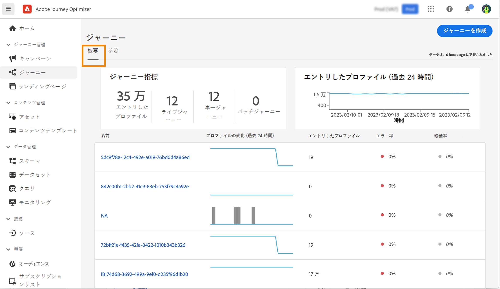
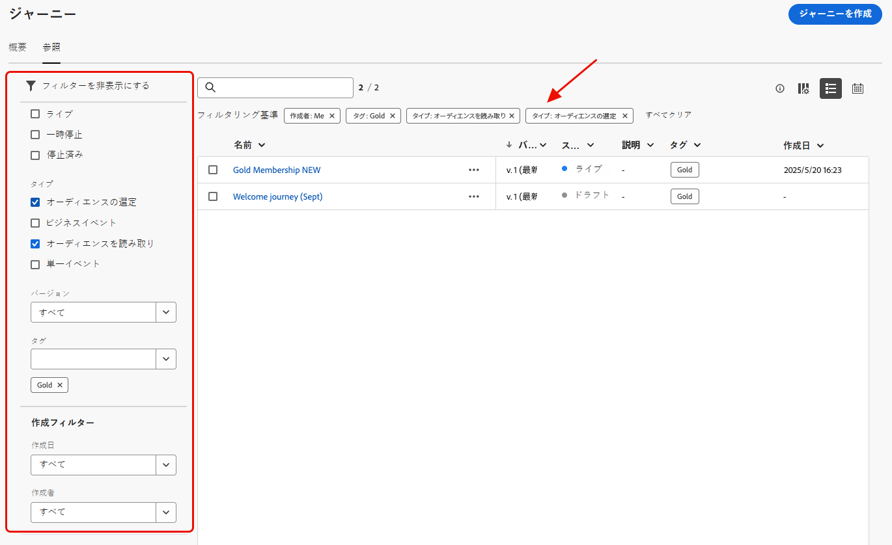
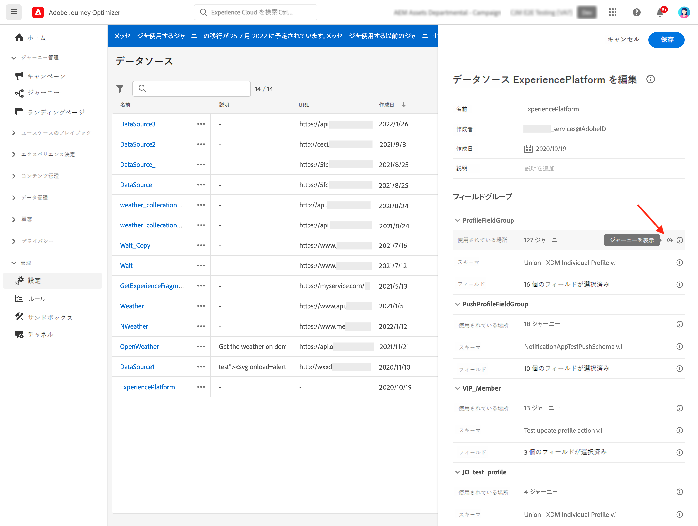

# ジャーニーの参照とフィルタリング {#browse-journeys}

## ジャーニーダッシュボード {#dashboard-jo}

>[!CONTEXTUALHELP]
>id="ajo_journey_view"
>title="ジャーニーテーブルとタイムラインの表示"
>abstract="ジャーニーテーブルとタイムラインの表示"

「ジャーニー管理」メニューセクションで、「**[!UICONTROL ジャーニー]**」をクリックします。「**[!UICONTROL 概要]**」と「**[!UICONTROL 参照]**」の 2 つのタブが使用できます。

* 「**[!UICONTROL 概要]**」タブには、ジャーニーに関連する主要指標を含むダッシュボードが表示されます。

  

   * **処理済みのプロファイル**：過去 24 時間に処理されたプロファイルの合計数
   * **ライブジャーニー**：過去 24 時間のトラフィックを含むライブジャーニーの合計数。ライブジャーニーには、**単一ジャーニー**（イベントベース）と&#x200B;**バッチジャーニー**（オーディエンスを読み取り）が含まれます。
   * **エラー率**：過去 24 時間にエントリしたプロファイルの合計数に対する、エラーが発生したすべてのプロファイルの割合。
   * **破棄率**：過去 24 時間にエントリしたプロファイルの合計数に対する、破棄されたすべてのプロファイルの割合。破棄されたプロファイルは、名前空間が正しくないことや再エントリルールを理由に、ジャーニーにエントリする資格がないユーザーを表します。

  >[!NOTE]
  >
  >このダッシュボードでは、過去 24 時間のトラフィックを含むジャーニーが考慮されます。アクセス可能なジャーニーのみが表示されます。指標は、30 分ごとに、新しいデータが使用可能になった場合にのみ更新されます。

* 「**[!UICONTROL 参照]**」タブには、既存のジャーニーのリストが表示されます。ジャーニーを検索し、フィルターを使用して、各要素に対して基本的なアクションを実行できます。例えば、項目の複製や削除が可能です。

  

## ジャーニーのフィルタリング {#journey-filter}

ジャーニーのリストでは、様々なフィルターを使用して、ジャーニーのリストを絞り込むことができます。

**[!UICONTROL ステータスフィルターとバージョンフィルター]**&#x200B;では、[ステータス](#journey-statuses)、[タイプ](#journey-types)、[バージョン](#journey-versions)および割り当てられている[タグ](../start/search-filter-categorize.md#tags)に従ってジャーニーをフィルタリングできます。

**[!UICONTROL 作成フィルター]**&#x200B;を使用すると、作成日またはジャーニーを作成したユーザーに従ってジャーニーをフィルタリングできます。

**[!UICONTROL アクティビティフィルター]**&#x200B;と&#x200B;**[!UICONTROL データフィルター]**&#x200B;では、特定のイベント、フィールドグループまたはアクションを使用するジャーニーを表示できます。

**[!UICONTROL 公開フィルター]**&#x200B;を使用すると、公開日またはユーザーを選択できます。例えば、昨日公開されたライブジャーニーの最新バージョンのみを表示するように選択できます。

特定の日付範囲に基づいてジャーニーをフィルタリングするには、**[!UICONTROL 公開済み]**&#x200B;ドロップダウンリストから「**[!UICONTROL カスタム]**」を選択します。

イベント、データソースまたはアクションの設定ペインの「**[!UICONTROL 使用されている場所]**」フィールドには、特定のイベント、フィールドグループまたはアクションを使用するジャーニーの数が表示されます。「**[!UICONTROL ジャーニーを表示]**」ボタンをクリックすると、対応するジャーニーのリストを表示できます。

## ジャーニーのタイプ {#journey-types}

ジャーニーのタイプは、そのジャーニーで使用されるアクティビティによって異なります。これには、以下のようなものがあります。

* **[!UICONTROL 単一イベント]** - 単一イベントジャーニーは、特定のプロファイルにリンクされます。イベントは、ユーザーの行動やユーザーにリンクして発生した事象（10,000 ロイヤルティポイントに到達など）に関連します。[詳細情報](../event/about-events.md)
* **[!UICONTROL ビジネスイベント]**。ビジネスイベントジャーニーは、プロファイルに関連しないイベントで開始します。イベントの設定は技術系ユーザーが実行し、編集はできません。[詳細情報](../event/about-events.md)
* **[!UICONTROL オーディエンスの選定]** - オーディエンスの選定ジャーニーは Adobe Experience Platform オーディエンスへのプロファイルのエントリや離脱をリッスンして、個人をジャーニーにエントリさせたりジャーニー内を前進させたりすることができます。[詳細情報](audience-qualification-events.md)
* **[!UICONTROL オーディエンスを読み取り]** - オーディエンスを読み取りジャーニーでは、オーディエンス内のすべての個人がジャーニーにエントリし、ジャーニーに含まれるメッセージを受け取ります。[詳細情報](read-audience.md)

ジャーニーのタイプと関連するエントリ管理について詳しくは、[ このページ ](entry-management.md) を参照してください。

## ジャーニーのステータス {#journey-statuses}

ジャーニーのステータスは、ライフサイクルに応じて異なります。これには、以下のようなものがあります。

* **クローズ済み**：「**新規エントリに対してクローズ**」ボタンを使用してジャーニーが終了しました。ジャーニーは、新しい個人がジャーニーにエントリするのを停止します。既にジャーニーにエントリしているユーザーは、通常どおりにジャーニーを終了できます。
* **ドラフト**：ジャーニーは最初のステージです。まだ公開されていません。
* **ドラフト（テスト）**：「**テストモード**」ボタンを使用してテストモードがアクティブ化されています。
* **完了済み**：91 日の[グローバルタイムアウト](journey-properties.md#global_timeout)が経過すると、ジャーニーは自動的にこのステータスに切り替わります。既にジャーニーにエントリしているプロファイルは、通常どおりにジャーニーを終了できます。新しいプロファイルは、そのジャーニーにエントリできなくなります。
* **ライブ**：ジャーニーは「**公開**」ボタンを使用して公開されています。
* **停止済み**：「**停止**」ボタンを使用してジャーニーがオフになっています。すべての個人のジャーニーが即座に終了します。

>[!NOTE]
>
>* また、ジャーニーオーサリングライフサイクルには、「公開中」（「ドラフト」と「ライブ」の間）、「テストモードをアクティブ化中」または「テストモードを非アクティブ化中」（「ドラフト」と「ドラフト（テスト）」の間）および「停止中」（「ライブ」と「停止」の間）の、フィルタリングに使用できない一連の中間ステータスも含まれます。ジャーニーが中間の状態にある場合は、読み取り専用です。
>
>* **ライブ**&#x200B;ジャーニーを変更する必要がある場合は、ジャーニーの[新しいバージョンを作成](#journey-versions)します。

## ジャーニーのバージョン {#journey-versions}

ジャーニーリストには、すべてのジャーニーバージョンがバージョン番号と共に表示されます。ジャーニーを検索すると、アプリを初めて開いたときに、リストの先頭に最新のバージョンが表示されます。次に、必要な並べ替えを定義します。アプリケーションはこの定義をユーザーの環境設定として扱います。ジャーニーのバージョンは、ジャーニー版インターフェイスの上部（キャンバスの上）にも表示されます。

>[!NOTE]
>
>通常、プロファイルは同じジャーニー内に同時に複数回存在することはできません。再エントリが有効な場合、プロファイルはジャーニーに再エントリできますが、再エントリできるのは以前のジャーニーインスタンスから完全に離脱した後のみになります。[詳細情報](end-journey.md)。

### ジャーニーの新しいバージョンの作成 {#journey-create-new-version}

ライブジャーニーを変更する必要がある場合は、ジャーニーの新しいバージョンを作成します。既存のジャーニーの新しいバージョンを作成するには、次の手順に従います。

1. ライブジャーニーの最新バージョンを開き、「**[!UICONTROL 新しいバージョンを作成]**」をクリックして確認します。

   

   >[!NOTE]
   >
   >新しいバージョンは、ジャーニーの最新バージョンからのみ作成できます。

1. 変更を加え、「**[!UICONTROL 公開]**」をクリックして確認します。

ジャーニーが公開された時点から、最新版ジャーニーに個人利用者がエントリし始めます。既に前のバージョンにエントリしている人物は、ジャーニーが終了するまで古いバージョンを継続します。後で同じジャーニーに再エントリする場合は、最新バージョンにエントリすることになります。

ジャーニーのバージョンは個別に停止できます。ジャーニーのすべてのバージョンには同じ名前が付いています。

新しいバージョンのジャーニーを公開すると、前のバージョンが自動的に終了し、**クローズ**&#x200B;ステータスに切り替わります。このジャーニーにはエントリできません。最新バージョンを停止しても、以前のバージョンはクローズのままとなります。

>[!NOTE]
>
>ジャーニーのバージョン管理には、特定のガードレールと制限が適用されます。 詳しくは、[ このページ ](../start/guardrails.md#journey-versions-journey-versions-g) を参照してください。

## ジャーニーの複製 {#duplicate-a-journey}

既存のジャーニーは、「**参照**」タブから複製できます。すべてのオブジェクトと設定は、ジャーニーコピーに複製されます。

手順は次のとおりです。

1. コピーするジャーニーに移動し、**その他のアクション**&#x200B;アイコン（ジャーニー名の横の 3 つのドット）をクリックします。
1. 「**複製**」を選択します。

   

1. ジャーニーの名前を入力して確定します。ジャーニーのプロパティ画面で名前を変更することもできます。デフォルトでは、名前は `[JOURNEY-NAME]_copy` のように設定されます。

   

1. 新しいジャーニーが作成され、ジャーニーリストで使用できます。
