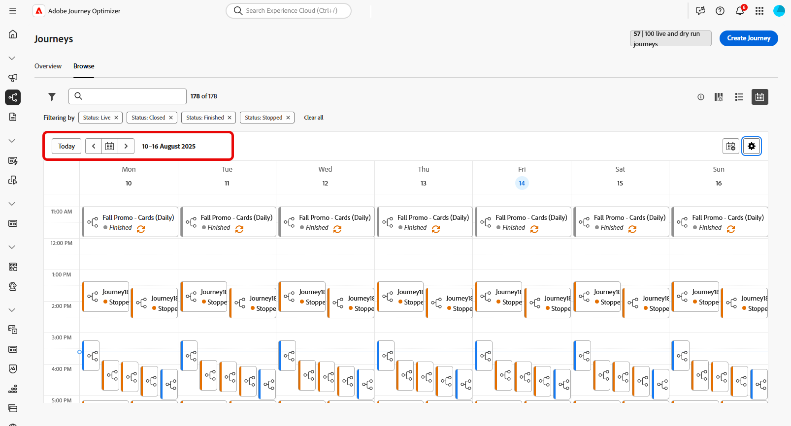

# ジャーニーの参照とフィルタリング {#browse-journeys}

>[!CONTEXTUALHELP]
>id="ajo_journey_view"
>title="ジャーニーリストとカレンダー表示"
>abstract="[!DNL Journey Optimizer]では、ジャーニーリストに加えて、ジャーニーのカレンダー表示が提供され、ジャーニーのスケジュールが明確に視覚的に表現されます。これらのボタンを使用すると、リスト表示とカレンダー表示をいつでも切り替えることができます。"

## ジャーニーダッシュボード {#dashboard-jo}

「ジャーニー管理」メニューセクションで、「**[!UICONTROL ジャーニー]**」をクリックします。「**[!UICONTROL 概要]**」と「**[!UICONTROL 参照]**」の 2 つのタブが使用できます。

### ジャーニーの概要

「**[!UICONTROL 概要]**」タブには、ジャーニーに関連する主要指標を含むダッシュボードが表示されます。

* **処理済みのプロファイル**：過去 24 時間に処理されたプロファイルの合計数
* **ライブジャーニー**：過去 24 時間のトラフィックを含むライブジャーニーの合計数。ライブジャーニーには、**単一ジャーニー**（イベントベース）と&#x200B;**バッチジャーニー**（オーディエンスを読み取り）が含まれます。
* **エラー率**：過去 24 時間にエントリしたプロファイルの合計数に対する、エラーが発生したすべてのプロファイルの割合。
* **破棄率**：過去 24 時間にエントリしたプロファイルの合計数に対する、破棄されたすべてのプロファイルの割合。破棄されたプロファイルは、名前空間や再エントリルールが正しくないなど、ジャーニーにエントリする資格がないユーザーを表します。

>[!NOTE]
>
>このダッシュボードでは、過去 24 時間のトラフィックを含むジャーニーが考慮されます。アクセス可能なジャーニーのみが表示されます。指標は、30 分ごとに、新しいデータが使用可能になった場合にのみ更新されます。

### ジャーニーリスト

「**[!UICONTROL 参照]**」タブには、既存のジャーニーのリストが表示されます。ジャーニーを検索し、フィルターを使用して、各要素に対して基本的なアクションを実行できます。例えば、項目の複製や削除が可能です。

### ジャーニーカレンダー {#calendar}

[!DNL Journey Optimizer] では、ジャーニーリストに加えて、ジャーニーのカレンダー表示が提供され、ジャーニーのスケジュールが明確に視覚的に表現されます。

>[!AVAILABILITY]
>
>カレンダー表示は現在、一連の組織でのみ使用できます（限定提供）。アクセス権をリクエストするには、[このフォーム](https://forms.cloud.microsoft/r/FC49afuJVi){target="_blank"}を使用します。
>
>この機能は開発中です。上部のメニューの「**[!UICONTROL ベータ版フィードバック]**」ボタンを使用して、ご意見やご要望をお寄せください。

カレンダー表示にアクセスするには、ジャーニーリストを開き、 アイコンをクリックします。

カレンダーには、現在の週にスケジュールされているすべてのジャーニーが表示されます。週間を移動するには、カレンダーの上にある矢印ボタンを使用します。

ジャーニーの表現方法：

* デフォルトでは、カレンダーグリッドには、選択した週のすべてのライブジャーニーとスケジュールされたジャーニーが表示されます。追加のフィルターオプションを使用すると、完了、停止、終了したアクティブ化を表示できます。
* ドラフトジャーニーとテストモードのジャーニーは表示されません。
* 複数日にまたがるジャーニーは、カレンダーグリッドの上部に表示されます。
* 開始時間を指定していない場合は、最も近い手動アクティブ化時刻を使用してカレンダーに配置されます。
* ジャーニーは 1 時間の期間として表示されますが、実際の送信時間または完了時間は反映されません。

ジャーニーの詳細を表示するには、視覚的なブロックをクリックして詳細を開き、確認します。

ジャーニーリストには、すべてのジャーニーバージョンがバージョン番号と共に表示されます。ジャーニーを検索すると、アプリを初めて開いたときに、リストの先頭に最新のバージョンが表示されます。次に、必要な並べ替えを定義します。アプリケーションはこの定義をユーザーの環境設定として扱います。ジャーニーのバージョンは、ジャーニー版インターフェイスの上部（キャンバスの上）にも表示されます。詳しくは、[ジャーニーバージョン管理](publishing-the-journey.md#journey-versions-journey-versions)を参照してください。

## ジャーニーのフィルタリング {#journey-filter}

ジャーニーのリストで、様々なフィルターを使用してジャーニーのリストを絞り込みます。

**[!UICONTROL ステータスフィルターとバージョンフィルター]**&#x200B;では、[ステータス](#journey-statuses)、[タイプ](#journey-types)、[バージョン](publishing-the-journey.md#journey-versions-journey-versions)および割り当てられている[タグ](../start/search-filter-categorize.md#tags)に従ってジャーニーをフィルタリングできます。

**[!UICONTROL 作成フィルター]**&#x200B;を使用すると、作成日またはジャーニーを作成したユーザーに従ってジャーニーをフィルタリングできます。

**[!UICONTROL アクティビティフィルター]** と **[!UICONTROL データフィルター]** の特定のイベント、フィールドグループ、アクションなどを使用するジャーニーを表示します。

**[!UICONTROL 公開フィルター]**&#x200B;を使用すると、公開日またはユーザーを選択できます。例えば、昨日公開されたライブジャーニーの最新バージョンのみを表示するように選択できます。

特定の日付範囲に基づいてジャーニーをフィルタリングするには、**[!UICONTROL 公開済み]**&#x200B;ドロップダウンリストから「**[!UICONTROL カスタム]**」を選択します。

イベント、データソースまたはアクションの設定ペインの「**[!UICONTROL 使用されている場所]**」フィールドには、特定のイベント、フィールドグループまたはアクションを使用するジャーニーの数が表示されます。「**[!UICONTROL ジャーニーを表示]**」ボタンをクリックすると、対応するジャーニーのリストを表示できます。

## ジャーニーのタイプ {#journey-types}

ジャーニーのタイプは、そのジャーニーで使用されるアクティビティによって異なります。これには、以下のようなものがあります。

* **[!UICONTROL 単一イベント]** - 単一イベントジャーニーは、特定のプロファイルにリンクされます。イベントは、人物の行動または人物にリンクして発生した事象（人物が 10,000 ロイヤルティポイントに到達など）に関連しています。 [詳細情報](../event/about-events.md)
* **[!UICONTROL ビジネスイベント]**。ビジネスイベントジャーニーは、プロファイルに関連しないイベントで開始します。イベントの設定は技術系ユーザーが実行し、編集はできません。[詳細情報](../event/about-events.md)
* **[!UICONTROL オーディエンスの選定]** - オーディエンスの選定ジャーニーは Adobe Experience Platform オーディエンスへのプロファイルのエントリや離脱をリッスンして、個人をジャーニーにエントリさせたりジャーニー内を前進させたりすることができます。[詳細情報](audience-qualification-events.md)
* **[!UICONTROL オーディエンスを読み取り]** - オーディエンスを読み取りジャーニーでは、オーディエンス内のすべての個人がジャーニーにエントリし、ジャーニーに含まれるメッセージを受け取ります。[詳細情報](read-audience.md)

ジャーニーのタイプと関連するエントリの管理について詳しくは、[このページ](entry-management.md)を参照してください。

## ジャーニーのステータス {#journey-statuses}

ジャーニーのステータスは、ライフサイクルに応じて異なります。これには、以下のようなものがあります。

* **クローズ済み**：「**新規エントリに対してクローズ**」ボタンを使用してジャーニーが終了しました。ジャーニーは、新しい個人がジャーニーにエントリするのを停止します。既にジャーニーにエントリしているユーザーは、通常どおりにジャーニーを終了できます。
* **ドラフト**：ジャーニーは最初のステージです。まだ公開されていません。
* **ドラフト（テスト）**：「**テストモード**」ボタンを使用してテストモードがアクティブ化されています。
* **完了済み**：91 日の[グローバルタイムアウト](journey-properties.md#global_timeout)が経過すると、ジャーニーは自動的にこのステータスに切り替わります。既にジャーニーにエントリしているプロファイルは、通常どおりにジャーニーを終了できます。新しいプロファイルは、そのジャーニーにエントリできなくなります。
* **ライブ**：ジャーニーは「**公開**」ボタンを使用して公開されています。
* **停止済み**：「**停止**」ボタンを使用してジャーニーがオフになっています。すべての個人のジャーニーが即座に終了します。

>[!NOTE]
>
>* ジャーニーオーサリングライフサイクルには、フィルタリングできない一連の中間ステータス（「公開」（「ドラフト」と「ライブ」の間）、「テストモードのアクティブ化」または「テストモードの非アクティブ化」（「ドラフト」と「ドラフト（テスト）」の間）、「停止」（「ライブ」と「停止済み」）が含まれます。 ジャーニーが中間の状態にある場合は、読み取り専用です。
>
>* **ライブ**&#x200B;ジャーニーを変更する必要がある場合は、ジャーニーの[新しいバージョンを作成](#journey-versions)します。

## ジャーニーの複製 {#duplicate-a-journey}

既存のジャーニーは、「**参照**」タブから複製できます。すべてのオブジェクトと設定は、ジャーニーコピーに複製されます。

手順は次のとおりです。

1. コピーするジャーニーに移動し、**その他のアクション**&#x200B;アイコン（ジャーニー名の横の 3 つのドット）をクリックします。
1. 「**複製**」を選択します。

   

1. ジャーニーの名前を入力して確定します。ジャーニーのプロパティ画面で名前を変更することもできます。デフォルトでは、名前は `[JOURNEY-NAME]_copy` のように設定されます。

   

1. 新しいジャーニーが作成され、ジャーニーリストで使用できます。
