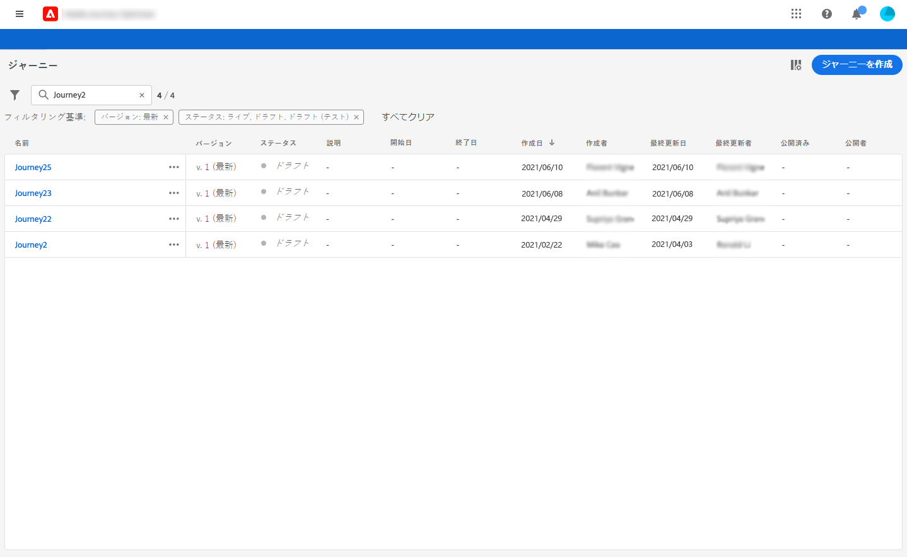
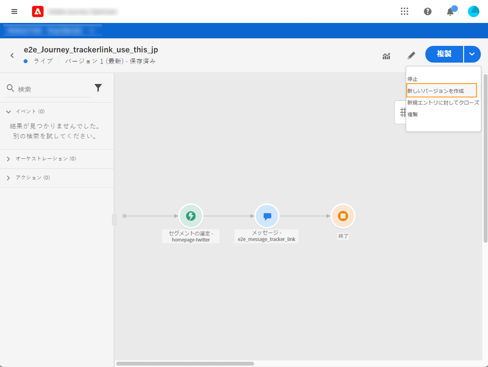
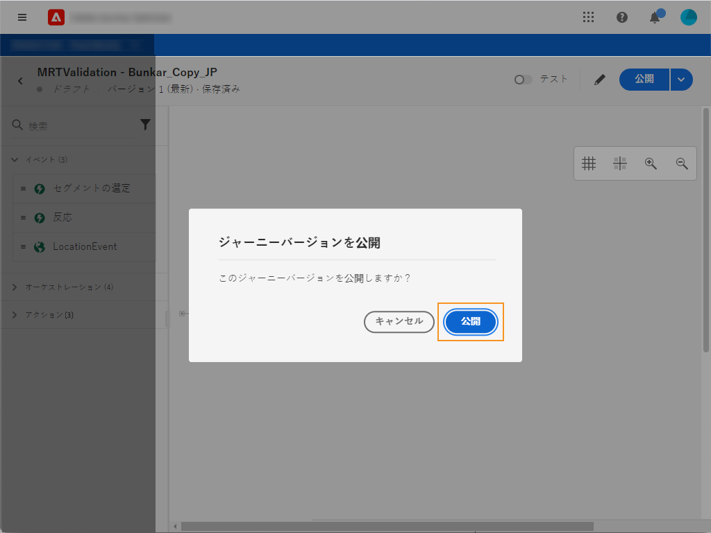

# ジャーニーのバージョン{#concept_ldc_k55_zgb}

ジャーニーリストでは、すべてのジャーニーバージョンがバージョン番号と共に表示されます。 [このページ](../building-journeys/using-the-journey-designer.md)を参照してください。

ジャーニーを検索すると、アプリを初めて開いたときに、リストの先頭に最新のバージョンが表示されます。 次に、必要な並べ替えを定義します。アプリケーションはこの定義をユーザーの好みとして扱います。ジャーニーのバージョンは、ジャーニー版インターフェイスの上部（キャンバスの上）にも表示されます。

ライブジャーニーを変更する必要がある場合は、ジャーニーの新しいバージョンを作成する必要があります。

>[!NOTE]
>
>ジャーニーバージョンの制限について詳しくは、[このページ](../building-journeys/limitations.md#journey-versions-limitations)を参照してください

1. ライブジャーニーの最新バージョンを開き、**[!UICONTROL 新しいバージョンを作成]**&#x200B;をクリックして確認します。

   

   >[!NOTE]
   >
   >新しいバージョンは、ジャーニーの最新バージョンからのみ作成できます。

1. 変更を行い、「**[!UICONTROL 発行]**」をクリックして確認します。

   

ジャーニーが公開された時点から、個人利用者は最新版ジャーニーの流れに取り込まれます。以前のバージョンを既に入力していると、ジャーニーが完了するまで古いバージョンが使用されます。 後で同じジャーニーを再入力するしたとき、最新バージョンに移行します。

ジャーニーバージョンは個別に停止できます。 ジャーニーのすべてのバージョンは同じ名前が付いています。

>[!NOTE]
>
>新しいバージョンのジャーニーを公開すると、前のバージョンが自動的に終了し、**「終了」** ステータスに切り替わります。その終了したジャーニーに利用者が入ることはありません。 最新バージョンを停止しても、以前のバージョンは閉じたままとなります。
