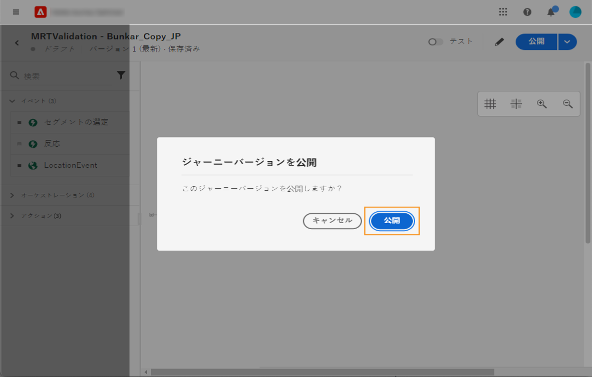

# 一般原則{#jo-general-principle}

用途 [!DNL Journey Optimizer] イベントやデータソースに保存されたコンテキストデータを活用して、リアルタイムオーケストレーションのユースケースを構築します。

次の機能を活用して、複数のステップから成る詳細なシナリオを設計できます。

* イベントの受信をトリガーにしてリアルタイムに&#x200B;**単一配信**&#x200B;を送信したり、Adobe Experience Platform のセグメントを使用してメッセージを&#x200B;**一括で**&#x200B;送信したりできます。

* イベント、Adobe Experience Platform の情報、サードパーティの API サービスのデータなどの&#x200B;**コンテキストデータ**&#x200B;を活用できます。

* **組み込みのアクション**&#x200B;を使用して [!DNL Journey Optimizer] でデザインしたメッセージを送信したり、サードパーティのシステムを使用している場合は&#x200B;**カスタムアクション**&#x200B;を作成してメッセージを送信したりできます。

* **ジャーニーデザイナー**&#x200B;を使用すると、エントリイベントやセグメントの読み取りアクティビティを簡単にドラッグ＆ドロップして、条件を追加し、パーソナライズされたメッセージを送信するなど、複数の手順から成るユースケースを作成できます。

## ジャーニーの作成手順{#steps-journey}

Adobe Journey Optimizerを使用して、1 つのキャンバスからパーソナライズされたジャーニーを設計および調整します。

Adobe Journey Optimizerには、マーケターがマーケティングアウトリーチを 1 対 1 の顧客エンゲージメントと調和させるためのオムニチャネルオーケストレーションキャンバスが含まれています。 ユーザーインターフェイスを使用すると、パレットからアクティビティをキャンバスに簡単にドラッグ&amp;ドロップして、ジャーニーを構築できます。

での最初のジャーニーの開始方法と作成方法を説明します。 [このページ](journey-gs.md).

オムニチャネルジャーニーデザイナーは、直感的なドラッグ&amp;ドロップインターフェイスを使用して、ターゲットオーディエンス、リアルタイム顧客またはビジネスインタラクションに基づく更新、およびオムニチャネルメッセージを使用して複数手順のジャーニーを構築できます。

詳しくは、 [この節](using-the-journey-designer.md).

データエンジニアとして、データソース、イベント、アクションを含むジャーニーを設定する手順について詳しくは、 [この節](../configuration/about-data-sources-events-actions.md).

## ユースケース{#uc-journey}

ジャーニーの構築方法については、次のエンドツーエンドの使用例を参照してください。

ビジネスの使用例：

* [マルチチャネルメッセージの送信](journeys-uc.md)
* [Campaign v7／v8 を使用したメッセージの送信](campaign-classic-use-case.md)
* [購読者へのメッセージの送信](message-to-subscribers-uc.md)

技術的な使用例：

* [カスタムアクションを使用したコレクションの動的な受け渡し](collections.md)
* [配信を増やす](ramp-up-deliveries-uc.md)
* [外部データソースとカスタムアクションでのスループットの制限](limit-throughput.md)

## ジャーニーのバージョン{#journey-versions}

ジャーニーリストには、すべてのジャーニーバージョンがバージョン番号と共に表示されます。[このページ](../building-journeys/using-the-journey-designer.md)を参照してください。

ジャーニーを検索すると、アプリを初めて開いたときに、リストの先頭に最新のバージョンが表示されます。次に、必要な並べ替えを定義します。アプリケーションはこの定義をユーザーの環境設定として扱います。ジャーニーのバージョンは、ジャーニー版インターフェイスの上部（キャンバスの上）にも表示されます。

>[!NOTE]
>
>ほとんどの場合、プロファイルは同じジャーニー内に同時に複数回存在することはできません。再エントリが有効な場合、プロファイルはジャーニーに再エントリできますが、以前のジャーニーインスタンスから完全に離脱するまでは実行できません。[詳細情報](end-journey.md)。

ライブジャーニーを変更する必要がある場合は、新しいバージョンのジャーニーを作成します。

1. ライブジャーニーの最新バージョンを開き、「**[!UICONTROL 新しいバージョンを作成]**」をクリックして確認します。

   

   >[!NOTE]
   >
   >新しいバージョンは、ジャーニーの最新バージョンからのみ作成できます。

1. 変更を加え、「**[!UICONTROL 公開]**」をクリックして確認します。

   

ジャーニーが公開された時点から、最新版ジャーニーに個人利用者がエントリし始めます。既に前のバージョンにエントリしている人物は、ジャーニーが終了するまで古いバージョンを継続します。後で同じジャーニーに再度エントリする場合は、最新バージョンに移行します。

ジャーニーのバージョンは個別に停止できます。ジャーニーのすべてのバージョンには同じ名前が付いています。

新しいバージョンのジャーニーを公開すると、前のバージョンが自動的に終了し、**クローズ**&#x200B;ステータスに切り替わります。ジャーニーへのエントリは起こり得ません。 最新バージョンを停止しても、以前のバージョンは閉じたままになります。

>[!NOTE]
>
>ジャーニーバージョンのガードレールと制限について詳しくは、 [このページ](../start/guardrails.md#journey-versions-limitations)