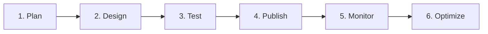

# ジャーニーの基本を学ぶ{#jo-general-principle}

Adobe Journey Optimizerを使用すると、オーディエンスの行動やニーズにリアルタイムで適応する、パーソナライズされた複数のステップから成るカスタマージャーニーを作成できます。 直感的なドラッグ&amp;ドロップキャンバスを使用すると、コンテキストデータとオーディエンスターゲティングを活用して、複数のチャネルにわたってメッセージとアクションを調整し、最大の影響を得ることができます。

このガイドは、ジャーニーの基本を理解し、ユースケースに適したジャーニータイプを選択し、有意義でタイムリーなカスタマーエクスペリエンスを提供するジャーニーを自信を持って設計するのに役立つ明確なロードマップを提供します。

## ジャーニーとは

**ジャーニー** は、顧客の行動、ビジネスイベント、スケジュールされたキャンペーンに応じて、様々なチャネルにわたってパーソナライズされたインタラクションを調整する、自動化された複数手順のカスタマーエクスペリエンスです。

[!DNL Journey Optimizer] を使用すると、次のことができます。

* イベントやデータソースに保存されたコンテキストデータを使用して **リアルタイムオーケストレーション** のユースケースを構築できます。
* 顧客の行動やビジネスイベントに動的に対応する **複数の手順から成る詳細なシナリオ** を設計する
* メール、プッシュ、SMS、アプリ内 **web など、様々な分野で :11** のパーソナライズされたエクスペリエンスを大規模に提供します

➡️ **作成を開始する準備はできていますか？** 最初のジャーニーを作成 [ を 5 分で ](journey-gs.md) きます。

## ジャーニータイプを選択 {#journey-types}

**作成を開始する前に**、ユースケースに適したジャーニーのタイプを理解することが重要です。 Adobe Journey Optimizerでは、4 つのジャーニータイプをサポートしており、それぞれが様々なエントリメカニズムとビジネスシナリオに合わせて設計されています。

>[!BEGINTABS]

>[!TAB  単一ジャーニー ]

 **使用するタイミング：** リアルタイムのイベントトリガーエクスペリエンス

**単一ジャーニー** は、特定のアクション（購入、アプリのログイン、フォームの送信）が発生すると、個別にトリガーされます。 プロファイルはリアルタイムで一度に 1 つずつ入力されるので、すぐに行動に基づく応答を行う場合に最適です。

**次に最適：**

* 購入後の注文確認
* が購読したときに送信されるウェルカムメール
* ブラウジングによってトリガーされる買い物かご放棄
* パスワードリセット通知

➡️ [ イベントについて学ぶ ](../event/about-events.md) | [ 購読者へのメッセージのユースケース ](message-to-subscribers-uc.md)

>[!TAB  オーディエンスジャーニーの読み取り ]

**使用するタイミング：** スケジュール済みキャンペーンをオーディエンスセグメントに

**オーディエンスジャーニーを読み取り** Adobe Experience Platform オーディエンスから開始し、すべてのプロファイルに同時にメッセージを一括で送信します。 このジャーニータイプは、スケジュールされた大規模な通信に最適です。

**次に最適：**

* 月刊ニュースレター
* セグメントをターゲットにするプロモーションキャンペーン
* 製品に関するお知らせ
* 季節ごとのマーケティングキャンペーン

➡️[ オーディエンスを読み取りについて学ぶ ](read-audience.md) | [ オーディエンスの概要 ](../audience/about-audiences.md)

>[!TAB  オーディエンスの選定ジャーニー ]

 **使用するタイミング：** オーディエンスメンバーシップの変更に対するリアルタイム応答

**オーディエンスの選定ジャーニー** プロファイルが特定のオーディエンスに適合する（または離脱する）ときのトリガー。 プロファイルはリアルタイムで条件を満たすと個別に入力されるため、顧客の行動が変化した場合でも即座にエンゲージメントを確保できます。

**次に最適：**

* VIP層のアップグレード通知
* 顧客が非アクティブになった際の再エンゲージメント
* 最初の購入祝いメッセージ
* 顧客の引っ越し時の地理的ターゲティング

➡️[ オーディエンスの選定について学ぶ ](audience-qualification-events.md) | [ オーディエンスの作成 ](../audience/creating-a-segment-definition.md)

>[!TAB  ビジネスイベントジャーニー ]

**使用すべき状況：** 複数のお客様に影響するビジネス状況

**ビジネスイベントジャーニー** は、複数のプロファイルに同時に影響を与えるビジネスレベルのイベント（在庫の更新、天気アラート、価格の変更）によってトリガーされます。 これらは、個々の行動ではなく、より広いビジネス条件に対応します。

**次に最適：**

* 関心のある顧客への低インベントリアラート
* Flash 販売のお知らせ
* 天候ベースのプロモーション
* 価格下降通知
* 製品の在庫切れアラート

➡️ [ ビジネスイベントについて学ぶ ](../event/about-creating-business.md) | [ 応募管理 ](entry-management.md)

>[!ENDTABS]

>[!NOTE]
>
>どのタイプを選択するか不明な場合は、 イベントベースのエクスペリエンスの場合は **単一ジャーニー** から開始し、スケジュールされたキャンペーンの場合は **オーディエンスを読み取りジャーニー** から開始します。これらは、最も一般的なユースケースをカバーしています。

## ジャーニーデザイナーを使用したビルド {#journey-designer}

**[ジャーニーデザイナー](using-the-journey-designer.md)** は、顧客体験を作成するための視覚的なキャンバスです。 直感的なドラッグ&amp;ドロップインターフェイスを使用すると、コードを記述しなくても、ジャーニーのすべてのステップを調整できます。

### デザイナーでできること：

:::: landing-cards-container

:::

**エントリポイントの定義**

顧客の入力方法（イベント、オーディエンスセグメント、オーディエンスの選定のいずれか）を選択します。

[エントリ管理の詳細](entry-management.md)
:::

:::

**メッセージの送信**

メール、プッシュ、SMS/MMS、アプリ内、web などの組み込みチャネルアクションを、すべてJourney Optimizerで設計して使用します。

[ジャーニーでのメッセージの送信](journeys-message.md)
:::

:::

**ロジックおよび条件の追加**

プロファイル属性、オーディエンスメンバーシップまたはリアルタイムイベントに基づいてジャーニーを分岐します。

[条件を使用](condition-activity.md)
:::

:::

**データの活用**

イベント、Adobe Experience Platform、サードパーティの API サービスなどのコンテキストデータを使用できます。

[データソースの操作](../datasource/about-data-sources.md)
:::

:::

**外部システムの接続**

カスタムアクションを作成して、メッセージの送信またはワークフローのトリガー用にサードパーティ製システムを統合します。

[カスタムアクションの設定](../action/about-custom-action-configuration.md)
:::

:::

**オーケストレーションアクティビティの追加**

待機時間、ジャンプ、プロファイル更新およびオーディエンス管理を使用して、高度なフローを作成します。

[すべてのアクティビティを探索](about-journey-activities.md)
:::

::::

➡️ **実践的な学習：** [ ジャーニーデザイナーのビデオをご覧ください ](#video) または [ エンドツーエンドのユースケースについて詳しく説明 ](jo-use-cases.md)

## ジャーニー作成ワークフロー {#workflow}

ジャーニーを成功させるには、明確で繰り返し可能なプロセスに従います。 ステップバイステップのワークフローを次に示します。

### &#x200B;1. **ジャーニーの計画** {#plan}

デザイナーを開く前に、目的を明確にします。

* **目標は何ですか？** （例：新規顧客のオンボーディング、非アクティブユーザーの再エンゲージ）
* **観客はだれですか。** （特定のセグメント、イベント駆動型の個人）
* **適合するジャーニータイプはどれですか？** （上記の [ ジャーニータイプ ](#journey-types) を参照）
* **どのチャネルを使用しますか？** （メール、プッシュ、SMS など）

### &#x200B;2. **キャンバスでのデザイン** {#design}

ジャーニーデザイナーを使用したフローの作成：

1. **エントリ条件の設定** - プロファイルの入力方法（イベント、オーディエンス、選定）を定義します
2. **オーケストレーションロジックの追加** – 待機時間、条件、決定ポイントを含める
3. **メッセージの設定** – 通信を設計したり、既存のテンプレートを活用したりします
4. **アクションの設定** – 実行するビルトインまたはカスタムアクションを設定します
5. **終了条件の定義** - ジャーニーを完了するタイミングと方法を指定します

[Journey designer →の使用方法を学ぶ](using-the-journey-designer.md)

### &#x200B;3. **運用開始前にテスト** {#test}

ジャーニーを常にテストして、顧客が経験する前に問題を特定してください。

* **テストモード** を使用して、テストプロファイルを含むジャーニーをシミュレートします
* **ドライラン** を使用すると、実際のデータに影響を与えたりメッセージを送信したりせずに、ジャーニーの実行をプレビューできます
* すべての条件、メッセージ、アクションが期待どおりに動作することを確認します
* タイミング、データフロー、パーソナライゼーションの確認

[ ジャーニー→のテスト ](testing-the-journey.md) | [ ドライラン→ールについて学ぶ ](journey-dry-run.md)

### &#x200B;4. **ジャーニーの公開** {#publish}

テストが完了したら、公開してジャーニーをライブにします。

* 最終的な設定とプロパティの確認
* 実際の顧客向けに有効化するパブリッシュ
* メモ：ライブジャーニーは停止できますが、編集はできません（新しいバージョンを作成する必要があります）

[ジャーニー→を公開する](publish-journey.md)

### &#x200B;5. **パフォーマンスの監視** {#monitor}

ジャーニーの実際のパフォーマンスを追跡する：

* ジャーニーレポートと分析の表示
* エントリ、完了およびエラー率の監視
* 重大な問題に対するアラートの設定

[→の監視とレポート ](report-journey.md) | [ アラートの設定→](../reports/alerts.md)

### &#x200B;6. **最適化と反復** {#optimize}

インサイトを使用した改善：

* エンゲージメント指標とコンバージョン率の分析
* 送信時間の最適化のテスト
* 機能強化を含む新しいジャーニーバージョンの作成
* AI を活用したレコメンデーションの使用

[ ジャーニーの最適化→](optimize.md) | [ 送信時間の最適化→](send-time-optimization.md)

➡️ **開始する準備ができましたか？**[ 今すぐ最初のジャーニーを作成→ます ](journey-gs.md)

## 実際のユースケース {#use-cases}

ジャーニーの概念を適用して一般的なマーケティングの課題を解決する方法を示す、実用的な例から学びます。

:::: landing-cards-container

:::

**新規購読者へようこそ**

お客様がサービスを登録する際に、オンボーディング手順の完了を促すウェルカムジャーニーをトリガーします。

[ユースケースを表示→](message-to-subscribers-uc.md)
:::

:::

**送信時間の最適化**

AI を使用すると、各顧客が最も関与する可能性が高いタイミングでメールを配信し、開封率とクリック率を最大化します。

[ユースケースを表示→](send-time-optimization.md)
:::

:::

**配信を増やす**

メッセージ量を徐々に増やして送信評判をウォームアップし、配信品質の問題を回避します。

[ユースケースを表示→](ramp-up-deliveries-uc.md)
:::

:::

**平日の目標**

関連性を高めるために、顧客がジャーニーにエントリする曜日に基づいて異なるコンテンツを送信します。

[ユースケースを表示→](weekday-email-uc.md)
:::

:::

**マルチチャネルキャンペーン**

メール、プッシュ、SMS、web チャネルにわたるシームレスなエクスペリエンスを 1 つのジャーニーで調整します。

[ユースケースを表示→](journeys-uc.md)
:::

:::

**すべてのユースケース**

ステップバイステップの実装を使用して、ジャーニーのユースケースの完全なライブラリを調べます。

[ すべての→を参照 ](jo-use-cases.md) | [ ユースケースライブラリ→](/help/rp_landing_pages/journey-use-cases-landing-page.md)
:::

::::

## ジャーニー機能の詳細 {#capabilities}

ジャーニーの構築に慣れたら、次の強力な機能を探索して、高度な顧客体験を作成します。

:::: landing-cards-container

:::

**高度な式**

データ操作と複雑なロジック用の式エディターを使用して、動的条件とパーソナライゼーションを構築します。

[式の詳細情報](/help/rp_landing_pages/building-advanced-conditions-journeys-landing-page.md)
:::

:::

**タイムゾーン管理**

自動タイムゾーン調整と最適な送信時間で、グローバルオーディエンスを処理します。

[タイムゾーンの管理](timezone-management.md)
:::

:::

**テストモードとドライラン**

運用開始前にテストプロファイルを使用してジャーニーを検証し、実際のデータに影響を与えずに実行をプレビューします。

[ドライランを使用](journey-dry-run.md)
:::

:::

**サンドボックスにコピー**

サンドボックス間でジャーニーを複製して、テストおよびデプロイメントワークフローを効率化します。

[ジャーニーのコピー](copy-to-sandbox.md)
:::

:::

**タグと組織**

タグを使用してジャーニーを分類およびフィルタリングし、大規模な管理を強化します。

[タグを使用して整理](tags.md)
:::

:::

**スループット制御**

メッセージのスループットを制限して送信の評判を管理し、システムが大量に送信されるのを回避します。

[スループットの制御](limit-throughput.md)
:::

::::

[すべてのジャーニー機能を表示します→](/help/rp_landing_pages/manage-journey-landing-page.md)

## ～を見ることで学ぶ {#video}

ジャーニーコンポーネントを視覚的に紹介し、キャンバスでジャーニーを作成するための基本を説明します。

>[!VIDEO](https://video.tv.adobe.com/v/3424996?quality=12)

➡️ **ビデオを増やしますか？**[ ジャーニーのビデオチュートリアルを見る ](https://experienceleague.adobe.com/ja/docs/journey-optimizer-learn/tutorials/journeys/journey-designer-overview){target="_blank"}

## サポートが必要な場合 {#help}

### 一般的なタスクのクイックリンク

* **[初めてのジャーニーの作成](journey-gs.md)** – 初心者向けステップバイステップガイド
* **[ジャーニーに関する FAQ](journey-faq.md)** – よくある質問への回答
* **[トラブルシューティング](/help/rp_landing_pages/troubleshoot-journey-landing-page.md)** – 問題の診断と修正
* **[エラーコードのリファレンス](error-codes-reference.md)** - エラーメッセージについて
* **[ガードレールと制限事項](../start/guardrails.md)** – 技術的な境界とベストプラクティス

### 問題に関する通知を受け取る

**[ジャーニーアラート](../reports/alerts.md)** を設定すると、ジャーニーでエラーや異常なパターンが発生した場合に、リアルタイムで通知を受け取ることができます。

### その他のリソース

* **[ジャーニー管理ハブ](/help/rp_landing_pages/manage-journey-landing-page.md)** - フィルタリング、最適化およびプロファイル管理のためのツール
* **[ジャーニーアクティビティのリファレンス](/help/rp_landing_pages/about-journey-building-landing-page.md)** – すべてのアクティビティタイプに関する完全なガイド
* **[実行の問題のトラブルシューティング](troubleshooting-execution.md)** - ジャーニー実行の問題のデバッグ
* **[インバウンドアクティビティのトラブルシューティング](troubleshooting-inbound.md)** - エントリと選定の問題の修正

**初めてのジャーニーを作成する準備はできていますか？** [ 今すぐ始める→](journey-gs.md)
