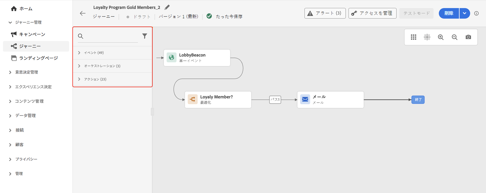

# ジャーニーの基本を学ぶ {#jo-general-principle}

>[!BEGINSHADEBOX]

**このページでは、** ジャーニーの種類、デザインワークフロー、主な機能、パーソナライズされた顧客体験を構築するためのベストプラクティスなど、Adobe Journey Optimizerでのジャーニーの基本について説明します。

>[!ENDSHADEBOX]

>[!CONTEXTUALHELP]
>id="ajo_journey_canvas"
>title="ジャーニーの作成"
>abstract="ドラッグ＆ドロップキャンバスを使用すると、コンテキストデータとオーディエンスターゲティングを活用して、複数のチャネルをまたいでメッセージとアクションを調整し、最大限の影響を得ることができます。"
>additional-url="https://experienceleague.adobe.com/ja/docs/journey-optimizer/using/orchestrate-journeys/create-journey/journey-gs" text="最初のジャーニーを作成"

[!DNL Adobe Journey Optimizer] を使用すると、オーディエンスの行動やニーズにリアルタイムで適応する、パーソナライズされた複数手順のカスタマージャーニーを作成できます。 直感的なドラッグ＆ドロップキャンバスを使用すると、コンテキストデータとオーディエンスターゲティングを活用して、複数のチャネルをまたいでメッセージとアクションを調整し、最大限の影響を得ることができます。

このガイドでは、ジャーニーの基本を理解し、ユースケースに適したジャーニータイプを選択し、有意義でタイムリーなカスタマーエクスペリエンスを提供するジャーニーを自信を持ってデザインするのに役立つ明確なロードマップについて説明します。

## ジャーニーとは

**ジャーニー**&#x200B;とは、顧客行動、ビジネスイベント、スケジュールキャンペーンに応じ、チャネルをまたいでパーソナライズされたインタラクションを調整する、自動化されたマルチステップのカスタマーエクスペリエンスです。

[!DNL Journey Optimizer] を使用すると、次の操作を実行できます。

* イベントやデータソースに保存されたコンテキストデータを活用して、**リアルタイムオーケストレーション**&#x200B;のユースケースを作成
* 顧客行動やビジネスイベントに動的に対応する、**マルチステップの高度なシナリオ**&#x200B;をデザインする
* メール、プッシュ通知、SMS、アプリ内、web など、**1:1 のパーソナライズされたエクスペリエンス**&#x200B;を大規模に提供する

➡️ **作成を開始する準備は整っていますか？** 5 分で[最初のジャーニーを作成できます](journey-gs.md)。

### ジャーニーとキャンペーン：それぞれを使用するタイミング {#journeys-vs-campaigns-intro}

[!DNL Adobe Journey Optimizer] では、顧客にリーチするには、**ジャーニー**（1:1 のリアルタイムオーケストレーション）、**キャンペーン**（シンプルなバッチまたは API トリガーによる配信）、**オーケストレーションキャンペーン**（複数のエンティティデータを含むバッチキャンバスワークフロー）の 3 つのアプローチが用意されています。

**クイック決定：**

* 各顧客が自身のペースで進む、マルチステップの行動駆動型エクスペリエンスを実現するには、**ジャーニー**&#x200B;を使用します
* オーディエンスに対するシンプルなメッセージ配信、スケジュールメッセージ配信、トリガーメッセージ配信を実現するには、**アクションおよび API トリガーキャンペーン**&#x200B;を使用します
* マルチエンティティのセグメント化と正確な事前送信数を必要とする複雑なバッチワークフローを実現するには、**オーケストレーションキャンペーン**&#x200B;を使用します

<!--
 waiting for DOCAC-13912
➡️ **[View detailed comparison: Journeys vs Campaigns](../start/journeys-vs-campaigns.md)** - Includes decision guide, use cases, and feature availability
-->

## ジャーニータイプの選択 {#journey-types}

[!DNL Adobe Journey Optimizer] では、それぞれ異なるエントリメカニズムとビジネスシナリオ向けにデザインされた、次の 4 つのジャーニータイプをサポートしています。

* **単一ジャーニー**：リアルタイムのイベントトリガー型エクスペリエンス（カート放棄の回復、ウェルカムメール）
* **オーディエンスを読み取りジャーニー**：オーディエンスセグメントに対するスケジュール済みバッチ通信（ニュースレター、プロモーションキャンペーン）
* **オーディエンスの選定ジャーニー**：オーディエンスメンバーシップの変更に対するリアルタイム応答（VIP アップグレード、再エンゲージメント）
* **ビジネスイベントジャーニー**：複数の顧客に影響を与えるビジネス条件（在庫アラート、Flash セール）

<!--
 waiting for DOCAC-13912 
➡️ **[Journey types: choose the right one](journey-types-selection.md)** - Detailed comparison, decision guide, and feature compatibility matrix 
-->

## ジャーニーデザイナーを使用した作成 {#journey-designer}

**[ジャーニーデザイナー](using-the-journey-designer.md)**&#x200B;は、カスタマーエクスペリエンスを作成する視覚的なキャンバスです。 直感的なドラッグ＆ドロップ インターフェイスを使用すると、コードを書き込まずにジャーニーのすべてのステップを調整できます。

### デザイナーで実行できること：

:::: landing-cards-container

:::

**エントリポイントの定義**

顧客のエントリ方法（イベント、オーディエンスセグメント、オーディエンスの選定）を選択します。

[エントリ管理の詳細情報](entry-management.md)
:::

:::

**メッセージの送信**

Journey Optimizer でデザインされた、メール、プッシュ、SMS／RCS／MMS、アプリ内、web など、すべてのビルトインチャネルアクションを使用します。

[ジャーニーでのメッセージの送信](journey-action.md)
:::

:::

**ロジックと条件の追加**

プロファイル属性、オーディエンスメンバーシップまたはリアルタイムイベントに基づいてジャーニーを分岐します。

[条件の使用](conditions.md)
:::

:::

**データの活用**

イベント、[!DNL Adobe Experience Platform]、サードパーティの API サービスからのコンテキストデータを使用します。

[データソースの操作](../datasource/about-data-sources.md)
:::

:::

**外部システムの接続**

カスタムアクションを作成して、メッセージの送信またはワークフローのトリガー用にサードパーティシステムを統合します。

[カスタムアクションの設定](../action/about-custom-action-configuration.md)
:::

:::

**オーケストレーションアクティビティの追加**

待機時間、ジャンプ、プロファイルの更新、オーディエンス管理を使用して、高度なフローを作成します。

[すべてのアクティビティについて](about-journey-activities.md)
:::

::::

➡️ **実践的な学習：**&#x200B;[ジャーニーデザイナーのビデオを視聴](#video)するか、[エンドツーエンドのユースケースを探索](jo-use-cases.md)します

## ジャーニー作成ワークフロー {#workflow}

成功するジャーニーを作成するには、明確で繰り返し可能なプロセスに従います。 ステップバイステップのワークフローを次に示します。

**1. 計画** → **2. デザイン** → **3. テスト** → **4. 公開** → **5. 監視** → **6. 最適化**

### &#x200B;1. ジャーニーを計画 {#plan}

デザイナーを開く前に、目的を明確にします。

* **目標は何ですか？** （例：新規顧客をオンボード、非アクティブユーザーを再び関与）
* **オーディエンスは誰ですか？** （特定のセグメント、イベント駆動型の個人）
* **適合するジャーニータイプはどれですか？** （上記の[ジャーニータイプ](#journey-types)を参照）
* **使用するチャネルは何ですか？** （メール、プッシュ、SMS など）

### &#x200B;2. キャンバスでデザイン {#design}

ジャーニーデザイナーを使用してフローを作成します。

* **エントリ条件の設定** - プロファイルのエントリ方法（イベント、オーディエンス、選定）を定義します
* **オーケストレーションロジックの追加** - 待機時間、条件、決定ポイントを含めます
* **メッセージの設定** - 通信をデザインするか、既存のテンプレートを活用します
* **アクションの設定** - 実行するビルトインアクションまたはカスタムアクションを設定します
* **終了条件の定義** - プロファイルがジャーニーを完了するタイミングと方法を指定します

[ジャーニーデザイナーの使用の詳細情報 →](using-the-journey-designer.md)

### &#x200B;3. 公開前にテスト {#test}

顧客に問題が発生する前に、常にジャーニーをテストして問題を検出します。

* **テストモード**&#x200B;を使用して、テストプロファイルを使用してジャーニーをシミュレートします
* **ドライラン**&#x200B;を使用して、実際のデータに影響を与えたり、メッセージを送信したりすることなく、ジャーニーの実行をプレビューします
* すべての条件、メッセージ、アクションが期待どおりに動作することを確認します
* タイミング、データフロー、パーソナライゼーションを確認します

[ジャーニーのテスト →](testing-the-journey.md) | [ドライランの詳細情報 →](journey-dry-run.md)

### &#x200B;4. ジャーニーの公開 {#publish}

テストが完了したら、公開してジャーニーをライブにします。

* 最終的な設定とプロパティを確認します
* 実際の顧客に対して公開してアクティブ化します。
* メモ：ライブジャーニーは停止できますが、編集はできません（新しいバージョンを作成する必要があります）

[ジャーニーの公開 →](publish-journey.md)

### &#x200B;5. パフォーマンスを監視 {#monitor}

実際のジャーニーが実行する仕組みを追跡します。

* ジャーニーレポートと分析を表示します
* エントリ率、完了率、エラー率を監視します
* 重大な問題に関するアラートを設定します

[監視とレポート →](report-journey.md) | [アラートの設定 →](../reports/alerts.md)

### &#x200B;6. 最適化と反復 {#optimize}

インサイトを使用して改善します。

* エンゲージメント指標とコンバージョン率を分析します
* 送信時間の最適化をテストします
* 改善を含む新しいジャーニーバージョンを作成します
* AI を活用したレコメンデーションを使用します

[ジャーニーの最適化 →](optimize.md) | [送信時間の最適化 →](send-time-optimization.md)

➡️ **開始する準備は整っていますか？** [今すぐ最初のジャーニーを作成できます →](journey-gs.md)

## 実際のユースケース {#use-cases}

ジャーニーの概念を適用して一般的なマーケティング課題を解決する方法を示す実用的な例から学びます。

:::: landing-cards-container

:::

**新規サブスクライバーの歓迎**

顧客がサービスに登録する際に、オンボーディング手順の完了を促すウェルカムジャーニーがトリガーされます。

[ユースケースの表示 →](message-to-subscribers-uc.md)
:::

:::

**送信時間の最適化**

AI を使用して、各顧客が最も関与する可能性の高いタイミングでメールを配信し、開封率とクリック率を最大化します。

[ユースケースの表示 →](send-time-optimization.md)
:::

:::

**配信を増やす**

メッセージの量を徐々に増やして、送信の評判をウォームアップし、配信品質の問題を回避します。

[ユースケースの表示 →](ramp-up-deliveries-uc.md)
:::

:::

**平日のターゲット**

関連性を高めるために、顧客がジャーニーにエントリする曜日に基づいて異なるコンテンツを送信します。

[ユースケースの表示 →](weekday-email-uc.md)
:::

:::

**マルチチャネルキャンペーン**

メール、プッシュ、SMS、web チャネルをまたいでシームレスなエクスペリエンスを 1 つのジャーニーで調整します。

[ユースケースの表示 →](journeys-uc.md)
:::

:::

**すべてのユースケース**

ステップバイステップの実装を含むジャーニーユースケースの完全なライブラリを探索します。

[すべての参照 →](jo-use-cases.md) | [ユースケースライブラリ →](../../rp_landing_pages/journey-use-cases-landing-page.md)
:::

::::

## ジャーニー機能について {#capabilities}

ジャーニーの作成に慣れたら、高度なカスタマーエクスペリエンスを作成する次の強力な機能を探索します。

:::: landing-cards-container

:::

**高度な式**

データ操作と複雑なロジック用の式エディターを使用して、動的な条件とパーソナライズを作成します。

[式の詳細情報](../../rp_landing_pages/building-advanced-conditions-journeys-landing-page.md)
:::

:::

**タイムゾーン管理**

自動タイムゾーン調整と最適な送信時間を使用して、グローバルオーディエンスを処理します。

[タイムゾーンの管理](timezone-management.md)
:::

:::

**テストモードとドライラン**

公開前にテストプロファイルを使用してジャーニーを検証し、実際のデータに影響を与えずに実行をプレビューします。

[ドライランの使用](journey-dry-run.md)
:::

:::

**サンドボックスへのコピー**

サンドボックス間でジャーニーを複製して、テストとデプロイメントのワークフローを効率化します。

[ジャーニーのコピー](../configuration/copy-objects-to-sandbox.md#objects)
:::

:::

**タグと組織**

タグを使用してジャーニーを分類およびフィルタリングし、大規模な管理を強化します。

[タグを使用した整理](tags.md)
:::

:::

**スループット制御**

送信の評判を管理し、システムの過負荷を回避するために、メッセージのスループットを制限します。

[スループットの制御](limit-throughput.md)
:::

::::

[すべてのジャーニー機能の表示 →](../../rp_landing_pages/manage-journey-landing-page.md)

## 視聴して学ぶ {#video}

ジャーニーコンポーネントを視覚的に紹介し、キャンバスでジャーニーを作成するための基本について説明します。

>[!VIDEO](https://video.tv.adobe.com/v/3430350?captions=jpn&quality=12)

➡️ **さらにビデオを視聴しますか？** [ジャーニーのビデオチュートリアルをご覧ください](https://experienceleague.adobe.com/ja/docs/journey-optimizer-learn/tutorials/journeys/journey-designer-overview){target="_blank"}

## よくある質問 {#common-questions}

+++ ジャーニーとキャンペーンの違いは何ですか？

[!DNL Adobe Journey Optimizer] には、次の 3 つのアプローチが用意されています。

* **ジャーニー** - 1:1 のリアルタイムオーケストレーションで、各プロファイルがそれぞれのペースで異なるステップを進んでいきます。 条件付きロジックを使用した、行動駆動型のマルチステップエクスペリエンス（例：オンボーディング、買い物かごの放棄）に最適です。

* **キャンペーン（アクションおよび API トリガー）**：スケジュールに従って、または API トリガーを通じてすべてのプロファイルに同時に実行される、オーディエンスへのシンプルなメッセージ配信。 プロモーションキャンペーン、ニュースレター、トランザクションメッセージに最適です。

* **オーケストレーションキャンペーン**：リレーショナルデータ（プロファイル + 製品／店舗／予約）を使用した、複雑なセグメント化を含むマルチステップのバッチワークフロー。 すべてのプロファイルは、正確な事前送信数と共に処理されます。 季節のプロモーション、製品のローンチ、マルチエンティティデータを必要とするキャンペーンに最適です。

**主な違い**：ジャーニーは、リアルタイムのアクションに対して個々の顧客の状態を維持します。アクションおよび API トリガーキャンペーンは、シンプルなメッセージをバッチで配信します。オーケストレーションキャンペーンは、マルチエンティティのセグメント化機能を含むバッチワークフローキャンバスを提供します。

<!-- waiting for DOCAC-13912 - [See detailed comparison](#journeys-vs-campaigns) -->
[オーケストレーションキャンペーンの詳細情報](../orchestrated/gs-orchestrated-campaigns.md)

+++

<!--
 Waiting for DOCAC-13912
+++ Which journey type should I use?

Use the [decision guide](#decision-guide) or [comparison table](#journey-types-comparison) to choose between Unitary, Read Audience, Audience Qualification, and Business Event journeys based on your trigger mechanism and use case.

+++
-->

+++ ライブジャーニーを編集できますか？

制限付きの要素（名前、メッセージコンテンツ）を編集できますが、構造の変更には新しいバージョンを作成する必要があります。 [ジャーニーのバージョンの詳細情報](publish-journey.md#journey-versions)

+++

➡️ **その他の質問がありますか？** 40 以上の詳細な回答を含む[ジャーニーに関する完全な FAQ をご覧ください](journey-faq.md)

## サポートが必要な場合 {#help}

以下のリンクを使用して、ガイダンス、トラブルシューティング、リソースを見つけます。

### 一般的なタスクに対するクイックリンク

* **[最初のジャーニーの作成](journey-gs.md)** - 初心者向けステップバイステップガイド
* **[ジャーニーに関する FAQ](journey-faq.md)** - よくある質問への回答
* **[トラブルシューティング](../../rp_landing_pages/troubleshoot-journey-landing-page.md)** - 問題の診断と修正
* **[エラーコードリファレンス](error-codes-reference.md)** - エラーメッセージについて
* **[ガードレールと制限](../start/guardrails.md)** - 技術的な境界とベストプラクティス

### 問題に関する通知の受信

**[ジャーニーアラート](../reports/alerts.md)**&#x200B;を設定すると、ジャーニーでエラーや異常なパターンが発生した際に、リアルタイムの通知を受信できます。

### その他のリソース

* **[ジャーニー管理ハブ](../../rp_landing_pages/manage-journey-landing-page.md)** - フィルタリング、最適化、プロファイル管理のためのツール
* **[ジャーニーアクティビティリファレンス](../../rp_landing_pages/about-journey-building-landing-page.md)** - すべてのアクティビティタイプに対する完全なガイド
* **[実行の問題のトラブルシューティング](troubleshooting-execution.md)** - ジャーニー実行に関する問題のデバッグ
* **[インバウンドアクティビティのトラブルシューティング](troubleshooting-inbound.md)** - エントリと選定に関する問題の修正

**最初のジャーニーを作成する準備は整っていますか？** [今すぐ始めましょう →](journey-gs.md)

+++ AI ナレッジリファレンス

このセクションには、このトピックに関連する解釈、検索、質問への回答をサポートすることを目的とした構造化された知識が含まれています。

理解を深めるには、この情報をこのページのドキュメントと組み合わせる必要があります。 どちらのソースも単独で使用することを意図していません。このページでは、機能について説明しますが、この節では、用語、意図、適用可能性、および制約の曖昧さを解消するのに役立つ追加のコンテキストを提供します。

* **TL;DR:**&#x200B;このページは、Adobe Journey Optimizer ジャーニーの基本を学ぶハブです。4つのジャーニーの種類、6段階の制作ワークフロー、実際のユースケース、高度な機能へのリンクについて説明します。

**インテント：**

* ジャーニーとは何か、キャンペーンやオーケストレーションされたキャンペーンとの違いを理解します
* ユースケースに適したジャーニータイプ（単一、オーディエンスの読み取り、オーディエンスの選定、ビジネスイベント）を選択します
* 計画、設計、テスト、公開、監視、最適化の6つのステップで構成されるジャーニー作成ワークフローに従ってください
* シミュレーション、テストモード、またはドライ実行を使用して、本番稼働前にジャーニーを検証します
* レポートとアラートを通じてジャーニーを公開し、パフォーマンスを監視する
* 式、タイムゾーン管理、サンドボックスへのコピー、スループット制御などの高度な機能について説明します

**用語集：**

* **ジャーニー**：顧客の行動、ビジネスイベント、スケジュールされたキャンペーンに応じて、チャネルをまたいでパーソナライズされたインタラクションを調整する、自動化されたマルチステップの顧客体験。 *（製品固有）*
* **ジャーニーデザイナー**: AJOの視覚的なドラッグ&amp;ドロップ操作のキャンバスは、コードを記述することなくジャーニーフローを構築および設定するために使用されます。 *（製品固有）*
* **テストモード**：永続的なAdobe Experience Platform テストプロファイル（テストプロファイルとして明示的にフラグ付け）を使用して、ドラフトジャーニーを公開前にトラバースするジャーニー検証モード。 *（製品固有）*
* **ドライラン**：通信の送信やプロファイルの更新を行わずに、実際の実稼動データに対してジャーニーを実行する特別な公開モード。 *（製品固有）*
* **Simulation**：一時的なシミュレートされたユーザーを即座に生成する検証モード。シミュレートされたユーザーはAdobe Experience Platformに保持されません。 *（製品固有）*
* **オーケストレーションされたキャンペーン**：リレーショナルデータ（プロファイル +商品/店舗/予約）を使用し、すべてのプロファイルを正確な事前送信数と一緒に処理する、AJOのマルチステップバッチワークフロー。 *（製品固有）*

**ガードレール：**

* ライブジャーニーは構造的に編集できません。変更には新しいバージョンの作成が必要です
* 問題を検出するには、公開前にテストモードとドライランを使用する必要があります

**用語：**

* 正式名称：ジャーニー（Acronym）：なし（None）：バリエーション：カスタマージャーニー、AJOジャーニー
* 同義語：「ジャーニーデザイナー」 = 「キャンバス」 = 「ジャーニーキャンバス」
* 「ジャーニー」≠「キャンペーン」は、ジャーニーがリアルタイムのマルチステップの行動主導型エクスペリエンスのために個々の顧客の状態を維持します。キャンペーンは、スケジュールに従って、またはAPIトリガーを介してメッセージを一括でオーディエンスに配信します
* 混同しないでください。「シミュレーション」≠「テストモード」≠「ドライラン」 – シミュレーションは一時的なシミュレーションユーザーを使用します。テストモードは、ドラフトジャーニーで永続的なAEP テストプロファイルを使用します。ドライランは、お客様に連絡したり、プロファイルを更新したりすることなく、実際の実稼動データに対して実行されます

**FAQ:**

* **Q: Journey Optimizerのジャーニーとキャンペーンの違いは何ですか？** — ジャーニーは、各プロファイルが条件付きロジックを通じて独自のペースで進む1:1 リアルタイムのオーケストレーションを提供します。キャンペーンは、スケジュール上またはAPIトリガー経由で同時にメッセージをオーディエンスに配信します。オーケストレーションされたキャンペーンは、複雑なマルチエンティティセグメンテーションのためのバッチキャンバスワークフローです。
* **Q: ライブジャーニーを編集できますか？**  – 名前やメッセージコンテンツなどの限られた要素を編集できます。構造的な変更には、ジャーニーの新しいバージョンを作成する必要があります。
* **Q: ジャーニーを構築する手順を教えてください。** - 6つのステップのワークフローは、計画、キャンバスでのデザイン、テスト（テストモードまたはドライラン）、公開、パフォーマンスの監視、最適化/反復です。
* **Q：実際のメッセージを送信せずにジャーニーを検証するにはどうすればよいですか？** - シミュレーション（一時的なシミュレーションユーザー）、テストモード（永続的なAEP テストプロファイル）、またはドライラン（お客様からの連絡やプロファイルの更新なしに実稼動データ）を使用します。 ドライランプロファイルは、エンゲージ可能なプロファイルとライブジャーニーの割り当てにカウントされます。
* **Q: サブスクリプションによってトリガーされるウェルカムメールには、どのジャーニータイプを使用すればよいですか？** — サブスクリプション登録などの特定の個人イベントによってトリガーされる単一ジャーニーを使用します。

+++
