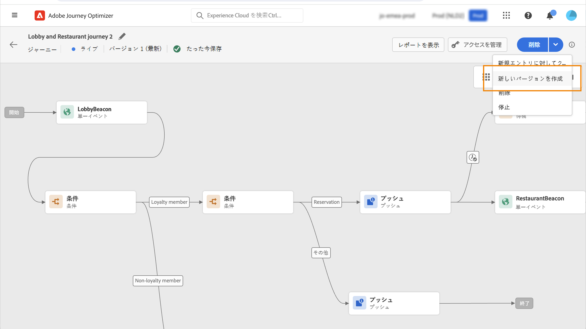

# ジャーニーの基本を学ぶ{#jo-general-principle}

[!DNL Journey Optimizer] を使用すると、イベントやデータソースに保存されたコンテキストデータを活用して、リアルタイムオーケストレーションの使用例を作成できます。

次の機能を活用して、複数のステップから成る高度なシナリオを設計できます。

* イベントの受信をトリガーにしてリアルタイムに&#x200B;**単一配信**&#x200B;を送信したり、Adobe Experience Platform のオーディエンスを使用してメッセージを&#x200B;**一括で**&#x200B;送信したりできます。

* イベント、Adobe Experience Platform の情報、サードパーティの API サービスのデータなどの&#x200B;**コンテキストデータ**&#x200B;を活用できます。

* **組み込みのアクション**&#x200B;を使用して [!DNL Journey Optimizer] でデザインしたメッセージを送信したり、サードパーティのシステムを使用している場合は&#x200B;**カスタムアクション**&#x200B;を作成してメッセージを送信したりできます。

* **ジャーニーデザイナー**&#x200B;を使用すると、エントリイベントや「オーディエンスを読み取り」アクティビティを簡単にドラッグ＆ドロップして、条件を追加し、パーソナライズされたメッセージを送信するなど、複数のステップから成るユースケースを作成できます。

>[!NOTE]
>
>ジャーニーのガードレールと制限について詳しくは、[こちらのページ](../start/guardrails.md)をご覧ください。

## ジャーニーの作成手順{#steps-journey}

Adobe Journey Optimizer を使用して、1 つのキャンバスからパーソナライズされたジャーニーを設計および調整します。ジャーニーを作成するための主な手順は次のとおりです。

➡️ [この機能をビデオで確認](#video)

Adobe Journey Optimizer には、マーケターがマーケティングアウトリーチを 1 対 1 の顧客エンゲージメントと調和させるためのオムニチャネルオーケストレーションキャンバスが含まれています。ユーザーインターフェイスを使用すると、パレットからキャンバスにアクティビティを簡単にドラッグ＆ドロップして、ジャーニーを作成できます。

 初めてのジャーニーの開始および作成方法については、[このページ](journey-gs.md)を参照してください。

オムニチャネルジャーニーデザイナーは、直感的なドラッグ&amp;ドロップインターフェイスを用いて、ターゲットオーディエンス、リアルタイムの顧客やビジネスインタラクションに基づく最新情報、およびオムニチャネルメッセージを使用した、複数手順のジャーニーを作成できるようユーザーを支援します。

詳しくは、[この節](using-the-journey-designer.md)を参照してください。

データエンジニアとして、データソース、イベント、アクションを含むジャーニーを設定する手順について詳しくは、[この節](../configuration/about-data-sources-events-actions.md)を参照してください。

## ユースケース{#uc-journey}

ジャーニーの構築方法については、次のエンドツーエンドのユースケースを参照してください。

ビジネスでのユースケース：

* [マルチチャネルメッセージの送信](journeys-uc.md)
* [Campaign v7／v8 を使用したメッセージの送信](ajo-ac.md)
* [サブスクライバーへのメッセージの送信](message-to-subscribers-uc.md)

技術的なユースケース：

* [カスタムアクションを使用したコレクションの動的な受け渡し](collections.md)
* [外部データソースとカスタムアクションを使用してスループットを制限する](limit-throughput.md)

## ジャーニーのバージョン{#journey-versions}

ジャーニーリストには、すべてのジャーニーバージョンがバージョン番号と共に表示されます。[このページ](../building-journeys/using-the-journey-designer.md)を参照してください。

ジャーニーを検索すると、アプリを初めて開いたときに、リストの先頭に最新のバージョンが表示されます。次に、必要な並べ替えを定義します。アプリケーションはこの定義をユーザーの環境設定として扱います。ジャーニーのバージョンは、ジャーニー版インターフェイスの上部（キャンバスの上）にも表示されます。

>[!NOTE]
>
>通常、プロファイルは同じジャーニー内に同時に複数回存在することはできません。再エントリが有効な場合、プロファイルはジャーニーに再エントリできますが、再エントリできるのは以前のジャーニーインスタンスから完全に離脱した後のみになります。[詳細情報](end-journey.md)。

ライブジャーニーを変更する必要がある場合は、ジャーニーの新しいバージョンを作成します。

1. ライブジャーニーの最新バージョンを開き、「**[!UICONTROL 新しいバージョンを作成]**」をクリックして確認します。

   

   >[!NOTE]
   >
   >新しいバージョンは、ジャーニーの最新バージョンからのみ作成できます。

1. 変更を加え、「**[!UICONTROL 公開]**」をクリックして確認します。

ジャーニーが公開された時点から、最新版ジャーニーに個人利用者がエントリし始めます。既に前のバージョンにエントリしている人物は、ジャーニーが終了するまで古いバージョンを継続します。後で同じジャーニーに再エントリする場合は、最新バージョンにエントリすることになります。

ジャーニーのバージョンは個別に停止できます。ジャーニーのすべてのバージョンには同じ名前が付いています。

新しいバージョンのジャーニーを公開すると、前のバージョンが自動的に終了し、**クローズ**&#x200B;ステータスに切り替わります。このジャーニーにはエントリできません。最新バージョンを停止しても、以前のバージョンはクローズのままとなります。

## チュートリアルビデオ {#video}

ジャーニーのコンポーネントを把握し、キャンバスでのジャーニー構築の基本を理解します。

>[!VIDEO](https://video.tv.adobe.com/v/3424996?quality=12)
