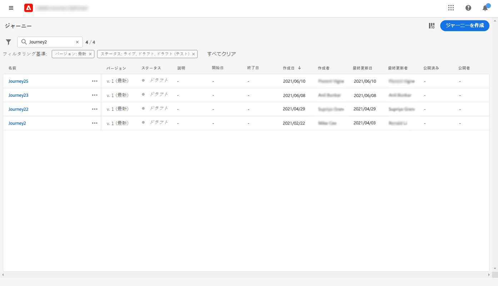

# Journeys での作業の開始{#jo-general-principle}

イベントまたはデータソースに格納されているコンテキストデータを使用して、リアルタイムオーケストレーションユースケースを作成するために使用 [!DNL Journey Optimizer] します。

以下の機能を利用して、高度な高度シナリオを作成することが可能です。

* イベントの受信時に、または **** Adobe 体験プラットフォームセグメントを使用して、リアルタイム **のユニタリデリバリ** を送信します。

* 文脈データ **を、イベント、Adobe エクスペリエンスプラットフォームから、または、サードパーティの API サービスのデータを利用** します。

* サードパーティシステムを使用してメッセージを送信している場合は、組み込みアクション **を使用して、** で [!DNL Journey Optimizer] 作成されたメッセージを送信したり、カスタムアクション **を作成** したりできます。

* このような場合は、旅の **デザイナー** を使用して、エントリイベントを簡単にドラッグ &amp; ドロップしたり、セグメントを読み取る操作を実行したり、条件を追加したり、パーソナライズされたメッセージを送信したりすることができます。

## 旅を作成するためのステップ{#steps-journey}

Adobe 旅オプティマイザーを使用して、1つの canvas からパーソナライズされた journeys をデザインし、オーケストレーションを行います。

Adobe 旅オプティマイザーには、1対1のユーザー取り組みによって harmonize マーケティング広告のマーケティング担当を促進する omnichannel オーケストレーション canvas が含まれています。 ユーザーインターフェイスを使用すると、パレットからキャンバスにアクティビティを簡単にドラッグ &amp; ドロップして、旅を作成することができます。

最初の旅を開始して作成する方法については [ 、このページ ](journey-gs.md) を参照してください。

Omnichannel の旅デザイナーにより、ターゲットユーザーや、リアルタイムでの顧客や業務間の相互作用に基づいた更新を行うことができます。また、直観的なドラッグ &amp; ドロップインターフェイスを使用してメッセージを omnichannel することもできます。

詳しくは、ここを  参照してください。

データエンジニアとして、データソース、イベント、アクションを含む journeys を設定する手順については、このセクション ](../configuration/about-data-sources-events-actions.md) で [ 詳しく説明しています。

## 使用例{#uc-journey}

以下のエンド間用途については、journeys を構築する方法を参照してください。

ビジネスユースケース:

* [マルチチャンネルメッセージの送信](journeys-uc.md)
* [キャンペーン v7/v8 を使用したメッセージの送信](ajo-ac.md)
* [メッセージをサブスクライバーに送信する](message-to-subscribers-uc.md)

テクニカルユースケース:

* [カスタムアクションによるコレクションの動的なパス](collections.md)
* [ランプアップ配信](ramp-up-deliveries-uc.md)
* [外部データソースおよびカスタムアクションによるスループットの制限](limit-throughput.md)

## 旅のバージョン{#journey-versions}

旅リストには、すべてのバージョン番号が表示されます。 このページ ](../building-journeys/using-the-journey-designer.md) を参照してください [ 。

フライトを検索した場合、アプリケーションを初めて起動したときに最新のバージョンがリストの先頭に表示されます。 これにより、必要な並べ替えを定義することができます。これにより、アプリケーションでは、ユーザーに設定した並べ替えが維持されます。 また、旅のバージョンは、そのキャンバスの上にある、旅の版のインターフェイスの上部にも表示されます。

>[!NOTE]
>
>通常、一度に1つのプロファイルを1回の操作で複数回使用することはできません。 「再入り口」が有効になっている場合は、プロファイルは旅に再入力することができますが、その前のインスタンスが終了するまでこの操作を実行することはできません。 [詳しく ](end-journey.md) は、こちらを参照してください。

ライブフライトに変更する必要がある場合は、新しいバージョンの旅を作成してください。

1. ライブフライトの最新バージョンを開き、「確認」をクリック **[!UICONTROL Create a new version]** します。

   

   >[!NOTE]
   >
   >最新バージョンの旅についてのみ、新バージョンを作成することができます。

1. 変更を行い、「確認」ボタンをクリック **[!UICONTROL Publish]** します。

   

旅が公開されてから、担当者は最新の旅に入ります。 前のバージョンが既に入力されている人物は、旅が完了するまでそのままにしておきます。 このような場合でも、後で同じ位置に移動しても、最新のバージョンにはなりません。

旅バージョンは個別に停止することができます。 Journeys のすべてのバージョンには同じ名前が付けられています。

新しいバージョンのフライトをパブリッシュすると、以前のバージョンが自動的に終了し、「終了 **」状態に** 切り替わります。このようにしても、入口は発生しません。 最新バージョンを停止した場合でも、以前のバージョンは閉じたままとなります。

>[!NOTE]
>
>旅のバージョンについて詳しくは、このページを [ 参照してください。](../start/guardrails.md#journey-versions-limitations)