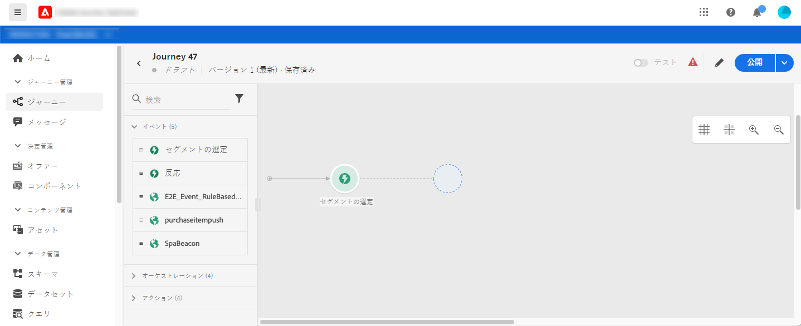
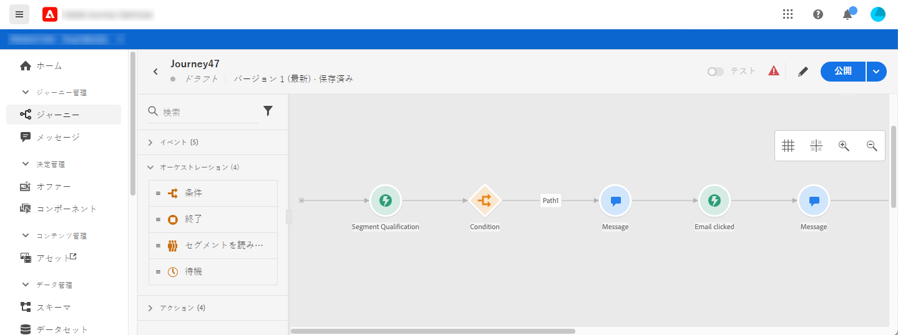
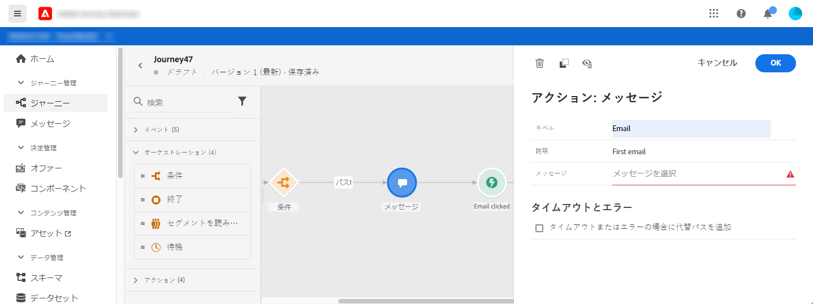
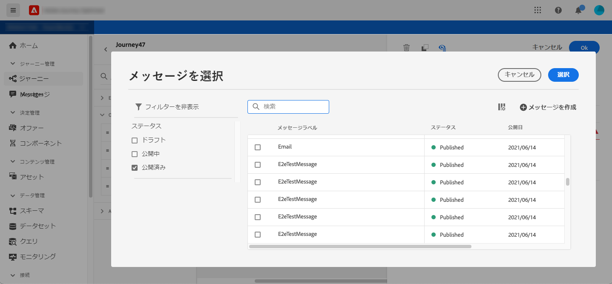
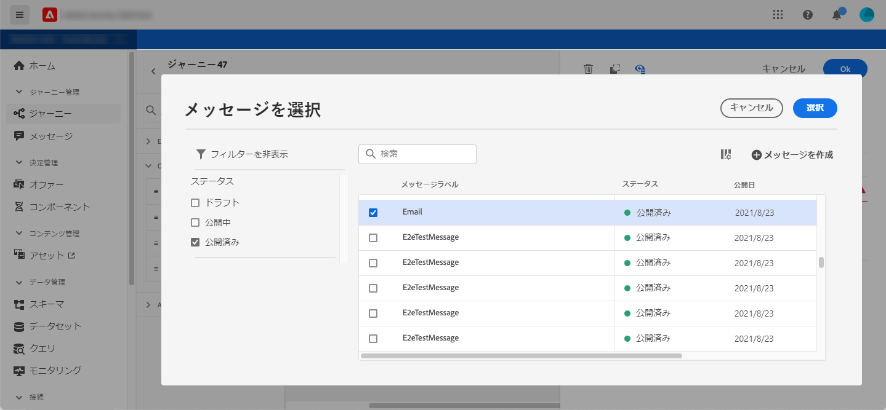
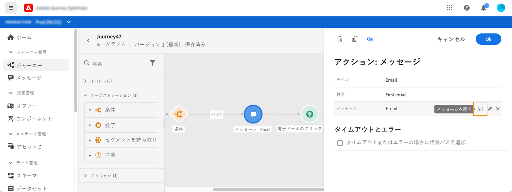
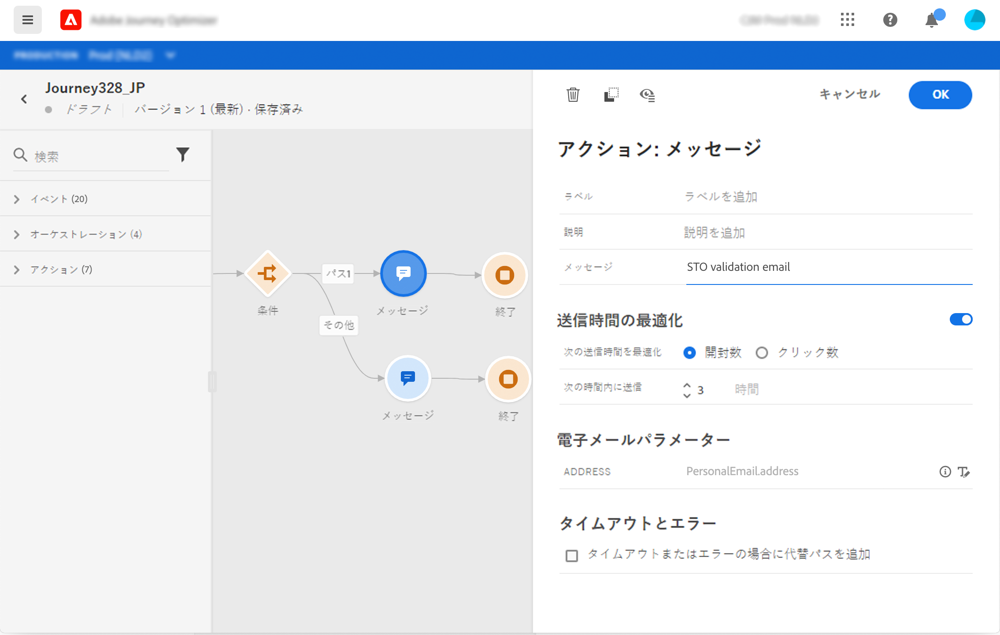

# ジャーニーへのメッセージの追加

[!DNL Journey Optimizer] にはメッセージ機能があらかじめ組み込まれているので、コンテンツをデザインし、メッセージを公開するだけで済みます。[この節](../get-started-content.md)を参照してください。次に、Journey Optimizer でデザインしたプッシュメッセージまたはメールメッセージをジャーニーに追加します。

サードパーティのシステムを使用してメッセージを送信する場合は、カスタムアクションを作成します。詳しくは、この[節](../action/action.md)を参照してください。

## メッセージアクティビティの追加

1. 通常どおり、ジャーニーをイベントまたは「**セグメントを読み取り**」アクティビティで開始します。

   

1. パレットの「**アクション**」セクションから、**メッセージ**&#x200B;アクティビティをキャンバスにドラッグ＆ドロップします。

   

1. ラベルと説明を追加します。

   

1. 「**メッセージ**」フィールド内でクリックします。Journey Optimizer でデザインした、利用可能なメッセージのリストが表示されます。ステータスでリストを絞り込むことができます。

   

1. メッセージを選択し、「**選択**」をクリックします。「**メッセージの作成**」をクリックして、この画面から直接新しいメッセージを作成することもできます。

   

   メッセージを確認する場合は、「**メッセージ**」フィールドの「**メッセージを開く**」アイコンをクリックします。メッセージが新しいタブで開きます。

   

1. ジャーニーに次のステップを追加します。

## メールパラメーターとプッシュパラメーター

**[!UICONTROL メールパラメーター]**&#x200B;および&#x200B;**[!UICONTROL プッシュパラメーター]**&#x200B;のセクションには、読み取り専用フィールドが表示されます。通常、この設定はメッセージの作成時に実行します。 [この節](../get-started-content.md)を参照してください。

特定の値を強制的に指定するには、フィールドの右側にある「**パラメーターの上書きを有効にする**」アイコンを使用します。 このオプションは、テストに役立つ場合があります。例えば、メールの場合、自分のメールアドレスを追加できます。ジャーニーを公開すると、メールが送信されます。

## 送信時間の最適化{#send-time-optimization}

>[!CONTEXTUALHELP]
>id="jo_bestsendtime_disabled"
>title="送信時間の最適化について"
>abstract="Adobe Journey Optimizer の送信時間最適化機能（アドビの AI サービスを利用）は、メールまたはプッシュメッセージの送信に最適な時間を予測して、過去の開封率とクリック率に基づいてエンゲージメントを最大化できます。"

Adobe Journey Optimizer の送信時間最適化機能（アドビの AI サービスを利用）は、メールまたはプッシュメッセージの送信に最適な時間を予測して、過去の開封率とクリック率に基づいてエンゲージメントを最大化できます。機械学習モデルを使用して、ユーザーごとにパーソナライズされた送信時間をスケジュールし、メッセージの開封率やクリック率を高めます。

>[!NOTE]
>
>この機能は現在ベータ版で、ベータ版のお客様のみご利用いただけます。ベータ版プログラムに参加するには、アドビカスタマーケアにお問い合わせください。

送信時間最適化モデルは、Adobe Journey Optimizer のデータを取り込み、ユーザーレベルの開封率（メールとプッシュの場合）およびクリック率（メールの場合）を調べて、顧客がメッセージングに関与する可能性が最も高いタイミングを判断します。送信時間の最適化では、情報に基づいたレコメンデーションを行うために、1 か月以上のメッセージトラッキングデータが必要です。ユーザーごとに、次のスコアを使用して最適な時間が自動的に選択されます。

* エンゲージメントを最大化するための各曜日の最適な時間帯
* エンゲージメントを最大化するのに最適な曜日
* エンゲージメントを最大化するための最適な曜日の最適な時間

モデルは、スコアリングとトレーニングのどちらに注目しているかによって異なります。トレーニングは、最初は毎週、その後は四半期ごとに実施されます。スコアリングは、最初は毎週、その後は毎月行われます。

* トレーニング - スコアを付けるために使用するアルゴリズムの開発
* スコアリング - トレーニング済みモデルに基づく個々のプロファイルへのスコアの適用

この情報はユーザーのプロファイルと共に保存され、ジャーニーの実行時に参照されて、メッセージを送信するタイミングを Adobe Journey Optimizer に指示します。

>[!CAUTION]
>
>* この機能は、トラッキングが有効になっているメールおよびプッシュのモノチャネルメッセージでのみ使用できます。
>* メッセージを公開する必要があります。
>* この機能はバーストモードとは互換性がありません。

### 送信時間最適化の有効化{#activate-send-time-optimization}

>[!CONTEXTUALHELP]
>id="jo_bestsendtime_email"
>title="送信時間最適化の有効化"
>abstract="適切なラジオボタンを選択して、メールの開封数とクリックスルー数のどちらを最適化するかを選択します。また、「次のオプション内で送信」に値を入力して、システムで使用される送信時間を区切ることもできます。"

>[!CONTEXTUALHELP]
>id="jo_bestsendtime_push"
>title="送信時間最適化の有効化"
>abstract="プッシュメッセージではクリック数が適用されないため、デフォルトは「開封数」オプションになります。また、「次のオプション内で送信」に値を入力して、システムで使用される送信時間を区切ることもできます。"

「メッセージ」アクティビティのパラメーターから&#x200B;**送信時間の最適化**&#x200B;スイッチを選択して、メールまたはプッシュメッセージの送信時間の最適化を有効にします。

メールメッセージの場合は、適切なラジオボタンを選択して、メールの開封数とクリックスルー数のどちらを最適化するかを選択します。プッシュメッセージではクリック数が適用されないため、デフォルトは「開封数」オプションになります。

また、「**次の時間内に送信**」オプションの値を入力することで、システムで使用される送信時間を区切ることもできます。 値として「6 時間」を選択した場合、[!DNL Journey Optimizer] は各ユーザープロファイルを確認し、ジャーニーの実行時刻から 6 時間以内の最適な送信時刻を選択します。
