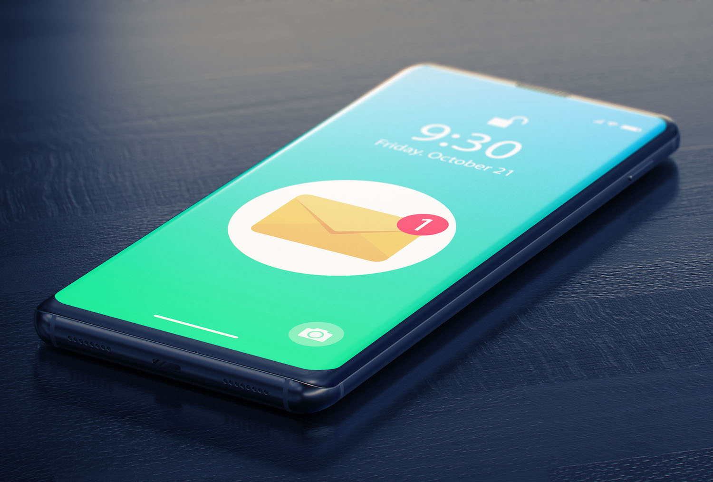
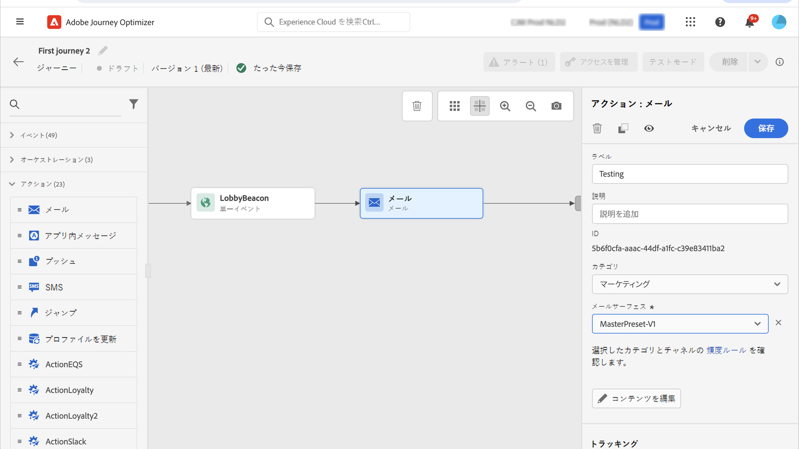

# メール、アプリ内、プッシュおよびテキストメッセージの送信 {#add-a-message-in-a-journey}

>[!CONTEXTUALHELP]
>id="ajo_message_activity"
>title="メッセージアクティビティ"
>abstract="Journey Optimizer には、メッセージ機能が組み込まれています。ジャーニーにプッシュ、テキストメッセージ（SMS／MMS）、アプリ内またはメールのメッセージアクティビティを追加し、設定とコンテンツを定義するだけです。その後、メッセージアクティビティがジャーニーのコンテキストで実行および送信されます。"

[!DNL Journey Optimizer] には、メッセージ機能が組み込まれています。ジャーニーにプッシュ、SMS／MMS、アプリ内またはメールのメッセージアクティビティを追加し、設定とコンテンツを定義するだけです。その後、メッセージアクティビティがジャーニーのコンテキストで実行および送信されます.

また、メッセージを送信する特定のアクションを設定することもできます。

* サードパーティのシステムを使用してメッセージを送信する場合は、カスタムアクションを作成できます。詳しくは、[この節](../action/action.md)を参照してください。

* Campaign と Journey Optimizer を連携させる場合は、次の節を参照してください。

   * [[!DNL Journey Optimizer] と Campaign v7/v8](../action/acc-action.md)
   * [[!DNL Journey Optimizer] と Campaign Standard](../action/acs-action.md)

ジャーニーにメッセージを追加するには、次の手順に従います。

1. ジャーニーを[イベント](general-events.md)または[オーディエンスを読み取り](read-audience.md)アクティビティで開始します。

1. パレットの「**アクション**」セクションで、**メール**、**アプリ内**、**SMS** または **プッシュ**&#x200B;アクティビティをキャンバスに追加します。

1. アクティビティを設定します。 メッセージコンテンツを作成する詳細な手順については、次のページを参照してください。

   <table style="table-layout:fixed">
   <tr style="border: 0;">
   <td>
   
   
<a href="../email/create-email.md"><strong>メールの作成</strong>
   

   

   </td>
   <td>
   
   
<a href="../in-app/create-in-app.md"><strong>アプリ内メッセージの作成</strong>
   

   

   </td>
   <td>
   
   

   <a href="../push/create-push.md"><strong>プッシュ通知の作成<strong></a>
   

   

   </td>
   <td>
   
   

   <a href="../sms/create-sms.md"><strong>テキストメッセージ（SMS／MMS）の作成</strong></a>
   

   

   </td>
   </tr>
   </table>

## ライブコンテンツの更新{#update-live-content}

ライブジャーニーでメッセージ（メール、アプリ内、SMS、プッシュ）のコンテンツを更新できます。

それには、ライブジャーニーを開き、メッセージアクティビティを選択して、「**コンテンツを編集**」をクリックします。

ただし、パーソナライゼーションで使用されている属性は、プロファイル属性であるかコンテキストデータ（イベントプロパティまたはジャーニープロパティから得られるもの）であるかにかかわらず、変更することはできません。

コンテキストデータを変更すると、次のエラーメッセージが表示されます：ERR_AUTHORING_JOURNEYVERSION_201

プロファイル属性を変更すると、次のエラーメッセージが表示されます：ERR_AUTHORING_JOURNEYVERSION_202

アプリ内アクティビティの場合、ジャーニーのライブ中にコンテンツを変更できますが、アプリ内トリガーは変更できません。

## 送信時間の最適化{#send-time-optimization}

>[!CONTEXTUALHELP]
>id="jo_bestsendtime_disabled"
>title="送信時間の最適化について"
>abstract="Adobe Journey Optimizer の送信時間最適化機能（アドビの AI サービスを利用）は、メールまたはプッシュメッセージの送信に最適な時間を予測し、過去の開封率とクリック率に基づいてエンゲージメントを最大化できます。"

>[!NOTE]
>
>この機能は、デフォルトでは有効になっていません。アクティブにするには、アドビ担当者にお問い合わせください。

### 送信時間の最適化について {#about-send-time}

Adobe Journey Optimizer の送信時間最適化機能（アドビの AI サービスを利用）は、メールまたはプッシュメッセージの送信に最適な時間を予測し、過去の開封率とクリック率に基づいてエンゲージメントを最大化できます。機械学習モデルを使用して、ユーザーごとにパーソナライズされた送信時間をスケジュールし、メッセージの開封率やクリック率を高めます。

送信時間最適化モデルは、Adobe Journey Optimizer のデータを取り込み、ユーザーレベルの開封率（メールとプッシュの場合）およびクリック率（メールの場合）を調べて、顧客がメッセージングに関与する可能性が最も高いタイミングを判断します。送信時間の最適化では、情報に基づいたレコメンデーションを行うために、1 か月以上のメッセージトラッキングデータが必要です。ユーザーごとに、次のスコアを使用して最適な時間が自動的に選択されます。

* エンゲージメントを最大化するための各曜日の最適な時間帯
* エンゲージメントを最大化するのに最適な曜日
* エンゲージメントを最大化するための最適な曜日の最適な時間

モデルは、スコアリングとトレーニングのどちらに注目しているかによって異なります。トレーニングは、最初は毎週、その後は四半期ごとに実施されます。スコアリングは、最初は毎週、その後は毎月行われます。

* トレーニング - スコアを付けるために使用するアルゴリズムの開発
* スコアリング - トレーニング済みモデルに基づく個々のプロファイルへのスコアの適用

この情報はユーザーのプロファイルと共に保存され、ジャーニーの実行時に参照されて、メッセージを送信するタイミングを Adobe Journey Optimizer に指示します。

### よくある質問 {#faq-send-time}

+++ 送信時間の最適化では何ができますか？新規プロファイルはどのように処理されますか？送信を 6／12／24 時間にわたって実行されますか？

送信時間の最適化では、顧客との関わり合いに最適な時間の予測し、メールの開封率やクリック率の最適化を試みます。スコアは、各プロファイルの `3*7*24` 属性の形式になります。`7*24` 属性は、受信者にメールを送信するのに最適な予測時間のランクを表し、3 はメールの開封率、メールのクリック率およびプッシュ開封率を最適化するためのものです。

+++

+++各プロファイルの予想送信時間はどこで確認できますか？

全体的なスコアは、**プロファイル**&#x200B;インターフェイスに表示されます。3 組の 168 スコアのそれぞれに対して、ランクは -83 から 84 になります。ランクが高いほど、受信者とのやり取りに適した時間が選択されたことになります。ジャーニーの開始と期間を定義できるので、ベストランク（84）はその時間枠には含まれない場合があります。この場合、ランクの値が最も高い時間を選択することをお勧めします。

+++

+++どのレポートの種類を使用できますか？

ジャーニーにアクセスし、「**レポートを表示**」ボタンをクリックし、左側の「**ジャーニー**」タブを選択します。[詳細情報](../reports/journey-global-report.md)

+++

+++送信時間の最適化データは、プロファイルリッチネスにどのように影響しますか？

送信時間の最適化では、各プロファイルにスコアや属性が追加されますが、新規プロファイルは作成されません。

+++

### 送信時間最適化の有効化{#activate-send-time-optimization}

>[!CONTEXTUALHELP]
>id="jo_bestsendtime_email"
>title="送信時間最適化の有効化"
>abstract="適切なラジオボタンを選択して、メールの開封数とクリックスルー数のどちらを最適化するかを選択します。また、「次のオプション内で送信」に値を入力して、システムで使用される送信時間を区切ることもできます。"

>[!CONTEXTUALHELP]
>id="jo_bestsendtime_push"
>title="送信時間最適化の有効化"
>abstract="プッシュメッセージではクリック数が適用されないため、デフォルトは「開封数」オプションになります。また、「次のオプション内で送信」に値を入力して、システムで使用される送信時間を区切ることもできます。"

アクティビティのパラメーターから&#x200B;**送信時間の最適化**&#x200B;スイッチを選択して、メールまたはプッシュメッセージの送信時間の最適化を有効にします。

メールメッセージの場合は、適切なラジオボタンを選択して、メールの開封数とクリックスルー数のどちらを最適化するかを選択します。プッシュメッセージではクリック数が適用されないため、デフォルトは「開封数」オプションになります。

また、「**次の時間内に送信**」オプションの値を入力することで、システムで使用される送信時間を区切ることもできます。値として「6 時間」を選択した場合、[!DNL Journey Optimizer] は各ユーザープロファイルを確認し、ジャーニーの実行時刻から 6 時間以内の最適な送信時刻を選択します。

**最適な時間が期間外にある場合はどうなりますか？**

次の設定を例に取ります。

* クリック時に最適化
* アクションは午前 10 時に起動される予定
* 期間は 3 時間

プロファイルには、期間外に最適なオープン時間を設定できます。例えば、John の最適なクリックオープンが午後 5 時であるといった具合です。

プロファイルレベルでは、1 週間の時間ごとのスコアがあります。この例では、メールは常に期間内に送信されます。実行時に、その期間（午前 10 時から 3 時間）内のスコアのリストがシステムにより確認されます。 次に、午前 10 時、午前 11 時および正午のスコアが比較され、最も高いスコアが選択されます。その時点でメールが送信されます。
