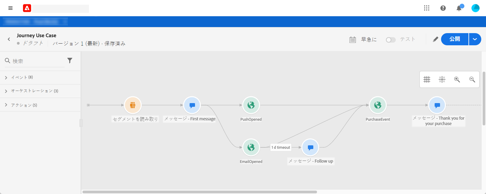
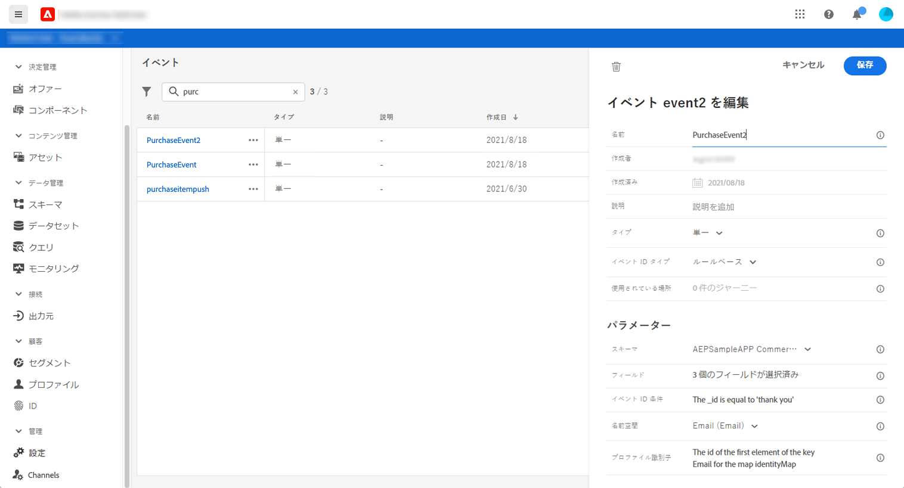
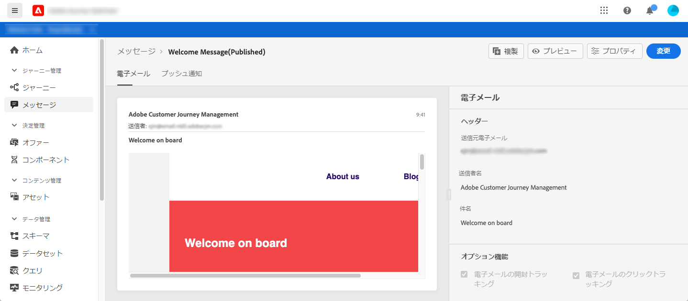
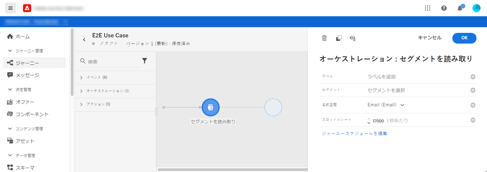
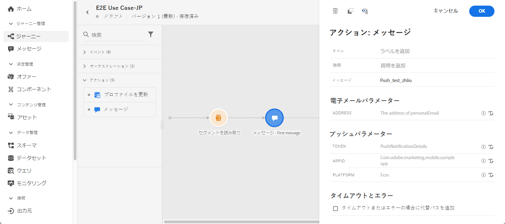

# Journey のユースケース

このセクションでは、セグメントの読み取り、イベント、反応イベント、メールやプッシュメッセージを組み合わせた使用例を示します。

## ユースケースの説明

このユースケースでは、特定のセグメントに属するすべての顧客に、最初のメッセージ（メールとプッシュ）を送信します。

最初のメッセージへの反応に応じて、特定のメッセージを送りたいと思います。

最初のメッセージの後、お客様がメールまたはプッシュを開くのを 1 日待ちます。 反応がない場合は、フォローアップメールを送信します。

その後、購入されたお客様には感謝の意を表すプッシュメッセージを送信します。

## 前提条件

このユースケースを実現するには、次の設定を行う必要があります。

* アトランタ、サンフランシスコ、シアトルに住む、1980 年以降生まれの顧客セグメント
* 購入イベント
* 3 つのメッセージ

### セグメントの作成

このジャーニーでは、特定の顧客セグメントを活用します。 セグメントに属するすべての個人をジャーニーに入れ、別々の手順を踏んでもらいます。 この例では、1980 年以降に生まれた、アトランタ、サンフランシスコ、シアトルに住むすべてのお客様をターゲットにするセグメントが必要です。

セグメントの詳細については、[このページ](../segment/about-segments.md)を参照してください。

1. **[!UICONTROL セグメント]**&#x200B;メニューで、「**[!UICONTROL セグメントを作成]**」をクリックします。

1. 「**[!UICONTROL セグメントのプロパティ]**」ペインに、セグメントの名前を入力します。

1. 所望のフィールドを左ペインから中央のワークスペースにドラッグアンドドロップし、必要に応じて設定します。 この例では、**市区町村**&#x200B;と&#x200B;**生年**&#x200B;の属性フィールドを使用します。

1. **[!UICONTROL 保存]**&#x200B;をクリックします。

   

セグメントが作成され、ジャーニーで使用できる状態になります。**セグメントの読み取り**&#x200B;アクティビティを使用すると、セグメントに属するすべての個人をジャーニーを入れることができます。

### イベントの設定

顧客が購入したときにジャーニーに送信するイベントを設定します。ジャーニーは、イベントを受け取ると、「ありがとうございました」というメッセージをトリガーします。

ここでは、ルールベースのイベントを使用します。 イベントの詳細については、[このページ](../event/about-events.md)を参照してください。

1. 「管理」セクションで、「**[!UICONTROL 設定]**」を参照し、「**[!UICONTROL イベント]**」をクリックします。 新しいイベントを作成するには、**[!UICONTROL 追加]**&#x200B;をクリックします。

1. イベントの名前を入力します。

1. **[!UICONTROL イベント ID タイプ]**&#x200B;フィールドで、**[!UICONTROL ルールベース]**&#x200B;を選択します。

1. **[!UICONTROL スキーマ]**&#x200B;とペイロードの&#x200B;**[!UICONTROL フィールド]**&#x200B;を定義します。 複数のフィールドを使用できます。例えば、購入された製品、購入日、購入 ID などです。

1. **[!UICONTROL イベント ID 条件]**&#x200B;フィールドに、ジャーニーをトリガーするイベントの識別に使用する条件を定義します。 たとえば、`purchaseMessage` フィールドを追加し、次のルールを定義します。`purchaseMessage="thank you"`

1. **[!UICONTROL 名前空間]**&#x200B;と&#x200B;**[!UICONTROL キー]**&#x200B;を定義します。

1. **[!UICONTROL 保存]**&#x200B;をクリックします。

   

イベントが設定され、ジャーニーで使用できる状態になります。対応するイベントアクティビティを使用すると、顧客が購入を行うたびにアクションをトリガーできます。

### メッセージの作成

このユースケースでは、次の 3 つのメッセージを作成します。

* プッシュとメールによる最初のメッセージ
* 「ありがとうございました」というプッシュメッセージ
* メールでのフォローアップメッセージ

これらのメッセージをデザインしてパブリッシュする方法については、[このセクション](../segment/about-segments.md)を参照してください。

## ジャーニーのデザイン

1. **セグメントの読み取り**&#x200B;アクティビティでジャーニーを開始します。 前に作成したセグメントを選択します。 セグメントに属するすべての個人がジャーニーに入ります。

   

1. **メッセージ**&#x200B;アクティビティをドロップし、プッシュとメールによる最初のメッセージを選択します。ジャーニー内のすべての個人にこのメッセージが送信されます。

   

1. メッセージアクティビティにカーソルを置き、「+」記号をクリックして新規のパスを作成します。

1. 最初のパスに、**反応**&#x200B;イベントを追加し、**プッシュ開封**&#x200B;を選択します。セグメントに属する個人がプッシュによる最初のメッセージを開くと、このイベントがトリガーされます。

1. 2 番目のパスに、**反応**&#x200B;イベントを追加し、**メール開封**&#x200B;を選択します。 このイベントは、個人がメールを開いたときにトリガーされます。

1. いずれかの反応アクティビティで、**「イベントタイムアウトを定義」**&#x200B;ボックスをチェックし、デュレーション（この例では 1 日）を定義して、**「タイムアウトパスを設定」**&#x200B;をチェックします。これにより、プッシュまたはメールによる最初のメッセージを開かなかった個人に対する別のパスが作成されます。

   >[!NOTE]
   >
   >複数のイベント（この場合は 2 つの反応）でタイムアウトを設定する場合は、そのうちの 1 つのイベントにタイムアウトを設定するだけで構いません。

1. タイムアウトパスに&#x200B;**メッセージ**&#x200B;アクティビティをドロップし、メールによるフォローアップメッセージを選択します。 次の日にメールやプッシュによる最初のメッセージを開かなかった個人に、このメッセージが送信されます。

1. 3 つのパスを、前に作成した購入イベントに接続します。個人が購入を行うと、このイベントがトリガーされます。

1. イベントの後に&#x200B;**メッセージ**&#x200B;アクティビティをドロップし、「ありがとうございます」というメールを選択します。

1. **終了**&#x200B;アクティビティを追加します。

## ジャーニーのテストと公開

1. ジャーニーをテストする前に、ジャーニーが有効であり、エラーがないことを確認します。

1. 右上隅にある&#x200B;**テスト**&#x200B;トグルをクリックして、テストモードを有効にします。テストに入れるテストプロファイルを定義します。プロファイルは 1 つだけでも、一度に最大 100 個でも定義できます。 テストモードの使い方については、[このセクション](testing-the-journey.md)を参照してください。

1. ジャーニーの準備が整ったら、右上隅の「**公開**」ボタンを使用して公開します。
