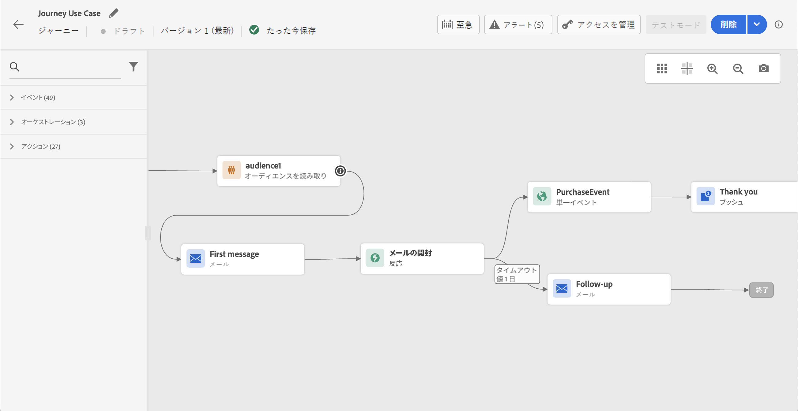
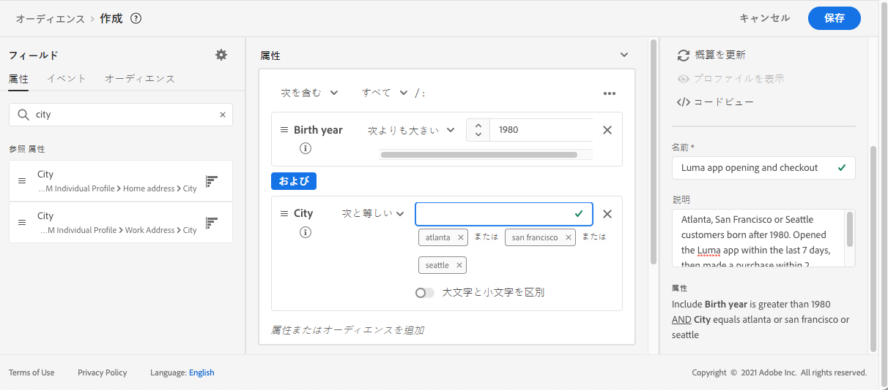
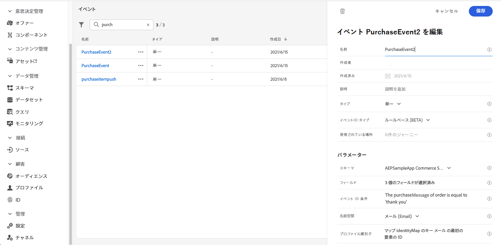
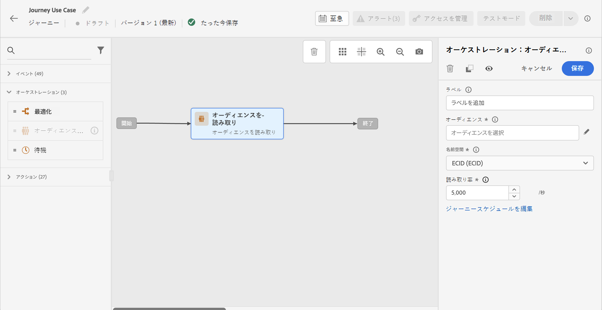
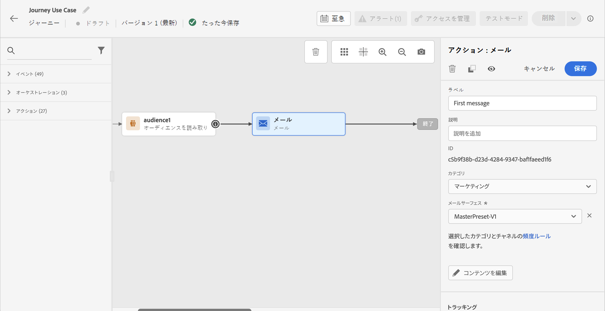

# マルチチャネルメッセージの送信 {#send-multi-channel-messages}

>[!BEGINSHADEBOX]

**このページでは、**&#x200B;読み取りオーディエンス、イベント、反応イベント、電子メールおよびプッシュメッセージをフォローアップロジックと組み合わせたマルチチャネルジャーニーを構築する方法について説明します。

>[!ENDSHADEBOX]

この節では、「オーディエンスの読み取り」と、イベント、反応イベント、メール／プッシュメッセージを組み合わせたユースケースを示します。

## ユースケースの説明

このユースケースの目標は、特定のオーディエンスに属するすべての顧客に、最初のメールメッセージを送信することです。

最初のメッセージへの反応に基づいて、特定のフォローアップメッセージが送信されます。

顧客がメールを開いた場合、システムは購入を待ち、感謝の意を表すプッシュメッセージを送信します。

反応がない場合は、フォローアップメールが送信されます。

## 前提条件

このユースケースを実現するには、次の設定を行います。

* アトランタ、サンフランシスコまたはシアトルに住む 1980 年以降生まれのすべての顧客のオーディエンス
* 購入イベント

### オーディエンスの作成

このジャーニーでは、特定のオーディエンスの顧客を活用します。 このオーディエンスに属する個人は全員ジャーニーにエントリし、別々のステップを進みます。 この例では、オーディエンスは、アトランタ、サンフランシスコまたはシアトルに住む 1980 年以降生まれのすべての顧客をターゲットにします。

オーディエンスについて詳しくは、[このページを参照](../audience/about-audiences.md)してください。

1. 「CUSTOMER」メニューセクションで、「**[!UICONTROL オーディエンス]**」を選択します。
1. オーディエンスリストの右上にある「**[!UICONTROL オーディエンスを作成]**」ボタンをクリックします。
1. **[!UICONTROL オーディエンスのプロパティ]**&#x200B;パネルで、オーディエンスの名前を入力します。
1. 目的のフィールドを左側のパネルから中央のワークスペースにドラッグ＆ドロップし、必要に応じて設定します。 この例では、「**市区町村**」と「**誕生年**」の属性フィールドを使用します。
1. 「**[!UICONTROL 保存]**」をクリックします。

   

これで、オーディエンスが作成され、ジャーニーで使用する準備が整いました。 **オーディエンスを読み取り**&#x200B;アクティビティを使用すると、オーディエンスに属するすべての個人がジャーニーにエントリできます。

### イベントの設定

顧客が購入した際にジャーニーに送信されるイベントを設定します。 ジャーニーはイベントを受け取ると、「ありがとうございました」というメッセージをトリガーします。

ここでは、[ルールベースのイベント](../event/about-events.md)を使用します。

1. 「管理」メニューセクションで、「**[!UICONTROL 設定]**」を選択し、「**[!UICONTROL イベント]**」をクリックします。 「**[!UICONTROL イベントを作成]**」をクリックして、新しいイベントを作成します。

1. イベントの名前を入力します。

1. 「**[!UICONTROL イベント ID タイプ]**」フィールドで、「**[!UICONTROL ルールベース]**」を選択します。

1. **[!UICONTROL スキーマ]**&#x200B;とペイロードの&#x200B;**[!UICONTROL フィールド]**&#x200B;を定義します。 購入した製品、購入日、購入 ID など、複数のフィールドを使用します。

1. 「**[!UICONTROL イベント ID 条件]**」フィールドに、ジャーニーをトリガーするイベントの識別に使用する条件を定義します。 例えば、`purchaseMessage` フィールドを追加し、`purchaseMessage="thank you"` ルールを定義します

1. **[!UICONTROL 名前空間]**&#x200B;と&#x200B;**[!UICONTROL プロファイル識別子]**&#x200B;を定義します。

1. 「**[!UICONTROL 保存]**」をクリックします。

   

これで、イベントが設定され、ジャーニーで使用する準備が整いました。 対応するイベントアクティビティを使用すると、顧客が購入を行うたびにアクションをトリガーできます。

## ジャーニーのデザイン

1. ジャーニーを&#x200B;**オーディエンスを読み取り**&#x200B;アクティビティで開始します。 前に作成したオーディエンスを選択します。 そのオーディエンスに属するすべての個人がジャーニーにエントリします。

   

1. **メール**&#x200B;アクションアクティビティをドロップし、「最初のメッセージ」のコンテンツを定義します。 ジャーニー内のすべての個人にこのメッセージが送信されます。 メールを設定およびデザインする方法については、この[節](../email/create-email.md)を参照してください。

   

1. **反応**&#x200B;イベントを追加し、「**メールの開封**」を選択します。 オーディエンスに属する個人が、メールを開封すると、このイベントがトリガーされます。

1. 「**イベントのタイムアウトを定義**」チェックボックスをオンにし、期間（この例では 1 日）を定義して、「**タイムアウトのパスを作成**」をオンにします。 プッシュまたはメールでの最初のメッセージを開封しなかった人向けに、別のパスが作成されます。

1. タイムアウトのパスに、**メール**&#x200B;アクションアクティビティをドロップし、「フォローアップ」メッセージのコンテンツを定義します。 メールやプッシュによる最初のメッセージを開かなかった人に、翌日このメッセージが送信されます。 [詳しくは、メールの設定とデザイン方法を参照してください](../email/create-email.md)。

1. 最初のパスに、前に作成した購入イベントを追加します。 個人が購入を行うと、このイベントがトリガーされます。

1. イベントの後に、**プッシュ**&#x200B;アクションアクティビティをドロップし、「感謝」メッセージのコンテンツを定義します。 プッシュを設定およびデザインする方法については、この[節](../push/create-push.md)を参照してください。

## ジャーニーのテストと公開

1. ジャーニーをテストする前に、そのジャーニーが有効で、エラーがないことを確認します。

1. 右上隅にある&#x200B;**テスト**&#x200B;切替スイッチを使用して、テストモードをアクティブ化します。 テストモードの使い方については、この[節](testing-the-journey.md)を参照してください。

1. ジャーニーの準備が整ったら、右上隅の「**公開**」ボタンを使用して公開します。

## 複数段階のロイヤルティジャーニー {#multi-phase-loyalty}

この例では、主要なジャーニーアーキテクチャパターンを示します。複雑な多段階のジャーニーを、[**[!UICONTROL &#x200B; ジャンプ &#x200B;]**](jump.md) アクティビティに接続された、小規模で焦点を絞ったサブジャーニーに分解します。 ロイヤルティプログラムはシナリオの役割を果たしますが、このパターンは、複数のマイルストーンやビジネスフェーズにまたがるジャーニーに適用されます。

複雑な多段階のジャーニーを通じて、膨大な顧客パスをすばやく作成できます。 各段階で1つのサブジャーニーに分割することで、各ジャーニーを管理、テスト、個別に管理できます。

### シナリオ

2つのマーケティングチャネル（[電子メール &#x200B;](../email/create-email.md)と[&#x200B; プッシュ &#x200B;](../push/create-push.md)）を使用して3つのマイルストーンを通じて顧客を導くロイヤルティプログラムを検討します。

1. **フェーズ 1 — モバイルアプリをダウンロード：**&#x200B;最初のコミュニケーションでは、新規ロイヤルティメンバーにアプリのダウンロードを促します。 顧客が設定された期間内に行動しなかった場合、フォローアップリマインダーが送信されます。
1. **フェーズ 2 – 最初の取引を行う：** アプリがダウンロードされると、ターゲットメッセージによって顧客が最初のロイヤルティ取引を完了するよう導きます。
1. **フェーズ 3 — 2回目の取引を行う：**&#x200B;最初の取引後、最後の一連のコミュニケーションによって2回目の取引が促進され、ロイヤルティのエンゲージメントが深まります。

このシンプルな戦略を導入したとしても、このジャーニーには、顧客が辿る20を超える独自の経路が存在します。 顧客接点やチャネルが増えるごとに、複雑さが飛躍的に拡大します。

### サブジャーニーの分解

エンドツーエンドのジャーニーを、次の3つの小規模なサブジャーニーに分割します。

| サブジャーニー | 入力条件 | ビジネスの目的 |
|---|---|---|
| フェーズ 1 - アプリダウンロード | 顧客がロイヤルティプログラムに参加 | モバイルアプリのダウンロードを促進 |
| フェーズ 2 – 最初のトランザクション | 顧客によるアプリのダウンロード | ロイヤルティ向上を図る |
| フェーズ 3 -2番目のトランザクション | 顧客が最初のトランザクションを完了しました | ロイヤルティ向上 |

[**[!UICONTROL &#x200B; ジャンプ &#x200B;]**](jump.md) アクティビティを使用してサブジャーニーを接続し、プロファイルがあるフェーズから次のフェーズにシームレスに渡されるようにします。 各サブジャーニーは、シンプルで読みやすく、個別に管理できます。

<!--
>[!NOTE]
>
>If your goal is to build a gamified loyalty program with challenges, tasks, and built-in reward tracking, Journey Optimizer also offers a dedicated **Loyalty Challenges** capability.
-->

