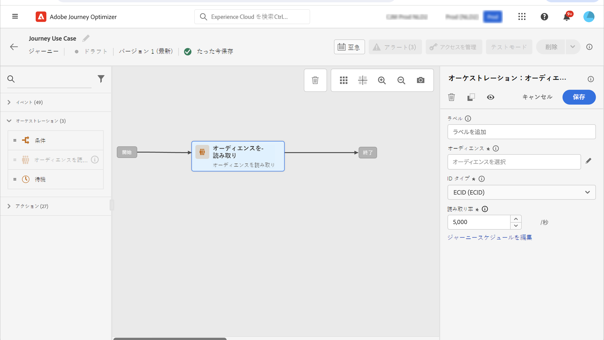

# マルチチャネルメッセージの送信 {#send-multi-channel-messages}

この節では、「オーディエンスを読み取り」、イベント、反応イベントおよびメール／プッシュメッセージを組み合わせたユースケースを示します。

## ユースケースの説明

このユースケースの目標は、特定のオーディエンスに属するすべての顧客に、最初のメールメッセージを送信することです。

最初のメッセージへの反応に基づいて、特定のフォローアップメッセージが送信されます。

顧客がメールを開いた場合、システムは購入を待ち、感謝の意を表すプッシュメッセージを送信します。

反応がない場合は、フォローアップメールが送信されます。

## 前提条件

このユースケースを実現するには、次の設定を行います。

* アトランタ、サンフランシスコまたはシアトルに住む 1980 年以降生まれのすべての顧客のオーディエンス
* 購入イベント

### オーディエンスの作成

このジャーニーでは、特定のオーディエンスの顧客を活用します。このオーディエンスに属する個人は全員ジャーニーにエントリし、別々のステップを進みます。この例では、オーディエンスは、アトランタ、サンフランシスコまたはシアトルに住む 1980 年以降生まれのすべての顧客をターゲットにします。

オーディエンスについて詳しくは、[このページを参照](../audience/about-audiences.md)してください。

1. 「CUSTOMER」メニューセクションで、「**[!UICONTROL オーディエンス]**」を選択します。
1. オーディエンスリストの右上にある「**[!UICONTROL オーディエンスを作成]**」ボタンをクリックします。
1. **[!UICONTROL オーディエンスのプロパティ]**&#x200B;パネルで、オーディエンスの名前を入力します。
1. 目的のフィールドを左側のパネルから中央のワークスペースにドラッグ＆ドロップし、必要に応じて設定します。この例では、「**市区町村**」と「**誕生年**」の属性フィールドを使用します。
1. 「**[!UICONTROL 保存]**」をクリックします。

   

これで、オーディエンスが作成され、ジャーニーで使用する準備が整いました。**オーディエンスを読み取り**&#x200B;アクティビティを使用すると、オーディエンスに属するすべての個人がジャーニーにエントリできます。

### イベントの設定

顧客が購入した際にジャーニーに送信されるイベントを設定します。ジャーニーはイベントを受け取ると、「ありがとうございました」というメッセージをトリガーします。

ここでは、[ルールベースのイベント](../event/about-events.md)を使用します。

1. 「管理」メニューセクションで、「**[!UICONTROL 設定]**」を選択し、「**[!UICONTROL イベント]**」をクリックします。「**[!UICONTROL イベントを作成]**」をクリックして、新しいイベントを作成します。

1. イベントの名前を入力します。

1. 「**[!UICONTROL イベント ID タイプ]**」フィールドで、「**[!UICONTROL ルールベース]**」を選択します。

1. **[!UICONTROL スキーマ]**&#x200B;とペイロードの&#x200B;**[!UICONTROL フィールド]**&#x200B;を定義します。購入した製品、購入日、購入 ID など、複数のフィールドを使用します。

1. 「**[!UICONTROL イベント ID 条件]**」フィールドに、ジャーニーをトリガーするイベントの識別に使用する条件を定義します。例えば、`purchaseMessage` フィールドを追加し、`purchaseMessage="thank you"` ルールを定義します

1. **[!UICONTROL 名前空間]**&#x200B;と&#x200B;**[!UICONTROL プロファイル識別子]**&#x200B;を定義します。

1. 「**[!UICONTROL 保存]**」をクリックします。

   

これで、イベントが設定され、ジャーニーで使用する準備が整いました。対応するイベントアクティビティを使用すると、顧客が購入を行うたびにアクションをトリガーできます。

## ジャーニーのデザイン

1. ジャーニーを&#x200B;**オーディエンスを読み取り**&#x200B;アクティビティで開始します。前に作成したオーディエンスを選択します。そのオーディエンスに属するすべての個人がジャーニーにエントリします。

   

1. **メール**&#x200B;アクションアクティビティをドロップし、「最初のメッセージ」のコンテンツを定義します。ジャーニー内のすべての個人にこのメッセージが送信されます。メールを設定およびデザインする方法については、この[節](../email/create-email.md)を参照してください。

   

1. **反応**&#x200B;イベントを追加し、「**メールの開封**」を選択します。オーディエンスに属する個人が、メールを開封すると、このイベントがトリガーされます。

1. 「**イベントのタイムアウトを定義**」チェックボックスをオンにし、期間（この例では 1 日）を定義して、「**タイムアウトのパスを作成**」をオンにします。プッシュまたはメールでの最初のメッセージを開封しなかった人向けに、別のパスが作成されます。

1. タイムアウトのパスに、**メール**&#x200B;アクションアクティビティをドロップし、「フォローアップ」メッセージのコンテンツを定義します。メールやプッシュによる最初のメッセージを開かなかった人に、翌日このメッセージが送信されます。[詳しくは、メールの設定とデザイン方法を参照してください](../email/create-email.md)。

1. 最初のパスに、前に作成した購入イベントを追加します。個人が購入を行うと、このイベントがトリガーされます。

1. イベントの後に、**プッシュ**&#x200B;アクションアクティビティをドロップし、「感謝」メッセージのコンテンツを定義します。プッシュを設定およびデザインする方法については、この[節](../push/create-push.md)を参照してください。

## ジャーニーのテストと公開

1. ジャーニーをテストする前に、そのジャーニーが有効で、エラーがないことを確認します。

1. 右上隅にある&#x200B;**テスト**&#x200B;切替スイッチを使用して、テストモードをアクティブ化します。テストモードの使い方については、この[節](testing-the-journey.md)を参照してください。

1. ジャーニーの準備が整ったら、右上隅の「**公開**」ボタンを使用して公開します。
