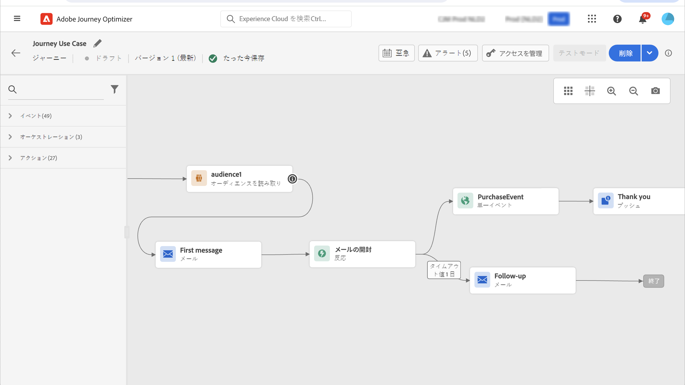
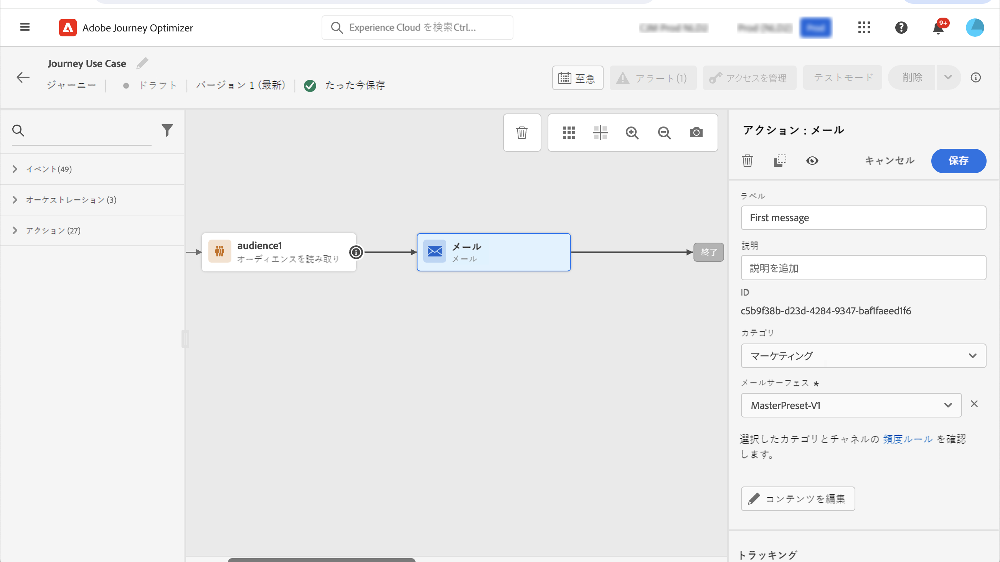

# ユースケース：マルチチャネルメッセージの送信{#send-multi-channel-messages}

この節では、セグメントの読み取り、イベント、反応イベント、メールやプッシュメッセージを組み合わせたユースケースを示します。

## ユースケースの説明

このユースケースでは、特定のセグメントに属するすべての顧客に、最初のメッセージ（メールとプッシュ）を送信します。

最初のメッセージへの反応に基づいて、特定のメッセージを送信するとします。

最初のメッセージの後、顧客がメールまたはプッシュを開封するのを 1 日待ちます。反応がない場合は、フォローアップメールを送信します。

その後、購入されたお客様には感謝の意を表すプッシュメッセージを送信します。

## 前提条件

このユースケースを実現するには、次の設定をおこなう必要があります。

* アトランタ、サンフランシスコ、シアトルに住む 1980 年以降生まれのすべての顧客のセグメント
* 購入イベント
* 3 つのメッセージ

### セグメントの作成

このジャーニーでは、特定の顧客セグメントを活用します。セグメントに属する個人は全員ジャーニーにエントリし、別々のステップを進みます。この例では、1980 年以降に生まれた、アトランタ、サンフランシスコ、シアトルに住むすべての顧客をターゲットにするセグメントが必要です。

セグメントの詳細については、この[ページ](../segment/about-segments.md)を参照してください。

1. 「CUSTOMER」メニューセクションで、「**[!UICONTROL セグメント]**」を選択します。

1. セグメントリストの右上にある「**[!UICONTROL セグメントを作成]**」ボタンをクリックします。

1. 「**[!UICONTROL セグメントのプロパティ]**」ペインに、セグメントの名前を入力します。

1. 目的のフィールドを左ペインから中央のワークスペースにドラッグ＆ドロップし、必要に応じて設定します。
この例では、「**市区町村**」と「**誕生年**」の属性フィールドを使用します。

1. 「**[!UICONTROL 保存]**」をクリックします。

   

セグメントが作成され、ジャーニーで使用できる状態になります。「**セグメントを読み取り**」アクティビティを使用すると、セグメントに属するすべての個人をジャーニーに入れることができます。

### イベントの設定

顧客が購入したときにジャーニーに送信するイベントを設定する必要があります。ジャーニーはイベントを受け取ると、「ありがとうございました」というメッセージをトリガーします。

ここでは、ルールベースのイベントを使用します。イベントの詳細については、この[ページ](../event/about-events.md)を参照してください。

1. 「管理」メニューセクションで、「**[!UICONTROL 設定]**」を選択し、「**[!UICONTROL イベント]**」をクリックします。「**[!UICONTROL イベントを作成]**」をクリックして、新しいイベントを作成します。

1. イベントの名前を入力します。

1. 「**[!UICONTROL イベント ID タイプ]**」フィールドで、「**[!UICONTROL ルールベース]**」を選択します。

1. **[!UICONTROL スキーマ]**&#x200B;とペイロードの&#x200B;**[!UICONTROL フィールド]**&#x200B;を定義します。複数のフィールドを使用できます。例えば、購入された製品、購入日、購入 ID などです。

1.  「**[!UICONTROL イベント ID 条件]**」フィールドに、ジャーニーをトリガーするイベントの識別に使用する条件を定義します。たとえば、`purchaseMessage` フィールドを追加し、次のルールを定義します：`purchaseMessage="thank you"`

1. **[!UICONTROL 名前空間]**&#x200B;と&#x200B;**[!UICONTROL プロファイル識別子]**&#x200B;を定義します。

1. 「**[!UICONTROL 保存]**」をクリックします。

   

イベントが設定され、ジャーニーで使用できる状態になります。対応するイベントアクティビティを使用すると、顧客が購入を行うたびにアクションをトリガーできます。

### メッセージの作成

このユースケースでは、次の 3 つのメッセージを作成します。

* プッシュとメールによる最初のメッセージ
* 「ありがとうございました」というプッシュメッセージ
* メールでのフォローアップメッセージ

これらのメッセージを設計して公開する方法については、この[節](../segment/about-segments.md)を参照してください。

## ジャーニーの設計

1. 「**セグメントを読み取り**」アクティビティでジャーニーを開始します。前に作成したセグメントを選択します。セグメントに属するすべての個人がジャーニーに入ります。

   

1. **メッセージ**&#x200B;アクティビティをドロップし、プッシュとメールによる最初のメッセージを選択します。ジャーニー内のすべての個人にこのメッセージが送信されます。

   

1. メッセージアクティビティにカーソルを置き、「+」記号をクリックして新規のパスを作成します。

1. 最初のパスに&#x200B;**反応**&#x200B;イベントを追加し、「**プッシュの開封**」を選択します。セグメントに属する個人が、最初のメッセージのプッシュバージョンを開封すると、このイベントがトリガーされます。

1. 2 番目のパスに、**反応**&#x200B;イベントを追加し、「**E メールの開封**」を選択します。このイベントは、個人がメールを開封するとトリガーされます。

1. いずれかの反応アクティビティで、「**イベントのタイムアウトを定義**」ボックスをチェックし、デュレーション（この例では 1 日）を定義して、「**タイムアウトのパスを作成**」をチェックします。プッシュまたはメールでの最初のメッセージを開封しなかった人向けに、別のパスが作成されます。

   >[!NOTE]
   >
   >複数のイベント（この場合は 2 つの反応）でタイムアウトを設定する場合は、そのうちの 1 つのイベントにタイムアウトを設定するだけで構いません。

1. タイムアウトパスに&#x200B;**メッセージ**&#x200B;アクティビティをドロップし、メールによるフォローアップメッセージを選択します。メールやプッシュによる最初のメッセージを開かなかった人に、翌日このメッセージが送信されます。

1. 3 つのパスを、前に作成した購入イベントに接続します。個人が購入をおこなうと、このイベントがトリガーされます。

1. イベントの後に&#x200B;**メッセージ**&#x200B;アクティビティをドロップし、「ありがとうございます」メールメッセージを選択します。

1. **終了**&#x200B;アクティビティを追加します。

## ジャーニーのテストと公開

1. ジャーニーをテストする前に、ジャーニーが有効であり、エラーがないことを確認します。

1. 右上隅にある「**テスト**」トグルをクリックして、テストモードを有効にします。テストプロファイルをどのようにテストにエントリさせるか（1 つのプロファイル、または一度に最大 100 個）を定義します。テストモードの使い方については、この[節](testing-the-journey.md)を参照してください。

1. ジャーニーの準備が整ったら、右上隅の「**公開**」ボタンを使用して公開します。
