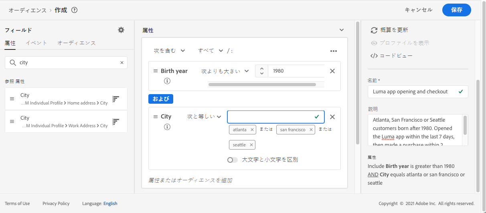
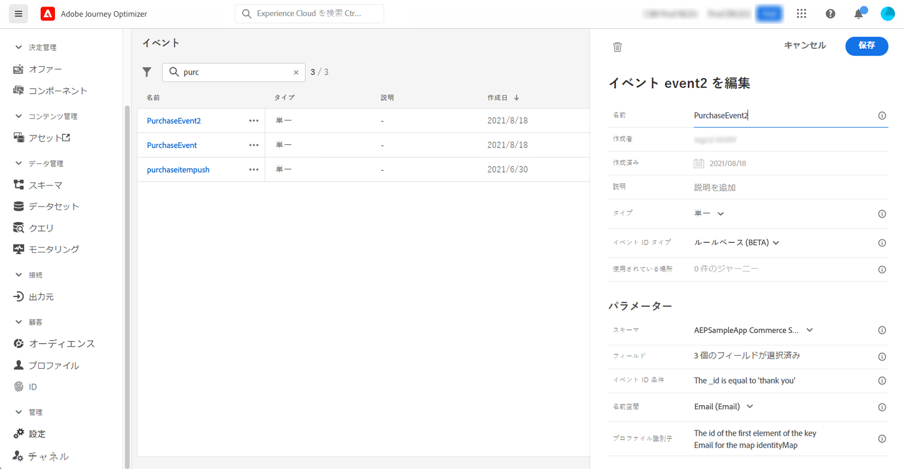

# 用途: マルチチャンネルメッセージを送信します。{#send-multi-channel-messages}

この節では、読み取りセグメント、イベント、イベントの反問題、電子メール/プッシュメッセージを結合したユースケースを示します。

## ユースケースの説明

この例では、特定のセグメントに属しているすべてのお客様に、最初のメッセージ (e メールとプッシュ) を送信します。

最初のメッセージに対する反応に基づいて、特定のメッセージを送信します。

最初のメッセージが表示された後、お客様が押したり電子メールを開くことができるようになります。 反応がない場合は、フォローアップ電子メールを送信します。

次に、購入を待ち、お客様に「お礼」というメッセージを送信します。

## 知識

このようなユースケースを作成するには、次の設定を行う必要があります。

* アトランタ、サンフランシスコ、またはシアトルに住むすべての得意先のセグメントは、1980の後に生まれています。
* 購入イベント

### セグメントの作成

Emc は、お客様の特定の分野を活用することを目指しています。 セグメントに属しているすべての個人は、旅に入り、様々なステップに従うことになります。 この例では、アトランタ、サンフランシスコ、シアトル、および1980以降のシアトルに住むすべてのユーザーを対象としています。

セグメントについて詳しくは、この [ ページ ](../segment/about-segments.md) を参照してください。

1. 「顧客」メニューから、を選択 **[!UICONTROL Segments]** します。

1. セグメントリストの右上にあるボタンを **[!UICONTROL Create segment]** クリックします。

1. **[!UICONTROL Segment properties]**&#x200B;ウィンドウで、セグメントの名前を入力します。

1. 必要に応じて、左側のペインから中央のワークスペースに目的のフィールドをドラッグ &amp; ドロップします。 この例では、「市区町村 **」と** 「誕生年 **」の属性を使用して** います。

1. をクリック **[!UICONTROL Save]** します。

   

これで、セグメントが作成され、旅に使用できるようになりました。 **「セグメント** の読み取り」アクティビティーを使用すると、セグメントに属するすべての個人が旅に入るようにすることができます。

### イベントを設定します。

あなたは、お客様が購入を行ったときに、旅に送られるイベントを設定する必要があります。 このようにイベントが発生すると、旅に「お礼」メッセージが表示されます。

そのために、ルールベースのイベントを使用しています。 イベントについて詳しくは、この [ ページ ](../event/about-events.md) を参照してください。

1. 「管理」セクションで、、の順に選択 **[!UICONTROL Configurations]** し、をクリック **[!UICONTROL Events]** します。 をクリック **[!UICONTROL Create event]** して、新しいイベントを作成します。

1. イベントの名前を入力します。

1. **[!UICONTROL Event ID type]**&#x200B;フィールドで、を選択 **[!UICONTROL Rule Based]** します。

1. **[!UICONTROL Schema]** And payload **[!UICONTROL Fields]** を定義します。購入した製品、購買日、購買 id など、いくつかのフィールドを使用できます。

1. **[!UICONTROL Event ID condition]**&#x200B;フィールドで、システムによって使用される条件を定義して、旅をトリガーするイベントを識別します。例えば、次のルールを定義して、フィールドを `purchaseMessage` 追加することができます。 `purchaseMessage="thank you"`

1. **[!UICONTROL Namespace]** And **[!UICONTROL Profile Identifier]** を定義します。

1. をクリック **[!UICONTROL Save]** します。

   

これで、イベントが設定され、旅に使用できるようになりました。 対応するイベントアクティビティーを使用して、顧客が購入を行うたびにアクションをトリガーできます。

## 旅のデザイン

1. 「セグメント **の読み取り」アクティビティを使用して** 、旅を開始します。以前に作成したセグメントを選択します。 そのセグメントに属しているすべての個人が旅に入ります。

   

1. **電子メール** アクションアクティビティをドロップして、「第1メッセージ」のコンテンツを定義します。このメッセージは、旅においてすべての人物に送信されます。 電子メールの設定とデザインの方法については、この [ 節 ](../email/create-email.md) を参照してください。

   

1. 電子メール活動上にカーソルを置き、「+」記号をクリックして、新しいパスを作成します。

1. 最初のパスでは、反力 **イベントを追加** し、「プッシュオープン **」を選択** します。このイベントは、セグメントに属している個々のメッセージが、最初のメッセージのプッシュバージョンを開いたときにトリガーされます。

1. 第2のパスでは、反応 **イベントを追加** し、「電子メールを開く **」を選択** します。このイベントは、個々の電子メールがユーザーによって開かれたときにトリガーされます。

1. いずれかの反力アクティビティーで、「イベントタイムアウト **を定義」ボックスをオン** にして、期間 (この例では1日) を定義して **、タイムアウトパス** を設定します。この操作によって、最初のメッセージを開かないユーザーに対しては別のパスが作成されます。

   >[!NOTE]
   >
   >複数のイベントに対してタイムアウト (この場合は2つの反応) を設定する場合は、1つのイベントに対してのみタイムアウトを設定する必要があります。

1. タイムアウトパスで、電子メール **アクションアクティビティをドロップ** し、&quot;フォローアップ&quot; メッセージのコンテンツを定義します。このメッセージは、電子メールを開かない人物、または翌日に送信される最初のメッセージに送られます。 電子メールの設定とデザインの方法については、この [ 節 ](../email/create-email.md) を参照してください。

1. 3つのパスを、既に作成されている購入イベントに接続します。 このイベントは、個人が購入を行ったときにトリガーされます。

1. イベントの後に、「プッシュ **アクション」アクティビティーをドロップ** して、「お礼」メッセージの内容を定義します。この [ 節で ](../push/create-push.md) は、プッシュを設定してデザインする方法について説明します。

## 旅のテストと公開

1. お客様の旅をテストする前に、それが有効であり、エラーが発生していないことを確認してください。

1. **テストモードを有効にするには、右上隅にある「テスト** 」をクリックします。テストプロファイルにテストを入力する方法として、1つのプロファイルを使用するか、一度に最大100までを指定します。 この [ 節で ](testing-the-journey.md) は、テストモードの使用方法について説明します。

1. 旅が準備できたら、右上隅にある「パブリッシュ **」ボタンを使用して** 、ページをパブリッシュします。
